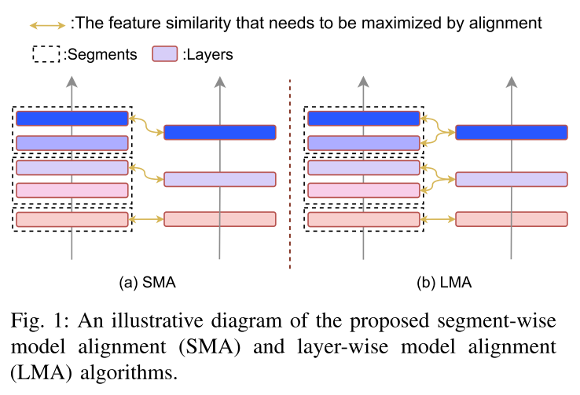
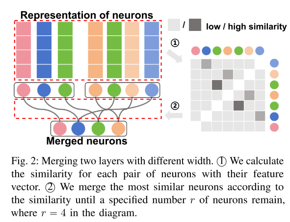
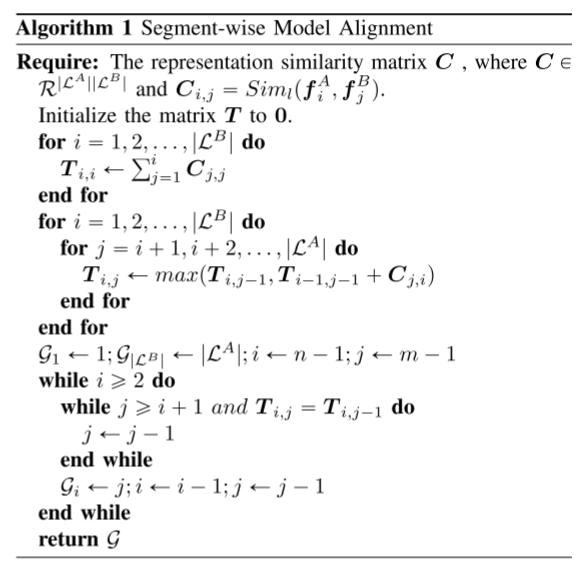
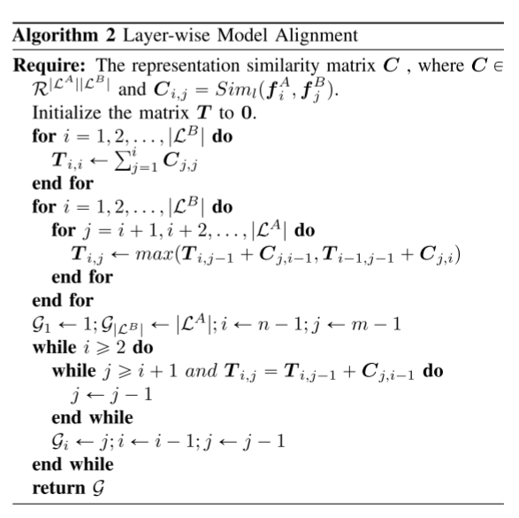

# Training-free Heterogeneous Model Merging

摘要

模型合并作为一种强大的模型重用范例引起了人们的极大关注，它有助于将特定于任务的模型集成到具有多种功能的单一通用框架中。以前的研究，主要利用加权平均(WA)等方法，表明模型合并可以有效地利用预训练模型，而无需费力的再训练。然而，模型之间固有的异构性对其适用性构成了实质性的限制，特别是当面临模型体系结构中的差异时。为了克服这一挑战，我们提出了一个创新的模型合并框架，为异构模型设计，包括深度和宽度的异质性。为了解决深度异质性，我们引入了一种层对齐策略，该策略通过分割更深的模型来协调模型层，将具有相似表示的连续层视为一个内聚段，从而实现具有不同层深度的模型的无缝合并。对于宽度的异质性，我们提出了一种新的弹性神经元压缩算法，该算法将不同宽度的模型的权重投影到一个共同的维度空间，从而消除了对相同宽度的需求。大量的实验验证了这些方法的有效性，表明在视觉和NLP任务中，结构异构模型的合并可以达到与同构模型合并相当的性能水平。我们的代码可以在https://github.com/zjuvipa/training_free_heterogeneous_model_merging上公开获得。

## I. INTRODUCTION

深度神经网络在一系列要求苛刻的计算机视觉和自然语言处理任务中取得了非凡的成功，最终导致了许多模型的开发和公开发布，以及它们的架构和预训练参数(例如，Pytorch Hub1, hug Hub2)。这些易于访问的模型为各种任务精心调整，为从业者提供了相当大的便利。然而，他们的用途仍然局限于最初训练他们的特定任务。这种限制在模型存储[5]，[30]和计算效率方面提出了重大挑战，特别是当模型参数的大小以前所未有的速度增长时。

鉴于各种任务中训练有素的模型过多，近年来一个突出的研究方向是将多个特定于任务的模型组合成一个具有广泛功能的单一模型，而不需要详尽的再训练阶段。现有文献大致可分为两派:直接加权平均[1]、[25]、[29]和对齐-再平均[1]、[21]、[22]。前一种方法直接对多个网络的网络权值进行平均，以获得扩展能力[9]、[29]或增强泛化性能[25]。**然而，这种方法仅限于网络共享训练轨迹的共同部分(例如，相同的预训练模型)，因为通过完全不同的轨迹训练的模型之间的参数空间的显着差异可能导致显著的性能下降[7]**。为了放松这一假设，后一种方法首先对模型[1]，[22]，[23]的**参数空间进行对齐**，然后通过加权平均对模型进行合并，这依赖于一个公认的猜想，**即大多数SGD解属于这样一个集合，该集合的元素可以排列，使得任意两个排列元素[4]之间的线性插值不存在性能障碍。**

尽管先前的研究在没有任何训练的预训练模型合并方面取得了显著的进步，但这些都假设预训练模型存在于同质体系结构中，从而限制了它们在面对结构异构模型时的效用。据我们所知，只有少数的工作试图融合结构上异构的模型，但是它们需要一个昂贵的再训练阶段。**由于模型异质性带来的巨大困难，异构模型的无训练模型合并的挑战在很大程度上仍未被探索。具体来说，模型可能不仅在层深度上不同，而且在层宽度上也不同，这使得它们的参数空间不兼容，无法通过现有方法中采用的元素一对一映射进行对齐。**

在这项工作中，我们提出了一个开创性的模型合并框架，旨在解决上述挑战，专注于建筑异质性的两个维度:深度异质性和宽度异质性。具体来说，对于层数不同的深度非均质性，**我们观察到模型的相邻层往往表现出相似的表示**[14]，**连续中间层的输入和输出可以用更少的层，甚至单层[26]代替**。因此，**我们引入了一种深度异构模型合并算法，该算法首先将更深的模型划分为多个部分，每个部分包含具有相似表示的层**。我们确保片段的数量与较浅模型中的层数相对应，从而解决了层数不一致的问题。**关于宽度异质性，先前的方法需要两个模型共享相同的宽度(即维度)，以便在神经元之间建立一对一的映射**。相比之下，**我们引入了一种弹性神经元压缩算法，该算法构建映射矩阵，将不同宽度的权重投影到公共宽度上，从而避免了对相同宽度的需求。**我们进行了大量的实验来研究这些方法的有效性，结果表明，在视觉和NLP任务上，所提出的异构模型合并可以达到与同构模型合并相当的性能。

综上所述，本文的主要贡献有:(1)我们首次探讨了模型合并中固有的挑战，具体解决了如何在结构异构的环境下合并模型，包括宽度和深度的异质性。(2)提出了一种新的模型合并框架，该框架可促进在宽度和深度异质性场景下的有效合并。(3)广泛的实验验证展示了我们的框架在一系列任务和模型架构中的有效性。

## II. RELATED WORK

**直接加权平均。**加权平均[25]是一种应用广泛的模型合并技术，它通过对参数进行平均来构建合并模型。任务算法[9]采用预定义的比例因子来区分各种模型的显著性。Fisher merge[17]进行加权参数融合，其中权重由Fisher信息矩阵[6]确定。RegMean[12]通过优化具有封闭形式解的线性回归问题巧妙地解决了模型合并问题。ties - merged[28]通过修剪低幅度参数、纠正符号不一致、隔离合并符号一致的参数来解决[9]中的任务冲突。DARE[29]通过随机删除delta参数并重新缩放剩余参数，进一步减轻了先前方法的参数干扰。

**对齐，然后平均。**Git Re-Basin[1]和Neuron Alignment[22]通过评估它们的权重或激活之间的相似性来排序模型。REPAIR[13]通过计算中间层特征激活之间的相关性，并在网络中加入多个批归一化层，提高了Git Re-Basin的精度。OTFusion[20]引入了一种基于最优传输理论的基于排列的方法，利用Wasserstein距离，其中神经元关联促进了具有相同深度的已有模型的一次性融合。一些研究[10]，[23]扩展了这些方法，以适应基于transformer的架构，尽管在没有微调的情况下，性能会持续下降。Zipit![21]解决了模型内部合并，通过“压缩”模型内部和模型之间的冗余特征来对齐同一盆地内的所有模型。此外，MuDSC[27]提出了在权重和激活空间中同时对齐模型。

## III. METHODOLOGY

### A. Preliminaries

\### 我们首先回顾在同构架构中合并模型的方法。将模型$\mathcal{L}$视为由层$L_i \in \mathcal{L}$组成的集合，每层都有一组参数（例如，对于线性层，有$W_i$和$b_i$）。合并两个模型$\mathcal{L}^A$和$\mathcal{L}^B$的任务，涉及将它们的参数融合到一个新模型$\mathcal{L}^*$中，使得$\mathcal{L}^*$在$\mathcal{L}^A$和$\mathcal{L}^B$各自的原始任务上保持准确性。当$\mathcal{L}^A$和$\mathcal{L}^B$是从相同的检查点进行微调时，一些研究[11, 25]已经证明，合并过程就像对它们的权重进行平均一样直接。例如，如果$L_i$表示一个线性层，且$W_i^A, W_i^B \in \mathbb{R}^{n_i n^{i - 1}}$，其中$n_i$表示第$i$层的维度，那么新的权重矩阵$W_i^*$可以简单表示为： 

$ \boldsymbol{W}_i^* = \frac{1}{2}\boldsymbol{W}_i^A + \frac{1}{2}\boldsymbol{W}_i^B \tag{1} $ 

然而，当$\mathcal{L}^A$和$\mathcal{L}^B$不是从相同的检查点进行微调时，公式(1)通常会导致随机的准确率。为了解决这个问题，一系列研究[1, 13, 21]发现，在平均之前，对其中一个模型的特征空间进行排列，使其与另一个模型的特征空间对齐，可以显著恢复损失的准确率。具体来说，遵循先前研究[21]的通用框架，设$\boldsymbol{P}_i^A$和$\boldsymbol{P}_i^B$表示排列矩阵，用于将层$L_i^A$和$L_i^B$的输出对齐到相同的空间，其中$\boldsymbol{P}_i^A, \boldsymbol{P}_i^B \in \mathbb{R}^{n_i n_i}$。对于每一层，我们可以应用：

$ \boldsymbol{W}_i^* = \boldsymbol{P}_i^A \boldsymbol{W}_i^A (\boldsymbol{P}_{i - 1}^A)^{-1} + \boldsymbol{P}_i^B \boldsymbol{W}_i^B (\boldsymbol{P}_{i - 1}^B)^{-1} \tag{2} $ 

在这里，我们不仅对$W_i^A$和$W_i^B$的输出空间进行排列，还对它们的输入空间进行排列，以逆转来自上一层的排列（因此使用伪逆矩阵$(\boldsymbol{P}_{i - 1}^A)^{-1}$和$(\boldsymbol{P}_{i - 1}^B)^{-1}$）。 

设$\boldsymbol{f}_i^A$和$\boldsymbol{f}_i^B$分别表示每个模型第$i$层的特征向量，其中$\boldsymbol{f}_i^A, \boldsymbol{f}_i^B \in \mathbb{R}^{n_i m_i}$，$m_i$表示特征维度。对最优的$\boldsymbol{P}_i^A$和$\boldsymbol{P}_i^B$的搜索可以表示为以下目标函数：

$ \underset{\boldsymbol{P}_i^A,\boldsymbol{P}_i^B}{\arg\max} \sum_{i = 1}^{|\mathcal{L}*|} Sim_f(\boldsymbol{P}_i^A\boldsymbol{f}_i^A,\boldsymbol{P}_i^B\boldsymbol{f}_i^B). \tag{3} $ 

这里，$Sim_f(\cdot, \cdot)$计算两组特征向量中对应索引位置的特征之间的相似度之和。通常使用余弦相似度作为$Sim_f(\cdot, \cdot)$。 

### B. 深度异构合并

公式3表明，对于深度同构模型，我们的优化目标是最大化各层之间的聚合特征相似度。然而，对于深度异构模型，这种公式并不适用，因为两个模型的层不能直接以一对一的方式对齐。幸运的是，先前的研究表明相邻层通常表现出相似的表示，并且多个层的功能可以有效地由一个独立的单层替代。受此启发，我们通过分割较深的模型，并将具有相似表示的连续层视为一个统一的片段，来对齐两个模型的层。具体来说，我们假设模型A比模型B更深，并将模型A的层划分为一组片段$\mathcal{S}^A$。设$\boldsymbol{f}_{ij}^A$表示模型A的第$i$个片段$S_i^A$中第$j$层的特征，$\boldsymbol{f}_{i}^B$表示模型B的第$i$层的特征。因此，深度异构合并的目标公式如下： 

$ \underset{\boldsymbol{P}_{ij}^A,\boldsymbol{P}_{ij}^B,\mathcal{S}^A}{\arg\max} \sum_{i = 1}^{|\mathcal{B}|}\sum_{j = 1}^{|\mathcal{S}^A|} Sim_f(\boldsymbol{P}_{ij}^A\boldsymbol{f}_{ij}^A,\boldsymbol{P}_{ij}^B\boldsymbol{f}_{i}^B) \tag{4} $ 

其中$\boldsymbol{P}_{ij}^A$和$\boldsymbol{P}_{ij}^B$分别是模型A和模型B中第$i$个片段第$j$层对应的投影矩阵。 为了简化问题，我们将其简化为一个两步优化过程。首先，我们确定模型A的片段$\mathcal{S}^A$。然后，针对每个片段$\mathcal{S}^A$，我们依次对$\boldsymbol{P}_{ij}^A$、$\boldsymbol{P}_{ij}^B$进行优化，基于$\boldsymbol{f}_{ij}^A$和$\boldsymbol{f}_{i}^B$。这就引出了两个关键问题：1）我们应该如何合并$\mathcal{S}^A$和$\mathcal{L}^B$？2）我们如何确定片段$\mathcal{S}^A$？ 对于第一个问题，为了简化符号，我们假设在合并过程中，将模型A的片段$\mathcal{S}^A = \{L_1^A, L_2^A, \ldots, L_l^A\}$与模型B的层$L^B$进行合并。这里，$\boldsymbol{W}_j^A$和$\boldsymbol{W}^B$分别表示各自模型的权重，而$\boldsymbol{P}_j^A$和$\boldsymbol{P}^B$是公式4中的排列矩阵。设$\boldsymbol{x}$表示输入数据。考虑到特征映射$\boldsymbol{f}_l$在很大程度上类似于线性映射（直到一个缩放因子$\alpha$），在线性插值$\boldsymbol{W}_l^A$和$\boldsymbol{W}_l^B$之间，即$\alpha\boldsymbol{f}_l^A + (1 - \alpha)\boldsymbol{f}_l^B \propto \alpha\boldsymbol{W}_l^A + (1 - \alpha)\boldsymbol{W}_l^B$[31]。我们旨在从特征平均中推导出一种合理的权重平均形式，用于深度异构合并。融合后的特征$\boldsymbol{f}^*$可以看作是来自$\mathcal{S}^A$的特征与来自$L^B$的特征的综合，即： 

$ \begin{align*} \boldsymbol{f}^*&=\boldsymbol{P}_l^A\boldsymbol{W}_l^A(\boldsymbol{P}_{l - 1}^A)^{-1}\boldsymbol{f}_{l - 1}^* + \boldsymbol{P}^B\boldsymbol{W}^B\boldsymbol{x}\\ &=\boldsymbol{P}_l^A\boldsymbol{W}_l^A(\boldsymbol{P}_{l - 1}^A)^{-1}\boldsymbol{P}_{l - 1}^A\boldsymbol{W}_{l - 1}^A(\boldsymbol{P}_{l - 2}^A)^{-1}\ldots\boldsymbol{P}_1^A\boldsymbol{W}^A\boldsymbol{x}\\ &+\boldsymbol{P}^B\boldsymbol{I}(\boldsymbol{P}_{l - 1}^B)^{-1}\boldsymbol{P}_{l - 1}^B\boldsymbol{W}^B(\boldsymbol{P}_{l - 2}^B)^{-1}\ldots\boldsymbol{P}_1^B\boldsymbol{W}^B\boldsymbol{x}, \tag{5} \end{align*} $ 

其中$\boldsymbol{I}$是单位矩阵。上述因子$\alpha$被纳入排列矩阵$\boldsymbol{P}_l$中。根据公式5的第二项，$L^B$可以扩展为$\mathcal{S}^B = \{L_1^B, L_2^B, \ldots, L_p^B\}$，其中$L_1^B = L^B$，且$L_i^B(i > 1)$可以被视为权重为$\boldsymbol{I}$的层。因此，合并$\mathcal{S}^A$和$\mathcal{L}^B$可以通过权重平均来公式化，通过权重平均逐层合并$\mathcal{S}^A$和$\mathcal{S}^B$，从而得到合并模型的权重： $ \begin{align*} \boldsymbol{W}_1^*&=\boldsymbol{P}_1^A\boldsymbol{W}_1^A(\boldsymbol{P}_0^A)^{-1} + \boldsymbol{P}_1^B\boldsymbol{W}^B(\boldsymbol{P}_0^B)^{-1}\\ \boldsymbol{W}_2^*&=\boldsymbol{P}_2^A\boldsymbol{W}_2^A(\boldsymbol{P}_1^A)^{-1} + \boldsymbol{P}_2^B\boldsymbol{I}(\boldsymbol{P}_1^B)^{-1}\\ &\cdots\\ \boldsymbol{W}_l^*&=\boldsymbol{P}_l^A\boldsymbol{W}_l^A(\boldsymbol{P}_{l - 1}^A)^{-1} + \boldsymbol{P}_l^B\boldsymbol{I}(\boldsymbol{P}_{l - 1}^B)^{-1}. \tag{6} \end{align*} $ 

我们在补充材料中详细阐述了合并具有异构架构的残差模型的方法。 对于第二个问题，目标可以简化为找到一组索引$\mathcal{G}$，使得$\mathcal{S}^A = \{L_{G_{i - 1} + 1}^A, L_{G_{i - 1} + 2}^A, \ldots, L_{G_{i}}^A\}$。接下来，我们介绍两种用于模型对齐的启发式算法（图1）：1）片段 - 模型对齐；2）逐层模型对齐。 

#### 片段级模型对齐（SMA）

其目标是确保在分割后，每个片段$S_i^A$的输出表示尽可能与模型B中相应层$L_i^B$的表示相似。为了实现这个目标，我们首先计算模型A和模型B所有层之间的成对相似度，然后设计一个匹配算法来最大化$\boldsymbol{f}_{G_i}^A$和$\boldsymbol{f}_{i}^B$之间的相似度：

 $ \underset{\mathcal{G}}{\arg\max} \sum_{i = 1}^{|\mathcal{L}^B|} Sim_l(\boldsymbol{f}_{G_i}^A,\boldsymbol{f}_{i}^B). \tag{7} $ 

值得注意的是，对于相似度函数$Sim_l(\cdot, \cdot)$，由于$\boldsymbol{f}_{G_i}^A$和$\boldsymbol{f}_{i}^B$尚未通过投影矩阵进行重新投影，对应索引位置的特征相似度之和不能被视为特征组之间的整体相似度。因此，我们应用中心核对齐（CKA）[14]作为替代方法来计算层之间的表示相似度，因为该相似度指标与CKA等价，即

$CKA(\boldsymbol{f}^A,\boldsymbol{f}^B) = CKA(\boldsymbol{P}^A\boldsymbol{f}^A,\boldsymbol{P}^B\boldsymbol{f}^B)$，

因此我们能够在对齐之前测量层之间的相似度。 

#### 逐层模型对齐（LMA）

先前的方法主要关注将$S_i^A$的输出特征与$L_i^B$的特征进行对齐。然而，如公式(4)所示，$S_i^A$的内部特征与$L_i^B$的特征之间也存在对齐关系。因此，我们提出一种最大化全局特征相似度的对齐方法，其目标可以表示为：

 $ \underset{\mathcal{G}}{\arg\max} \sum_{i = 1}^{|\mathcal{L}^B|} \sum_{j = i}^{g_{i - 1}} Sim_l(\boldsymbol{f}_{j}^A,\boldsymbol{f}_{i}^B). \tag{8} $ 

片段级和逐层模型对齐算法的伪代码在补充材料中给出。 

### C. 宽度异构合并 

模型之间的宽度差异是一种更为常见的情况；然而，现有的方法仅针对宽度相同的模型进行合并。一方面，基于神经元对齐的技术[1, 22]需要在数量相等的神经元之间建立一一对应关系。另一方面，基于神经元压缩的方法[21]已被证明仅对宽度相同的模型有效。在这项工作中，我们引入了一种弹性神经元压缩算法，该算法可以适应具有任意宽度的模型，并对相关神经元进行合并。图2展示了合并宽度异构层的过程。如图所示，相似的神经元会被逐个合并，而不考虑它们属于哪个模型，剩余神经元的数量由预定义的超参数$r$限制。在实际应用中，$r$可以设置为被合并模型的最大宽度。 

## IV. EXPERIMENTS

A.实验设置

数据集。实验在视觉和自然语言任务上进行，包括小规模的CIFAR-10/100[15]，大规模的ImageNet[2]，以及著名的自然语言理解通用语言理解评估(GLUE)基准[24]。

模型。我们采用各种常用的模型体系结构来演示所提出方法的通用性。对于视觉任务，我们合并了不同深度和宽度的ResNets[8]和VGGs[19]。对于自然语言理解分类任务，我们研究了基于Transformer编码器的屏蔽语言模型。具体来说，我们考虑了5个不同的BERT模型，种子1到5，来自MultiBERTs复制[3]，每个模型有12层。为了获得不同深度的模型，我们将每个模型的偶数层重复，将模型的深度扩展到17层。对于GLUE中的每个分类任务，我们使用随机初始化的分类头对每个MultiBERTs模型进行微调，包括池化层和分类层权重。我们在各个模型中保持头部初始化相同。

评估。在CIFAR-10/100和ImageNet上的实验中，我们将分类数据集随机划分为两个不重叠的子分类任务，分别训练各自的模型，然后将模型合并为一个。然后用联合精度和单任务精度来评价合并模型的性能。联合精度是在组合数据集中对所有类进行评估时模型的总体精度。对于每个任务的准确性，我们提供了合并的多任务模型在两个单独任务上的准确性，以及它们的平均性能。使用类名的CLIP文本编码作为目标，使用CLIP样式的loss[18]对每个模型进行训练。为了公平的比较，我们训练了3对模型并报告了平均精度。对于GLUE的实验，我们研究了8个不同GLUE任务中微调BERT模型之间的损失障碍。我们使用由Frankle等人定义的损失势垒。b[7]。

## S1. ResNet的深度异构合并

在本节中，我们详细阐述在面对异构架构时合并残差模型的方法。假设要合并的层$S^A = \{L_1^A, L_2^A, \ldots, L_l^A\}$和模型B中的层$L^B$，其中$L_i^A (i = 1, 2, \ldots, l)$和$L^B$都是残差层，其公式可以简单地表示为$\boldsymbol{f} = (\boldsymbol{W} + \boldsymbol{I})\boldsymbol{x}$。遵循非残差层情况下的方法，我们通过特征平均推导出权重平均的形式。在这种情况下，平均后的特征$\boldsymbol{f}^*$由下式给出：

 $ \begin{align*} \boldsymbol{f}^*&=(\boldsymbol{P}_l^A\boldsymbol{W}_l^A(\boldsymbol{P}_{l - 1}^A)^{-1} + \boldsymbol{I})\boldsymbol{f}_{l - 1}^* + (\boldsymbol{P}^B\boldsymbol{W}^B + \boldsymbol{I})\boldsymbol{x}\\ &=(\boldsymbol{P}_l^A\boldsymbol{W}_l^A(\boldsymbol{P}_{l - 1}^A)^{-1} + \boldsymbol{I})(\boldsymbol{P}_{l - 1}^A\boldsymbol{W}_{l - 1}^A(\boldsymbol{P}_{l - 2}^A)^{-1} + \boldsymbol{I})\\ &\quad\cdots(\boldsymbol{P}_1^A\boldsymbol{W}^A + \boldsymbol{I})\boldsymbol{x}\\ &+ (\boldsymbol{P}^B\boldsymbol{0}(\boldsymbol{P}_{l - 1}^B)^{-1} + \boldsymbol{I})(\boldsymbol{P}_{l - 1}^B\boldsymbol{0}(\boldsymbol{P}_{l - 2}^B)^{-1} + \boldsymbol{I})\\ &\quad\cdots(\boldsymbol{P}_1^B\boldsymbol{W}^B + \boldsymbol{I})\boldsymbol{x}, \tag{1} \end{align*} $ 

其中$\boldsymbol{0}$和$\boldsymbol{I}$分别是零矩阵和单位矩阵。需要注意的是，我们仍然可以将$L^B$扩展为$S^B = \{L_1^B, L_2^B, \ldots, L_l^B\}$，其中$L_1^B = L^B$，$L_i^B (i > 1)$表示权重设为$\boldsymbol{I}$的残差层。这是因为残差层可以通过快捷连接将特征传递到下一层。那么合并模型的权重表示为：

 $ \begin{align*} \boldsymbol{W}_1^*&=\boldsymbol{P}_1^A\boldsymbol{W}_1^A(\boldsymbol{P}_0^A)^{-1} + \boldsymbol{P}^B\boldsymbol{W}^B(\boldsymbol{P}_0^B)^{-1}\\ \boldsymbol{W}_2^*&=\boldsymbol{P}_2^A\boldsymbol{W}_2^A(\boldsymbol{P}_1^A)^{-1} + \boldsymbol{P}_2^B\boldsymbol{0}(\boldsymbol{P}_1^B)^{-1}\\ &=\boldsymbol{P}_2^A\boldsymbol{W}_2^A(\boldsymbol{P}_1^A)^{-1}\\ &\cdots\\ \boldsymbol{W}_l^*&=\boldsymbol{P}_l^A\boldsymbol{W}_l^A(\boldsymbol{P}_{l - 1}^A)^{-1} + \boldsymbol{P}_l^B\boldsymbol{0}(\boldsymbol{P}_{l - 1}^B)^{-1}\\ &=\boldsymbol{P}_l^A\boldsymbol{W}_l^A(\boldsymbol{P}_{l - 1}^A)^{-1}. \tag{2} \end{align*} $ 

## S2. 伪代码

片段级和逐层模型对齐算法的伪代码分别在算法1和算法2中给出。 

## S3. 更多实验细节

#### A. 计算损失障碍 

为了在GLUE基准上评估性能，我们使用由Frankle等人[1]定义的损失障碍，其定义为插值损失与基础模型平均损失之间的最大差值： $ \max_{\lambda} \mathcal{L}(\lambda\theta_A + (1 - \lambda)\theta_B) - \frac{1}{2}(\mathcal{L}(\theta_A) + \mathcal{L}(\theta_B)), \tag{3} $ 其中我们计算$\theta_A$和$\theta_B$的多个插值，即$\lambda\theta_A + (1 - \lambda)\theta_B$，并且我们在$\lambda = 0$和$\lambda = 1$之间均匀选取21个样本。  

