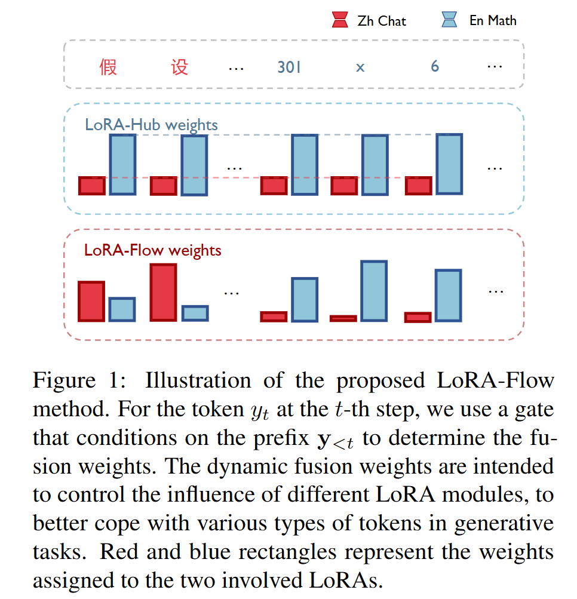
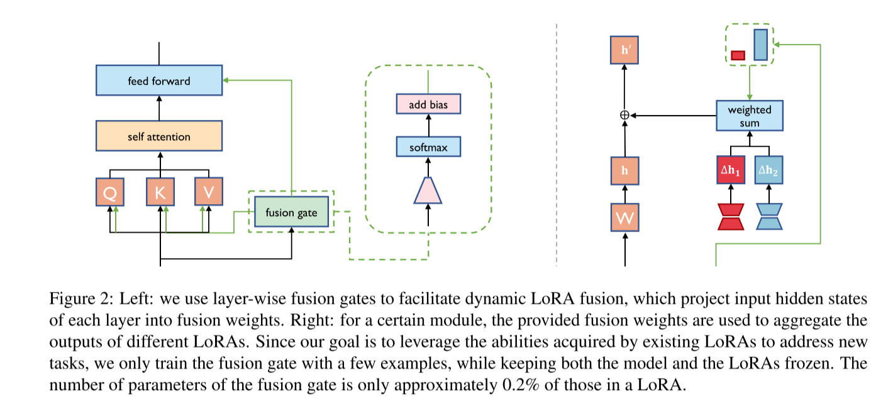
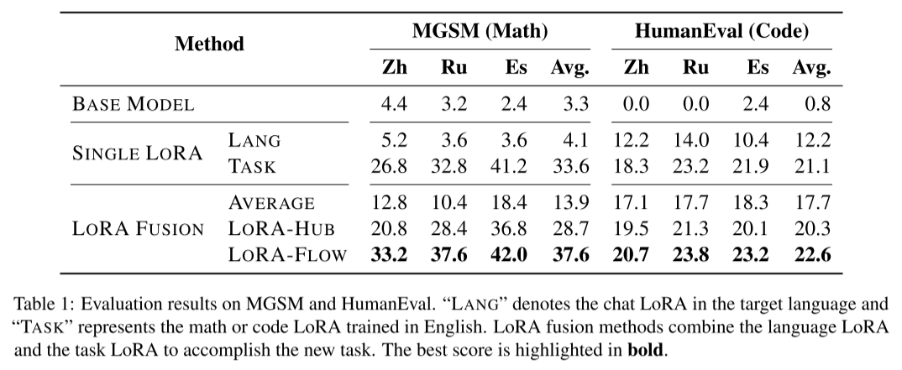
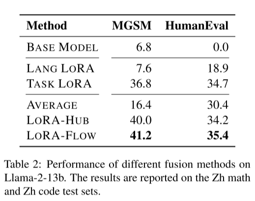
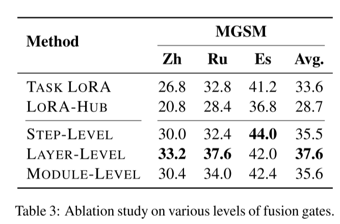
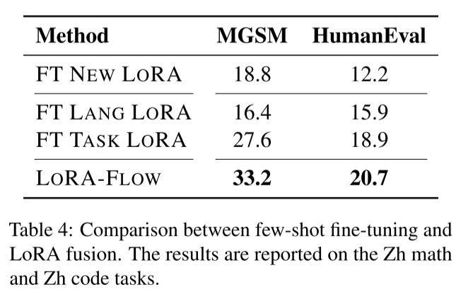
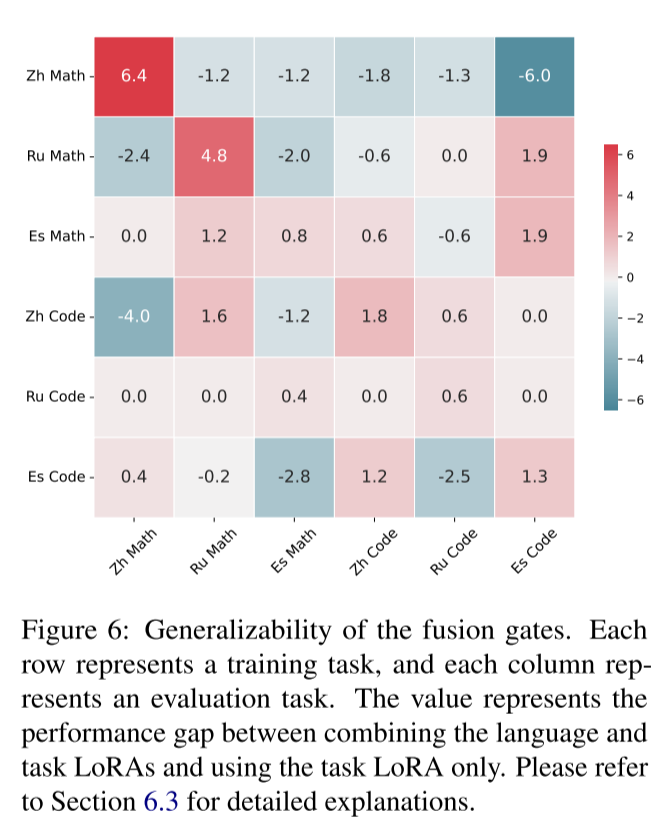

# LoRA-Flow: Dynamic LoRA Fusion for Large Language Models in Generative Tasks

### 摘要 

LoRA（低秩适配器，Low - Rank Adaptation）采用轻量级模块，针对每个下游任务或领域对大语言模型（LLMs）进行定制，其中不同的习得附加模块代表不同的技能。将现有的LoRA模块组合起来处理新任务，可以提高已学习的LoRA的可复用性，这对于标注数据有限的任务特别有益。此前大多数关于LoRA组合的研究主要依赖于每个相关LoRA的任务级权重，使得不同的示例和标记共享相同的LoRA权重。然而，在生成性任务中，不同的标记需要不同的技能来处理。以中文数学任务为例，理解题目描述可能更多地依赖于中文LoRA，而计算部分可能更多地依赖于数学LoRA。为此，我们提出了LoRA - Flow，它利用动态权重来调整不同LoRA的影响。每个步骤的权重由一个融合门控（fusion gate）来确定，该门控具有极少的可学习参数，仅需200个训练示例即可学习得到。在六个生成性任务上进行的实验表明，我们的方法始终优于基于任务级融合权重的基线方法。这表明了在LoRA组合中引入动态融合权重的必要性。 

### 1 Introduction

大语言模型（LLMs）在广泛的任务中展现出了优于以往较小模型的卓越性能（OpenAI，2023；Anil等人，2023；Touvron等人，2023a,b），从而将人工智能系统的适用性扩展到众多现实场景中。由于其庞大的模型规模，训练大语言模型的所有参数通常成本极高。因此，一些研究人员提出了一系列参数高效微调（PEFT）方法（Houlsby等人，2019；Li和Liang，2021）。在这些方法中，LoRA（低秩适配器；Hu等人，2022）因其高效性和简易性而成为最受欢迎的方法之一。 LoRA的基本思想是为每个下游领域或任务学习一个附加模块。最近的一些研究不再仅仅使用单个LoRA来处理已学习的任务，而是探索了组合现有LoRA来应对未见过的任务的潜力（Zhang等人，2023；Huang等人，2024；Chronopoulou等人，2023）。这个研究方向有可能大幅提高已学习参数的可复用性，促进不同模型能力的整合。

大多数现有的LoRA融合方法在组合不同的LoRA时采用任务级权重分布。**这意味着所有的示例和标记都共享相同的融合比例。**然而，**对于一些复杂的生成性任务（例如，解决数学问题或根据给定指令生成代码），大语言模型可能需要动态地运用不同类型的能力来有效地处理任务**。图1展示了一个例子，我们训练了一个中文聊天LoRA（即Zh Chat）和一个英文数学LoRA（即En Math），我们的目标是解决一个中英文混合的数学问题。直观地说，理解中文的题目描述可能更多地依赖于中文聊天LoRA，而进行计算可能更多地依赖于英文数学LoRA。 在这项工作中，我们提出了LoRA - Flow，它可以动态地确定不同LoRA在标记级的权重。在每个时间步，融合权重由一个门控模块生成，该模块以当前前缀为条件。融合门控包含极少的参数，仅约占LoRA参数的0.2% 。我们通过实验发现，融合权重仅通过200个训练示例就可以学习得到。我们还观察到，不同模型层之间的权重存在显著差异，这表明LoRA的影响在不同层之间有所不同。总之，这项工作的贡献如下：

- 我们提出了LoRA - Flow，一种将现有LoRA与动态融合权重相结合的方法，以有效地控制每个LoRA在各种生成步骤中的影响。 

- 我们在六个不同的生成任务上验证了LoRA - Flow的有效性，结果表明LoRA - Flow始终优于使用任务级融合权重的基线方法（例如，LoRA - Hub）。 
- 通过从多个方面进行精心设计的分析，我们对LoRA的整合有了更深入的理解。我们认为这个探索过程对于为大语言模型构建灵活的即插即用社区插件是富有成效的，使开发者能够利用其他人创建的插件来构建自己的大语言模型应用程序。 

图1：所提出的LoRA - Flow方法示意图 对于第 $t$ 步的标记 $y_t$，我们使用一个以前缀 $\mathbf{y}_{<t}$ 为条件的门控来确定融合权重。动态融合权重旨在控制不同LoRA模块的影响，以便更好地应对生成性任务中不同类型的标记。红色和蓝色矩形表示分配给两个相关LoRA的权重。 

### 2 Background

#### 大语言模型 

大多数最新的大语言模型采用仅解码器架构，由具有相同结构的堆叠层组成大规模模型。对于一个序列 $\mathbf{y}$，大语言模型通过以下方式估计其概率： $ P(\mathbf{y}|\boldsymbol{\theta}_{\text{base}})=\prod_{t = 1}^{T}P(y_t|\mathbf{y}_{<t};\boldsymbol{\theta}_{\text{base}}) \quad (1) $ 

其中，$y_t$ 表示第 $t$ 步的标记，$\mathbf{y}_{<t}$ 是前缀序列，$\boldsymbol{\theta}_{\text{base}}$ 表示基础大语言模型的参数。 

#### LoRA

LoRA（Hu 等人，2022）是一种参数高效微调方法，在某些场景下可以达到与全量微调相当的性能，但计算成本显著降低。具体来说，对于模型中的一个给定矩阵 $W \in \mathbb{R}^{m \times d}$，我们可以学习两个低秩矩阵 $A \in \mathbb{R}^{r \times d}$ 和 $B \in \mathbb{R}^{m \times r}$ 来近似 $W$ 的参数更新：

 $ \Delta W = BA \quad (2) $ 

#### LoRA融合 

每个训练好的LoRA都具备独特的能力，将它们组合起来可以整合大语言模型的各种技能。形式上，我们可以用 $\Delta W_1 = B_1A_1$ 和 $\Delta W_2 = B_2A_2$ 来表示两个现有的LoRA。Zhang 等人（2023）提出按以下方式合并两个LoRA： 

$ \mathbf{h}' = W\mathbf{x} + \lambda\Delta W_1\mathbf{x} + (1 - \lambda)\Delta W_2\mathbf{x} \quad (3) $ 

其中，$\lambda$ 是一个需要手动调整的超参数。 LoRA - Hub（Huang 等人，2024）通过以下方式进一步改进了融合方法： $ \begin{align*} \mathbf{h}' &= W\mathbf{x} \\ &+ (w_1B_1 + w_2B_2)(w_1A_1 + w_2A_2)\mathbf{x} \quad (4) \end{align*} $ 

**其中，融合权重 $w_1$ 和 $w_2$ 是通过少样本学习得到的。虽然LoRA - Hub能够自动确定不同LoRA的融合权重，但对于给定任务，不同标记的权重保持相同。这种共享权重方案可能会限制所涉及LoRA在需要多种上下文的复杂生成任务中的表达能力。**

### 3 方法

为了更灵活地处理生成性任务，我们提出了LoRA - Flow，该方法在每个生成步骤中使用动态融合权重。接下来，我们将首先介绍融合权重的计算方式（3.1节），然后详细说明如何将这些权重整合到模型中（3.2节）。最后，我们将在3.3节中描述训练算法。

图2:左:我们使用分层融合门来促进动态LoRA融合，将每层的输入隐藏状态投影到融合权值中。右:对于某个模块，使用提供的融合权重来聚合不同lora的输出。由于我们的目标是利用现有lora获得的能力来处理新任务，因此我们只使用几个示例来训练融合门，同时保持模型和lora冻结。融合门的参数数量仅为LoRA的0.2%左右。

### 3.1 计算融合权重

在第 $t$ 步，我们旨在使用前缀 $\mathbf{y}_{<t}$ 来确定融合权重，该前缀捕捉了当前标记的上下文。鉴于基础模型已经将上下文信息压缩到隐藏向量中，我们建议直接利用第 $t$ 步的隐藏状态，以避免冗余计算。 隐藏状态有三个层级，每个层级包含不同粒度的信息： 

- **步骤级（Step-level）隐藏状态 $\mathbf{x}_t$**：第 $t$ 步的输入词嵌入在该步骤的表示。 
- **层级（Layer-level）隐藏状态 $\mathbf{x}_t^l$**：第 $t$ 步输入到第 $l$ 层的表示。
- **模块级（Module-level）隐藏状态 $\mathbf{x}_t^{l,\text{type}}$**：输入到特定模块的向量（即自注意力网络中的查询投影）。 

如一些先前的研究所示，不同层中的隐藏状态可能处于不同的流形中（Voita 等人，2019）。因此，仅使用步骤级隐藏状态 $\mathbf{x}_t$ 来计算整个模型的融合权重可能效果不佳。另一方面，使用模块级隐藏状态会为融合门引入大量新参数，因为每个模块需要一个独立的门来处理其输入状态 $\mathbf{x}_t^{l,\text{type}}$ 。因此，我们使用层级隐藏状态 $\mathbf{x}_t^l$ 。6.1节的实证研究表明，层级融合权重能够胜过其他两种类型的权重。 如图2所示，对于第 $l$ 层，融合门根据输入表示 $\mathbf{x}_t^l$ 计算，然后将其映射为融合权重：

 $ \mathbf{w}^l = \text{softmax}(W_{\text{gate}}^l\mathbf{x}_t^l) + \mathbf{b}^l \quad (5) $ 

其中 $W_{\text{gate}}^l \in \mathbb{R}^{k \times d}$ 且 $\mathbf{b}^l \in \mathbb{R}^{k \times 1}$ ，$k$ 是LoRA的数量。$W_{\text{gate}}^l$ 和 $\mathbf{b}^l$ 都是可学习参数。给定 $d$ ，$k$ 通常比 $d$ 小得多，并且融合门中的参数数量与LoRA中的参数数量相比可以忽略不计。例如，在Llama - 2 7b（Touvron等人，2023b）中，一个LoRA的参数数量为117.44M，而 $r = 64$ ，组合两个LoRA的门控总共仅包含0.26M个参数。 

### 3.2 整合融合权重

如3.1节所述，我们在LoRA - Flow中使用层级融合权重。一旦在第 $t$ 步得到融合权重 $\mathbf{w}^l$ ，我们将该权重应用于所有包含LoRA的模块。与LoRA - Hub（Huang等人，2024）不同，LoRA - Hub分别组合LoRA的A矩阵和B矩阵（如公式(4)所示），我们整合不同LoRA的输出，将每个LoRA视为一个完整的模块。这样做的原因是，以这种中间方式组合不同秩的LoRA可能会受到限制。设 $\Delta \mathbf{h} = [\Delta \mathbf{h}_1; \cdots ; \Delta \mathbf{h}_k] \in \mathbb{R}^{d \times k}$ 表示所有涉及的LoRA的输出，融合过程可以表示为： 

$ \mathbf{h}' = \mathbf{h} + \Delta \mathbf{h}\mathbf{w}^l \quad (6) $ 

其中 $\mathbf{h}$ 是基础模型中模块的输出。图2展示了一个示例。 

### 3.3 训练

对于基础模型 $\boldsymbol{\theta}_{\text{base}}$ 和一组现有的已学习LoRA $\boldsymbol{\theta}_{\text{LoRA}} = \{\boldsymbol{\theta}_{\text{LoRA}}^1, \cdots, \boldsymbol{\theta}_{\text{LoRA}}^k\}$ ，我们在新任务上训练融合门 $\boldsymbol{\theta}_{\text{fusion}}$： 

$ \hat{\boldsymbol{\theta}}_{\text{fusion}} = \underset{\boldsymbol{\theta}_{\text{fusion}}}{\text{argmax}} \{\mathcal{L}(\boldsymbol{\theta}_{\text{total}}|\mathcal{D}_{\text{new}})\} \quad (7) $ 

其中 $\boldsymbol{\theta}_{\text{total}} = \boldsymbol{\theta}_{\text{base}} \cup \boldsymbol{\theta}_{\text{LoRA}} \cup \boldsymbol{\theta}_{\text{fusion}}$ 表示总参数。似然定义为：

 $ \mathcal{L}(\boldsymbol{\theta}_{\text{total}}|\mathcal{D}_{\text{new}}) = \sum_{i = 1}^{N} P(\mathbf{y}_i|\boldsymbol{\theta}_{\text{total}}) \quad (8) $

其中 $N$ 是新任务上的训练示例数量。我们按照LoRA - Hub（Huang等人，2024）的方法，以少样本学习的方式在几个融合模块中学习 $\boldsymbol{\theta}_{\text{fusion}}$ ，其中 $N$ 设置为200 。由于 $\boldsymbol{\theta}_{\text{fusion}}$ 仅包含少量参数，这些有限的训练示例足以学习到有效的融合机制。

在上述文本的公式中， $\mathcal{D}_{\text{new}}$ 表示新任务的训练数据集 。 在训练融合门 $\boldsymbol{\theta}_{\text{fusion}}$ 时，需要基于这个新任务的训练数据集 $\mathcal{D}_{\text{new}}$ 来计算似然函数 $\mathcal{L}(\boldsymbol{\theta}_{\text{total}}|\mathcal{D}_{\text{new}})$ ，通过最大化这个似然函数，来得到最优的融合门参数 $\hat{\boldsymbol{\theta}}_{\text{fusion}}$ ，从而让模型在新任务上表现更好。 公式（8）中对数据集中每个样本 $\mathbf{y}_i$ 的概率 $P(\mathbf{y}_i|\boldsymbol{\theta}_{\text{total}})$ 求和得到似然函数，这里的样本就是来自 $\mathcal{D}_{\text{new}}$ 。 

### 4 实验

#### 4.1 实验设置 

- **基础模型**：我们使用Llama - 2（Touvron等人，2023b）作为基础大语言模型来检验各种LoRA融合方法的性能，因为它是使用最广泛的开源大语言模型之一。由于计算限制，我们使用Llama - 2 7b模型。 
- **LoRA训练**：为了进行LoRA融合实验，我们首先在有足够监督数据的任务上学习几个LoRA：    
- **中文聊天（Zh Chat）**：我们使用Lai等人（2023）发布的数据来学习中文聊天LoRA，预计其具备理解和生成中文文本的能力。总共有52K个训练示例。    
- **俄语聊天（Ru Chat）**：俄语聊天LoRA的训练数据也来自Lai等人（2023），包含52K个俄语训练示例。    
- **西班牙语聊天（Es Chat）**：西班牙语聊天LoRA的训练数据同样来自Lai等人（2023），包含52K个西班牙语训练示例。    
- **英文数学（En Math）**：英文数学LoRA的训练数据由Yu等人（2023）构建，包含395K个英文数学问题。    
- **英文代码（En Code）**：我们使用Magicoder数据集（Wei等人，2023）训练英文代码LoRA，该数据集包含186K个英文代码生成问题。 我们将LoRA整合到注意力网络中的查询、键、值和输出投影以及前馈网络的三个线性投影中。默认情况下，LoRA的秩设置为64 ，$\alpha$ 的值设置为16 。对于英文代码LoRA，我们将 $r$ 设置为256，因为我们观察到代码LoRA在 $r = 64$ 时无法有效地学习任务。我们使用余弦退火预热调度，峰值学习率为 $1e - 4$ 。对于每个任务，LoRA训练3个 epoch ，预热比例设置为0.04 。 
- **LoRA融合**：我们以少样本方式评估LoRA融合方法。具体来说，我们在六个任务上进行评估，包括中文数学、俄语数学、西班牙语数学、中文代码、俄语代码和西班牙语代码。在每个任务中，我们组合目标语言的聊天LoRA和英文的任务LoRA。简而言之，我们使用语言LoRA来表示目标语言，使用英文训练的任务LoRA（数学或代码LoRA）。 对于每个任务，我们构建200个训练示例用于微调训练，这些示例首先由GPT - 3.5根据英文数学或代码数据翻译生成，然后由人工验证。对于融合实验的验证，我们也构建100个问题作为验证集。对于代码生成任务，由于代码生成测试示例标注既耗时又耗力，我们使用人工创建20个问题作为验证集。LoRA - Hub和本文提出的LoRA - Flow都在少样本数据上进行训练。我们使用验证集来搜索训练超参数。搜索空间的峰值学习率是 $\{1e - 3, 1e - 4\}$ ，批量大小的搜索空间是 $\{2, 4, 8\}$ 。每个融合模块训练5个 epoch ，使用少样本训练数据。 
- **评估**：对于数学融合实验，我们使用MGSM（Shi等人，2023）作为测试集，这是一个广泛用于评估大语言模型数学能力的多语言评估基准。对于代码生成融合实验，我们构建一个多语言版本的HumanEval（Chen等人，2021）。HumanEval中的原始英文问题描述由GPT - 3.5翻译成其他语言，然后由人工验证。我们分别在MGSM和HumanEval上报告准确率和通过率@1分数。 

#### 4.2 主要结果

表1展示了相关方法在不同生成任务上的结果。为了进行比较，我们还展示了基础模型和单个LoRA的性能。用英文训练的任务LoRA已经展现出显著的跨语言迁移能力，超过了在非英文任务上的语言LoRA。例如，在中文数学任务中，任务LoRA达到了26.8的准确率，而语言LoRA仅达到5.2 。在代码生成任务中，任务LoRA也明显优于语言LoRA。 当我们将语言和任务LoRA组合起来，并与使用任务级融合权重的两种基线方法进行比较时。“Average”基线指的是简单地对两个涉及的LoRA的输出进行平均，如第2节所述，LoRA - Hub使用任务级融合权重进行少样本训练数据，这与提出的LoRA - Flow类似。然而，LoRA - Flow使用动态融合权重，这些权重在不同的时间步骤和模型层中有所不同。我们使用Huang等人（2024）发布的开源代码在实验中重新实现LoRA - Hub。 从我们的实验中，我们发现 “Average” 和LoRA - Hub的性能甚至比单个任务LoRA更差，这表明使用静态权重组合不同的LoRA对于复杂的生成任务（如解决数学问题或生成代码段）效果不够好。具体来说，LoRA - Hub仅在中文数学任务上优于单个任务LoRA。 使用与LoRA - Hub相同的少样本训练数据进行训练，LoRA - Flow在所有六个评估任务上都优于基线方法。例如，LoRA - Flow在代码生成任务上相对于LoRA - Hub的性能提升了2.3（22.6对比20.3）。这证实了在生成任务中使用动态权重的必要性。 

#### 4.3大模型结果

为了验证LoRA-Flow在更大大型语言模型上的有效性，我们还在Llama-2-13b上进行了实验。考虑到更大的模型需要更高的训练成本，我们只为13b模型训练了三个lora，即Zh Chat, En Math和En Code。不同融合方式对13b模型的结果如表2所示。在更大的模型上，所涉及的所有方法都比在7b模型上取得了更好的结果。与LoRA-Hub相比，LoRA-Flow在数学和代码任务上都表现出卓越的性能。这些结果也证明了LoRA-Flow可以兼容各种规模的模型。

### 5 分析 

为了更深入地了解LoRA - Flow的特性，我们从多个角度进行了一系列全面的分析。我们首先在5.1节中估计模型不同层的平均融合权重，然后在5.2节中研究融合权重在不同时间步的变化情况。最后，在5.3节中给出一个具体案例。 

#### 5.1 不同层的融合权重 

图3展示了在中文数学任务中，两个相关LoRA（即中文聊天LoRA和英文数学LoRA）在不同层的平均融合权重。对于中文聊天LoRA和英文数学LoRA，不同层的权重都有显著变化，这表明不同模型层存在不同的融合方案。具体来说，我们观察到较低层给英文数学LoRA分配更高的权重，而较高层则给中文聊天LoRA分配更多的权重。这种现象可以通过以下原因解释：底层主要利用数学LoRA进行推理，而顶层在目标语言的文本生成中更多地依赖语言LoRA。相比之下，像LoRA - Hub这种使用固定权重组合LoRA的方法，将每个Transformer层的能力视为等同，忽略了它们能力上的差异。这限制了LoRA融合的潜力。 

#### 5.2 不同时间步的融合权重 

我们还分析了解码过程中不同时间步的平均融合权重。我们根据生成标记的相对位置将所有标记划分为10个区间。图4展示了结果，其中“10%”表示左侧最初的10%标记，“20%”表示接下来10% - 20%的标记。结果强调了在生成任务中使用动态融合权重的必要性，因为它们表明不同的时间步需要不同的融合权重，这再次证实了我们的直觉。 

#### 5.3 融合权重的详细分析 

为了更好地研究LoRA - Flow的融合过程，我们在图5中给出了一个例子，其中包括模型生成的具体标记以及两个相关LoRA（即中文聊天LoRA和英文数学LoRA）对应的融合权重。正如5.2节所讨论的，融合权重在不同标记之间存在显著差异。值得注意的是，由于融合门中加入了偏差向量，如公式(5)所示，某些标记可能具有负的融合权重。我们从Zhang等人（2023）的工作中获得启发，他们观察到负的融合权重可以产生特定的效果。 

平均而言，融合门给英文数学LoRA分配更高的权重。此外，我们观察到中文聊天LoRA的融合权重存在一些低谷。为了更好地理解这一现象，我们找出了与这些低谷对应的标记。如图5所示，我们用相同的颜色标记权重低谷和相应的文本片段。令人惊讶的是，我们发现当中文聊天LoRA的融合权重降低时，文本片段主要包含数字和数学计算（例如，“1800 / 6 = 300”），这与英文数学LoRA所学习到的数学能力更相符。 

通过研究这个案例，我们发现融合权重与生成内容之间有很强的相关性。当内容涉及数学推理时，LoRA - Flow会提高英文数学LoRA的融合权重。权重的显著波动表明，在整个解码过程中依赖固定权重是不可行的，这强调了动态融合权重的必要性。 

### 6 讨论 

#### 6.1 消融研究 

为了进一步研究LoRA - Flow中门控的粒度，我们进行了一项消融研究，以比较不同类型门控的性能：步骤级门控、层级门控和模块级门控。如3.1节所述，步骤级门控为每个步骤估计融合权重，该权重由整个模型共享。层级门控是LoRA - Flow的默认设置，为每一层计算融合权重。模块级门控为每个模块（例如，最后一层中的查询投影模块）提供特定的权重，它比层级门控具有更大的灵活性，但会引入更多的可训练参数。 表3展示了不同门控层级的结果。平均而言，层级融合门控获得了最高分数，超过了步骤级门控和模块级门控。尽管如此，另外两种融合门控类型的表现也优于LoRA - Hub。具体来说，步骤级融合门控的平均分数为35.5，而LoRA - Hub的平均分数为28.7。这些结果表明，虽然在不同模型层使用共享融合权重，但在不同时间步采用动态融合方法比使用任务级静态权重能产生更好的结果。由于不同的模型层可能具有不同的能力，使用层级融合门控可以进一步提高性能。 

#### 6.2 LoRA融合与少样本微调 

在数据有限的场景中，组合现有的LoRA可以有效地利用在其他任务中获得的知识。在本节中，我们将LoRA - Flow与其他少样本微调基线进行比较：(1) FT new LoRA：使用相同的少样本训练示例为目标任务学习一个新的LoRA；(2) FT lang LoRA：在目标任务上微调语言LoRA；(3) FT task LoRA：在目标任务上微调任务LoRA。结果如表4所示。我们的方法动态地整合了语言LoRA和任务LoRA，超过了所有三个少样本微调基线，这表明在少样本场景中利用现有LoRA的有效性。 

#### 6.3 不同任务间的泛化性

与LoRA - Hub（Huang等人，2024）类似，我们使用少样本训练数据为每个任务学习融合模块。在本研究中，我们还探讨了融合门控在各种任务间的泛化性。例如，为中文代码任务训练的、用于组合中文聊天LoRA和英文代码LoRA的门控，能否有效地组合俄语聊天LoRA和英文数学LoRA？ 图6展示了结果，描绘了合并两个LoRA与仅使用任务LoRA（这是一个强有力的基线）之间的性能差异。具体来说，首行表示所有任务的初始随机数据。值得注意的是，许多值为正，这表明虽然在方法设计时并未特别考虑零样本泛化，但它仍然展现出一定程度的泛化能力。以第三行为例，在西班牙语数学任务上训练一个门控，使得训练任务的性能提高了0.8。令人印象深刻的是，这个西班牙语数学门控在其他三个任务（即俄语数学、中文代码和西班牙语代码）上也提高了性能。此外，在西班牙语代码任务中观察到的性能提升超过了在西班牙语数学任务中获得的提升。我们将进一步提高LoRA融合方法的零样本泛化能力的研究留给未来的工作。 

### 7 相关工作 

#### 模块组合

探索现有模块在新任务中的复用是一个有吸引力的研究方向。Pfeiffer等人（2021）通过额外的注意力层组合在各种下游任务上微调过的适配器（Houlsby等人，2019）。Zhang等人（2023）定义了一些特定的操作，如加法和减法，来组合现有的LoRA。组合权重在验证集上进行微调。Huang等人（2024）通过在少样本方式下自动优化融合权重进一步改进了LoRA的组合。Chronopoulou等人（2023）将为摘要任务和多语言无监督数据训练的多个LoRA组合用于多语言摘要，其中融合权重也是一个需要微调的超参数。以前的LoRA融合方法采用任务级静态权重，而我们提出的LoRA - Flow可以根据当前上下文动态地组合不同类型的LoRA。 

#### LoRA的混合

最近的一些研究提出通过LoRA混合（MoLoRA）架构（Zadouri等人，2023；Dou等人，2023）来提高LoRA的性能，这类似于混合专家模型。这些努力的主要目标是克服LoRA在某些下游任务中的局限性，因为单个LoRA的表达能力可能受到其中间秩的限制。我们的工作与MoLoRA的主要区别在于，MoLoRA主要旨在为基础模型训练一个更好的插件，而我们的目标是在不训练新LoRA的情况下利用预训练的LoRA来处理新任务。这两种方法是互补的。我们的方法也可以扩展以纳入现有的MoLoRA或其他先进类型的LoRA用于未见任务。