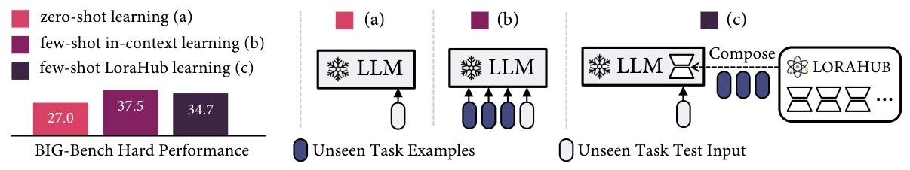
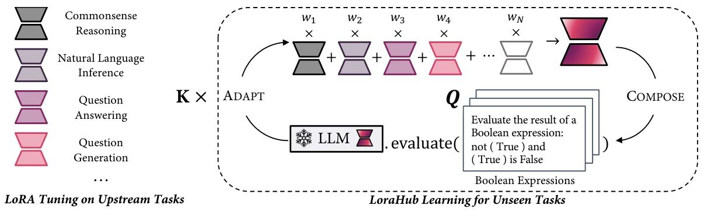

# LoraHub: Efficient Cross-Task Generalization via Dynamic LoRA Composition

**一段话总结**：本文提出**LoraHub**框架，旨在通过动态组合不同任务训练的**LoRA 模块**实现跨任务泛化。它利用少量新任务示例自动组合模块，无需额外模型参数和人工干预。以**FLAN-T5-large**为基础模型在**Big-Bench Hard（BBH）基准测试**中，LoraHub 性能接近少样本上下文学习，且推理时使用更少令牌，降低成本。同时，论文探讨其特性，对比相关工作，为 LLMs 快速适应多样任务提供新途径。

1. **方法概述**：先在多种上游任务上训练 LoRA 模块，对于新任务，LoraHub 学习分为 COMPOSE 和 ADAPT 两个阶段。COMPOSE 阶段组合现有 LoRA 模块，ADAPT 阶段将组合模块与 LLM 结合评估性能，用无梯度算法更新权重，最终得到适应新任务的模型。
2. **LoRA 调优**：LoRA 通过将 LLM 注意力权重矩阵更新分解为低秩矩阵，减少可训练参数数量，实现高效调优。
3. **COMPOSE 阶段**：采用元素级组合方法，将多个 LoRA 模块对应参数整合，但组合过多模块可能扩大搜索空间，可通过随机选择等方法优化。
4. **ADAPT 阶段**：利用无梯度方法（如 Shiwa 中的 CMA-ES 算法）优化组合模块权重，以交叉熵损失为目标，结合 L1 正则化，避免权重出现极端值。

图 1 展示了零样本学习、少样本上下文学习和少样本 LoraHub 学习（本文提出的方法）的过程。需要注意的是，组合（Compose）过程是按任务进行的，而非按示例进行。在 BIG-Bench Hard（BBH）基准测试中，本文方法实现了与零样本学习相似的推理吞吐量，同时性能接近上下文学习。

- **零样本学习**：在没有新任务的标记示例情况下，模型直接对未知任务进行预测，其优势是推理速度快，无需额外处理示例，但往往性能受限，因为模型缺乏对新任务的适应性知识。
- **少样本上下文学习**：利用少量新任务的标记示例，将这些示例作为上下文信息提供给模型，模型基于这些示例和自身的预训练知识进行预测。这种方法通常能获得较好的性能，但由于需要处理大量示例作为输入，推理成本较高，例如在 BBH 基准测试中，平均每个示例的输入令牌数较多。
- **少样本 LoraHub 学习**：结合了零样本学习和少样本上下文学习的优点。它通过动态组合在不同任务上预训练的 LoRA 模块，仅使用少量新任务示例来指导模块组合和权重调整。在推理时，其吞吐量与零样本学习相似，即不需要处理大量输入令牌，减少了计算开销；同时，通过合理组合 LoRA 模块，在 BBH 基准测试中的性能接近少样本上下文学习，能够有效适应新任务。

**Cross-Task Generalization** 在现实场景中，用户常常期望大语言模型（LLM）能够执行其之前从未遇到过的新任务，这种能力被广泛称为跨任务泛化。一般来说，跨任务泛化分为两类：零样本学习（米什拉等人，2022；桑等人，2022；钟等人，2022；OpenAI，2022；林等人，2022），它不需要新任务的标记示例；以及少样本学习（叶等人，2021；闵等人，2022），它需要少量的标记示例。假设我们有N个不同的上游任务，大语言模型已经在这些任务上进行了训练，记为$\mathbb{T}={T_{1}, ..., T_{N}}$ 。本文主要关注后一类情况，即对于一个未见过的目标任务$T' \notin \mathbb{T}$ ，用户只能提供有限的标记示例集Q。我们的目标是仅使用Q来修改模型 $M_{\theta}$，使其适应任务$T'$ 。一种直观的方法是基于Q对$M_{\theta}$ 的权重进行微调，从而得到一个更新后的模型$M_{\phi}$ ，使其在$T'$ 上的性能有所提升。然而，当Q较小时，这种方法效率低下、耗时较长，并且不稳定。 

### 方法

图2展示了研究方法主要包含两个阶段：COMPOSE阶段和ADAPT阶段，具体内容如下： 

1. **COMPOSE阶段**：在这个阶段，会将已有的多个LoRA模块整合为一个统一的模块。这些LoRA模块是之前在不同任务上训练得到的。整合过程中，使用一组系数（用w表示）来实现。系数w中的每个元素都是标量，可正可负，通过这些系数对不同的LoRA模块进行加权组合，从而形成一个新的、综合了多个模块能力的统一模块。这一过程的目的是将不同任务训练出的LoRA模块的优势进行融合，为后续处理新任务做准备。 
2. **ADAPT阶段**：首先，把在COMPOSE阶段组合好的LoRA模块与大语言模型（LLM）结合，并在来自未知新任务的少量示例上对其性能进行评估。由于这些示例数量有限，被称为少样本示例。然后，采用一种无需计算梯度的算法来优化系数w。之所以选择梯度 - 自由算法，是因为直接使用梯度下降等传统方法需要构建复杂的超网络，消耗大量的GPU内存和时间，而当前系数w的参数数量相对较少，更适合用这种更高效的方式。经过K次这样的迭代优化，会得到一个高度适应新任务的组合LoRA模块。最后，将这个优化后的模块与LLM结合，就能让模型执行之前未见过的新任务。 

如图2所示，我们首先在各种上游任务上训练低秩自适应（LoRA）模块。具体而言，对于N个不同的上游任务，我们分别训练N个LoRA模块，对于任务$T_{i} \in \mathbb{T}$，每个模块表示为$m_{i}$。随后，对于一个不属于$\mathbb{T}$的新任务$T'$，比如图2中所示的布尔表达式任务，利用该任务的8个示例来引导LoraHub的学习过程。 LoraHub学习过程包含两个主要阶段：组合（COMPOSE）阶段和适配（ADAPT）阶段。

在组合阶段，所有可用的LoRA模块会以${w_{1}, w_{2}, ..., w_{N}}$作为系数，被组合成一个单一的集成模块$\hat{m}$ 。每个$w_{i}$都是一个标量值，可以取正值或负值，并且组合方式多种多样。 在适配阶段，组合后的LoRA模块$\hat{m}$会与大语言模型$M_{\theta}$合并，然后在新任务$T'$的少样本示例上评估其性能。接着，使用一种无梯度算法来更新权重$w$，以提升$\hat{m}$在少样本示例集$Q$上的性能（例如降低损失）。最后，经过K步迭代后，将性能最优的LoRA模块应用于大语言模型$M_{\theta}$ ，得到最终的大语言模型$M_{\phi}=LoRA(\bar{M}_{\theta}, \hat{m})$ 。这个模型就是针对未见任务$T'$进行了有效调整的模型，之后会被部署使用，且不再更新。 

在COMPOSE阶段，研究团队采用了一种按元素组合的方法来合并LoRA模块，具体如下：

1. **元素级组合方法**：这种方法的核心是对LoRA模块的相应参数进行整合。LoRA模块在设计上是基于低秩分解，引入了可训练的低秩矩阵 。在组合多个LoRA模块时，要求参与组合的所有模块具有相同的秩r，这是为了确保模块的结构能够正确对齐，使组合过程在数学和逻辑上合理可行。例如，在一个基于Transformer架构的大语言模型中，LoRA模块添加在注意力层等关键层，相同的秩保证了这些模块在调整模型参数时的一致性和协调性。 
2. **组合公式推导**：假设每个单独的LoRA模块$m_{i}$可以表示为两个低秩矩阵$A_{i}$和$B_{i}$的乘积，即$m_{i}=A_{i}B_{i}$。在组合多个LoRA模块时，研究人员使用一组系数$w_{1}, w_{2}, \cdots, w_{N}$ 。通过将这些系数分别与对应的$A_{i}$和$B_{i}$矩阵进行加权求和，然后再将两个加权和的结果相乘，从而得到组合后的LoRA模块$\hat{m}$ ，公式为$\hat{m}=(w_{1}A_{1}+w_{2}A_{2}+\cdots+w_{N}A_{N})(w_{1}B_{1}+w_{2}B_{2}+\cdots+w_{N}B_{N})$ 。这个公式实现了对多个LoRA模块的综合集成，使得组合后的模块能够融合不同原始模块的特性。 通过这种元素级的组合方式，LoraHub能够将多个针对不同任务训练的LoRA模块的优势结合起来，为模型在新任务上的表现提供更多可能性。 

在ADAPT阶段，

受前人工作（Sun等人，2022年）的启发，论文作者采用了黑箱优化技术来寻找最优的权重向量 $w$。黑箱优化技术不需要了解目标函数的具体形式和梯度信息，仅通过输入和输出的关系来寻找最优解，特别适用于像LoraHub这样难以直接计算梯度的场景。

1. **优化目标**：在优化过程中，作者以交叉熵损失作为指导。交叉熵损失常被用于衡量两个概率分布之间的差异，在LoraHub中，它被用来评估模型预测结果与真实标签之间的差距。目标是找到一组最佳的权重 $\{w_1, w_2, \ldots, w_N\}$，使得模型在少样本示例 $Q$ 上的损失 $L$ 最小化。 
2. **L1正则化**：为了避免权重 $w$ 取到极端值，作者引入了L1正则化。L1正则化通过惩罚权重向量 $w$ 中各个元素的绝对值之和，对模型进行约束。这种约束有助于提高模型的泛化能力，防止过拟合。具体来说，L1正则化项为 $\sum_{i = 1}^{N}|w_i|$。 
3. **最终目标函数**：综合交叉熵损失和L1正则化，LoraHub的最终目标是最小化 $L+\alpha \cdot \sum_{i = 1}^{N}|w_i|$。其中，$\alpha$ 是一个超参数，用于平衡交叉熵损失和L1正则化项的相对重要性。$\alpha$ 的取值需要通过实验来确定，不同的 $\alpha$ 值可能会对模型性能产生不同的影响。 

在无梯度方法方面，研究团队利用了Shiwa（一种组合优化方法，Liu等人在2020年提出）。Shiwa提供了多种算法，并能根据不同情况选择最合适的优化算法。在后续的大多数实验设置中，主要采用了协方差矩阵自适应进化策略（Covariance Matrix Adaptive Evolution Strategies，简称CMA-ES，由Hansen和Ostermeier在1996年提出 ）。 

- **CMA-ES算法特性**：CMA-ES是一种基于随机和种群的优化算法，在处理各种优化挑战时具有很强的通用性。它通过一个由协方差矩阵定义的搜索分布来进行优化。在每次迭代过程中，CMA-ES会系统地更新这个搜索分布的均值和协方差，以此来优化目标函数。例如，在寻找最优解的过程中，它会根据当前种群的分布情况，动态调整搜索的方向和范围，使得搜索过程更加智能和高效。 
- **在LoraHub中的应用**：在LoraHub的学习过程中，使用CMA-ES算法来塑造权重\(w\)的搜索空间。具体来说，在ADAPT阶段，需要调整组合LoRA模块的权重\(w\)，以提升模型在未见任务少样本示例上的性能。CMA-ES算法通过不断更新搜索分布的均值和协方差，尝试不同的权重组合。最终，通过在未见任务的少样本示例上评估不同权重组合的性能，来确定最优的权重\(w\)。这样就能得到一个在新任务上表现良好的组合LoRA模块，进而提升整个模型对新任务的适应性和性能。 

协方差矩阵自适应进化策略（Covariance Matrix Adaptive Evolution Strategies，CMA-ES）是一种强大的随机优化算法，在诸多领域有着广泛应用，在LoraHub中用于优化LoRA模块组合权重，提升模型在新任务上的性能。下面从基本原理、关键参数、算法流程、优势与局限性展开讲解： 

1. **基本原理**：CMA-ES基于进化算法思想，模拟自然进化过程。它通过维护一个解的种群，利用协方差矩阵描述种群分布特征。每次迭代时，根据当前种群中解的表现，调整均值向量和协方差矩阵，从而引导搜索向更优区域进行。在LoraHub中，它用于调整LoRA模块组合权重$w$，以优化模型在新任务少样本示例上的性能。 

2.  **关键参数**    

   - **均值向量（Mean Vector）**：代表当前种群的中心趋势，决定了搜索空间中的主要搜索方向。在寻找最优权重$w$时，均值向量引导算法向可能的最优解靠近。    
   - **协方差矩阵（Covariance Matrix）**：刻画了解向量各个维度之间的相关性和变化程度。通过调整协方差矩阵，算法可以动态改变搜索步长和方向，适应不同的优化地形。例如，当解在某些维度上变化较大时，协方差矩阵相应元素会增大，使算法在这些维度上搜索范围更广；反之则缩小搜索范围。    
   - **种群规模（Population Size）**：指每次迭代中包含的解的数量。较大的种群规模能更全面地探索搜索空间，但计算成本较高；较小的种群规模计算效率高，但可能导致搜索不够充分。在LoraHub实验中，合适的种群规模需根据任务复杂程度和计算资源确定。 

3. **算法流程**    

   - **初始化**：设定初始均值向量、协方差矩阵（通常初始化为单位矩阵，表示各维度相互独立且步长相同）和种群规模。在LoraHub中，就是初始化LoRA模块组合权重$w$的分布。    

   - **生成种群**：根据当前均值向量和协方差矩阵，通过采样生成一组新的解（即新的权重组合$w$）。这些解构成当前迭代的种群。    

   - **评估与选择**：在新任务的少样本示例上评估每个解对应的模型性能（如计算交叉熵损失）。根据性能对解进行排序，选择表现较好的一部分解用于更新均值向量和协方差矩阵。    

   - **更新参数**：利用选择的解，按照特定公式更新均值向量和协方差矩阵。例如，均值向量向表现好的解的方向移动，协方差矩阵根据解的分布变化进行调整，使后续搜索更聚焦于有潜力的区域。    

   - **迭代优化**：重复上述步骤，不断生成新种群、评估、选择和更新参数，直到满足停止条件（如达到最大迭代次数或性能收敛），最终得到最优权重$w$。 

4. **优势**    

- **全局搜索能力强**：通过种群和协方差矩阵的动态调整，能在复杂搜索空间中有效探索，避免陷入局部最优解，这对于LoraHub处理多样的新任务至关重要。    
- **自适应能力好**：能根据搜索过程中的反馈，自动调整搜索步长和方向，适应不同的优化问题结构。在LoraHub中，面对不同任务和数据特征，能灵活优化权重$w$。    
- **对梯度信息依赖小**：无需计算目标函数的梯度，适用于目标函数复杂或梯度难以计算的场景，如LoraHub中组合多个LoRA模块优化时，采用该算法可避免构建复杂超网络计算梯度的难题。 

5. **局限性**    - **计算复杂度较高**：维护种群和更新协方差矩阵计算量较大，尤其是在高维搜索空间和大规模种群时，计算成本显著增加，限制了其在资源受限场景中的应用。    - **参数调优复杂**：算法性能对种群规模、学习率等参数敏感，不同问题需要反复试验确定合适参数，增加了使用难度和时间成本。 

