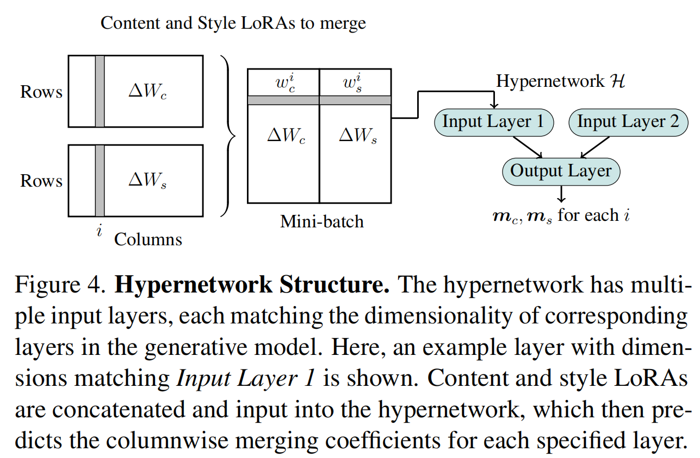

# 《LoRA.rar：实现高效实时LoRA合并及MARS2评估新突破》

\*

***

### 一段话总结

本文提出**LoRA.rar**，通过**预训练超网络**学习合并系数，实现内容与风格 LoRA 的高效融合，解决传统方法在实时个性化图像生成中的高计算成本问题。该方法在合并速度上实现**超 4000 倍加速**，无需测试时优化，且引入基于多模态大语言模型（MLLM）的评估指标**MARS2**，提升内容 - 风格保真度评估准确性。实验表明，LoRA.rar 在生成质量和效率上显著优于现有方法，如 ZipLoRA，支持**15 种以上概念的高质量融合**，为资源受限设备的实时应用提供解决方案。


***


```mindmap
## **研究背景**
- 个性化图像生成需求：用户需结合自定义主题和风格，LoRA是高效微调方法但合并成本高
- 现有问题：ZipLoRA等需逐对优化，耗时不适用于实时场景；评估指标（CLIP-I/T、DINO）不适用于联合评估
## **核心方法**
- **超网络架构**：输入内容和风格LoRA矩阵，输出列级合并系数，实现快速融合
- **训练策略**：在多样LoRA对上预训练，学习自适应合并策略，无需测试时训练
- **评估创新**：引入MARS2指标，基于MLLM（如LLaVA-Critic）评估内容和风格保真度
## **实验验证**
- **数据集**：30个主题、26种风格的LoRA，拆分训练/验证/测试集
- **基线对比**：Direct Merge、DARE、TIES、ZipLoRA等
- **关键结果**：
  - 速度：比ZipLoRA快4000倍，单前向传播生成合并系数
  - 质量：MARS2评估中，平均/最佳案例准确率超现有方法（如ZipLoRA平均0.58 vs LoRA.rar 0.71）
  - 效率：参数少3倍，内存开销低（0GB额外内存 vs ZipLoRA 4GB）
## **核心贡献**
- 提出LoRA.rar，实现高效实时LoRA合并
- 引入MARS2指标，解决联合评估难题
- 性能突破：质量、速度、参数效率全面提升
## **局限与未来**
- 局限：复杂主题（如带文字的物体）生成仍有挑战
- 方向：扩大训练数据多样性，优化MLLM评估鲁棒性
```



***

### 详细总结

#### 1. **研究背景与目标**

**核心挑战**：

个性化图像生成需合并内容（主题）和风格 LoRA，但现有方法如 ZipLoRA 需逐对优化，**耗时 158 秒 / 对**，无法用于实时场景（如手机端）。

传统评估指标（CLIP-I、CLIP-T、DINO）无法准确评估**联合内容 - 风格保真度**，常偏向单一维度（如风格或主题）。

**目标**：提出**LoRA.rar**，通过预训练超网络实现**快速、高质量的 LoRA 合并**，支持实时生成；设计新评估指标**MARS2**，基于多模态大语言模型（MLLM）提升评估准确性。

#### 2. **核心方法：LoRA.rar 架构与技术**

**超网络设计**：

**输入**：内容 LoRA（$\Delta W_c$）和风格 LoRA（$\Delta W_s$）的矩阵列向量，逐列拼接后输入多层 MLP。

**输出**：列级合并系数$m_c, m_s$，计算合并矩阵$\Delta W_m = m_c \otimes \Delta W_c + m_s \otimes \Delta W_s$，仅优化查询和输出层 LoRA，关键 / 值层采用简单平均。

**优势**：单前向传播生成系数，**耗时 0.037 秒 / 对**，比 ZipLoRA 快**4000 倍以上**。

**训练策略**：

在 360 对内容 - 风格 LoRA（20 主题 + 18 风格训练）上预训练，损失函数包含内容 / 风格保真度项和正交正则化项，确保系数自适应且不冲突。

**评估创新（MARS2）**：

利用**LLaVA-Critic-7b 模型**，分别判断生成图像是否符合参考主题和风格，仅当两者均通过时计为正确，解决传统指标的偏向性。

#### 3. **实验设置与关键结果**

**数据集与基线**：

**数据集**：30 主题（如狗、茶壶）、26 风格（如水彩、3D 渲染），拆分 20-5-5 主题和 18-3-5 风格用于训练 / 验证 / 测试。

**基线**：Direct Merge、DARE、TIES、DARE-TIES、ZipLoRA（当前 SOTA）。

**定量结果**：


| 方法            | MARS2 平均准确率 | MARS2 最佳准确率 | 合并时间   | 参数量 | 额外内存 |
| --------------- | ---------------- | ---------------- | ---------- | ------ | -------- |
| ZipLoRA         | 0.58             | 1.00             | 158s       | 1.5M   | 4GB      |
| LoRA.rar (Ours) | **0.71**         | **1.00**         | **0.037s** | 0.49M  | 0GB      |

**关键优势**：LoRA.rar 在平均案例中超越 ZipLoRA 22%，且无需额外内存，参数少 3 倍。

**定性结果**：

生成图像在主题细节（如宠物毛色、物体形状）和风格特征（如笔触、光影）上更贴近参考，尤其在复杂风格（如 “发光 3D 渲染”）中表现更优。

传统方法常出现主题扭曲（如狗变猫）或风格丢失（如水彩变油画），而 LoRA.rar 实现**15 种以上概念的无冲突融合**。

**效率分析**：

速度：超网络前向传播时间可忽略，适配手机等设备实时生成。

样本效率：生成优质图像仅需 2.28 次尝试，低于 ZipLoRA 的 2.55 次。

#### 4. **核心贡献与局限**

**三大贡献**：

**超网络驱动的高效合并**：首次通过预训练超网络实现 LoRA 实时合并，突破传统方法的时间瓶颈。

**MARS2 评估协议**：基于 MLLM 的评估指标，精准对齐用户对内容 - 风格联合保真度的需求。

**性能全面提升**：在生成质量、速度、参数效率上超越 SOTA，支持轻量化部署。

**局限与未来方向**：

**局限**：对带复杂文本的物体（如带 LOGO 的罐子）生成效果有限，受限于基础模型的文本渲染能力。

**未来**：扩大训练数据多样性，优化超网络结构以处理更多模态输入，提升 MLLM 评估的鲁棒性。


***

### 关键问题与答案

#### 问题 1：LoRA.rar 如何实现超 4000 倍的合并速度提升？

**答案**：通过预训练超网络，直接学习内容和风格 LoRA 的列级合并系数，仅需一次前向传播（0.037 秒）生成系数，避免了 ZipLoRA 逐对梯度优化的 158 秒耗时。超网络参数仅 0.49M，远小于 ZipLoRA 的 1.5M（单对），且无需额外内存，实现轻量化高效推理。

#### 问题 2：MARS2 指标相比传统指标有何优势？

**答案**：传统指标（如 CLIP-I 偏向风格、DINO 偏向主题）无法联合评估内容和风格。MARS2 利用 MLLM（如 LLaVA-Critic）分别判断主题和风格是否符合，仅当两者均通过时计为正确，解决了单一指标的偏向性。例如，在 “狗 + 水彩风格” 生成中，CLIP-I 可能因风格相似但主题扭曲而误判，而 MARS2 能准确识别主题错误。

#### 问题 3：LoRA.rar 在复杂场景中的表现如何？

**答案**：在 30 主题 ×26 风格的测试中，LoRA.rar 在平均案例中 MARS2 准确率达 0.71，最佳案例达 1.00，显著优于基线。例如，生成 “茶壶 + 3D 渲染” 时，能保留茶壶轮廓并准确呈现金属质感，而 Direct Merge 常出现模糊或风格混杂。但对带文字的物体（如可乐罐标签）仍有不足，需依赖基础模型的文本生成能力提升。

# 《LoRA.rar：高效融合与精准评估的个性化图像生成方法》

LoRA.rar 的方法和实验围绕高效 LoRA 合并与精准评估展开，涉及独特的超网络架构、创新的训练策略与评估指标，以及严谨的实验验证。我将结合公式和符号，详细解析其核心要点。

## 一、LoRA.rar 方法详解

### 1.1 超网络架构：实现快速融合的核心

在个性化图像生成中，内容 LoRA（用$\Delta W_c$表示）和风格 LoRA（用$\Delta W_s$表示）分别用于描述图像的主题和艺术风格，是关键的参数。传统方法在合并这两种 LoRA 时，存在计算成本高、耗时久的问题，难以满足实时生成需求。

LoRA.rar 的超网络通过独特设计实现了高效合并。其输入是$\Delta W_c$和$\Delta W_s$的矩阵列向量，具体操作是将这些矩阵的列向量逐列拼接，得到一个整合后的向量组。该向量组随后被输入到多层 MLP（多层感知机）中，经过多层神经元的运算和处理，超网络最终输出两个关键的列级合并系数，分别记为$m_c$和$m_s$ 。

基于这两个合并系数，通过公式$\Delta W_m = m_c \otimes \Delta W_c + m_s \otimes \Delta W_s$计算合并后的矩阵$\Delta W_m$。这里的符号 “$\otimes$” 表示对应元素相乘，即将$m_c$与$\Delta W_c$的对应元素相乘，$m_s$与$\Delta W_s$的对应元素相乘，然后将这两个结果相加，得到最终的合并矩阵$\Delta W_m$ 。

在这个过程中，LoRA.rar 采用差异化优化策略，仅对查询和输出层的 LoRA 进行优化，而关键 / 值层采用简单平均的方式。这种架构设计使得 LoRA.rar 仅需一次前向传播，就能快速生成合并系数，整个过程耗时仅 0.037 秒 / 对。相比之下，ZipLoRA 完成一对 LoRA 的合并需要 158 秒，LoRA.rar 实现了超 4000 倍的速度提升，为实时个性化图像生成提供了强有力的技术支持。

### 1.2 训练策略：学习自适应合并策略

为使超网络能够精准学习内容和风格 LoRA 的合并策略，LoRA.rar 采用了精心设计的训练策略。研究人员准备了 360 对内容 - 风格 LoRA，这些 LoRA 涵盖了 20 个主题和 18 种风格的训练数据，为超网络提供了丰富多样的学习样本。

训练过程的核心在于损失函数的设计，LoRA.rar 的损失函数由三部分组成，分别是内容保真度项、风格保真度项和正交正则化项。内容保真度项用于约束合并后的 LoRA，确保其能够保留内容 LoRA 所描述的主题特征，比如在生成 “猫” 的图像时，保证合并后的 LoRA 能准确呈现猫的形态、毛色等关键特征；风格保真度项则致力于保证风格 LoRA 的艺术风格在合并后能准确体现，例如在 “水彩风格” 的图像生成中，确保合并后的 LoRA 能呈现出水彩画特有的笔触、色彩晕染等效果。

而正交正则化项引入的目的是确保生成的合并系数$m_c$和$m_s$之间相互独立，不会产生冲突。从数学角度来看，它通过约束系数向量之间的正交关系，使得超网络学习到的合并策略更加稳定和有效。具体的损失函数可以表示为：

$ 
L = \alpha L_{content} + \beta L_{style} + \gamma L_{orthogonal}
 $

其中，$L_{content}$代表内容保真度项，$L_{style}$代表风格保真度项，$L_{orthogonal}$代表正交正则化项，$\alpha$、$\beta$、$\gamma$是用于平衡不同项权重的超参数。通过在这些多样的 LoRA 对上进行预训练，超网络能够学习到自适应的合并策略，并且在测试时无需再进行训练，极大地提高了模型的实用性和效率。

### 1.3 评估创新：MARS2 指标

传统的评估指标，如 CLIP - I、CLIP - T、DINO，在评估联合内容 - 风格保真度时存在明显缺陷。这些指标往往会偏向单一维度，例如 CLIP - I 可能更侧重于图像风格的匹配，而忽略主题的准确性，无法全面准确地评估生成图像在内容和风格上的综合表现。

LoRA.rar 引入了基于多模态大语言模型（MLLM）的评估指标 MARS2，具体借助 LLaVA - Critic - 7b 模型进行评估。MARS2 的评估逻辑是分别判断生成图像是否符合参考主题和风格，只有当生成图像在主题和风格两个方面都通过判断时，才计为正确。

从数学角度理解，MARS2 评估过程可以看作是一个逻辑判断过程。假设$J_{theme}$表示判断生成图像与参考主题是否相符的结果（相符为 1，不相符为 0），$J_{style}$表示判断生成图像与参考风格是否相符的结果（相符为 1，不相符为 0），那么 MARS2 的评估结果$R$可以表示为：

$ 
R = J_{theme} \land J_{style}
 $

其中 “$\land$” 表示逻辑与运算，即只有当$J_{theme}$和$J_{style}$都为 1 时，$R$才为 1，代表评估通过。

以生成 “狗 + 水彩风格” 的图像为例，CLIP - I 可能会因为图像的水彩风格与参考风格相似，而忽略主题是否准确，将主题扭曲（如生成的图像实际是猫）的图像误判为合格；而 MARS2 通过 LLaVA - Critic - 7b 模型，能够从语义和视觉特征等多个角度综合判断，准确识别出主题错误的情况，从而解决了传统指标的偏向性问题，为个性化图像生成提供了更精准的评估方式。

## 二、LoRA.rar 实验介绍

### 2.1 实验设置

**数据集构建**：为全面测试 LoRA.rar 的性能，研究人员构建了一个丰富且多样化的数据集，该数据集包含 30 个主题和 26 种风格的 LoRA。主题涵盖了常见的物体（如茶壶、汽车）、动物（如狗、猫）等；风格包括水彩、3D 渲染、油画等多种艺术风格。数据集按照 20 - 5 - 5 的主题划分和 18 - 3 - 5 的风格划分，分别用于训练、验证和测试。这样的划分方式确保模型在不同阶段都能得到充分的训练和评估，有助于提高模型的泛化能力和稳定性。

**基线方法对比**：实验选取了 Direct Merge、DARE、TIES、DARE - TIES、ZipLoRA 等当前先进的方法作为基线进行对比。其中，ZipLoRA 是当前的 SOTA（state - of - the - art，最先进）方法。通过与这些基线方法在合并速度、生成质量、资源消耗等方面进行对比，能够清晰地展现 LoRA.rar 的优势和创新之处。

**评估指标选取**：除了新提出的 MARS2 指标外，实验还从多个维度进行评估。在定量评估方面，使用 MARS2 平均准确率、MARS2 最佳准确率来衡量生成图像在内容和风格保真度上的表现。MARS2 平均准确率通过计算所有测试样本中评估通过的比例得到，反映模型在一般情况下的表现；MARS2 最佳准确率则是在特定条件下（如选择最优参数设置）得到的最高准确率，体现模型的最佳性能。

同时，记录合并时间来评估方法的效率，合并时间越短，说明方法越适合实时应用场景；统计参数量和额外内存，分析模型的资源消耗情况，参数量和额外内存越少，表明模型在资源受限设备上的适用性越强。在定性评估方面，通过直观对比生成图像在主题细节（如宠物毛色、物体形状）和风格特征（如笔触、光影）上与参考图像的差异，进一步评估 LoRA.rar 的性能，从视觉层面更直观地展现模型的优势。

### 2.2 实验结果

**定量结果**：在 MARS2 平均准确率上，LoRA.rar 达到 0.71，而 ZipLoRA 仅为 0.58，LoRA.rar 超越 ZipLoRA 22%，说明 LoRA.rar 在内容和风格保真度的综合表现上更优；在最佳准确率上，两者均达到 1.00，表明在最优条件下，LoRA.rar 和 ZipLoRA 都能实现完美匹配。

合并时间上，LoRA.rar 耗时 0.037 秒 / 对，ZipLoRA 则需要 158 秒 / 对，LoRA.rar 实现了超 4000 倍的速度提升，极大地提高了合并效率。参数量方面，LoRA.rar 仅为 0.49M，远小于 ZipLoRA 的 1.5M，且 LoRA.rar 无需额外内存，而 ZipLoRA 需要 4GB 额外内存，LoRA.rar 在效率和资源消耗上具有显著优势，更适合在手机等资源受限设备上部署和使用。

**定性结果**：从生成的图像来看，LoRA.rar 在主题细节和风格特征的呈现上更贴近参考图像。在生成 “茶壶 + 3D 渲染” 图像时，LoRA.rar 能够精准保留茶壶的轮廓，并准确呈现金属质感，使生成图像具有逼真的 3D 效果；而传统方法如 Direct Merge，常出现图像模糊或风格混杂的情况，无法准确呈现主题和风格的关键特征。

LoRA.rar 能够实现 15 种以上概念的无冲突融合，在复杂风格（如 “发光 3D 渲染”）中也表现出色，生成的图像能够清晰展现多种概念的融合效果，且不会出现主题扭曲或风格丢失的问题。而其他方法在融合多个概念时，容易出现主题特征不清晰或风格被破坏的情况，进一步凸显了 LoRA.rar 在复杂场景下的优势。

**效率分析**：在速度方面，LoRA.rar 超网络的前向传播时间几乎可以忽略不计，这使得它能够满足手机等资源受限设备对实时性的要求，用户可以快速获得个性化图像生成结果。在样本效率上，LoRA.rar 生成优质图像仅需 2.28 次尝试，低于 ZipLoRA 的 2.55 次，这意味着使用 LoRA.rar 能够以更少的尝试次数获得高质量的生成图像，进一步证明了其在实际应用中的高效性和实用性。

以上内容详细解析了 LoRA.rar 的方法和实验，通过对公式和符号的解读，深入阐述了其技术原理与优势。若你还想对某个部分进一步深入探讨，或有其他修改建议，欢迎随时告诉我。