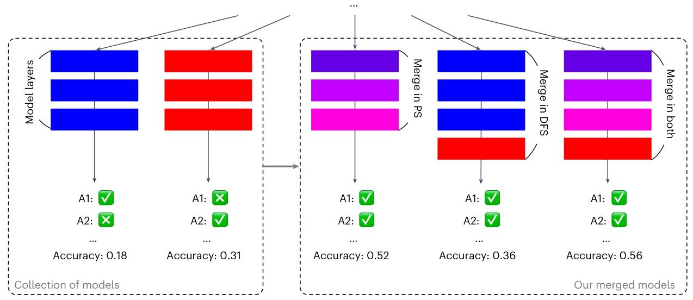

# Evolutionary optimization of model merging recipes

https://github.com/SakanaAI/evolutionary-model-merge

文章提出的方法是一种基于进化算法的模型合并方法，旨在自动发现不同开源模型的有效组合，从而创建具有特定能力的新基础模型。该方法主要在参数空间（PS）和数据流空间（DFS）进行操作： 

1. **参数空间（PS）合并**：将多个基础模型的权重整合为一个统一的实体，以提升性能。具体做法是基于任务向量分析，增强TIES-Merging和DARE方法，在每一层（包括输入/输出嵌入层或Transformer块）设置稀疏化和权重混合的合并配置参数，并使用进化算法（如CMA-ES）针对选定任务，以关键的任务特定指标（如MGSM任务的准确率、VQA任务的ROUGE分数）为导向进行优化。 
2. **数据流空间（DFS）合并**：保留每个模型各层的原始权重，通过优化令牌在神经网络中经过的推理路径来实现模型合并。在初步研究中，将范围限定在串行连接和非自适应配置。对于N个模型和预算T，该方法会搜索层索引序列$L_{ij}^{(t)}$来确定令牌的推理路径。由于搜索空间过大，通过引入大小为$T = M×r$的指示数组来管理层的包含或排除，从而减小搜索空间。此外，为解决层输入分布差异的问题，还会优化一个缩放矩阵$W$ ，也可通过神经网络参数化$W$来控制搜索空间大小。 
3. **双空间合并**：PS和DFS的合并方法是正交的，可以将二者结合，先在PS中对模型集合进行合并，再将合并后的模型放回集合，在DFS中进行合并，以进一步提升合并模型的性能。在多目标模型合并场景中，PS合并可先产生针对不同目标的合并模型，再用多目标遗传算法（如NSGA-II）进行DFS合并，拓展最终模型在相关指标上的性能。 

图 1 展示了进化模型合并的整体情况。我们的方法包含以下三个方面：

1. **在参数空间（PS）中优化混合参数的权重**：在 PS 中，对模型各层混合参数的权重进行优化。这意味着不是简单地复制和拼接各层参数，而是像调色一样对权重进行混合（例如，将红色和蓝色混合成紫色）。通过这种方式，综合多个基础模型的优势，使合并后的模型在性能上超越单个模型。
2. **在数据流空间（DFS）中优化层排列**：在 DFS 中，主要优化的是层的排列顺序。这一过程通过调整数据在不同模型层之间的流动路径，让模型能更有效地处理信息，从而提升性能。
3. **结合 PS 和 DFS 的综合策略**：将 PS 和 DFS 两种方法结合起来，形成一种综合的合并策略。先在 PS 中进行模型合并，调整模型的权重；再将合并后的模型放入集合，在 DFS 中进一步优化数据流动路径。这种综合策略能进一步提升合并模型的性能。

图中的 Q1 和 Q2 代表两道数学问题（原本是日语表述），A1 和 A2 是各个模型分别生成的答案。由于模型是基于日语文本进行运算的，为方便读者理解，这里将问题翻译成了英文。

### 参数空间中的合并（Merging in the PS）

在参数空间（PS）中的模型合并，目标是将多个基础模型的权重整合到一个具有相同神经网络架构的统一实体中，并且使其性能优于单个模型。尽管存在多种组合模型参数的策略 ，但我们的方法借助任务向量分析，依据模型针对特定任务的优化方向或擅长领域，来了解每个模型的优势。

具体而言，我们通过结合 DARE（一种相关技术）对 TIES-Merging（一种模型合并方法）进行改进，从而实现更精细的逐层合并（在本研究中，“层” 指的是输入 / 输出嵌入层或变压器模块）。我们在包括输入和输出嵌入层在内的每一层，设置用于稀疏化和权重混合的合并配置参数。

随后，利用进化算法（如协方差矩阵自适应进化策略，CMA-ES ），以关键的任务特定指标（例如，MGSM 任务中的准确率，或视觉问答任务（VQA）中的 ROUGE 分数）为导向，针对选定的任务对这些配置进行优化。

### 在数据流空间（DFS）中进行模型合并

“Merging in the DFS” 主要阐述了在数据流空间（DFS）中进行模型合并的方法、面临的问题及解决方案，具体内容如下：

1. **模型合并的基本概念与限制**：与参数空间合并不同，DFS 模型合并保持各层原始权重不变，通过优化令牌在神经网络中的推理路径来实现模型合并。在初步探索阶段，研究主要集中于串行连接和非自适应配置，更灵活的模型合并方式留待未来研究。

1. **搜索推理路径及搜索空间问题**：在 DFS 合并中，对于 N 个模型和预算 T，需要寻找层索引序列$L_{ij}^{(t)}$ ，来确定令牌在特定任务中的推理路径，其中$L_{ij}$表示第 i 个模型的第 j 层，$t ∈ [1, T ]$表示推理路径中的步骤。然而，搜索空间非常大。假设所有模型的总层数为 M ，搜索空间大小为$(M + 1)^T$ ，额外的 “1” 代表包含一个直通层。即便设置较为保守（如 M = 64 ，T = 60 ），搜索空间依然巨大，对进化搜索算法构成挑战。

1. **缩小搜索空间的策略**：初步研究发现，特定的层排列（如重复或置换序列）会对模型性能产生负面影响。基于此，研究引入了大小为$T = M × r$的指示数组ℐ（r 为重复次数）。将所有层按顺序排列（第 i 个模型的所有层后接第 i + 1 个模型的所有层）并重复 r 次，指示数组ℐ负责管理层的包含或排除。当$ℐ_i > 0$时，将索引 i 对应的层纳入合并模型，否则排除。这一策略将搜索空间缩小至$2^T$ ，使进化搜索更可行。

1. **解决输入分布差异的方法**：在优化推理路径时，由于各层输入分布可能与原始模型不同，可能导致意外输出。例如，初步研究表明交换语言模型中相邻两层会使性能下降。虽然需要更多理论研究来模拟这种分布变化，但经验表明，通过矩阵$W ∈ ℝ^{M×M}$对从第 i 层到第 j 层的输入进行适当缩放，有助于缓解该问题。$W$矩阵与指示数组ℐ一起通过进化搜索进行优化。考虑到$W$的大小会随 M 的增加而二次增长，对于包含大量层的场景，研究提出使用神经网络对$W$进行参数化，即通过进化前馈网络，根据层索引和步骤索引输出缩放权重$W_{ij} = \pi_{\theta}(i, j, t)$ ，其中$\theta$为待进化参数，其大小不随 M 的增长而改变。

在参数空间（PS）和数据流空间（DFS）进行模型合并时的优化方法和具体设置。

1. **参数空间（PS）优化**

- - **优化算法及参数设置**：使用在 Optuna 库中实现的协方差矩阵自适应进化策略（CMA - ES）算法进行 PS 优化，采用默认超参数。将所有初始参数值设为 0.5，sigma 设为 1/6 ，种群大小设为$4+\lfloor3\ln(n_{params})\rfloor$，其中$n_{params}$是要优化的参数数量。

- - **适应度值定义与数据集划分**：适应度值定义为 1069 个训练样本的准确率，该训练集与 MGSM 测试集不相交。这样划分数据集是为了避免模型在测试集上出现过拟合，保证模型的泛化能力。

- - **优化过程与模型选择**：进行 1000 次试验，选择训练准确率最高的试验对应的模型作为最终模型。通过初步实验决定使用 TIES - Merging 结合 DARE 方法，并对其参数进行优化，以实现更优的模型合并效果。

1. **数据流空间（DFS）优化**

- - **关键参数设置**：设置$M = 64$（假设所有模型的总层数），$r = 3$ ，所以$T = M×r = 192$ 。这些参数决定了搜索空间的大小和结构，影响模型合并过程中推理路径的搜索范围。

- - **数据集划分与性能评估**：从训练数据中保留最后 200 个样本作为验证集，其余数据用于优化，批量大小为 200。报告在验证集中准确率最高的模型快照的性能，且测试集与优化过程严格隔离，确保测试结果的可靠性，避免测试集信息泄露影响模型性能评估。

- - **优化算法与参数**：在 EvoJAX 中采用 CMA - ES 算法，对指示数组$ℐ$和缩放矩阵$W$进行共 100 代的优化，种群大小为 128，使用默认超参数。这种设置平衡了搜索效率和优化效果，有助于找到更优的模型合并配置。

- - **模型合并限制与兼容性处理**：将 DFS 合并限制在两个模型 A 和 B，以保证最终模型规模适中，可在单个 GPU 上运行。合并过程中使用模型 A 的分词器和输入 / 输出嵌入，并规定模型 A 的初始和最终 Transformer 层定义推理路径的起点和终点。初始化指示数组$ℐ$ ，使模型 A 的所有层更有可能作为推理路径的初始步骤被包含，从而缩短搜索时间，提高优化效率。

###  双空间合并

在参数空间（PS）和数据流空间（DFS）进行的模型合并是两种相互独立的方法；然而，将这两种解耦的方法结合起来，进一步提升合并模型的性能是可行的。正如我们在图 1 最右侧的示意图以及结果部分 “进化日语数学大语言模型” 一节中所示，可以先对一组模型进行 PS 合并，然后将合并后的模型放回模型集合中，再从这个扩大后的集合进行 DFS 合并。

当考虑多目标模型合并时，这种双空间合并的方式非常有用。在多目标模型合并场景下，可以先运用 PS 合并产生多个合并模型，每个模型针对一个感兴趣的目标。然后，使用多目标遗传算法（如 NSGA-II）进行 DFS 合并，进一步提升最终模型在相关指标上的性能。

例如，在构建一个既擅长数学推理又能处理特定文化内容的模型时，先通过 PS 合并，根据不同目标调整模型权重，产生分别侧重数学推理和文化内容处理的中间模型。接着，利用 DFS 合并结合多目标遗传算法，从整体上优化推理路径，综合提升模型在数学推理准确性、文化内容理解与生成质量等多个指标上的表现，使最终模型在多个任务上都能达到更好的性能。