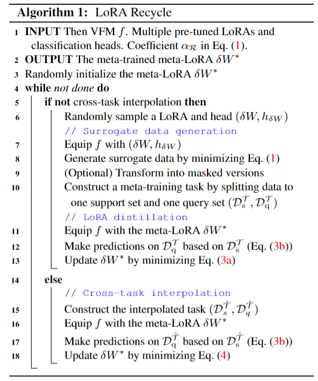

# Unlocking Tuning-Free Few-Shot Adaptabilityin Visual Foundation Models by Recycling Pre-Tuned LoRAs

 以ChatGPT为代表的大型语言模型（LLM）无需微调即可展现出强大的少样本适应能力，使其成为数据有限和实时应用的理想选择。然而，当前视觉基础模型（VFM）尚未实现这种适应性——它们仍需依赖充足的调优数据进行显式微调。此外，预训练-微调范式催生了大量任务专用的模块化组件，例如低秩适应（LoRA）。**本文首次探索了在不访问原始训练数据的前提下，重用多样化预调LoRA以实现视觉基础模型免调优少样本适应的潜力。我们提出的LoRA Recycle框架通过元学习目标，从多样化预调LoRA中蒸馏出一个元LoRA，该过程利用了通过对预调LoRA本身进行反向生成的替代数据。**一旦视觉基础模型配备了这种元LoRA，即可像大型语言模型的上下文学习那样，通过单次前向传播解决新的少样本任务。此外，我们为框架设计了双高效机制，在显著加速元训练过程的同时保持甚至提升性能。跨域与域内场景下的多组少样本分类基准实验，充分验证了该框架的优越性。

### 通过低秩自适应（LoRA）反演生成替代数据

**通过 LoRA 反演生成代理数据**

- **目标标签处理**：将输入的目标标签 `targets` 转换为 `torch.LongTensor` 并移动到指定设备上。
- **数据初始化**：使用 `torch.randn` 随机初始化一批图像数据 `inputs`，其形状为 `[len(targets), *self.img_size]`，并设置为需要计算梯度，这是生成数据的起点，类似于 LoRA 反演中从随机状态开始调整数据以匹配模型的特征。
- **优化器设置**：使用 Adam 优化器来更新 `inputs`，通过不断调整输入数据，使其逐渐接近期望的特征分布。

代码核心围绕深度反演，通过优化随机初始化的图像，使图像经过教师模型后的特征统计信息和输出类别分布与目标匹配，主要涉及的操作有：

1. **图像初始化与优化**：随机初始化图像，使用 Adam 优化器迭代更新图像，以最小化不同损失项的加权和。
2. **损失计算**：包括交叉熵损失、批量归一化损失、总变差损失和 L2 损失。
3. **后处理与保存**：选择最优图像，根据注意力分数进行掩码处理，并保存到数据池中。

**元学习与无数据元学习**：元学习旨在学习任务分布上的先验知识，实现对未见少样本任务的高效适应；无数据元学习则直接从现成的预训练模型中进行元学习，但现有方法难以扩展到大型视觉 Transformer。

LoRA Inversion是一种从预调优的LoRA生成原始训练数据的方法，通过迭代优化初始化为高斯噪声的数据，并最小化特定损失函数来实现。

1. **整体概念**：LoRA Inversion的目的是在仅拥有预调优的LoRA（$\delta W$）及其分类头（$h$），但没有原始训练数据的情况下，生成与原始训练数据相似的数据。它通过对一批初始化为高斯噪声的数据$x$进行迭代优化来实现这一目标。 
2.  **损失函数**：优化过程通过最小化损失函数$\mathcal{L}_{data }$来完成，公式为$\min _{X} \mathcal{L}_{data }=CE\left(h \circ f_{\delta W}(X), Y\right)+\alpha_{\mathcal{R}} \mathcal{R}_{BN}(X)$。这个损失函数由两部分组成：    
3. **交叉熵分类损失（$CE\left(h \circ f_{\delta W}(X), Y\right)$）**：$CE()$是交叉熵分类损失，$Y$是目标标签（例如，[1, 0, 0]表示某个特定类别）。$h \circ f_{\delta W}(X)$表示将数据$X$输入到配备了LoRA（$\delta W$）的模型$f$中，然后再经过分类头$h$处理后的输出。最小化这部分损失的目的是实现标签条件生成，即确保经过模型处理后的$X$能被预测为目标标签$Y$。这使得生成的数据在分类任务上具有与目标标签一致的特性。    
4. **图像正则化项（$\alpha_{\mathcal{R}} \mathcal{R}_{BN}(X)$）**：$\mathcal{R}_{BN}$是图像正则化项，$\alpha_{R}$是其系数。为了进一步提高生成数据的真实性，引入了自然性先验$\mathcal{R}_{BN}$。其计算公式为$\mathcal{R}_{BN}(X)=\sum_{l}\left\| \mu^{(l)}(X)-\mu_{BN}^{(l)}\right\| _{2}+\left\| \sigma^{(l)}(X)-\sigma_{BN}^{(l)}\right\| _{2}$ ，其中$\mu^{(l)}(X)$和$\sigma^{(l)}(X)$分别是在预训练模型第$l$层计算得到的输入特征图的均值和方差 ，$\mu_{BN}^{(l)}$和$\sigma_{BN}^{(l)}$是预训练模型第$l$层批量归一化（BN）层中存储的统计量（由原始训练数据计算得出）。由于视觉Transformer通常没有BN层，论文中提到可借用开源预训练ResNet50中存储的BN统计量。最小化$\mathcal{R}_{BN}(X)$可以缩小生成数据与真实数据在这些统计量上的差距，从而使生成数据的分布更接近真实数据，提高生成数据的真实性。  
5. **迭代优化过程**：以高斯噪声初始化数据$X$后，通过不断调整$X$的值，使得损失函数$\mathcal{L}_{data }$逐渐减小。在每次迭代中，计算损失函数对$X$的梯度，并根据梯度更新$X$的值。这个过程会持续进行，直到损失函数收敛到一个较小的值，或者达到预设的迭代次数。通过这种方式，逐渐生成与原始训练数据在标签预测和特征分布上都相似的数据。 

**元训练任务构建**是元学习过程中的关键环节，它基于生成的特定任务数据构建用于元训练的任务。在通过LoRA反演等方法生成任务T的特定数据后，将这些数据进行划分，构建出支持集$D_{c}^{T}$和查询集$D_{q}^{T}$ ，以此形成元训练任务，具体过程和要点如下： 

1. **构建流程**：在生成任务T的特定数据后，要将这些数据进行拆分。把它们分成两个部分，一个是支持集$D_{c}^{T}$，另一个是查询集$D_{q}^{T}$ 。这样构建出来的任务就成为了后续元训练过程的元训练任务。
2. **N - way K - shot设置下的数据集构成**    - **支持集**：在N - way K - shot的设定中，支持集包含N个不同的类，并且每个类有K个示例。“N - way”表示任务涉及N个不同的类别，“K - shot”表示每个类别只有K个样本用于训练。**支持集的作用是为模型在元训练过程中提供少量的样本数据，让模型学习不同类别的特征表示。**在一个5 - way 1 - shot的图像分类元训练任务中，支持集就会有5个不同类别的图像，每个类别仅有1张图像。    - **查询集**：查询集同样包含N个类，但每个类别的示例数量比支持集多，通常设置为15个。查询集用于在元训练过程中评估模型对新样本的分类能力。**模型在学习了支持集的特征后，需要对查询集中的样本进行预测，通过比较预测结果和真实标签，可以计算损失并进行模型参数的更新，提升模型在少样本情况下的泛化能力。** 

**元学习目标公式实际为**： 

$\min_{\delta W^{*}}\mathcal{L}_{meta}=\mathbb{E}_{p_{\mathcal{T}}}\sum_{(X_{q},Y_{q})\in\mathcal{D}_{q}^{\mathcal{T}}}KL\left(P\left(Y_{pred}|X_{q},\mathcal{D}_{s}^{\mathcal{T}}\right),h_{\mathcal{T}}\circ f_{\delta W_{\mathcal{T}}}(X_{q})\right)$  公式3（a）

其中， $P\left(Y_{pred}=i|X_{q},\mathcal{D}_{s}^{\mathcal{T}}\right)=\frac{\exp\left(-\left\|f_{\delta W^{*}}(X_{q})-c_{i}\right\|_{2}\right)}{\sum_{i'}\exp\left(-\left\|f_{\delta W^{*}}(X_{q})-c_{i'}\right\|_{2}\right)}$ 

公式中，$\min_{\delta W^{*}}\mathcal{L}_{meta}$ 表示要对元LoRA的参数$\delta W^{*}$进行优化，使得元学习损失$\mathcal{L}_{meta}$最小化。$\mathbb{E}_{p_{\mathcal{T}}}$ 是基于任务分布$p_{\mathcal{T}}$求期望，意味着考虑所有从任务分布中采样得到的任务。$(X_{q}, Y_{q})$ 是查询集$\mathcal{D}_{q}^{\mathcal{T}}$里的样本及其标签。

$P\left(Y_{pred}|X_{q},\mathcal{D}_{s}^{\mathcal{T}}\right)$ 是在已知支持集$\mathcal{D}_{s}^{\mathcal{T}}$的情况下，使用元LoRA$\delta W^{*}$对查询样本$X_{q}$预测的类别概率分布 。它通过计算$f_{\delta W^{*}}(X_{q})$（元LoRA作用于$X_{q}$得到的特征表示）与各类别中心$c_{i}$的距离，并利用Softmax函数转化为概率。

$h_{\mathcal{T}}\circ f_{\delta W_{\mathcal{T}}}(X_{q})$ 则是使用预调优的LoRA$\delta W_{\mathcal{T}}$和分类头$h_{\mathcal{T}}$对$X_{q}$进行预测的结果。$KL$散度用于衡量这两个概率分布之间的差异，通过最小化该差异，促使元LoRA学习如何在不同任务上做出与预调优LoRA相近的准确预测，进而具备适应多种任务的能力。 

元学习目标优化过程中内循环的操作和特点，具体解释如下： 

1. **内循环作为无调优适应的转变**：将内循环（公式(3b)，在原文元学习目标公式中虽未明确标记为(3b)，但此处按论文阐述逻辑指代相关部分 ）重新定义为一种无调优适应过程。在传统的模型训练中，遇到新任务时通常需要对模型进行微调，即更新模型参数以适应新任务。但在内循环中，采用了一种不同的策略，避免了参数更新，实现无调优适应。 
2. **计算类中心**：利用支持集来计算每个类别的中心$c_{i}$。对于每个类别$\bar{z}$，其类中心$c_{i}$是通过对支持集中属于该类别的所有样本的特征嵌入求平均得到的 ，公式为$c_{i}=\frac{1}{|D_{s, i}^{T}|} \sum_{X \in D_{s, i}^{T}} f_{\delta W^{*}}(X)$ 。其中，$|D_{s, i}^{T}|$表示支持集中类别$i$的样本数量，$X$是支持集中的样本，$f_{\delta W^{*}}(X)$是样本$X$经过带有元LoRA（$\delta W^{*}$）的模型处理后的特征嵌入表示。通过这种方式，得到每个类别的一个代表性特征向量，即类中心。
3. **基于距离建模查询样本的类别概率**：在得到类中心后，对于查询集中的样本$X_{q} \in D_{q}^{T}$，根据它到各个类中心的欧氏距离来建模其属于某个类别的概率。直观地说，如果一个查询样本到某个类中心的欧氏距离较小，那么它属于这个类别的概率就较高；反之则概率较低。这种基于距离的概率建模方式，为判断查询样本的类别提供了一种度量方法。 
4. **避免参数更新和二阶导数计算**：整个过程的重要特点是不涉及任何参数更新。在传统的基于梯度的优化方法中，更新模型参数需要计算梯度，而计算二阶导数在一些复杂模型和优化算法中是必要的，但计算二阶导数通常计算量较大。内循环的这种无调优适应策略避免了参数更新，也就无需计算二阶导数，从而降低了计算复杂度，提高了计算效率，同时也避免了因参数更新可能导致的过拟合等问题，使得模型在少样本情况下能更稳定地学习和适应新任务。 

元学习中优化元LoRA的外循环过程，其核心目的是提升元LoRA在不同任务中的预测准确性，具体解释如下： 

1. **外循环的优化目标**：在外循环（公式(3a) ）中，主要对元LoRA的参数$\delta W^{*}$进行优化，目的是让其在处理不同任务时，能在内循环中做出更精确的预测。通过不断调整$\delta W^{*}$ ，使配备元LoRA的模型在面对各种少样本任务时，性能得到提升。 
1. **优化方式——最小化KL散度**：具体的优化手段是最小化**查询集$D_{q}^{T}$**上预调优LoRA（$\delta W_{T}$ ，作为教师模型）和元LoRA（$\delta W^{*}$ ，作为学生模型）之间的预测差异。这里使用Kullback-Leibler（KL）散度来衡量这种差异。KL散度是一种衡量两个概率分布之间差异的指标，在该场景下，它衡量了预调优LoRA对查询集样本的预测结果与元LoRA预测结果的差异程度。通过最小化KL散度，元LoRA能够学习到预调优LoRA在处理不同任务时的预测模式和知识。例如，假设在一个图像分类任务中，预调优LoRA对某类图像有较高的预测准确率，元LoRA通过最小化与预调优LoRA在查询集上的KL散度，学习到如何更准确地对这类图像进行分类。 
1. **元训练过程**：元LoRA$\delta W^{*}$是在从任务分布$p_{T}$中采样得到的大量预调优LoRAs上进行元训练的。这意味着元LoRA会接触到多种不同任务的预调优LoRA，通过与这些不同任务的预调优LoRA进行比较和学习（即最小化KL散度），元LoRA能够明确地学习到如何在不进行微调的情况下解决各种不同的任务。在元训练过程中，元LoRA不断调整自身参数，逐渐适应不同任务的需求，积累通用的任务解决能力，从而具备在新的少样本任务上无需微调就能做出较好预测的能力。 

在元学习框架中，元LoRA的参数更新和初始化是提升模型跨任务适应能力的关键环节。它借助预调优LoRA的知识，通过特定的损失计算和优化算法更新参数，同时以随机初始化作为起点开启学习过程。

1. **元LoRA的参数更新**    
   - **基于损失计算的更新机制**：元LoRA利用预调优LoRA已经学习到的知识和特征表示，通过比较不同预调优LoRA在查询集上的预测结果来优化自身参数。具体来说，会计算预调优LoRA（作为教师模型）和元LoRA（作为学生模型）在查询集上预测的差异，常用的度量方式是Kullback-Leibler（KL）散度或交叉熵（CE）损失 。在一个图像分类的元学习任务中，假设有多个预调优LoRA分别在不同的图像分类任务（如动物分类、植物分类等）上进行了训练。将这些预调优LoRA和元LoRA应用到查询集的图像上，计算元LoRA的预测结果与预调优LoRA预测结果之间的KL散度或CE损失。这个损失值反映了元LoRA与预调优LoRA在预测上的差异程度。    
   - **优化算法的应用**：得到损失值后，使用优化算法（如随机梯度下降及其变种，常见的有Adam等）来更新元LoRA的参数。以Adam算法为例，它会根据损失函数关于元LoRA参数的梯度，结合之前计算的一阶矩估计（动量）和二阶矩估计（自适应学习率），逐步调整元LoRA的参数，使得损失值逐渐减小。在每次迭代中，优化算法会根据当前的梯度和之前的动量、自适应学习率信息，计算出参数的更新量，然后将这个更新量应用到元LoRA的参数上，从而使元LoRA在后续的预测中能够更接近预调优LoRA的预测结果，提升在不同任务上的预测能力。 
2. **元LoRA的初始化**：论文中提到元LoRA（$\delta W^{*}$）通常采用随机初始化的方式。在基于Transformer架构的视觉基础模型中，元LoRA的参数矩阵（如低秩矩阵$\delta W_{A}$和$\delta W_{B}$ ）会按照一定的随机分布（如高斯分布或均匀分布）生成初始值。随机初始化使得元LoRA在训练开始时处于一种“无偏见”的状态，然后通过后续的元训练过程，逐步学习到不同任务的特征和模式。这种初始化方式为元LoRA提供了一个统一的起点，避免了初始值对某些任务的偏好，让元LoRA能够在训练过程中公平地学习不同任务的信息，从而更好地适应各种不同的任务。 

### Cross-task interpolation

跨任务插值（Cross-task interpolation）是论文中为解决元学习中任务分布多样性问题而提出的一种方法，用于增强元学习的泛化能力，具体如下： 

1. **提出背景**：元学习目标公式（Eq. (3) ）的实现依赖于从潜在任务分布$p_{T}$中采样得到广泛多样的预调优LoRAs，这对提升元学习的泛化能力至关重要。因为多样的预调优LoRAs能让模型接触到不同任务的特征和模式，从而学习到更通用的知识。然而，在实际应用中，受限于LoRA的数量（即有限的LoRA预算），固定数量的预调优LoRAs可能无法充分捕捉任务分布$p_{T}$的多样性。比如，在少样本学习场景下，可用的预调优LoRAs数量有限，这些LoRAs所涵盖的任务类型和特征范围也相应受限，难以全面代表所有可能的任务，这就可能导致元学习模型的泛化能力不足。 
2. **具体做法**：为解决上述问题，论文提出跨任务插值方法。该方法通过组合不同预调优LoRAs中的类别来生成新任务。例如，有两个预调优LoRAs，$\delta W_{i}$对应的任务类别是（哈士奇，麻雀），$\delta W_{j}$对应的任务类别是（金毛寻回犬，野马） ，通过跨任务插值，可能生成新的任务类别（哈士奇，金毛寻回犬）。这种方式将不同任务的类别进行组合，创造出了新的任务场景，使得任务分布更加密集和多样化。 
3. **作用和意义**：跨任务插值扩展了元训练的任务范围。通过生成这些新任务，模型在元训练过程中可以接触到更多不同类型的任务，学习到更丰富的任务特征和模式，从而增强了模型对未见任务的泛化能力。由于新生成的插值任务的标签空间与任何预调优LoRA都不匹配，在计算元学习目标时，需要对公式（Eq. (3a) ）进行修改，将KL散度损失替换为交叉熵（CE）损失，以适应新的任务情况并有效进行模型训练。 

3. **修改后的元学习目标公式**：修改后的公式为$\min _{\delta W^{*}} \mathbb{E}_{p_{\tilde{\tau}}} \sum_{\left(X_{q}, Y_{q}\right) \sim \mathcal{D}_{q}^{\tilde{\tau}}} CE\left(P\left(Y_{pred } | X_{q}, \mathcal{D}_{s}^{\hat{\mathcal{T}}} ; \delta W^{*}\right), Y_{q}\right)$ 。其中，$p_{\hat{\tau}}$代表插值任务的分布，反映了新生成任务在所有可能任务中的分布情况；$(D_{s}^{\hat{\mathcal{T}}}, D_{q}^{\hat{\mathcal{T}}})$分别是插值任务$\hat{\tau}$的支持集和查询集，用于模型训练和评估；$CE$表示交叉熵损失函数，用于计算模型预测结果$P\left(Y_{pred } | X_{q}, \mathcal{D}_{s}^{\hat{\mathcal{T}}} ; \delta W^{*}\right)$与真实标签$Y_{q}$之间的差异。通过最小化这个损失，模型可以在新的插值任务上进行有效的学习和优化，进一步提升泛化能力。 

### LoRA Distillation via Meta-Learning

Efficient inversion with token pruning（通过标记修剪实现高效反演）”这部分内容的解释： 

1. **提出背景**： 根据公式(1)（也就是之前提到的通过LoRA反演来优化数据$X$的损失函数公式），通过LoRA反演来优化数据$X$需要进行迭代的前向和后向计算。在每次迭代中，都要将数据$X$输入模型进行前向传播得到预测结果以计算损失，然后再进行反向传播计算梯度来更新$X$。这种迭代的前向和后向计算过程会带来较高的计算量和计算时间成本，为了提高计算效率，所以提出了标记修剪的方法。 
2. **方法原理**： 
   1. 其核心思想是基于自注意力机制的特性。自注意力机制本质上会根据标记（token）的重要性和相关性对它们进行加权。也就是说，在处理数据时，不同的标记对最终结果的贡献程度是不同的，有些标记相对重要，有些则相对不重要。    
   2. 基于此，在反演过程中，我们可以对不重要的标记进行修剪。具体操作如在图3的左面板所示，在模型的第$i$层，我们直接丢弃那些被判定为不重要的标记。一旦这些标记被丢弃，就不再对它们进行前向处理（即不再将它们输入到后续的层中进行计算），也不需要为它们计算反向梯度（因为它们不再参与后续的计算和参数更新）。 
3. **方法效果**： 通过这种标记修剪的方式，显著地减少了计算复杂度。因为不再处理那些不重要的标记，前向计算时的数据量减少，计算量也相应降低；同时，反向计算时不需要为这些标记计算梯度，进一步减少了计算量。这样就提高了通过LoRA反演生成数据的效率，使得在更短的时间内或者使用更少的计算资源的情况下，能够完成数据的生成过程。   

1. **重要标记的定义**： 最重要的标记是在$x_{[CLS]}$（分类标记）中具有最高注意力权重的那些标记。假设在第$i$层有$n + 1$个标记$[x_{[CLS]}, x_1, \ldots, x_n]$，其中$x_{[CLS]}$是在所有图像标记之前插入的分类标记，用于抓取全局信息。 
2. **注意力权重计算**：    
   - 为了衡量每个标记的重要性，我们使用分类标记$x_{[CLS]}$相对于所有其他标记的注意力权重作为指标。具体计算公式为： $a_{[CLS]} = \text{Softmax}\left(\frac{q_{[CLS]} \cdot K^{\top}}{\sqrt{d}}\right)$  （公式5） 其中，$a_{[CLS]}$是一个$(n + 1)$维向量，表示从标记$x_{[CLS]}$到所有标记$[x_{[CLS]}, x_1, \ldots, x_n]$的注意力权重。$q_{[CLS]}$是标记$x_{[CLS]}$的查询向量。$K = [k_{[CLS]}, k_1, \ldots, k_n]^{\top}$是所有标记的键向量。$d$是查询向量的维度。通过这个公式，我们可以得到每个标记与$x_{[CLS]}$之间的注意力权重，权重越高表示该标记与$x_{[CLS]}$的相关性越强，对全局信息的贡献可能越大。 
3. **基于注意力权重的输出计算**： 然后，$a_{[CLS]}$用于通过自注意力机制计算标记$x_{[CLS]}$的输出，公式为： $x_{[CLS]} = a_{[CLS]} \cdot V$  （公式6） 其中，$V = [v_{[CLS]}, v_1, \ldots, v_n]^{\top}$是所有标记的值向量。这意味着$x_{[CLS]}$的输出可以看作是所有标记的值向量的线性组合，组合的权重就是$a_{[CLS]}$。 
4. **将注意力权重作为重要性指标的合理性**： 由于$x_{[CLS]}$的输出在最后一层用于分类，所以将$a_{[CLS]}$视为衡量每个标记对最终预测贡献程度（即每个标记的重要性）的指标是合理的。也就是说，那些在$a_{[CLS]}$中具有较高注意力权重的标记对最终的分类结果影响更大，因此可以将这些标记确定为最重要的标记。 
5.  **多头自注意力情况**： 对于多头自注意力机制，我们计算所有头的平均注意力权重$a_{[CLS]}$。这样做是为了综合考虑多个头中每个标记的重要性，避免单个头的偏差影响对标记重要性的判断。 
6. **计算成本**： 值得注意的是，这个过程不需要额外的计算需求，因为它是前向传播过程的一个固有部分。在模型的正常前向计算中，就会涉及到计算注意力权重和基于这些权重的输出计算，所以利用这些已有的计算结果来确定标记的重要性，不会增加额外的计算负担。（更多预备知识可参考附录B）   

掩码构建。为了突出生成图像中最具信息的区域，我们构建一个掩码矩阵，如图 3 右侧面板所示。掩码矩阵的构建方式是在保留的标记位置处设为1，其他位置设为0。

有选择地使用未掩码的标记进行元训练。我们将掩码与生成的图像相乘，以创建一个带掩码的图像，在生成的图像中保留最具信息的标记（例如前景）。在对元低秩自适应模块进行元训练时，我们只对未掩码的标记进行前向传播。这种对稀疏标记的有选择使用显著加快了元训练过程，同时通过减少生成数据中的噪声来维持甚至提高性能（分析见附录 A 中的表 6）。

