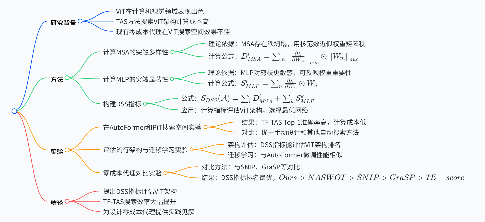

# Training-free Transformer Architecture Search

1. **一段话总结**：本文提出无训练的 Transformer 架构搜索（TF-TAS）方案，旨在解决当前 Transformer 架构搜索（TAS）方法耗时久的问题。通过研究多头自注意力（MSA）和多层感知器（MLP）特性，提出 DSS 指标，从突触多样性和突触显著性两个理论角度评估 ViT 架构。实验表明，TF-TAS 在不同 ViT 搜索空间中性能出色，搜索效率从约 24 GPU 天提升到小于 0.5 GPU 天，且 DSS 指标优于现有零成本代理方法。

1. **思维导图**

1. **详细总结**

- - **研究背景**：视觉 Transformer（ViT）在计算机视觉任务中取得显著成功，Transformer 架构搜索（TAS）旨在自动搜索更好的 ViT 架构，但现有 TAS 方法计算成本高，如基于单次训练的方法训练超网需超 24 GPU 天 。同时，用于卷积神经网络（CNN）的零成本代理因 ViT 与 CNN 结构差异，难以直接应用于 ViT 搜索空间。

- - **方法**

- - - **MSA 的突触多样性**：MSA 存在秩坍塌问题，影响 ViT 性能。利用 MSA 权重矩阵的核范数近似其秩来衡量突触多样性，公式为$D_{MSA}^{l}=\sum_{m}\left\| \frac{\partial \mathcal{L}}{\partial W_{m}}\right\| _{n u c} \odot\left\| W_{m}\right\| _{n u c}$，实验验证其与 ViT 网络分类准确率正相关，肯德尔系数达 0.65。

- - - **MLP 的突触显著性**：通过剪枝敏感性实验发现 MLP 对剪枝更敏感，受权重冗余影响小，适合用突触显著性评估。计算 MLP 突触显著性公式为$S_{MLP}^{l}=\sum_{n} \frac{\partial \mathcal{L}}{\partial W_{n}} \odot W_{n}$ 。

- - - **DSS 指标与 TF-TAS**：结合 MSA 的突触多样性和 MLP 的突触显著性构建 DSS 指标，公式为$S_{DSS}(\mathcal{A})=\sum_{l} D_{MSA}^{l}+\sum_{k} S_{MLP}^{k}$。TF-TAS 通过计算 DSS 指标评估 ViT 架构，从搜索空间随机采样 8000 个子网，选择指标值最高的网络重训练得到最终结果。

- - **实验**

- - - **搜索空间实验**：在 AutoFormer 和 PiT 搜索空间进行实验，TF-TAS 搜索的最优 ViT 架构在 ImageNet 上 Top-1 准确率高，如在 AutoFormer 搜索空间，TF-TAS-Ti、TF-TAS-S 和 TF-TAS-B 分别达到 75.3% 等 ，且计算成本仅 0.5 GPU 天，远低于其他方法的 24 GPU 天。

- - - **评估流行架构与迁移学习**：对其他流行 ViT 架构评估，DSS 指标能评估架构排名。迁移学习实验中，TF-TAS-S 在 CIFAR-10 和 CIFAR-100 上微调性能与 AutoFormer 搜索的网络相似。

- - - **零成本代理对比**：与 SNIP、GraSP、NASWOT 和 TE-score 等零成本代理对比，DSS 指标排名最优，肯德尔系数$Ours > NASWOT > SNIP > GraSP > TE-score$，且对不同随机种子不变。

- - **结论**：提出 DSS 指标评估 ViT 架构，TF-TAS 搜索效率显著提升，为设计零成本代理提供实践见解，如评估 ViT 架构应考虑 MSA 和 MLP，初始化 ViT 网络的梯度矩阵含评估信息等。

1. **关键问题**

- - **问题 1**：为什么现有零成本代理不适用于 ViT 搜索空间？

- - - **答案**：CNN 主要由卷积层构成，而 ViT 的基本模块 MSA 和 MLP 主要由线性层组成，结构差异大。现有零成本代理是针对 CNN 搜索空间设计，直接应用于 ViT 搜索空间会因网络结构差异导致效果不佳，无法保证性能评估的准确性和通用性。

- - **问题 2**：DSS 指标中突触多样性和突触显著性分别是如何计算的，有什么理论依据？

- - - **答案**：突触多样性利用 MSA 权重矩阵的核范数近似其秩来计算，公式为$D_{MSA}^{l}=\sum_{m}\left\| \frac{\partial \mathcal{L}}{\partial W_{m}}\right\| _{n u c} \odot\left\| W_{m}\right\| _{n u c}$。理论依据是 MSA 存在秩坍塌，影响 ViT 性能，而矩阵的秩包含特征多样性信息，在一定条件下核范数可近似秩。突触显著性通过$S_{MLP}^{l}=\sum_{n} \frac{\partial \mathcal{L}}{\partial W_{n}} \odot W_{n}$计算，理论依据是 MLP 对剪枝更敏感，受权重冗余影响小，能更好反映权重重要性，适用于评估 ViT 中的 MLP 模块。

- - **问题 3**：TF-TAS 在不同搜索空间的实验结果有何差异，说明了什么？

- - - **答案**：在 AutoFormer 搜索空间，TF-TAS 搜索的最优 ViT 架构 Top-1 准确率较高，如 TF-TAS-Ti 可达 75.3% ；在 PiT 搜索空间，TF-TAS 也能获得可比甚至更好的 Top-1 分类准确率，但整体结果低于 AutoFormer 搜索空间。这说明搜索空间是 TAS 的重要部分，不同搜索空间特性不同，会影响搜索结果，也表明 TF-TAS 在不同搜索空间具有一定通用性，但搜索空间的设计对最终性能有显著影响。

1. **计算 MSA 的突触多样性**

- - **理论依据**：在 Transformer 架构中，多头自注意力（MSA）模块存在秩坍塌问题，这一问题严重影响了 ViT 的性能表现。通过研究发现，矩阵的秩能够反映特征的多样性，而在特定条件下，权重矩阵的核范数可以用来近似其秩。因此，利用核范数来衡量 MSA 的突触多样性具有理论可行性。

- - **计算公式**：对于第$l$个 MSA 模块，其突触多样性$D_{MSA}^{l}$的计算公式为$D_{MSA}^{l}=\sum_{m}\left\| \frac{\partial \mathcal{L}}{\partial W_{m}}\right\| _{n u c} \odot\left\| W_{m}\right\| _{n u c}$。其中，$\frac{\partial \mathcal{L}}{\partial W_{m}}$表示损失函数$\mathcal{L}$对 MSA 模块中第$m$个权重矩阵$W_{m}$的梯度，$\left\| \cdot \right\| _{n u c}$代表核范数，$\odot$为逐元素相乘操作。该公式通过对每个头的权重矩阵的核范数与对应梯度的核范数进行逐元素相乘并求和，得到 MSA 模块的突触多样性度量。经实验验证，此指标与 ViT 网络的分类准确率呈现显著正相关，肯德尔系数高达 0.65 ，有力地证明了其有效性。

1. **计算 MLP 的突触显著性**

- - **理论依据**：通过精心设计的剪枝敏感性实验，研究人员发现多层感知机（MLP）模块相较于 MSA 模块对剪枝操作更为敏感。这意味着 MLP 模块受权重冗余的影响较小，其权重更能准确反映模型的重要性。因此，使用突触显著性来评估 MLP 模块是合理且有效的。

- - **计算公式**：第$l$个 MLP 模块的突触显著性$S_{MLP}^{l}$由公式$S_{MLP}^{l}=\sum_{n} \frac{\partial \mathcal{L}}{\partial W_{n}} \odot W_{n}$计算得出。这里，$\frac{\partial \mathcal{L}}{\partial W_{n}}$是损失函数$\mathcal{L}$对 MLP 模块中第$n$个权重矩阵$W_{n}$的梯度，同样通过梯度与权重矩阵的逐元素相乘并求和，来衡量 MLP 模块的突触显著性，以此反映其在模型中的重要程度。

1. **构建 DSS 指标**

- - **公式**：将 MSA 的突触多样性和 MLP 的突触显著性相结合，构建出 DSS 指标，其计算公式为$S_{DSS}(\mathcal{A})=\sum_{l} D_{MSA}^{l}+\sum_{k} S_{MLP}^{k}$。该指标综合考虑了 Transformer 架构中两个关键模块的特性，能够全面地对 ViT 架构进行评估。

- - **应用**：在实际应用中，TF-TAS 通过计算 DSS 指标来评估 ViT 架构。具体做法是从给定的搜索空间中随机采样 8000 个子网，然后对每个子网计算其 DSS 指标值。最后，选择指标值最高的网络进行重新训练，从而得到最终的搜索结果。这种方式避免了传统 TAS 方法中大量的训练过程，极大地提高了搜索效率。