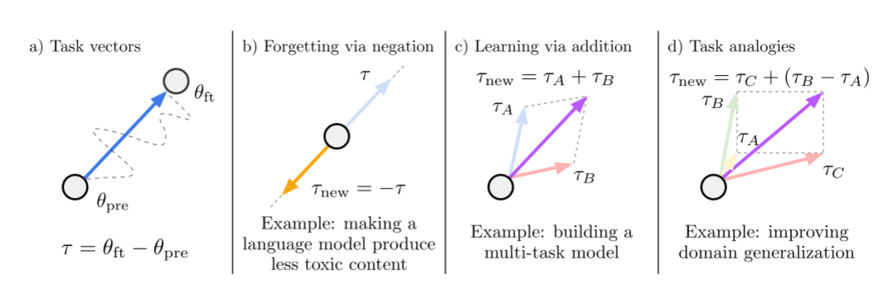

# Editing Models with Task Arithmetic

## 摘要

改变预训练模型的行为——例如，提高其在下游任务上的性能或减轻在预训练过程中学习的偏差——是开发机器学习系统时的常见做法。

在本工作中，我们提出了一种以任务向量为中心的新范式来引导神经网络的行为。

任务向量指定了预训练模型权重空间中的一个方向，使得在该方向上的移动可以改善任务性能。

我们通过从在任务上微调后的模型权重中减去预训练模型的权重来构建任务向量。

我们表明，这些任务向量可以通过如取反和加法等算术运算进行修改和组合，并且相应地引导结果模型的行为。

取反任务向量会降低目标任务上的性能，而对控制任务上的模型行为影响很小。

此外，将任务向量相加可以同时提高多个任务上的性能。

最后，当任务通过形式为“A AA 对于 B BB 正如 C CC 对于 D DD”的类比关系相联系时，结合来自三个任务的向量可以改善第四个任务的性能，即使没有使用第四个任务的数据进行训练。

总的来说，我们在多个模型、模态和任务上的实验表明，任务算术是一种简单、高效且有效的编辑模型的方法。

图1:任务向量和我们研究的用于编辑模型的算术运算的说明。(a)通过从微调后的同一模型的权重中减去预训练模型的权重获得任务向量(第2节)。(b)否定任务向量会降低任务的性能，(c)将任务向量一起添加可以提高预训练模型在考虑的任务上的性能(第4节)。(d)当任务形成类比关系时，例如在两个不同数据源上的监督学习和无监督学习，仅使用来自剩余三个目标和数据集组合的向量就可以提高监督目标任务的性能(第5节)。

## 2 任务向量

为了我们的目的，任务由用于微调的数据集和损失函数实例化。设  $\theta_{\text{pre}} \in \mathbb{R}^d$  为预训练模型的权重， $\theta_{\text{ft}}^t \in \mathbb{R}^d$  为在任务  $t$  上微调后的对应权重。任务向量  $\tau_t \in \mathbb{R}^d$  由  $\theta_{\text{ft}}^t$  和  $\theta_{\text{pre}}$  之间的逐元素差异给出，即  $\tau_t = \theta_{\text{ft}}^t - \theta_{\text{pre}}$ 。当任务从上下文中明确时，我们省略标识符  $t$ ，简单地将任务向量称为  $\tau$ 。

任务向量可以通过逐元素加法，以及可选的缩放项  $\lambda$ ，应用于任何来自相同架构的模型参数  $\theta$ ，使得结果模型具有权重  $\theta_{\text{new}} = \theta + \lambda \tau$ 。在我们的实验中，缩放项是使用保留的验证集确定的。注意，将单个任务向量添加到预训练模型中，且  $\lambda = 1$  会导致模型在该任务上进行微调。

根据 Ilharco 等人 [39] 的研究，我们专注于开放性模型，其中可以在不引入新参数的情况下对下游任务进行微调（例如，开放词汇表图像分类器 [78; 42; 76; 3] 和文本到文本模型 [79; 77; 9; 38]）。在微调引入新参数的情况下（例如，一个新的分类头），我们可以遵循 Matena 和 Raffel [63] 的方法，仅合并共享权重，但这一探索留待未来的工作。

**使用任务算术编辑模型**。我们专注于任务向量的三个算术表达式，如图 1 所示：否定任务向量、添加任务向量以及组合任务向量以形成类比。所有操作都以逐元素方式应用于权重向量。

当否定任务向量  $\tau$  时，应用结果向量  $\tau_{\text{new}} = -\tau$  对应于在微调模型和预训练模型之间进行外推。结果模型在目标任务上表现更差，而在控制任务上的性能变化很小（第 3 节）。添加两个或多个任务向量  $\tau_i$  得到  $\tau_{\text{new}} = \sum_i \tau_i$ ，结果是一个在所有任务上都精通的多任务模型，有时甚至优于针对单个任务微调的模型（第 4 节）。最后，当任务 A、B、C 和 D 形成形式为“A 对 B 就像 C 对 D”的类比时，任务向量  $\tau_{\text{new}} = \tau_C + (\tau_B - \tau_A)$  可以提高任务 D 的性能，即使该任务的数据很少或没有（第 5 节）。

对于所有操作，通过应用  $\tau_{\text{new}}$  获得的模型权重由  $\theta_{\text{new}} = \theta + \lambda \tau_{\text{new}}$  给出，其中缩放项  $\lambda$  是使用保留的验证集确定的。

## 3 通过否定进行遗忘

在本节中，我们展示了否定任务向量是减少其在目标任务上性能的有效方法，而不会显著影响其他地方的性能。遗忘或“反学习”可以帮助减轻预训练时学到的不良偏见；完全遗忘任务可能是为了遵守法规或出于道德原因，例如防止图像分类器识别人脸，或通过 OCR“读取”个人信息。

这些干预措施不应显著影响模型在处理编辑范围之外的数据时的行为 [69; 39]。因此，除了评估任务向量起源的目标任务外，我们还测量控制任务的准确性。我们的实验展示了否定任务向量在编辑图像分类和文本生成模型方面的有效性。

### 3.1 图像分类

对于图像分类，我们使用 CLIP 模型 [78] 和 Ilharco 等人 [39]; Radford 等人 [78] 研究的八个任务的任务向量，范围从卫星图像识别到分类交通标志：Cars [47]、DTD [12]、EuroSAT [36]、GTSRB [87]、MNIST [51]、RESISC45 [10]、SUN397 [101] 和 SVHN [72]。我们在附录 B 中探讨了包括 OCR 和个人识别在内的其他任务。对于控制任务，我们使用 ImageNet [16]。我们通过对每个目标任务进行微调来生成任务向量，详见附录 B.1。

我们与两个额外的基线进行比较，一个是按增加损失的方向进行微调（即，使用梯度上升），如 Golatkar 等人 [34]; Tarun 等人 [90] 所述；另一个是使用一个随机向量，其中每层的幅度与任务向量的相应层相同。更多细节见附录 B.2。

如表 1 所示，否定任务向量是在对控制任务影响很小的情况下，降低目标任务准确性的最有效编辑策略。例如，负任务向量将 ViT-L/14 的平均目标准确性降低了 45.8 个百分点，而对控制任务的准确性影响很小。相比之下，使用随机向量对目标准确性没有太大影响，而使用梯度上升进行微调会严重恶化控制任务的性能。我们在附录 B 中展示了更多结果。

### 3.2文本生成

我们研究是否可以通过否定一个训练过的任务向量来减轻特定的模型行为。特别是，我们的目标是减少各种大小的GPT-2模型产生的有毒代的数量[77]。我们通过对来自Civil Comments[8](毒性评分高于0.8)的数据进行微调来生成任务向量，然后对这些任务向量进行否定。如3.1节所述，我们还比较了微调时使用梯度上升的基线[34;[90]，并使用相同量级的随机任务向量。此外，我们比较了来自Civil Comments的无毒样品的微调(毒性评分小于0.2)，类似于Liu等人。我们用解毒b[35]测量了一千代模型的毒性。对于控制任务，我们在WikiText-103上测量语言模型的困惑度[66]。

如表2所示，使用负任务向量进行编辑是有效的，将分类为有毒的代数从4.8%减少到0.8%，同时将控制任务的困惑度保持在预训练模型的0.5个点以内。相比之下，梯度上升的微调通过将控制任务的性能降低到不可接受的水平来降低有毒代，而在减少任务代和控制任务方面，无毒数据的微调比任务向量更糟糕。作为实验控制，添加随机载体对WikiText-103的毒性代或困惑都没有什么影响。我们在附录C中提供了额外的实验细节和结果。