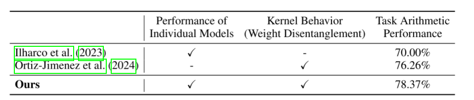
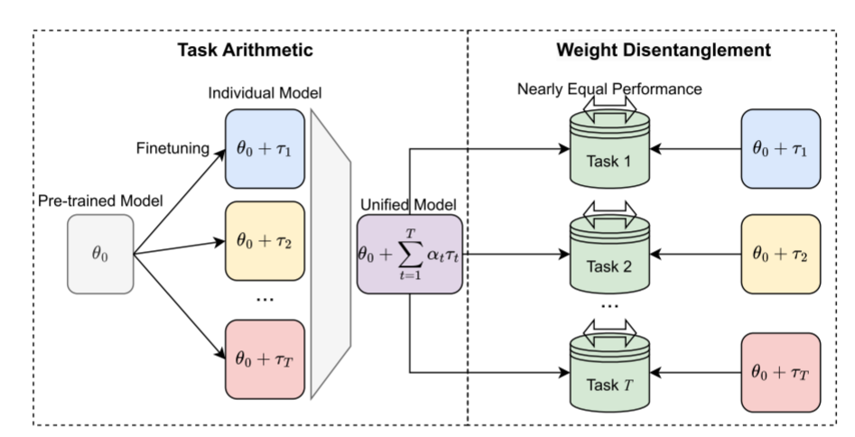
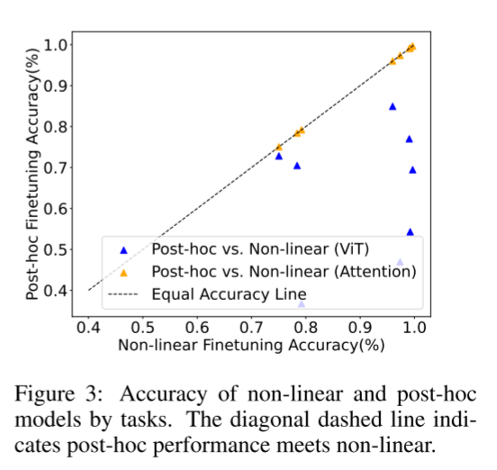
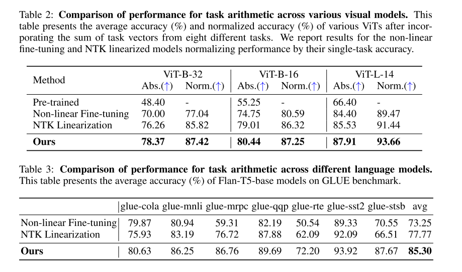
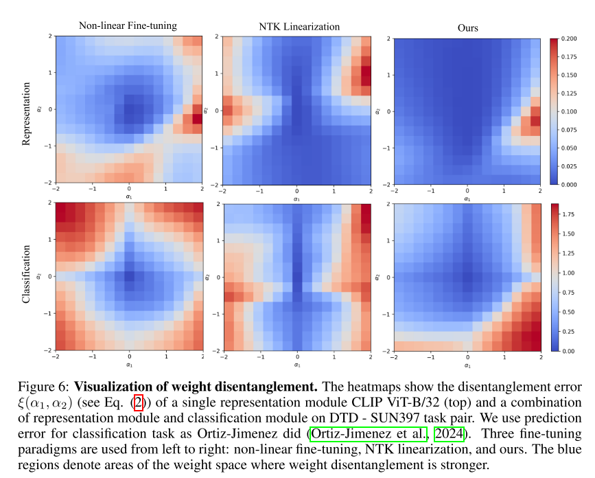

# FINE-TUNING ATTENTION MODULES ONLY: ENHANCING WEIGHT DISENTANGLEMENT IN TASK ARITHMETIC

近年来，任务算术引起了越来越多的关注。这种方法直接在权重空间中编辑预训练模型，通过将各种任务的微调权重组合成一个统一模型。其效率和成本效益源于无需训练的组合方式，这与传统方法形成鲜明对比——传统方法需要在大型数据集上对多个任务进行模型训练。然而，将这种统一模型应用于单个任务时，可能会受到其他任务的干扰（即缺乏权重解耦）。为解决这一问题，神经切线核（NTK）线性化被引入，利用“核行为”来促进权重解耦，并减轻无关任务带来的不利影响。尽管NTK线性化具有诸多优势，但也存在一些缺点，例如训练成本翻倍，以及单个模型性能下降。**为解决这一问题，我们提出了一种简单而有效且高效的方法，即仅微调Transformer中的注意力模块。我们的研究表明，注意力模块表现出核行为，而仅微调注意力模块可以显著改善权重解耦。**为了进一步理解我们的方法如何改善任务算术的权重解耦，我们通过区分表示模块和任务特定模块的作用，对任务算术进行了全面研究。特别是，我们发现表示模块在改善权重解耦方面发挥着重要作用，而任务特定模块（如分类头）可能会降低权重解耦性能。

## intro

如左图所示， $\theta_0$  是预训练模型， $\tau_t$ ， $t = 1, \cdots, T$  是第  $t$  个任务向量。每个任务上的**个体模型**由  $\theta_0 + \alpha_t \tau_t$  导出。任务算术是将所有任务向量加到预训练模型上以获得**统一模型**  $\theta_0 + \sum_{t=1}^{T} \alpha_t \tau_t$ 。任务算术的一个主要目标是实现如图右所示的权重解耦，这意味着统一模型的预测性能，如特定任务的准确性，将不会受到其他任务的影响。换句话说，统一模型与个体模型几乎具有相等的性能。

我们的目标是实现权重解纠缠的原因是因为任务算法主要关注竞争任务而不是协同任务(Ilharco等人，2023)，因为挑战在于平衡和优化可能存在冲突或需要不同模型行为的任务之间的性能。这种对竞争任务的强调对于开发鲁棒的多任务模型至关重要，这些模型可以有效地处理各种应用程序而不会降低性能。

表1:不同方法的任务算法性能比较。由于单个模型的良好性能和良好的核行为(权解纠缠)，我们的方法的任务算法性能(统一模型在所有任务上的平均精度)优于最先进的技术。

图 1：任务算术和权重解耦概念的说明。在左侧，在任务算术中，我们首先微调预训练模型 θ₀，得到微调后的单个模型 θ₀ + αₜτₜ，其中 τₜ 是第 t 个任务向量。我们最终通过将所有任务向量加到预训练模型上获得统一模型：θ₀ + ∑ₜᵀαₜτₜ。在右侧，权重解耦意味着统一模型对特定任务的预测不会受到其他任务的影响。

然而，权重解缠仍然是任务算法中最艰巨的挑战。最近的研究(Ortiz-Jimenez et al.， 2024)表明，由于模型在早期微调阶段的固有核行为，约束模型在切线空间内进行微调可以显着提高权重解纠缠。这种核行为由神经切线核(NTK)理论形式化(Jacot等人，2018)，指的是神经网络主要围绕预训练参数初始化进行更新。虽然NTK线性化是有效的，但它损害了单个模型的性能，并且需要两到三倍的计算资源，与任务算法的原始效率目标相冲突。

**为了解决这个问题，我们假设非线性微调和权解纠缠的结合是必要的。**这一假设促使我们研究以下问题:在神经网络中是否存在一个子模块，其中非线性微调可以表现出权重解纠缠?我们证明了变压器模型中的注意力模块表现出内核行为(见图3)，这对权重解缠至关重要。这一发现得到了事后线性化(ortizs - jimenez et al.， 2024)的经验证据的支持，这是一种使用一阶泰勒展开近似训练后网络输出变化的技术。在上述见解的基础上，我们建议只微调注意力模块，这将提高单个模型的性能和效率，同时保持权重解纠缠。此逻辑流如图2所示。

通过只关注注意力模块的微调，与非线性微调和NTK线性化相比，我们的方法显著提高了统一模型的权重解缠和准确性(见表2)，同时大大减少了计算负担和内存使用。该方法提供了一种平衡的替代方案，在保持单个模型的强大性能的同时增强了权重解缠能力，为在不牺牲效率或准确性的情况下提高任务算法性能提供了一种实用的解决方案。

为了进一步理解我们的方法如何提高任务算法的权重解纠缠，我们通过区分表示模块和任务特定模块的作用来进行研究，而现有文献(ortizi - jimenez et al.， 2024)使用单一模型制定任务算法，但没有明确区分它们。我们对预训练视觉转换(ViT)模型(如对比语言-图像预训练(CLIP))的任务算法进行了全面研究(Radford et al.， 2021)，对其基本机制提供了新的见解，并提出了通过任务算法提高预训练模型性能的新方法。具体来说，我们说明了表示模块在改善权重解缠方面起着重要作用，而这一直受到任务特定模块(如分类头)的限制。

具体而言，我们的主要贡献如下:

•我们提出了一种简单而有效的方法，该方法只对注意力模块进行微调，与最先进的方法相比，统一模型在所有任务上的权重解纠缠和平均准确率提高了2.38%，在几个视觉语言基准上比非线性基线提高了8.37%。

•我们证明了注意力模块表现出核行为，这表明专注于微调这些模块可以在保持效率的同时增强任务算法中的权重解纠缠能力。

•我们通过将表示模块从任务特定模块中分离出来，重新制定了任务算法的架构，揭示了虽然权重解纠结主要来自表示模块，但任务算法的有效性受到任务特定组件(如分类头)的约束。

## preliminaries

我们首先介绍必要的数学符号。设  $ F : \mathcal{X} \times \Theta \rightarrow \mathcal{Y} $  为一个神经网络，它接收输入  $ x \in \mathcal{X} $  并由一组权重  $ \vartheta \in \Theta $  参数化，这包括一个表示模块  $ f(\cdot; \theta) $  和一个任务特定模块  $ g(\cdot; \omega) $  其中  $ \vartheta = \{\theta, \omega\} $ 。我们假设  $ \mathcal{X} \subseteq \mathbb{R}^d $ ， $ \Theta \subseteq \mathbb{R}^m $  且  $ \mathcal{Y} \subseteq \mathbb{R}^c $ 。考虑  $ T $  个任务，每个任务  $ t $  由一个三元组  $ (D_t, \mu_t, F_t^*) $  组成，其中  $ D_t \subseteq \mathcal{X} $  是一个数据支持（例如，ImageNet (Deng et al., 2009) 图像）， $ \mu_t $  是一个输入分布，使得  $ \text{supp}(\mu_t) = D_t $ ，且  $ F_t^* : D_t \rightarrow \mathcal{Y} $  是一个目标函数（例如，标签）。在实践中，每个任务都由一个训练集  $ \{(x_v, F_t^*(x_v))\}_{v \in [n]} $  确定，其中  $ F_t^*(x_v) = g(f(x_v; \theta_t^*); \omega_t) $  且  $ x \sim \mu_t $ ，这用于从预训练权重  $ \theta_0 $  开始微调表示模块，并获得微调后的权重  $ \theta_t^* $ ，而任务特定模块固定在  $ \omega_t $ 。

在建立了这个上下文之后，我们现在可以介绍本工作的关键概念：任务向量和任务算术。

**定义 1（任务向量和任务算术）** 设  $\theta_0$  表示预训练表示模块的参数， $\theta_t$  表示在任务  $t$  上微调后的参数。任务  $t$  的任务向量  $\tau_t$  定义为： $\tau_t = \theta_t - \theta_0$ 。任务算术是一种通过修改预训练参数  $\theta_0$  到统一参数  $\theta_{\text{unified}}$  来适应  $T$  个不同任务的操作，如下所示：

$$
\theta_{\text{unified}} = \theta_0 + \sum_{t=1}^{T} \alpha_t \tau_t,
$$

其中  $\alpha_t$  是标量系数。

为了与统一模型的概念区分，我们称在特定任务  $T$  上微调的模型  $f_{\theta_t}$  为个体模型。值得注意的是，将单个任务向量  $\tau_t$  结合系数  $\alpha = 1$ 添加到预训练模型中会产生一个等同于这个个体模型  $f_{\theta_t}$  的模型。

**非线性微调**。任务算术的最初想法由 Ilharco 等人 (2023) 提出。他们证明了通过任务算术可以同时提高统一模型在多个任务上的性能。然而，模型的性能仍然落后于专门为特定任务微调的个体模型。在本文的其余部分，我们将这种基线方法称为非线性微调，因为任务向量  $\tau_t$  是通过这种方法获得的。

> Editing models with task arithmetic

**准确性差距**。我们将准确性差距定义为统一模型与相应个体模型在任务  $t$  上准确性的差异。对于这种准确性差距的一个合理假设是，不同任务的任务向量彼此之间表现出隐含的冲突。为了解决非线性微调的局限性，Ortiz-Jimenez 等人 (2024) 提出权重解耦是有效任务算术的一个重要且可能必要的条件。

**定义 2（权重解耦）** 给定  $T$  个不同任务及其相应的支持  $D = \{D_t\}_{t \in [T]}$ 。我们说一组任务向量  $\mathcal{T} = \{\tau_t\}_{t \in [T]}$  相对于参数函数  $f : \mathcal{X} \times \Theta \rightarrow \mathcal{Y}$  和初始权重  $\theta_0$  是权重解耦的，如果
$$
f \left( x; \theta_0 + \sum_{t=1}^{T} \alpha_t \tau_t \right) = \sum_{t=1}^{T} f(x; \theta_0 + \alpha_t \tau_t) \mathbb{1}(x \in D_t) + f(x; \theta_0) \mathbb{1} \left( x \notin \bigcup_{t \in [T]} D_t \right),
$$

其中  $f$  是表示模块。

**备注** 尽管权重解耦的概念最初由 Ortiz-Jimenez 等人 (2024) 提出，我们的定义 2 在几个关键方面与他们的定义不同。

首先，我们的定义将权重解耦描述为**一组任务向量相对于函数  $f$  的属性**，而它**最初是被定义为函数  $f$  相对于任务向量的属性**。我们反转表述的原因有两个。1) “权重解耦”这个术语对应于  $T$  个不同的权重（即任务向量），而不是  $f$ 。2) Ortiz-Jimenez 等人 (2024) 的方法和我们的方法都旨在找到更好的任务向量  $\mathcal{T}$ ，而不是找到更好的  $f$ 。

其次，**我们的定义专门适用于表示模块，而原始定义涵盖了整个神经网络。**这主要是由于任务算术仅在表示模块上执行这一事实所驱动的。我们将在第 4 节中展示，这一定义是定义良好的：权重解耦从表示模块中产生。

**NTK 线性化微调**  受到 NTK 研究的启发，这些研究表明非常宽的神经网络在其初始化  $\theta_0$  附近的行为类似于线性函数，Ortiz-Jiménez 等人 (2021) **提出了在  $f$  的一个事后线性函数  $f_{\text{lin}}$  上微调任务向量  $\tau$** ，该函数在  $\theta_0$  处表示为：
$$
f_{\text{lin}}(x; \theta_0 + \tau) = f(x; \theta_0) + \tau^\top \nabla_\theta f(x; \theta_0).
$$

获得的任务向量表示为  $\mathcal{T}_{\text{lin}}$ 。作者进一步通过实证展示了这种方法产生了一个重要特性： $\mathcal{T}_{\text{lin}}$  在  $\theta_0$  处相对于  $f_{\text{lin}}$  是权重解耦的。

为了总结本节，我们将良好的任务算术性能定义为由三个关键因素所表征：高准确性、计算效率和良好的权重解耦。

## 注意模块中的任务算法

### 3.1 任务算术的主要挑战

根据我们之前的定义，统一模型在每个任务  $t$  上的性能可以简单地分解如下：

 $$ \text{统一模型的准确性} = \text{个体模型的准确性} - \text{准确性差距}。 $$ 

不幸的是，现有研究表明这些因素之间存在权衡。非线性微调可以为个体模型实现高准确性，但由此产生的任务向量权重解耦程度较低，导致统一模型中存在较大的准确性差距。相反，线性微调保证了权重解耦，因此准确性差距较小，但线性微调的个体模型往往准确性较低，因为线性近似给模型带来了误差。这种权衡在任务算术中提出了一个重大挑战。

**为此，我们假设非线性微调和权重解耦的结合是必要的。这一假设促使我们研究以下问题：是否存在神经网络中的子模块，其中非线性微调可以表现出权重解耦？**我们的调查表明，注意力模块是一个有希望的候选者。

### 3.2 精度差距:关注模块的核行为和权解纠缠

根据 NTK 研究和 Ortiz-Jimenez 等人 (2024) 的讨论，如果一个预训练网络  $f(\cdot; \theta_0)$  在微调过程中表现出核行为——**即如果神经网络主要围绕其预训练参数初始化进行更新，并且可以通过其一阶泰勒展开来近似**——那么由此产生的任务向量是权重解耦的。直接检查核行为可能具有挑战性；然而，可以通过以下测试来近似。

**核行为测试**。给定一个函数  $f$ ，其初始参数为  $\theta_0$ ，以及一个具有任务向量  $\tau_t$  的任务  $t$ ，我们定义核行为测试如下。如果方程

 $$ f(x; \theta_0 + \tau_t) = f_{\text{lin}}(x; \theta_0 + \tau_t) $$ 

对于任务  $t$  数据集中的所有  $x$  都成立，我们说  $f(\cdot; \theta)$  在使用给定方法对任务  $t$  进行微调期间表现出核行为，或者更简单地说，给定方法表现出核行为。

在我们的实验中，我们比较了非线性函数  $(f(\cdot))$  和事后线性函数  $(f_{\text{lin}})$  在  $T$  个任务上的平均准确性，微调 (1) 所有参数和 (2) 仅在注意力模块上。具体来说，我们按照与Ilharco等人(2023)相同的设置，在8个任务上微调了几个不同大小的CLIP预训练vit (Dosovitskiy等人，2021):Cars (Krause等人，2013)、DTD (Cimpoi等人，2014)、SUN397 (Xiao等人，2016)、EuroSAT (Helber等人，2019)、GTSRB (Stallkamp等人，2011)、MNIST (LeCun, 1998)、SVHN (Netzer等人，2011)和RESISC45 (Cheng等人，2017)。

图3中的结果表明，注意力模块演示了内核行为。三角形点分别表示注意模块(黄色)和整个模型(蓝色)之间的核行为测试的比较。点与对角线虚线的接近度表示内核行为。事后注意模块(黄点表示)始终比整个ViT(蓝点)更接近对角线虚线，表明表现更好。

### 3.3 带有微调关注模块的单个模型的精度

根据注意力模块的核行为，我们建议仅对注意力模块进行微调。我们的微调范式与非线性微调范式和 NTK 线性化微调范式的比较在图 4 中展示。接下来，我们将展示仅微调注意力模块也能为个体模型实现高精度。

**非线性优势**。我们首先介绍一个称为非线性优势的关键概念。对于给定的方法，非线性优势定义为非线性微调和所讨论方法之间的个体模型准确性差异。由于非线性微调通常为个体模型实现最高准确性，非线性优势总是非负的，即非线性优势  $\geq 0$ 。

**个体模型的准确性**。在图 5 中，我们证明微调注意力模块可以减少非线性优势——与 NTK 线性化微调相比，基本上提高了个体模型的准确性。该图展示了两个比较：1）圆形标记表示我们的方法与非线性微调之间的比较。2）三角形标记显示 NTK 线性化与非线性微调之间的比较。

标记与对角虚线的距离表示非线性优势等于零。我们的方法，由圆形标记表示，始终比 NTK 线性化（三角形标记）更接近对角虚线，表明非线性优势较小。这种可视化表示表明，与NTK线性化相比，我们的微调注意力模块方法实现了更接近非线性微调的性能，从而更有效地减少了非线性优势。

### 3.4带有微调关注模块的统一模型的精度

我们已经证明我们的方法在个体模型上实现了高精度，并解决了准确性差距。然后我们将验证我们的方法在统一模型中实现了高准确性，包括平均准确性和标准化准确性。

为了获得任务向量，我们使用不同 ViTs 之前的微调权重，并为所有任务使用相同的混合系数，即  $\alpha = \alpha_1 = \cdots = \alpha_T$ ，以确保与 Ortiz-Jimenez 等人 (2024) 的公平比较。我们在附录 A 中提供了此实验的所有详细信息。

**标准化准确性**。标准化准确性是通过模型在每个任务上微调后达到的个体准确性计算的。数学上，

$$
\text{Normalized Acc} = \frac{1}{T} \sum_{t=1}^{T} \frac{\text{acc} \left( f(x; \theta_0 + \sum_{i} \alpha_t \tau_t) \right)}{\text{acc} \left( f(x; \theta_0 + \alpha_t \tau_t) \right)}
$$

**统一模型的准确性**。我们采用 Ilharco 等人 (2023) 提出的基准来评估预训练模型的任务算术能力，该模型包括第 3.2 节中描述的 8 个任务。特别是，表 2 显示我们的方法显著优于其非线性对应方法 (Ilharco 等人, 2023)，并在任务添加基准测试中取得了最先进的结果。我们的模型通过任务添加实现了统一模型的更高准确性（高达 2.38%）。此外，我们的方法不仅在平均准确性上表现优异，而且在标准化准确性上也表现良好。

对于自然语言处理 (NLP) 任务，我们使用 Flan-T5 (Chung 等人, 2022) 作为我们的预训练语言模型。对于微调，我们在从通用语言理解评估 (GLUE) 基准 (Wang 等人, 2018) 派生的七个任务上使用 Flan-T5 基础模型，使用相同的随机种子 42 初始化模型。这些任务分别是CoLA、MNLI、MRPC、QQP、RTE、SST2和STSB。我们在表3中报告了所有任务的精度和平均精度，我们的方法在视觉和NLP任务中优于非线性微调和NTK线性化。

**消融研究。**为了研究是否可以通过微调多层感知器(MLP)模块和注意力模块来提高权重解纠缠性能，我们进行了四种范式的消融实验:(1)只微调注意力权重(Q, K, V和O投影)(我们的)，(2)微调注意力权重和偏差，(3)微调注意力和MLP权重，(4)微调注意力和MLP权重以及偏差。值得注意的是，所有四种范式在性能和权解纠缠方面都优于NTK线性化，这表明ViT模型在注意力模块和MLP中表现出强大的核行为。然而，性能根据偏差参数是否微调而变化，最佳结果与LoRA中使用的设置密切一致。这表明对这些配置的进一步探索可能会对优化任务算法产生有价值的见解。

**效率比较。**除了精度更高之外，由于微调的参数更少，我们的方法比非线性微调和NTK线性化要高效得多，如表4所示。我们的微调方法大大提高了任务算法在实际应用中的吸引力。通过改进单个模型的性能，我们的方法证明了任务算法在有效地实现统一模型的良好精度方面的优越性。此外，我们观察到注意力模块中的核心行为促进了更大的任务解脱。在接下来的部分中，我们将深入研究这个概念，探索其含义和未来发展的潜力。

## 4任务算法相对于系数α的鲁棒性

在前面的章节中，我们讨论了如何在任务算法中找到一个好的T。然而，任务算法的鲁棒性(即α的影响)对权解纠缠的影响尚未得到探讨。为此，在下一节中，我们首先提出了一个度量来评估表示模块上的权重解缠性能，称为“解缠误差”，并证明了权重解缠是从表示模块中产生的。然后，我们证明了我们的方法对于表示和分类模块的更广泛的α选择具有很强的权值解纠缠性，这证明了我们的方法的任务算法的鲁棒性。

### 4.1权重解缠从表示模块中出现

为了探讨任务算法的鲁棒性及其对权解纠缠的影响，我们提出了一个称为“解纠缠误差”的度量来评估权解纠缠的性能。与以往关注特定任务模块的工作不同，我们研究了表示模块是否可以在不依赖于特定任务组件的情况下满足定义2(权重解纠缠)。

我们的假设是，预训练模型可以独立于下游任务展示任务算术属性，通过任务算术保持一致的表示。通过单独关注表示模块，我们的目标是表明预训练模型的固有属性足以支持任务算法，有可能简化过程并扩大其适用性。

为了可视化权重解耦的程度，我们使用 Ortiz-Jimenez 等人 (2024) 的解耦误差通过方程 (1) 测量差异：

$$
\xi(\alpha_1, \alpha_2) = \sum_{t=1}^{2} \mathbb{E}_{x \sim \mu_t} \left[ \text{dist} \left( f \left( x; \theta_0 + \alpha_t \tau_t \right), f \left( x; \theta_0 + \alpha_1 \tau_1 + \alpha_2 \tau_2 \right) \right) \right],
$$

其中“dist”表示输出向量之间的任何距离度量。由于我们处理的是表示分布，接下来我们使用 Kullback-Leibler 散度量作为距离度量。**一般来说， $\xi(\alpha_1, \alpha_2)$  的值越小，模型在  $(\alpha_1, \alpha_2)$  处的权重解耦程度越高。**

### 4.2 权重解耦结果

图 6 显示了 CLIP ViT-B/32 模型在不同微调范式下的几个任务向量对的解耦误差。我们观察到在围绕  $\theta_0$  的小区域内解耦误差最小，这使得任务算术成为可能。与下游任务的解耦误差不同，即使对于  $\alpha_1, \alpha_2 > 1$ ，它仍然相对较小，这表明任务算术的能力受到任务特定模块（分类头）性能的限制。

**解耦误差比较**。我们的方法显示出比其对应方法更大的权重解耦，如图 6（右）中低解耦误差的更广泛区域所证明的。这解释了仅微调注意力模块时实现的更高标准化准确性（参见表 2）。更大的权重解耦和个体模型的更好性能相结合，使得统一模型的性能更高。

这些结果表明，我们的方法在表示和分类模块的α选择范围更广的情况下实现了很好的权重解纠缠，说明了我们的方法中任务算法的鲁棒性。