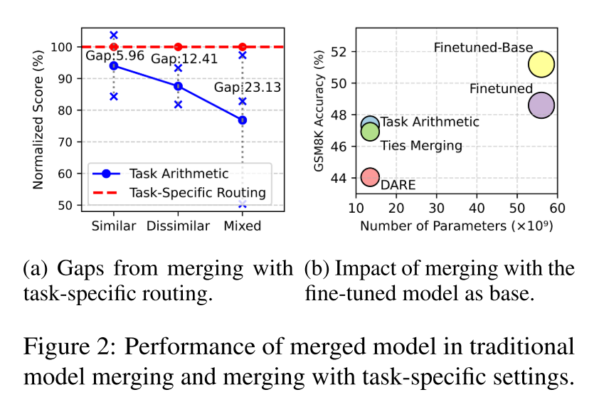
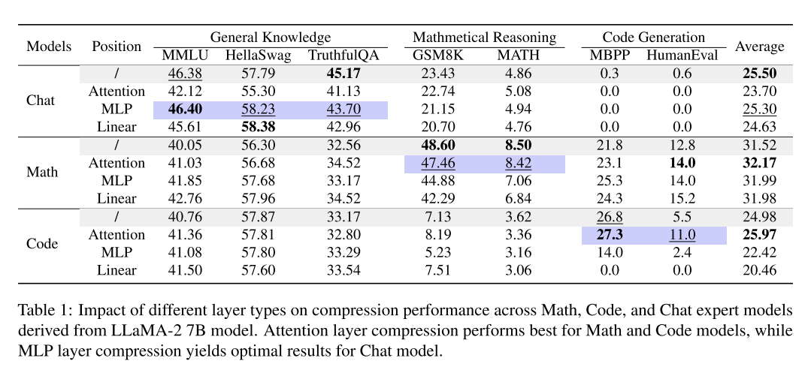

# **1bit-Merging: Dynamic Quantized Merging for Large Language Models**

大型语言模型的最新进展催生了在特定领域表现卓越的专用模型，这催生了对高效模型融合技术的需求。虽然传统的融合方法将参数合并到一个单一的静态模型中，但它们往往会在特定任务的性能上做出妥协。然而，特定任务的路由方法虽然保持了准确性，却引入了大量的存储开销。我们提出了1bit-Merging，这是一种将特定任务路由与1位量化任务向量相结合的新框架，以平衡性能和存储效率。我们的方法利用了不同特定任务模型在不同层存储知识的观察结果——聊天模型主要在注意力层存储知识，而数学/代码模型则在多层感知机（MLP）层存储知识——从而实现有针对性的压缩策略。通过对LLaMA2和Mistral模型家族在聊天、数学推理和代码生成任务中进行广泛的实验，我们证明了1bit-Merging在显著减少存储需求的同时，能够达到与现有方法相当甚至更优的性能。我们的框架为结合专用模型提供了一个实用的解决方案，同时保持了它们各自的优势并解决了当前方法的存储挑战 。

## 3 Method

### 3.1 传统模型合并与任务特定路由合并

我们首先比较传统模型合并与结合任务特定路由的合并策略。从共同预训练骨干  $\theta_{\text{PRE}}$  派生出  $K$  个微调模型  $\{\theta_{\text{SFT}}^{t_1}, \theta_{\text{SFT}}^{t_2}, \ldots, \theta_{\text{SFT}}^{t_K}\}$ ，每个任务向量定义为微调前后的差异：

$$
\delta_{t_k} = \theta_{\text{SFT}}^{t_k} - \theta_{\text{PRE}}, \quad \text{for } k \in \{1, \ldots, K\}.
$$

传统合并将所有任务向量聚合以构建一个单一静态合并模型：

$$
\theta_{\text{merged}}^{\text{traditional}} = \theta_{\text{PRE}} + \sum_{k=1}^{K} \delta_{t_k}.
$$

相比之下，带有路由的合并利用通过路由器为每个输入  $x$  定制的任务专业知识：

$$
k^* = \text{Router}(x), \quad \theta_{\text{merged}}^{\text{routing}} = \theta_{\text{PRE}} + \delta_{t_{k^*}}.
$$
如图2a所示，传统的合并方法，如Task Arithmetic (Ilharco et al.， 2023)受到任务干扰的影响很大:合并不同的任务(数学和聊天)比合并相似的任务(数学和代码)对性能的影响更大，添加更多的任务会加剧这种下降。相反，特定于任务的路由可以防止干扰并保持微调模型的准确性。

### 3.2 基础模型在模型合并中的影响

在任务特定路由的优势基础上，我们进一步研究了在模型合并中选择不同基础模型的影响。具体来说，我们比较了使用预训练骨干  $\theta_{\text{PRE}}$  与使用数学微调模型  $\theta_{\text{Math}} = \theta_{\text{PRE}} + \delta_{\text{Math}}$  作为数学输入数据的基础模型时的性能结果。如图 2b 所示，用数学微调模型替换预训练骨干显著提高了在 GSM8K (Cobbe et al., 2021) 数据集上的性能。因此，用任务特定微调初始化基础模型可以使合并模型更有效地解决相应任务。尽管超过了单独微调的模型，使用任务特定基础模型同时也增加了存储需求，因为需要加载多个任务向量。

### 3.3 1bit-合并

为了平衡性能与存储效率，我们引入了 1bit-合并，这是一种动态合并方法，结合了任务特定路由与 1-bit 量化的任务向量。

**任务向量的压缩。**认识到任务向量中的大量冗余，我们对任务向量应用 1-bit 权重量化，将线性层中的权重矩阵从 FP32/16 精度转换为 1-bit 格式。在这个量化过程中，任务向量的每个元素被设置为+1或-1。为了在激进压缩的情况下保持性能，我们使用 FP16 格式的标量值对二进制权重矩阵进行缩放。这种缩放确保量化后的权重保持原始权重的  $L_2$  范数，从而在极低比特压缩后保持模型性能（Liu et al., 2024）。缩放因子  $\alpha$  计算如下：

$$
\alpha = \frac{\|W\|_1}{m \cdot n}
$$

其中  $m$  和  $n$  是权重矩阵的维度。使用这个缩放因子，转换后的任务向量  $\tilde{\delta}_{t_k}$  定义为：

$$
\tilde{\delta}_{t_k} = \alpha \ast \text{Sign}(\delta_{t_k}) \tag{1}
$$

**压缩位置。** 我们通过选择性地压缩注意力层、MLP 层和所有线性层，检查不同模型组件的 1-bit 压缩效果。如表 1 所示，每种模型类型表现出不同的压缩特性。数学和代码模型仅在压缩注意力层时达到最佳性能，而聊天模型在 MLP 层压缩时表现最佳。值得注意的是，数学和代码模型的压缩版本在性能上略优于它们原始的微调对应物。这些模式揭示了模型架构中知识分布的一个基本差异：任务特定的能力（如数学推理和代码生成）主要存在于 MLP 层中，而注意力层似乎存储更通用、可转移的知识。基于这些见解，我们策略性地对数学和代码模型应用注意力层量化，并将MLP层量化应用于聊天模型。

**动态路由和合并** 我们的合并框架随后将压缩的任务向量与任务特定的路由机制结合在一起，其中训练好的路由器分析输入数据  $x$  以产生跨不同任务的概率分布  $p$ 。基于最高概率  $k^*$  选择最相关的任务向量  $\delta_{t_{k^*}}$ ，并将其添加到预训练模型参数  $\theta_{\text{PRE}}$  中，以形成一个任务特定的基础模型  $\theta_{\text{base}} = \theta_{\text{PRE}} + \delta_{t_{k^*}}$ 。最后，我们应用 Ties 合并 (Yadav et al., 2023) 将剩余的压缩任务向量整合到  $\theta_{\text{base}}$  中，从而形成一个综合模型，该模型能够动态适应最相关的任务，同时通过有效的参数整合保持整体性能。

## **4 Experiments**