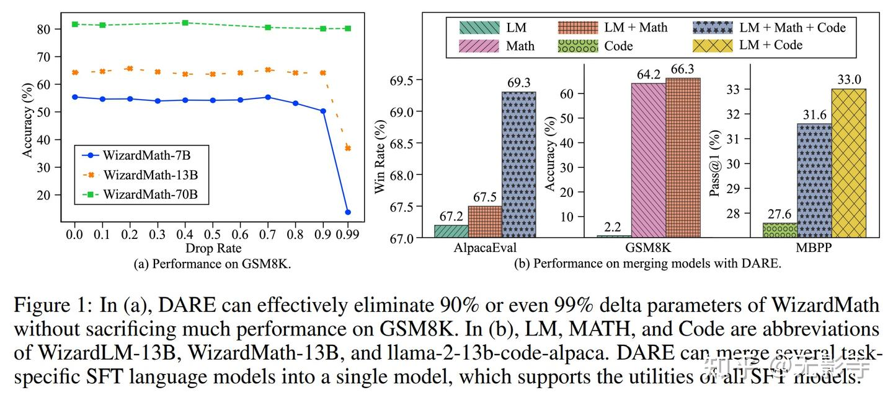
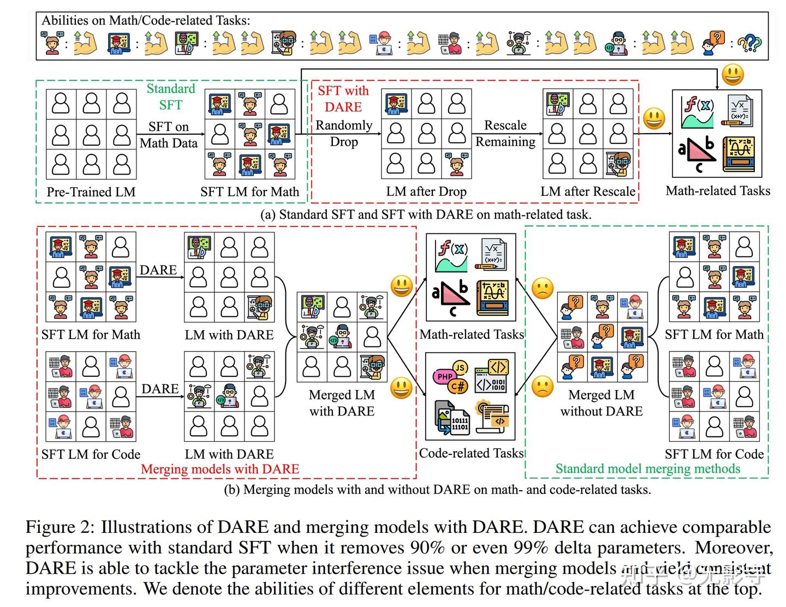
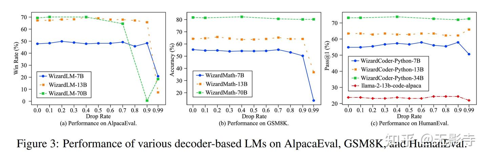
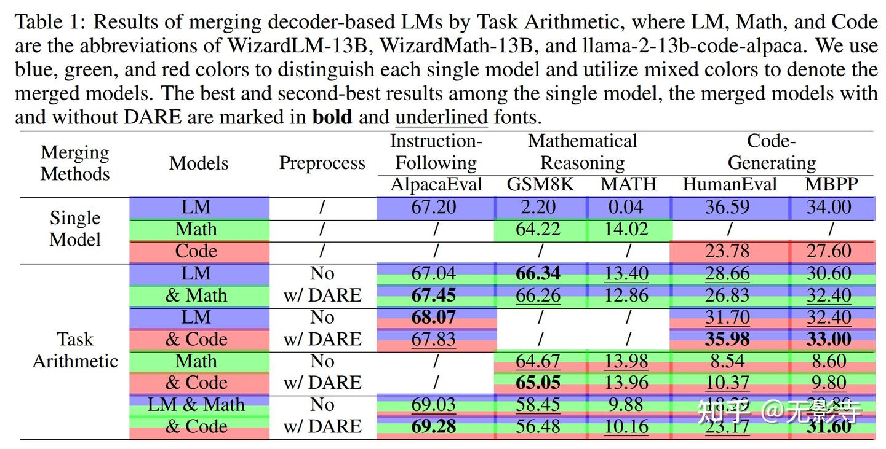
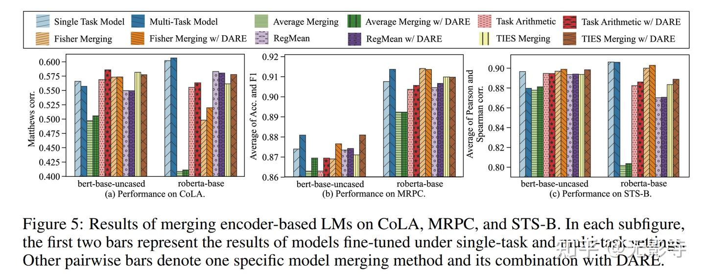
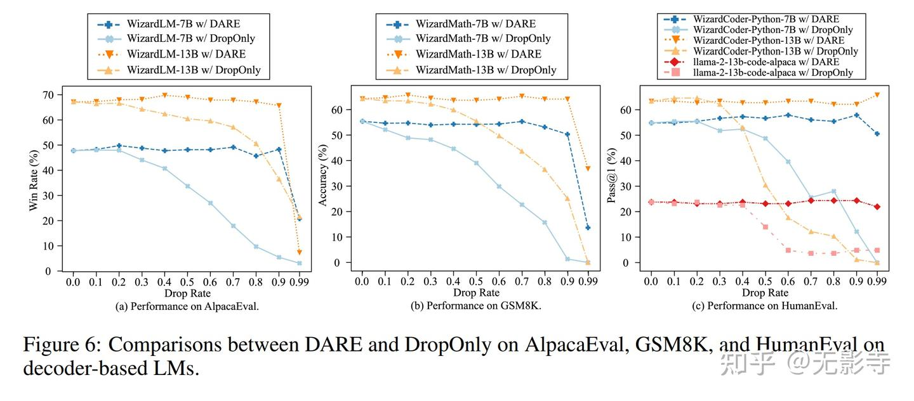
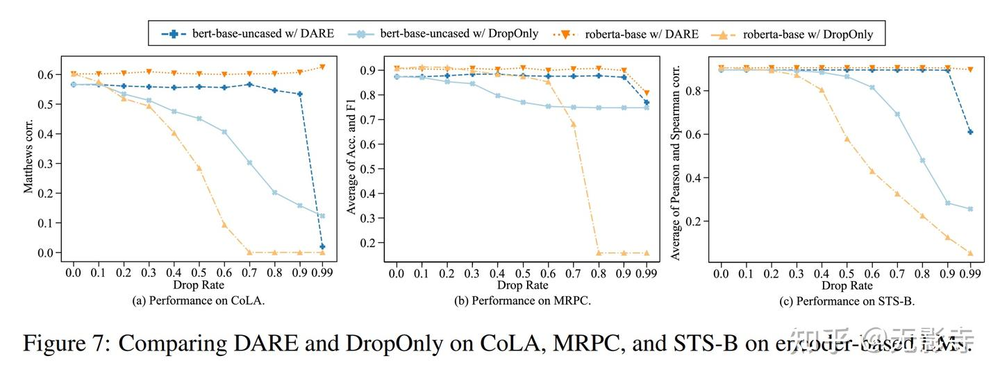
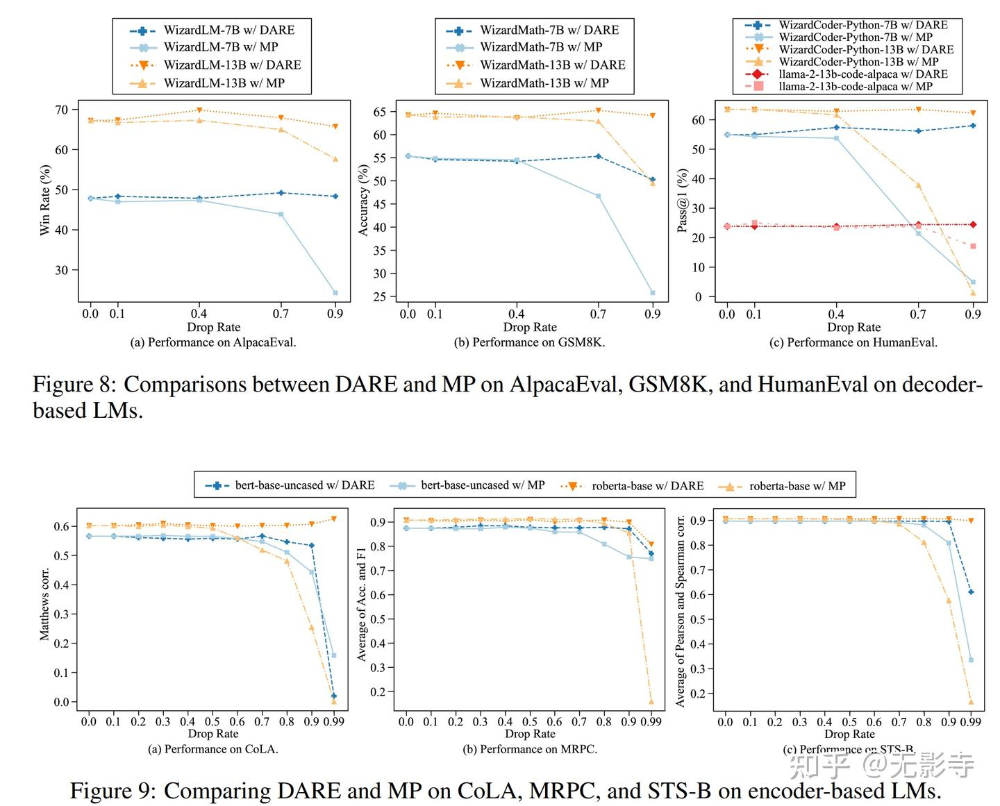
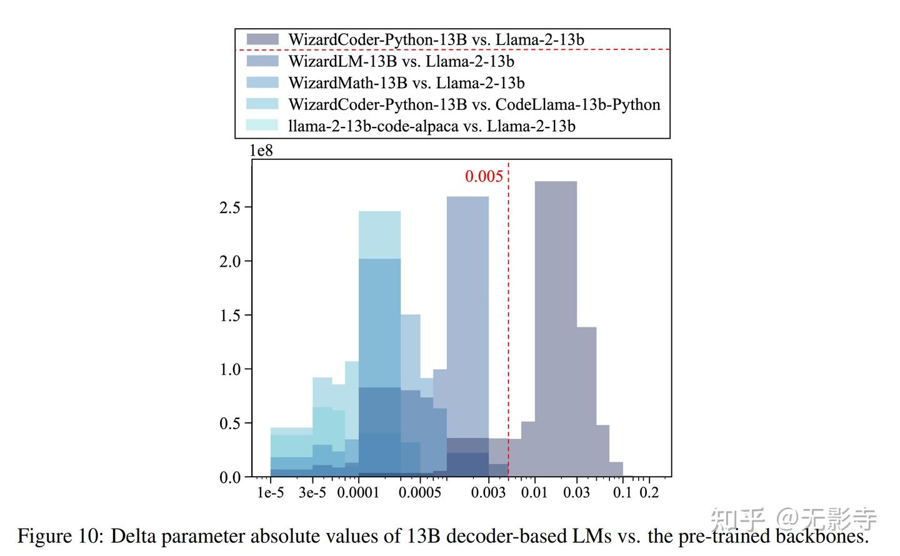

# Language Models are Super Mario:AbsorbingAbilities from Homologous Models as a Free Lunch

## 一、结论写在前面

论文讨论了语言模型中SFT [delta参数](https://link.zhihu.com/?target=https%3A//arxiv.org/abs/2203.06904)的极端冗余，并提出了一个简单的方法DARE，可以有效减少SFT所需的delta参 数数量，而不需要任何额外的数据、训练甚至GPU。与使用全部SFT delta参数相比，DARE可以惊人地删除90%甚至99%的SFT delta参数，同时牺牲的性能很小。

进一步，论文将DARE用作现有模型合并方法的一种通用预处理技术，将多个面向特定任务的[微调模型](https://zhida.zhihu.com/search?content_id=236729910&content_type=Article&match_order=1&q=微调模型&zhida_source=entity)合并为一个具有多种能力的单一模型。在基于解码器和编码器的语言模型上进行的大量实验，结果证明了DARE在减少SFT delta参数冗余和促进模型合并性能方面的有效性。

还深入分析了为什么DARE能如此有效以及使用DARE的前提条件。希望论文的发现能够激发研究人员设计更有效和高效的SFT策略，DARE具有成为联邦学习领域有前途技术的潜力。

## 二、论文的简单介绍

### 2.1 背景

类一直有通过各种方式获得额外能力的抱负，比如：电影和游戏。例如，在X战警:天启里，角色可以吸收其他变种人的能力来加强自己。同样，超级马里奥游戏中的主人公可以通过吸收游戏中的物品获得超能力，如：投掷火球。

鉴于大型语言模型(LLM，如GPT-4)的表现已经非常接近人类能力的水平，LLM可以合理地被视为通用人工智能系统的早期迭代版本。论文惊人地发现，与[天启](https://zhida.zhihu.com/search?content_id=236729910&content_type=Article&match_order=2&q=天启&zhida_source=entity)和超级马里奥类似，LM可以通过吸收其他模型来增强其能力，而无需训练或GPU。

通过优化模型的参数，有监督微调(Supervised Fine-Tuning，SFT)是为语言模型赋予特定任务能力所最广泛采用的策略。SFT的有效性可以从微调前后模型参数的改变中完全看出，这些改变的参数被称为[delta参数](https://link.zhihu.com/?target=https%3A//arxiv.org/abs/2203.06904)。论文展示了基于编码器或解码器的SFT语言模型，倾向于获得过度冗余的delta参数(excessively redundant delta parameters)。

### 2.2 论文的方法

论文提出了DARE，它根据降采样率p随机将某些delta参数重置为0，然后按1/(1-p)的因子缩放剩余的参数。尽管DARE很简单，但在其帮助下，当语言模型的参数达到70亿时，可以消除多达99%的delta参数，同时对模型性能几乎没有影响(见图1(a))。语言模型的参数越多，它可以容忍的p越大。这一发现表明，SFT语言模型确实学习了许多类似于[LoRA的低秩结构](https://link.zhihu.com/?target=https%3A//arxiv.org/abs/2106.09685)。因此，即使除去大多数这些结构后，产生一个低秩和极其稀疏的delta参数集，语言模型仍然可以保留其能力。

*图1:(a) 中，DARE可以有效地消除WizardMath 90%甚至99%的delta参数，而在GSM8K上的性能损失很小。(b) 中，LM、MATH 和 Code 分别是WizardLM-13B、WizardMath-13B和llama-2-13b-code-alpaca的缩写。DARE可以将几个面向特定任务的SFT语言模型合并为一个单一的模型，支持所有[SFT模型](https://zhida.zhihu.com/search?content_id=236729910&content_type=Article&match_order=1&q=SFT模型&zhida_source=entity)的功能*

基于这一观察，可以自信地合并多个同源SFT语言模型(从相同的backbone预训练)，而不必过多担心它们的能力下降。只要在合并过程中有一小部分delta参数不受影响，SFT释放的语言模型的能力仍然可以保留。论文首先使用DARE消除每个模型中的冗余delta参数，这有助于减轻多个模型之间的参数间干扰。 然后，论文对降低冗余的参数应用已建立的模型合并技术，创建一个具有多种能力的单一模型。

*图2：DARE和使用DARE[合并模型](https://zhida.zhihu.com/search?content_id=236729910&content_type=Article&match_order=1&q=合并模型&zhida_source=entity)的说明。当DARE删除90%甚至99%的delta参数时，它可以实现与标准SFT相当的性能。此外，DARE能够在合并模型时解决参数干扰问题并产生持续的改进。论文在顶部用math/code相关任务表示了不同元素的能力*

### 具体的

#### SFT Delta Parameters

设  $\theta_{\text{PRE}} \in \mathbb{R}^d$  表示预训练语言模型（LM）的参数（ $d$  是参数维度），例如 LLaMA (Touvron et al., 2023a) 或 Llama 2 (Touvron et al., 2023b)。对于任务  $t$ ，SFT 可以通过在特定任务数据上优化预训练模型来提供具有参数  $\theta_{\text{SFT}}^t \in \mathbb{R}^d$  的微调 LM。给定预训练 LM ( $\theta_{\text{PRE}}$ ) 和 SFT LM ( $\theta_{\text{SFT}}^t$ ) 的参数，delta 参数定义为 SFT 前后 LM 参数之间的差异，即  $\delta^t = \theta_{\text{SFT}}^t - \theta_{\text{PRE}} \in \mathbb{R}^d$ 。由于 delta 参数反映了 SFT 过程中参数的变化，分析 delta 参数的性质可以更好地理解 SFT。

#### Model Merging Problem

给定一组  $K$  个任务  $\{t_1, t_2, \cdots, t_K\}$  和  $K$  个相应的 SFT 模型，其参数为  $\{\theta_{\text{SFT}}^{t_1}, \theta_{\text{SFT}}^{t_2}, \cdots, \theta_{\text{SFT}}^{t_K}\}$ ，模型合并旨在将  $K$  个模型的参数融合到一个具有参数  $\theta_M$  的单一模型中，该模型能够同时很好地处理  $K$  个任务。遵循 Matena & Raffel (2022)；Jin et al. (2023)；Yadav et al. (2023)，我们专注于合并从相同预训练骨干优化的微调模型。

#### 3.1. DARE: 减少 Delta 参数冗余的简单方法

在这项工作中，我们揭示了 SFT LM 的 delta 参数的极端冗余特性，并提出了 DARE 来有效减少 delta 参数的冗余（见图 2(a)）。DARE 在概念上非常简单，包括两个步骤：丢弃和重新缩放。给定 delta 参数  $\delta^t = \theta_{\text{SFT}}^t - \theta_{\text{PRE}}$ ，DARE 首先基于丢弃率  $p$ （将其值设置为零）对  $\delta^t$  执行随机丢弃，然后按  $1/(1-p)$  的因子重新缩放剩余的参数，如下所示，

$$
\begin{align*}
m^t &\sim \text{Bernoulli}(p), \\
\tilde{\delta}^t &= (1 - m^t) \odot \delta^t, \\
\hat{\delta}^t &= \tilde{\delta}^t / (1 - p).
\end{align*}
$$

最后，我们通过加法将  $\hat{\delta}^t$  和  $\theta_{\text{PRE}}$  结合起来，以获得用于推理的参数，即  $\theta_{\text{DARE}}^t = \hat{\delta}^t + \theta_{\text{PRE}}$ 。我们证明，即使在去除大多数delta参数后，DARE也可以通过近似原始嵌入来很好地保持模型性能。

#### 理论分析

我们讨论线性变换，因为大多数语言模型（LMs）的参数在这一基本操作中发挥作用（例如，前馈网络中的计算、自注意力模块中的查询、键、值和输出的投影）。设  $W/\Delta W \in \mathbb{R}^{m \times n}$  和  $b/\Delta b \in \mathbb{R}^m$  为预训练/delta 参数。输入是一个向量  $x \in \mathbb{R}^n$ 。原始嵌入  $h \in \mathbb{R}^m$  的第  $i$  个（ $1 \leq i \leq m$ ）维度的期望值由下式计算：

$$
\mathbb{E}[h_i] = \mathbb{E} \left[ \sum_{j=1}^{n} \left( w_{ij} + \Delta w_{ij} \right) x_j + \left( b_i + \Delta b_i \right) \right]
$$

$$
= \sum_{j=1}^{n} x_j \mathbb{E}[w_{ij}] + \mathbb{E}[b_i] + \sum_{j=1}^{n} x_j \mathbb{E}[\Delta w_{ij}] + \mathbb{E}[\Delta b_i]
$$

$$
= \sum_{j=1}^{n} w_{ij} x_j + b_i + \sum_{j=1}^{n} \Delta w_{ij} x_j + \Delta b_i = h_i^{\text{PRE}} + \Delta h_i,
$$

其中  $w_{ij}/\Delta w_{ij}$  是  $W/\Delta W$  中第  $i$  行和第  $j$  列交叉点的条目。类似地， $b_i/\Delta b_i$  表示  $b/\Delta b$  中第  $i$  维度的元素。假设 DARE 以  $p$  的比例随机丢弃 delta 参数，并通过  $\gamma$  因子重新缩放其他参数。使用 DARE 后，delta 参数变为  $\Delta \tilde{W} \in \mathbb{R}^{m \times n}$  和  $\Delta \tilde{b} \in \mathbb{R}^m$ 。因此，嵌入的第  $i$  维度的期望值变为

$$
\mathbb{E}[\hat{h}_i] = \mathbb{E} \left[ \sum_{j=1}^{n} \left( w_{ij} + \Delta \tilde{w}_{ij} \right) x_j + \left( b_i + \Delta \tilde{b}_i \right) \right]
$$

$$
= \sum_{j=1}^{n} x_j \mathbb{E}[w_{ij}] + \mathbb{E}[b_i] + \sum_{j=1}^{n} x_j \mathbb{E}[\Delta \tilde{w}_{ij}] + \mathbb{E}[\Delta \tilde{b}_i]
$$

$$
= \sum_{j=1}^{n} w_{ij} x_j + b_i + \sum_{j=1}^{n} x_j ((1 - p) \cdot \gamma \cdot \Delta w_{ij} + p \cdot 0) + ((1 - p) \cdot \gamma \cdot \Delta b_i + p \cdot 0)
$$

$$
= h_i^{\text{PRE}} + (1 - p) \cdot \gamma \cdot \left( \sum_{j=1}^{n} \Delta w_{ij} x_j + \Delta b_i \right)
$$

$$
= h_i^{\text{PRE}} + (1 - p) \cdot \gamma \cdot \Delta h_i.
$$

通过设置  $\gamma = 1/(1 - p)$ ，我们有  $\mathbb{E}[h_i] = \mathbb{E}[\hat{h}_i]$ ，得出 DARE 可以近似原始嵌入。

备注:我们已经给出了DARE工作原理的粗略证明。在实际应用中，我们发现当跌落率p设置适当时，DARE是适用的，并且p的容差随lm参数的大小而增大。此外，删除微调参数而不是增量参数将导致灾难性的性能下降。一个有希望的未来方向是更深入地探索DARE，例如推断关于LM容量的p的上界，并说明微调参数和delta参数之间的内在差异。

最后，我们强调了DARE和Dropout之间的联系和差异(Srivastava et al.， 2014)。这两种方法都涉及随机删除和重新缩放操作，但它们在两个关键方面有所不同:(1)DARE处理delta参数，而Dropout处理模型输出;(2) DARE的目的是在不进行训练的情况下减少delta参数冗余，永久消除delta参数，只保留其他参数用于推理。Dropout用于防止模型过度拟合，它在训练期间暂时删除部分输出，但保留所有输出用于推理。

#### 3.2. 用DARE合并模型

由于DARE通过将大部分增量参数设置为零，有效地减少了增量参数的冗余，我们假设DARE可以帮助解决合并多个模型时参数的干扰问题(Yadav et al.， 2023)。以图2(b)为例，在合并数学模型和相关模型时，DARE可以辅助现有的模型合并方法更好地吸收两个模型的能力，且参数干扰较少或没有干扰。

正式地，给定在  $K$  个相应任务上微调的  $K$  个模型，其参数为  $\{\theta_{\text{SFT}}^{t_1}, \theta_{\text{SFT}}^{t_2}, \cdots, \theta_{\text{SFT}}^{t_K}\}$ ，我们首先对每个参数  $\theta_{\text{SFT}}^{t_k} (1 \leq k \leq K)$  应用 DARE，并导出  $\{\theta_{\text{DARE}}^{t_1}, \theta_{\text{DARE}}^{t_2}, \cdots, \theta_{\text{DARE}}^{t_K}\}$ 。然后，我们采用已建立的模型合并方法来融合导出的参数，并得到具有参数  $\theta_M$  的合并后的单一模型。让我们以任务算术（Ilhaco et al., 2023）为例，其官方计算过程表示为

$$
\theta_M = \theta_{\text{PRE}} + \lambda \cdot \sum_{k=1}^{K} \delta^{t_k} = \theta_{\text{PRE}} + \lambda \cdot \sum_{k=1}^{K} (\theta_{\text{SFT}}^{t_k} - \theta_{\text{PRE}}),
$$

其中  $\lambda$  是确定要合并的模型重要性的缩放项。当配备 DARE 时，任务算法的计算过程改写为
$$
\theta_{\text{DARE}}^{t_k} = \text{DARE} \left( \theta_{\text{SFT}}^{t_k}, \theta_{\text{PRE}}, p \right), \text{ for } 1 \leq k \leq K,
$$

$$
\theta_M = \theta_{\text{PRE}} + \lambda \cdot \sum_{k=1}^{K} \hat{\delta}^{t_k} = \theta_{\text{PRE}} + \lambda \cdot \sum_{k=1}^{K} \left( \theta_{\text{DARE}}^{t_k} - \theta_{\text{PRE}} \right). \tag{3}
$$

表达式 DARE  $\left( \theta_{\text{SFT}}^{t_k}, \theta_{\text{PRE}}, p \right)$  表示从  $\theta_{\text{SFT}}^{t_k}$  和  $\theta_{\text{PRE}}$  派生 delta 参数的过程，基于丢弃率  $p$  消除 delta 参数，遵循方程 (3.1)，最后将稀疏化的 delta 参数与  $\theta_{\text{PRE}}$  结合以获得  $\theta_{\text{DARE}}^{t_k}$ 。在第 4.3 节中，我们发现当合并多个 LM 时，DARE 可以有效提高任务算术的性能。同样值得注意的是，DARE 是一个多功能的即插即用模块，可以应用于任何模型合并方法，例如平均合并（Wortsman et al., 2022）、Fisher 合并（Matena & Raffel, 2022）、RegMean（Jin et al., 2023）和 TIES-合并（Yadav et al., 2023）。

### 2.3 论文的贡献

论文在八个GLUE[基准测试集](https://zhida.zhihu.com/search?content_id=236729910&content_type=Article&match_order=1&q=基准测试集&zhida_source=entity)的数据集上，对基于编码器的语言模型进行了广泛的实验，并对具有三种不同能力的Llama 2解码器进行了实验：执行指令、数学推理和代码生成。观察到：

(1)无论基于BERT、RoBERTa还是Llama 2，SFT语言模型都展示出大量冗余的delta参数。DARE允许删除约90%甚至99%的delta参数，而基本不影响下游任务的性能。 DARE中的缩放操作是保证有效移除delta参数的关键组成部分。如果不缩放，仅删除10%的delta参数就会明显影响性能。论文将这一现象归因于缩放有助于保留模型参数之间的连接性。

(2) 在八个GLUE数据集上合并基于编码器的语言模型时，DARE能够提高大多数现有模型合并方法的性能。 当涉及到更大的基于[Llama 2](https://zhida.zhihu.com/search?content_id=236729910&content_type=Article&match_order=3&q=Llama+2&zhida_source=entity)的语言模型时，简单的参数平均方法就已经能产生令人惊讶的好结果。 如图1(b)所示，通过结合DARE和参数平均来合并WizardLM和WizardMath，从而显著提高了WizardLM在GSM8K上的数学推理能力，从2.2提高到64.2的准确率，同时也适度提升了其在AlpacaEval上的执行指令能力，获胜率从67.2提高到67.5。 值得注意的是，所有这些好处都是仅使用CPU而无需进一步训练就获得的。 合并代码生成模型时也可以观察到类似的改进。

(3) **DARE适用于取值范围相对较小的SFT delta参数**。 与delta参数的观察不同，仅删除10%的微调参数会导致性能灾难性下降，甚至接近零。 **还发现，SFT语言模型的delta参数通常保持在0.005或更小的范围内，这表明对预训练语言模型的修改很小。** 然而，一旦我们继续预训练，delta参数可以快速达到大约0.03，这使DARE不可行。 这进一步确认了SFT主要是解锁预训练语言模型的能力，而不是引入额外的能力。

**2.3.1 SFT语言模型中delta参数的极端冗余性**

**2.3.2 使用DARE合并SFT语言模型**

*表1：使用Task Arithmetic合并基于解码器的语言模型的结果，其中LM、Math和Code分别是WizardLM-13B、WizardMath-13B和llama-2-13b-code-alpaca的缩写。使用蓝色、绿色和红色来区分每个单模型，并使用混合颜色来表示合并模型。单模型、带有和不带有DARE的合并模型中的最佳和第二佳结果以粗体和下划线字体标出*

**2.3.3 缩放操作的重要性**

**2.3.4 与基于幅值的裁剪的比较**

**2.3.5 何时可以使用DARE?**

论文在[https://github.com/yule-BUAA/MergeLM](https://link.zhihu.com/?target=https%3A//github.com/yule-BUAA/MergeLM)实现了一个开[源代码](https://zhida.zhihu.com/search?content_id=236729910&content_type=Article&match_order=1&q=源代码&zhida_source=entity)库，它集成了现有流行的模型合并方法，并支持基于编码器和解码器的语言模型。希望这项工作可以从参数的角度推进对对齐方式的理解。

论文标题：Language Models are Super Mario: Absorbing Abilities from Homologous Models as a Free Lunch