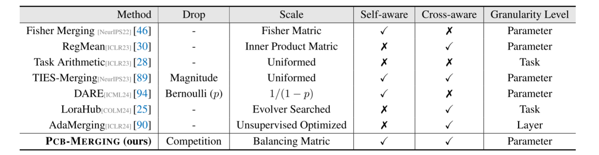
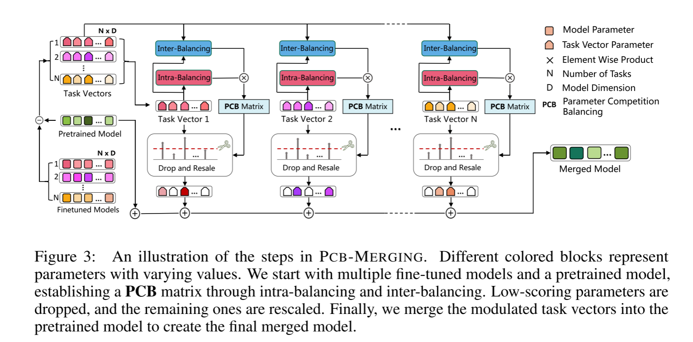

# Parameter Competition Balancing for Model Merging

虽然微调预训练模型已经成为一种常见的做法，但这些模型在其特定领域之外的表现往往不佳。最近开发的模型合并技术能够将多个模型直接集成到单个模型中，每个模型都针对不同的任务进行了微调。这种策略提高了多任务处理能力，而不需要对原始数据集进行再训练。然而，现有的方法在处理任务之间的潜在冲突和复杂相关性方面存在不足，特别是在参数水平调整方面，这对有效平衡各任务之间的参数竞争提出了挑战。本文介绍了一种名为pcb -合并(参数竞争平衡)的创新技术，它是一种轻量级的、无需训练的技术，可以调整每个参数的系数以实现有效的模型合并。pcb合并采用内部平衡来衡量单个任务内参数的重要性，采用内部平衡来评估不同任务间参数的相似性。重要性得分低的参数被丢弃，剩下的参数被重新缩放，形成最终的合并模型。我们在不同的合并场景中评估了我们的方法，包括跨任务、跨领域和跨训练配置，以及域外泛化。实验结果表明，我们的方法在多个模态、领域、模型大小、任务数量、微调形式和大型语言模型上实现了实质性的性能增强，优于现有的模型合并方法。该代码可在https://github.com/duguodong7/pcb-merging公开获取。

## 1简介

预训练模型(ptm)是深度学习的基础，由于其能够从大型数据集中学习广义特征，因此支撑了许多当前技术[99,5]。针对特定任务对ptm进行微调是提高性能的常见做法[71,31]。这种方法很普遍，基于广泛使用的ptm[59,80,58]，产生了数千个微调检查点[85]。但是，针对不同的任务对相同的模型进行微调可能会导致性能变化，从而带来重大挑战[57]。多任务学习[66,59]已被提出作为一种解决方案，但它会产生大量的训练成本，并且需要同时访问所有任务[16]的数据和标签。最近，一些研究人员开发了不需要原始训练数据就可以将多个独立训练的模型合并为单个模型的方法[20,86,27]。这种合并技术不仅符合数据隐私法规[83]，而且通过消除再培训的需要来提高效率。

先前的研究[20,86,27]表明，对多个任务特定模型的权重进行平均，并从相同的预训练初始化进行微调，可以提高不同任务的性能。许多研究[46,30]探索了创建额外的矩阵，匹配模型维度，以调整不同任务的参数系数。其他研究[28,89,90,96,94]关注任务向量[28]，将其定义为微调模型与原始预训练模型的参数值之差。<u>虽然这些基于任务向量的方法已经显示出有希望的结果，但它们通常对每个任务和参数应用统一的系数，这可能会限制它们的有效性</u>。**我们的研究旨在通过解决参数竞争的平衡机制来调整参数级系数，从而释放基于任务向量的方法的全部潜力。**

参数竞争在模型融合中起着至关重要的作用，既存在于同一任务的参数内部，也存在于不同任务的模型之间。首先，在单个模型中，特定于任务的微调参数经常相互竞争，其中一些是关键的，而许多是多余的。**先前的研究[89,94]已经证明，基于任务向量大小删除大量参数可以保持接近原始的性能。**此外，**适当调整重要参数，抑制冗余参数，可以进一步提高微调模型的性能(见图)。**参数也参与竞争(见图)。为一个任务重新缩放任务向量可以提高该特定任务的性能，**但可能会对跨任务能力产生负面影响**。因此，平衡分配给任务向量的系数需要仔细考虑它们对整体性能的影响。

表1:不同模型合并方法的比较。如果合并方法管理单个任务模型内的参数竞争，则认为它是自我意识的;如果它平衡任务模型群内的竞争，则认为它是交叉意识的。详情请参阅App. A。

我们认为，**能够管理任务内部参数竞争的合并方法表现出自我意识，而那些平衡任务之间参数竞争的方法表现出交叉意识。**我们根据这些标准对现有的模型合并方法进行了系统的比较和分析，如表1所示。为了建立一个自我意识和交叉意识的平衡矩阵，我们引入了pcbmerge (parameter Competition balancing for Model merged)，这是一种无需训练和无数据的模型合并方法。具体来说，我们使用内部平衡来衡量任务内参数的重要性，使用内部平衡来评估任务间参数的相似性。然后，低得分参数被删除，剩下的参数被重新缩放。最后，我们将调制的任务向量合并到预训练的模型中，以创建最终的合并模型。

为了从经验上证明pcbmerge 的有效性，我们进行了大量的实验，将其与现有的模型合并方法进行了比较。我们从四个方面展示了我们方法的优越性:(1)跨任务合并:我们使用各种模型(如T5[59]、ViT[12]和Llama2)在一系列NLP和视觉任务中评估了我们的方法[80]。我们还评估了其融合多个PEFT适配器的能力[42,24]。所有的实验都证明了与之前最先进的方法相比有了显著的改进，特别是在t5基础模型上实现了4.3%的性能提升。(2)跨领域合并:我们的方法将多个特定于领域的模型合并到情感分类等任务中[53,30]，证明了其对不同领域数据的有效处理。(3)交叉训练配置:在单一任务上合并来自不同训练环境的多个模型，突出其灵活性和鲁棒性。(4)域外泛化:我们评估了域移位数据集上的多任务和多域融合性能，测试了不同框架的泛化性。

本文有三个重要贡献:(1)重新审视了现有的模型合并方法，强调了参数竞争意识的关键作用;(2)提出了一种新的pcb合并方法，通过平衡参数竞争，有效地调整参数系数;(3)该方法在不需要额外训练的情况下，稳定并提高了模型合并在不同应用场景下的性能。

## 2相关工作

### 2.1模型融合概述

由于数据隐私和资源保护方面的考虑，深度模型融合越来越受到关注，在各个领域都有潜在的应用[39,14]。它通常分为三个主要类别。集成学习[64]结合模型输出来提高预测精度和鲁棒性，但需要并行部署多个模型。另一种方法涉及模式连通性[18]和对齐[1]，旨在使解更接近，以获得更好的平均初始条件。这可以通过链接优化路径[15,98]或解决排列不变性[72,79,40,30]来实现。最近的研究[88,75]侧重于不需要训练的方法来提高模型融合的可用性。第三种方法，加权平均[20,86]，需要具有相同结构的模型。虽然像[81]这样的先进支持合并不同的大型语言模型(大型语言模型)，但它们需要知识蒸馏[23]和复杂的训练。本文采用的是第三种轨道，因为它简单、高效、适用性广。

### 2.2合并具有相同初始化的微调模型

先前的研究发现，当多个模型从相同的预训练初始化进行微调时，平均它们的权重可以提高单个任务[20,86,13,29,92]、不同任务[27]和分布外泛化[3,60]的性能。Fisher merged[46]超越了简单的平均，使用Fisher信息矩阵[17]来识别单个参数的重要性，并在合并时使用它来权衡每个模型中的参数。RegMean[30]通过求解模型中每个单独线性层的局部线性回归问题，提出了合并模型参数的封闭解。然而，Fisher合并和RegMean方法都是耗时且计算量大的方法。

任务算法[28]介绍了任务向量的概念，展示了它们在促进跨任务泛化方面的有效性和轻量级。在此基础上，PEM Composition[96]扩展了任务算法框架以合并LoRA[24]模型，而tiesmerge[89]通过重置冗余参数和解决符号冲突来解决任务冲突。然而，这些方法在所有任务向量上共享一个合并系数，限制了灵活性。相比之下，Lorahub[25]和AdaMerging[90]使用不同的系数来增强适应性，但Lorahub的性能受到限制，因为它只搜索任务级别的系数。AdaMerging还需要复杂的训练和未标记的测试数据集，并且仅适用于分类问题。DARE[94]建议在合并微调大型语言模型时将删除和重新缩放作为预处理步骤。我们的方法主要采用drop来减少干扰和在参数层面进行缩放的策略，同时考虑了自我意识和跨模型意识。

图3:pcb合并步骤的说明。不同颜色的块表示具有不同值的参数。我们从多个微调模型和预训练模型开始，通过内部平衡和内部平衡建立PCB矩阵。低得分的参数被删除，剩下的参数被重新缩放。最后，我们将调制的任务向量合并到预训练的模型中，以创建最终的合并模型。

## 3方法

在3.1节中，我们建立了符号并概述了模型合并的问题。第3.2节将详细介绍所提出的pcb合并方法，该方法旨在平衡参数竞争。此外，在第3.3节中，我们采用进化算法来进一步提高我们方法的性能。

### 3.1前期准备

最初，我们面临一组任务  $\{T_1, \ldots, T_n\}$  和各种预训练模型，如 ViT [12]、T5 [59] 或 llama2 [80]。我们可以选择微调整个模型或采用参数高效微调（PEFT）方法 [42, 24]。在微调过程中，我们将可训练参数表示为  $\theta$ ，初始化为  $\theta_{\text{pre}}$ ，并将微调后的参数表示为  $\theta_{\text{ft}}$ 。模型合并问题涉及如何组合权重集  $\{\theta_1, \ldots, \theta_n\}$  以形成新的权重  $\theta_m$ ，而无需使用每个任务的初始训练数据重新训练，并确保  $\theta_m$  能够同时执行任务  $\{1, \ldots, N\}$ 。

最近的研究 [28] 引入了任务向量的概念，并基于任务向量完成了各种任务算术运算和模型合并。具体来说，对于任务  $T_i$ ，任务向量  $\tau_i \in \mathbb{R}^d$  被定义为通过从预训练权重  $\theta_{\text{pre}}$  中减去微调权重  $\theta_i$  获得的向量，即  $\tau_i = \theta_i - \theta_{\text{pre}}$ 。这使我们能够关注在每个特定任务模型的微调阶段发生的变化。基于任务向量的多任务模型合并方法可以表示为  $\theta_m = \theta_{\text{pre}} + \lambda * \sum_{i=1}^{n} \tau_i$ ，其中系数  $\lambda$  表示合并任务向量  $\tau_m$  的重要性。这一概念简单而有效，显著优于简单的权重平均方案，即  $\theta_m = (1/N) \sum_{i=1}^{n} \theta_i$ 。

### 3.2参数竞争均衡

### 3.2 参数竞争平衡

我们的方法旨在调节每个任务和参数的缩放因子，实现任务内部和任务之间的平衡。具体来说，我们使用参数竞争平衡（PCB）矩阵  $\beta_i \in \mathbb{R}^d$  来调整每个任务模型  $\theta_i \in \mathbb{R}^d$  中参数的尺度，从而得到最终融合的模型，如图3所示。具体的计算过程如下：

1. **任务内平衡（Intra-Balancing）**：最初，我们通过将非线性激活函数（即softmax）应用于任务向量的幅度来实现自感知，强调重要参数，同时在某种程度上抑制冗余参数。随着融合任务数量的增加，参数之间的竞争加剧。因此，任务数量  $N$  被用来调节冗余参数抑制的程度。
   $$
   \beta_{\text{intra},i} = \text{Softmax}(N * \text{Norm}(\tau_i \odot \tau_i)) \quad (1)
   $$
   

2. **任务间平衡（Inter-Balancing）**：接下来，我们实现交叉感知，使任务集合中的参数能够与其他参数交互，解决任务之间的潜在冲突和复杂相关性。为此，我们计算不同任务向量中相同位置参数之间的相似性，允许每个参数根据其他任务的信息更新其得分。计算过程如下：

$$
\beta_{\text{inter},i} = \sum_{j=1}^{n} \text{Softmax}(\text{Norm}(\tau_i \odot \tau_j))  \quad (2)
$$
3. **丢弃和重新缩放（Drop and Rescale）**：随后，我们获得  $\beta_i = \beta_{\text{intra},i} \odot \beta_{\text{inter},i}$ 。接下来，我们基于  $\beta_i$  构建一个掩码  $m_i \in \mathbb{R}^d$  以专注于更重要的参数。具体来说，该掩码  $m_i$  用于从  $\beta_i$  的  $D$  个元素中选择高分元素。我们将掩码比例定义为  $r$ ，其中  $0 < r \leq 1$ 。掩码  $m_i$  可以从以下公式导出：

   
   $$
   m_{i,d} = 
   \begin{cases} 
   1, & \text{如果 } \beta_{i,d} \geq \text{sorted}(\beta_i)[(1 - r) \times D] \\
   0, & \text{否则}
   \end{cases} \quad (3)
   $$
   

​	重要性得分被定义为  $\hat{\beta} = m_i \odot \beta_i$ 。最后，我们使用掩码平衡矩阵的得分来加权每个任务向量中每个参数的重要性。最终合并的任务向量  $\tau_m$  如下：
$$
\tau_m = \sum_{i=1}^{n} (\hat{\beta}_i \odot \tau_i) / \sum_{i=1}^{n} \hat{\beta}_i  \quad (4)
$$
从最终合并的任务向量  $\tau_m$ ，我们可以进一步按比例调整其幅度，并将其与初始参数值整合以产生融合模型参数  $\theta_m$ ，表示为  $\theta_m = \theta_{\text{pre}} + \lambda * \tau_m$ ，其中  $\lambda$  作为缩放超参数。关于方法工作流程的更多细节在附录A和算法1中介绍。

### 3.3 搜索系数

来自文献[28, 90]的研究表明，基于任务向量的模型合并方法对合并系数  $\lambda$  非常敏感。即使选择了适当均匀的  $\lambda$ ，进一步改进融合性能仍需要对每个任务向量进行合并系数的网格搜索。这个过程复杂且繁琐，尤其是在处理大量任务时。

受之前研究[77, 25]的启发，我们采用智能优化算法来搜索混合系数，旨在相比于使用统一系数获得更大的改进。优化过程寻求最佳集合  $\{\lambda_1, \ldots, \lambda_n\}$  以提高验证准确性，最终目标是最大化合并模型的验证准确性。

$$
\theta_m = \theta_{\text{pre}} + \sum_{i=1}^{n} (\hat{\beta}_i \odot \lambda_i \tau_i) / \sum_{i=1}^{n} \hat{\beta}_i \quad (5)
$$

在我们大多数的实验设置中，我们主要使用协方差矩阵自适应进化策略（CMA-ES）[21]。作为一种基于概率的群体优化算法，CMA-ES动态调整由协方差矩阵定义的搜索分布。它在每次迭代中系统地更新该分布的均值和协方差，以学习和利用搜索空间的潜在结构，提高优化效率。

## 4实验设置

**评估设置。**我们预计合并模型将为开发人员提供两个重要的优势。首先，通过整合来自各个模型的见解θ1..N在不同的环境中训练(例如任务、域，或者单个任务中的各种训练配置)，我们期望得到的合并模型θm能够跨任务、域或单个任务演示竞争性的测试性能。其次，该合并模型具有增强的跨域泛化能力。有关计算资源及微调程序的详情，请参阅应用程式F.1及F.2。

**基线方法。**我们的基线主要分为两类:非模型合并，其中涉及精细调整的个体模型和多任务学习，以及各种高级模型合并方法，如简单平均[86]、Fisher合并[46]、RegMean[30]、任务算法[28]、ties - merge[89]和AdaMerging[90]。关于这些基线的详细信息可以在App. e中找到。**值得注意的是，任务算法，tie - merge, AdaMerging和我们提出的pcb合并方法都是基于任务向量的。**此外，当合并跨不同任务的大型语言模型时，我们将DARE[94]作为预处理呈现结果。由于AdaMerging需要未标记的测试数据集，并且仅适用于分类问题，因此我们仅在合并微调后的ViT模型进行图像分类时与AdaMerging进行比较，如App. C.2所示。

**验证集。**大多数模型合并方法都需要访问验证集，用于计算Fisher矩阵或调优超参数。虽然ReMean可以使用未标记的训练数据为每个任务导出内积矩阵，但需要额外的验证来确定非对角乘数α的最优值。Fisher合并和ReMean都非常耗时，并且需要大量的计算资源。相比之下，基于任务向量的方法更轻量级，实现起来不需要训练，甚至可以在没有验证集的情况下使用。因此，我们进行了额外的实验来比较没有验证集的基于任务向量的方法。

**超参数。**当没有执行额外的验证时，我们对所有基于任务向量的方法使用默认值λ = 1。对于需要掩蔽比的ties - merge和pcb - merge，我们将掩蔽比r = 0.2设置为所有实验的默认值，除了大型语言模型实验中r = 0.1。当允许验证时，我们将RegMean中的非对角线乘数α设置为0.9，除了t5基础模型，它被设置为0.1。对于任务算法，我们在λ范围从0.2到1.5上进行搜索，步长为0.1。对于ties - merge和pcb - merge，我们在{0.05,0.1,0.2}和λ范围从0.8到2.5中搜索，步长为0.1。在采用进化策略对每个任务进行系数搜索的情况下，我们在0.8到2.5的范围内进行连续变量搜索。更多的超参数详细信息请参见App. F.3和表17。