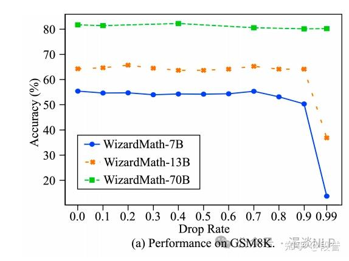
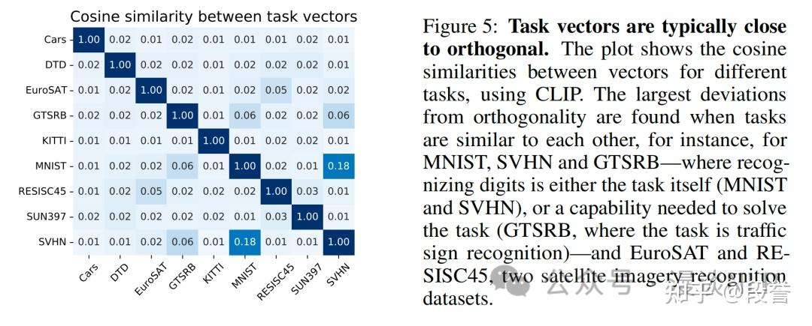
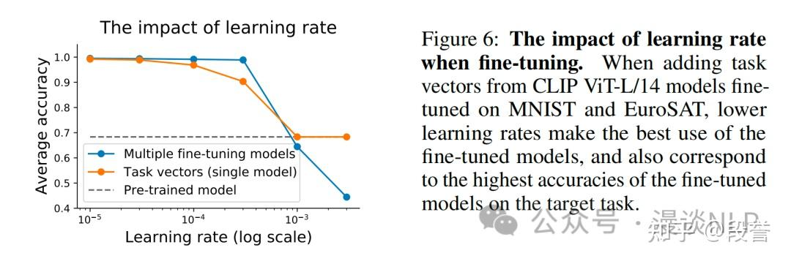
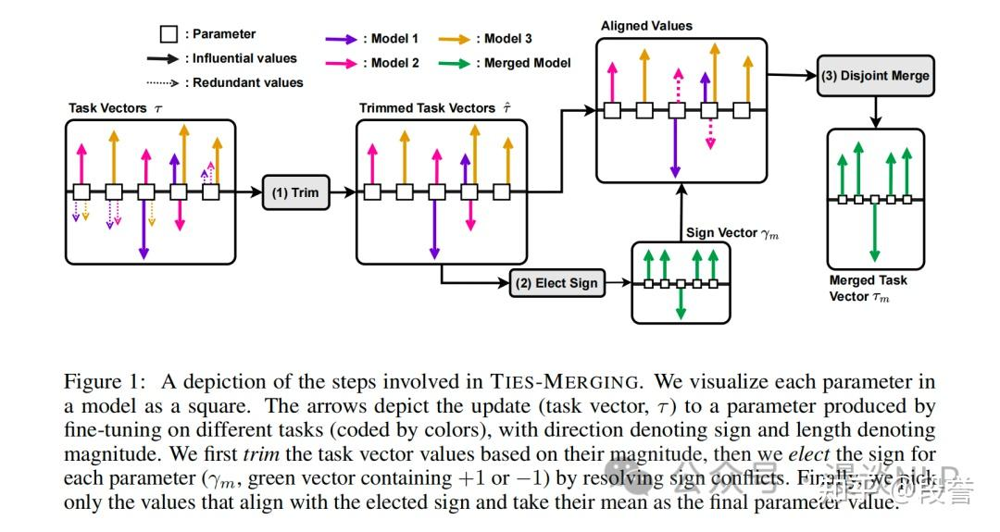
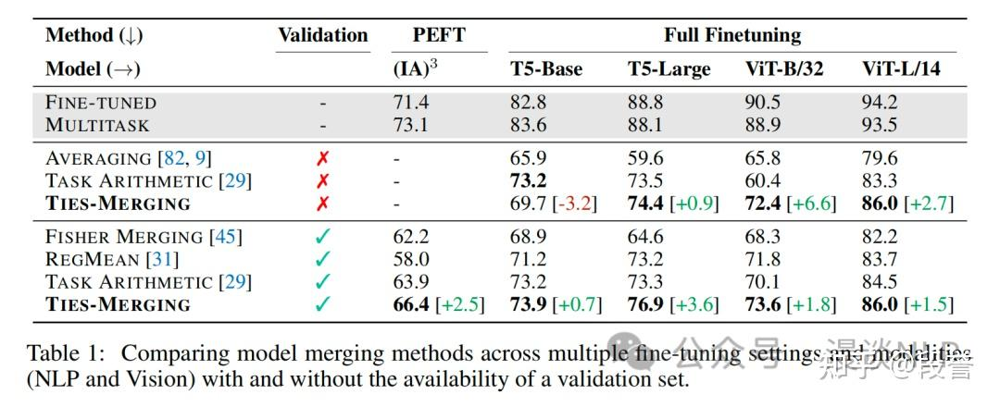
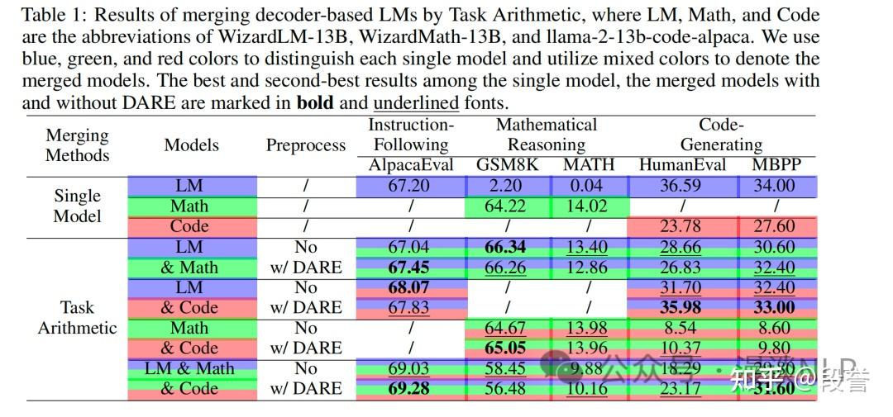
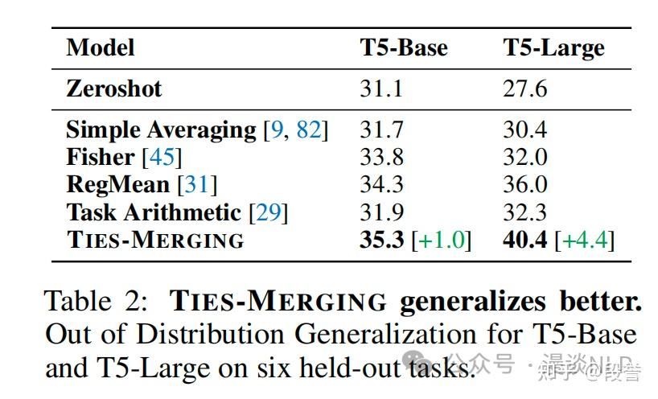

# 模型融合(Model Merging)：合理性、常见技术及其特性

https://zhuanlan.zhihu.com/p/677088727

[模型融合](https://zhida.zhihu.com/search?content_id=238594256&content_type=Article&match_order=1&q=模型融合&zhida_source=entity)（model merging）指：**将多个SFT模型在参数粒度上进行合并，得到一个融合模型**。

Model Merging能取得近似于`multi-task learning`的效果，即融合模型能够**同时“学会”**多种任务，也**可能**取得更好的in-domain performance、更好的[out-of-distribution generalization](https://zhida.zhihu.com/search?content_id=238594256&content_type=Article&match_order=1&q=out-of-distribution+generalization&zhida_source=entity)。

Model Merging在LLM时代也是合时宜的技术，因为它：

1. **无需训练**，节省了大量的机器成本、时间成本；
2. **只需模型参数，而无需训练数据**，规避了数据隐私问题。

## Delta Parameters的冗余性

首先从SFT过程的冗余性谈起。

先引入一个概念，叫 **delta parameters**，其值为  $\theta_{SFT} - \theta_{Base}$ ，直观理解就是SFT前后的参数变化值。

**Language Models are Super Mario: Absorbing Abilities from Homologous Models as a Free Lunch[1]** 提出一种对模型参数进行稀疏化的方法 -- **DARE**，其方法类似dropout：随机drop一定比例的delta parameters（置为0），对剩余的parameters进行rescale，即除以 $1 - \text{drop\_rate}$ ，以保证output的期望一致。

实验发现**drop rate在90%-99%时，效果与原模型相差无几**；而且模型**越大**，可以丢弃的`delta parameters`**越多**。

因为`delta parameters`是高度冗余的，因此可以在合并模型前，先丢掉大量的冗余参数，这样合并后的模型更不容易出现interference（干扰）现象，**合并效果也就有了保障**。形象化理解可参见下图。

### **Task Vector的正交性**

此处的`task vector`等同于上节提到的`delta parameters`，源自**Editing models with task arithmetic[2]**的提法，因为这些参数是在某个task上FT后得到的，带有这个task的信息，因此称之为`task vector`。

`Task-Arithmetic`论文对多个`task vector`进行了相似度计算，发现它们之间的相似度极低，**除了少数彼此关联的任务外，其余的`task vector`几乎都是正交的。**

由于`task vector`之间的正交性，即使直接对参数进行平均，效果也还不错。

### **前提**

就笔者阅读的论文而言，参数融合有一个必要前提：

**用于融合的SFT模型必须源自同一个Base模型**，即其模型结构一致、SFT的initilization一致。

其背后的原因在于：**用于合并的`delta parameters/task vector`的数值不可过大，否则会明显影响合并效果。**

`DARE`论文中有一个实验：当用于计算`delta parameters`的SFT模型（WizardCoder-Python-13B ）并不源自Base模型（Llama-2-13b）时，其`delta parameters`值**较大**（> 0.005），此时**仅drop 10% 的参数也会导致效果骤降。**

`Task-Arithmetic`论文研究了 在FT时采取不同量级的learning rate对合并效果的影响。发现当learning rate较大时，合并效果明显下降。

这与`DARE`论文的实验异曲同工，均说明**当`delta parameters/task vector`的数值较大时，合并效果是有影响的。**

至于数值多大算大？`DARE`给出的数字是**0.005**，**当大多数的`delta parameter`小于此值时可进行合并，否则不建议合并**。

## 模型融合的常见技术

### 任务定义

**输入**
-  $n$  个SFT Model  $\theta_{SFT1}, \theta_{SFT2} \ldots \theta_{SFTn}$ 
- 1个Base Model  $\theta_{Base}$ 
- 通过相减得到每个SFT Model的delta parameter  $\delta_{SFT1}, \delta_{SFT2} \ldots \delta_{SFTn}$ 

**输出**
- 1个merged Model  $\theta_{Merge}$ 

### Simple Averaging

$$
\theta_{Merge} = \frac{1}{n} \sum_{i=1}^{n} \theta_{SFTi} = \theta_{Base} + \left(\frac{1}{n} \sum_{i=1}^{n} \delta_{SFTi}\right)
$$

由于前文提到的冗余性和正交性特征，这一方法在少量模型融合的场景效果也还尚可，通常作为baseline进行比较。

### Fisher Averaging

简单来说，Fisher Averaging就是在合并时先对每个weight进行加权。其公式如下：

$$
\theta_{Merge} = \frac{\sum_{i=1}^{n} \hat{F}_i \theta_{SFTi}}{\sum_{i=1}^{n} \hat{F}_i}
$$

其中， $\hat{F}_i$  为Fisher Information Matrix，用以衡量任务i中每个参数的重要性。其公式如下：

$$
\hat{F}_t = \mathbb{E}_{x \sim D_t} \mathbb{E}_{y \sim p_{\theta_t}(y|x)} \nabla_{\theta_t} (\log p_{\theta_t} (y|x_t))^2
$$

### Task Arithmetic*

Task Arithmetic* 是对  $\delta_{SFT}$  进行sum后，乘上scale term  $\lambda$ ，与Base Model合并后得到融合模型。其公式如下：

$$
\theta_{Merge} = \theta_{Base} + (\lambda * \sum_{i=1}^{n} \delta_{SFTi})
$$

 $\lambda$  作为scale term，从验证集中挑选得来；论文实验发现，0.3 - 0.5的值一般比较好，没有validation（或者懒）的时候，直接设置为0.3 - 0.5即可。

### RegMean*

RegMean方法[4]只针对linear layer的融合，其思想是：合并后的模型输出要与合并前的模型输出尽可能接近。其目标函数如下：

$$
\min_{W} \|W^T X_1 - W_1^T X_1\|^2 + \|W^T X_2 - W_2^T X_2\|^2.
$$

在linear layer的设定下，该问题直接有close-form solution：

$$
W_M = \left(\sum_{i \in \mathcal{K}} X_i^T X_i\right)^{-1} \sum_{i \in \mathcal{K}} (X_i^T X_i W_i).
$$

原论文应用RegMean方法的策略如下：
1. 对linear layer使用RegMean方法进行参数融合；
2. 对非linear layer，使用simple averaging方法进行参数融合。

### TIES-Merging*

TIES[5]的核心思想是**尽量减少干扰（interference）**，从而取得更好的模型融合效果。

作者提出有两类干扰：

1. **冗余参数带来的干扰**，这类干扰就像noise；
2. **delta parameter的不同方向带来的干扰**，例如任务1要往东走、任务2要往西走，两者相加带来抵消，使得两个任务都做不好。

`TIES`就是为了解决这两类干扰。其框架图如下：

其核心步骤有三：

1. **Trim**。对每个待合并模型，仅保留magnitude最大的top 20%  $\delta_{SFT}$  参数，其余参数置为0；
2. **Elect**。得到每个参数的merged sign（即方向，取值+1、-1、0），merge策略类似于max-pooling -- 计算每个方向的magnitude和，选择magnitude最大的方向作为merged sign，也可以认为这是一种“投票”机制，少数任务服从多数任务；
3. **Disjoint Merge**。对每个  $\delta_{SFT}$  参数，仅保留符合merged sign的参数，然后进行直接平均，但计算平均时并不包括值为0的参数。

经过以上步骤，得到  $\delta_{Merge-TIES}$ ，然后像Task Arithmetic一样加入scale term，与Base Model参数合并，得到Merged Model：

$$
\theta_{Merge} = \theta_{Base} + \lambda * \delta_{Merge-TIES}
$$

值得一提的是，作者实验发现如果使用oracle merged sign，TIES方法的效果可以直逼Multi Task Learning方法，说明Elect阶段还有很大的提升空间。

### **DARE**

`DARE`方法前文已有介绍，其本身并不直接merge，而是提供了一种对`delta parameters`进行稀疏化的工具，因此可以作为**预处理方法，被应用到任何一个merge方法之中**。

## **模型融合的技术特性**

In-Domain Performance 融合模型既然对标Multi-Task Learning，其第一个关注点在于： 在同任务上，融合后的单一模型，和融合前的各个模型相比，表现如何？ 纵观论文，可以发现以下特性：

 特性1：融合模型的效果，通常比融合前的SFT模型差，更比Multi-Task Learning模型差；但随技术发展，其差距在减小，甚至偶有提升

以TIES论文结果为例，所有融合模型的效果距离第一列的FINE-TUNED（即用于融合的SFT模型）和MULTITASK（即用多个dataset，进行multi-task learning后得到的模型）仍有不小的差距。

然而DARE论文的实验表明，通过DARE + Task-Arithmetic，有可能得到效果更好的融合模型。例如融合WizardLM-13B和WizardMath-13B之后，其instruction following和math reasoning（GSM8K）能力都比单独的模型要更好。 不过需要指出的是，这一效果提升似乎并无规律可言，并且融合的模型也不多，最多才3个而已，不过这还是给模型融合这一方向注入了信心 -- 融合模型的效果有可能比单模型更好。 

特性2：融合的模型越多，效果的损失也越大

融合的模型多了，各参数间互相干扰的情况愈发严重，因此带来效果损失也是情理之中的事情。从TIES论文的结果来看，当merge模型达到7个时，表现最好的TIES也只能取得原模型效果的85%；不过当merge模型只有2个时，TIES和Task-Arithmetic都能几乎保持原模型的效果。

### Out-Of-Distribution Generalization

Multi-Task Learning的另一个重要特性是OOD Generalization，这也是融合模型的第二个重要关注点。

 所谓OOD Generalization，指的是模型在同任务、但没见过的数据分布上的泛化性。

从`TIES`论文的实验来看，融合模型的OOD Generalization能力还不错，说明**融合模型在一定程度上学到了鲁棒的task解决能力**。

### **其他使用场景**

模型融合还有一些使用场景：

1. 在一次训练当中，融合多个checkpoint，以提升模型的训练效果；
2. 将融合模型作为进一步Fine-Tuning的起点，以取得更好的FT效果；
3. `Task Vector`不仅可以用于加（即模型融合），也可以用于减（即让模型遗忘某些能力）。

## **总结**

模型融合在参数粒度上对模型进行合并，乍一看非常*不科学*，但其背后有SFT参数更新的**冗余性**、Task Vector的**正交性**做支撑，具备一定的合理性，即使在目前还不算复杂的融合方法下，也已经能够取得不错的效果。

同时，本文介绍了5种Merge算法、1种预处理算法，并对模型融合的技术特性进行了归纳，希望帮助读者对模型融合产生一个比较全面、深入的认识。

笔者认为模型融合是一个很好的分析工具，它可以**帮助我们理解LLM是如何“解锁”某一任务的**，这对于理解并优化LLM的Task Adapation能力是有意义的。