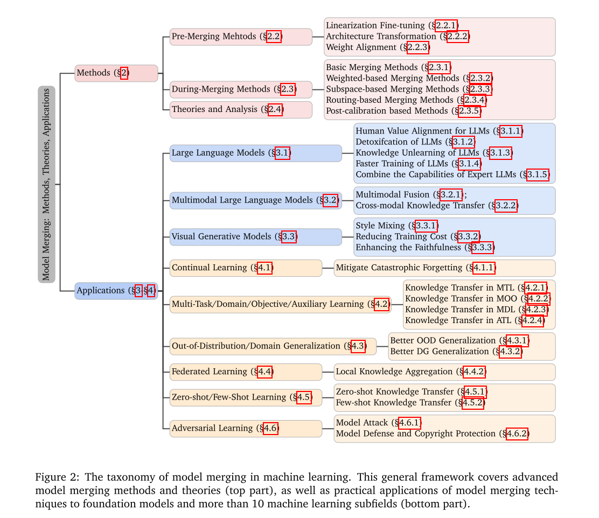
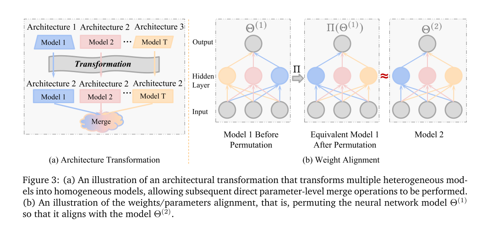
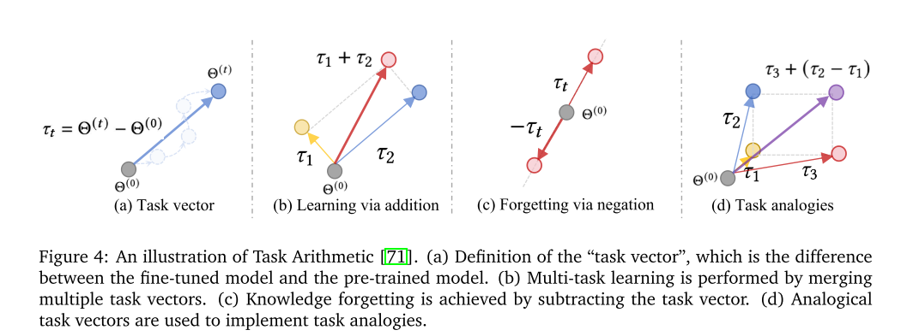
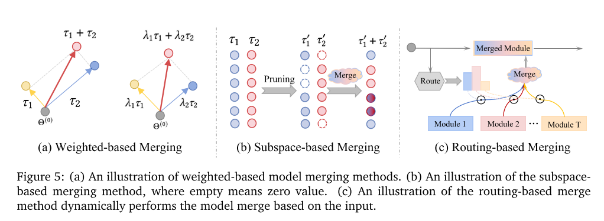

# Model Merging in LLMs, MLLMs, and Beyond Methods, Theories, Applications and Opportunities

https://github.com/EnnengYang/Awesome-Model-Merging-Methods-Theories-Applications

模型合并最相关的概念是集成学习，因为它们都促进了知识的融合和转移。如图1所示，它们之间的主要区别在于，集成学习必须保存所有个体模型，并在推理阶段融合多个模型的预测（或输出），而模型合并直接在参数级别进行合并，并且在推理阶段只有一个最终模型。这使得模型合并具有更吸引人的特性。

**现有的模型合并方法是如何分类的？**

我们首先在图2（上半部分）中提出了一种新的分类法，将现有的模型合并方法分为两个阶段（§2）：合并前和合并期间。

（i） 预合并方法旨在为合并创造更好的条件。它进一步分为使用线性化微调来实现权重空间和输入空间的解耦，执行架构转换将异质模型转换为同质模型，以及对齐权重以将它们放置在同一盆地中。

（ii）在合并过程中，方法侧重于设计复杂的技术，将多个模型合并为一个。这些方法解决了合并模型时的任务冲突和干扰问题。它们可以进一步分为执行最简单参数合并策略的基本合并方法；

加权合并方法，根据特定规则计算的重要性合并多个模型；

子空间合并方法，将多个模型投影到稀疏子空间中进行合并；

基于路由的方法，在推断过程中根据输入样本动态合并模型；

以及校正合并模型的基于后校准的方法。除了这些方法，我们还讨论了模型合并的理论或实证分析

**其次，哪些应用程序可以从模型合并中受益？**

我们详细讨论了基础模型中的模型合并的各种用例（第3节）和十个机器学习的子场（第4节）。如图2（下部）所示，模型合并可以应用于各种基础模型，包括大型语言模型，多模式大型语言模型和视觉生成模型。例如，大型语言模型合并的模型可以帮助减轻不实现和毒性输出，完成知识学习以及加快培训的速度。此外，在不同的机器学习子场中还会出现模型合并，例如持续学习，多任务/多域学习，很少的学习和其他子场，以解决各种挑战。例如，在持续的学习中，模型合并可以减轻对旧任务的灾难性忘记。在多任务学习，多目标学习和多领域学习中，它有助于知识转移。此外，在对抗性学习中，可以将模型合并用于攻击和防御策略。

**第三，模型合并还存在哪些挑战和未来的研究机会?**

尽管在合并方法和它们的成熟应用方面取得了进步，但在该领域仍有许多开放的挑战和未来的研究方向(§5)。例如，随着任务数量的增加，现有方法与独立专家模型之间的性能差距变得越来越大。此外，**现有的模型合并方法在合并过程中会产生巨大的内存成本，并且缺乏信任保证和深入的理论分析**。解决这些差距需要研究人员的大量努力，以进一步推动这一领域的蓬勃发展。

## 2 高级模型合并方法

在本节中，我们首先介绍2.1节中模型合并的符号和问题定义。然后，我们详细介绍了高级模型合并方法(表1总结了每种方法的主要目的)。现有的模型合并技术大致可以分为以下两类:

(i)§2.2中的Before merged Methods:它为模型合并提供了更好的先验知识。

(ii) 2.3节中的merge Methods:通过各种策略解决任务冲突/干扰，然后进行参数merge操作。

最后，我们在§2.4中总结了模型合并有效性的理论或解释。

#### 表 1：现有模型合并方法的总结

| 方法                     | 方法的目标或主要思想                                 |
| ------------------------ | ---------------------------------------------------- |
| 线性化微调（§2.2.1）     | 在输入空间和权重空间中解开不同的模型                 |
| 架构转换（§2.2.2）       | 将多个异构模型转换为同构模型                         |
| 权重对齐（§2.2.3）       | 将多个模型重新排列到同一基底                         |
| 基本合并方法（§2.3.1）   | 简单的加权平均或基于任务算术的合并                   |
| 加权合并方法（§2.3.2）   | 基于模型/参数重要性权重合并多个模型                  |
| 子空间合并方法（§2.3.3） | 通过将多个模型投影到稀疏子空间来合并它们             |
| 路由合并方法（§2.3.4）   | 在推理阶段基于输入动态合并多个模型                   |
| 后校准合并方法（§2.3.5） | 校准合并后的模型使其更接近各个单独模型，减少知识损失 |

### 2.1  记号与模型合并问题定义

假设有 $T$ 个模型 $(\Phi_{\Theta(1)}, \dots, \Phi_{\Theta(T)})$ 具有相同的架构，这些模型需要被合并，并且它们分别从零开始训练或基于同一个预训练模型 $\Phi_{\Theta(0)}$ 进行微调。第 $t$ 个模型 $\Phi_{\Theta(t)}$ 的参数（或权重）表示为 $\Theta^{(t)} = \{\Theta_l^{(t)}\}_{l=1}^{L}$，其中 $l$ 表示模型的第 $l$ 层，$L$ 为总层数。

在本综述中，我们关注**逐参数（parameter-wise）合并**。换句话说，模型合并的目标是合并参数 $\{\Theta^{(1)}, \dots, \Theta^{(T)}\}$，最终得到新的参数 $\Theta^{(\text{merge})} = \text{merge}(\Theta^{(1)}, \dots, \Theta^{(T)})$。一种直接的模型合并方法是加权平均 [164, 190]，定义为：

$
\Theta^{(\text{merge})} = \frac{1}{T} \sum_{t=1}^{T} \Theta^{(t)}
$

然而，这种方法的性能往往较差或不可行，原因可能包括：（i）缺乏适合的合并条件，例如多个模型可能不在相同的收敛盆地，或具有不一致的架构；（ii）多个模型之间存在冲突和干扰。我们将在§2.2和§2.3中分别说明高级方法如何解决这些问题。

### 2.2 预合并方法 mark

为了为模型合并提供更好的前提条件，一类工作侧重于独立模型的微调步骤，例如微调线性化模型而不是非线性模型（在 §2.2.1 中）。此外，当需要合并的多个模型架构不一致时，它们必须预先转换为相同的架构（在 §2.2.2 中）。最后，另一类工作尝试在合并之前对齐权重/参数（在 §2.2.3 中）。

### 2.2.1 线性化微调

Ortiz-Jimenez 等人 [136] 揭示了有效模型合并的一个必要条件是“权重解耦”。这意味着权重空间中的不同方向对应于输入空间中不相交区域的功能变化。例如，如果模型 1 在权重空间对应于输入空间中  $D_1$  的函数变化，而模型 2 在权重空间对应于输入空间中  $D_2$  的函数变化，那么合并后的模型在功能变化方面不会相互干扰。换句话说，满足这种权重解耦属性的两个模型可以在一个模型中共存，而不影响各自的性能，这是一个非常有吸引力的属性。

为了实现权重解耦，**Ortiz-Jimenez 等人 [136] 提出了在微调阶段沿着预训练模型的切空间 [74] 对线性化模型进行微调，**而不是在非线性模型的原始空间中。然而，使用所有参数进行线性化微调比非线性微调更昂贵。为了加速这一过程，一些工作建议只对部分层进行线性化。例如，Tang 等人 [180] 提出了部分线性化适配器模块，**然后合并适配器。Jin 等人 [85] 建议仅对整个模型的注意力模块中的线性层进行线性微调。**此外，TAFT [118] 为 Transformer [191] 架构开发了一种有效的线性化方法，该方法直接为 Transformer 网络导出封闭形式的线性化解决方案。**总之，在切空间中进行微调更容易解耦输入空间和权重空间，从而减少后续模型合并中的干扰。**

### 2.2.2 架构转换

在某些情况下，需要合并的模型可能具有不同的架构，无法直接合并。**为了解决这个问题，一些研究 [10, 134, 194] 提出在合并之前执行架构转换，即将具有不同架构的多个模型转换为同一架构**，如图 3(a) 所示。例如，GAN Cocktail [10] 试图合并具有不同架构的多个 GAN 模型  $\{\Theta^{(1)}, \ldots, \Theta^{(T)}\}$ 。它将所有 GAN 模型  $\Theta^{(t)}$ （ $t \in \{1, 2, \ldots, T\} \& t \neq k$ ）转换为指定的目标模型  $\Theta^{(k)}$ ，即， **$\Theta^{(k)}$  用作初始化以学习  $\Theta^{(t)}$  的输出，同时添加隐式正则化以确保  $\Theta^{(k)}$  不会忘记任务  $k$  的知识**。因此，转换后的 GAN 模型具有相同的结构和共享知识，便于进一步模型合并。同样，FuseChat [194] 提出合并具有不同架构和规模的聊天 LLM（例如，NH2-Mixtral-8x7B [83]，NH2-Solar-10.7B [93]，OpenChat-3.5-7B [195] 在他们的实际应用中）。具体来说，FuseChat 首先使用知识蒸馏将所有架构转换为与 OpenChat-3.5-7B 匹配，然后执行模型合并操作。**与上述基于蒸馏的方法不同，CLAFusion [134] 向较小的模型添加层/块（权重设置为单位矩阵）以使其架构与较大的模型对齐。**总之，**合并具有不同架构的模型需要首先将所有模型转换为通用架构以便稍后合并。**

图3:(a)将多个异构模型转换为同构模型的架构转换的说明，允许执行后续的直接参数级合并操作。(b)权重/参数对齐的说明，即对神经网络模型Θ(1)进行排列，使其与模型Θ(2)对齐。

### 2.2.3 权重对齐

**深度神经网络的线性模式连通性（LMC）特性表明，在深度神经网络的多个局部最小值之间存在一条路径，沿着这条路径损失几乎保持不变[41, 42, 43, 51, 183]。**许多研究[42, 47, 131]表明，两个独立模型，从同一个预训练模型开始，并用不同的超参数配置进行微调，通常满足LMC。此外，Adilova等人[3]和Zhou等人[241]将LMC的研究扩展到层级。**LMC特性意味着在权重空间中多个局部最小值可能等价，同一模型的不同权重配置可能表示相同的功能。**受此启发，许多工作提出在合并/插值两个独立模型时，**对一个模型的权重进行排列（即， $\Theta^{(1)} \rightarrow \Pi(\Theta^{(1)})$ ）以与另一个模型 $\Theta^{(2)}$ 对齐，如图3(b)所示。** $\Pi(\cdot)$ 表示一个排列函数，研究人员一直致力于研究有效和高效的排列策略以实现模型对齐。

OTFusion [167] 和 Imfeld 等人 [72] 采用最优传输来跨模型软对齐神经元。NeuronAlignment [183] 引入了一种廉价的启发式算法来近似最优神经元对齐。CCAMerge [64] 通过最大化神经元线性组合之间的相关性来进行排列。值得注意的是，Git re-basin [5] 提出了三种方法——激活匹配、权重匹配和直通估计——来对齐（或排列）在不同任务上训练的模型的权重。基于 Git re-basin，Pena 等人 [140] 进一步结合了基于 Sinkhorn 的投影来改进这些对齐方法。此外，MuDSC [215] 提出了同时在权重和激活空间中执行模型对齐。与启发式对齐策略不同，Deep-Align [133] 提出了一种基于学习的权重对齐方法，采用了一种新颖的可学习架构，该架构将两组权重作为输入，并输出一个排列矩阵用于对齐。

尽管这些对齐算法有了显著改进，Jordan 等人 [88] 认**为这些方法的成功取决于模型中使用归一化层**（例如，BatchNorm、LayerNorm 等）；如果没有这些，匹配算法的性能将大大降低。**作者称这个问题为“方差崩溃”问题**，并提出了 REPAIR 方法来解决它。此外，Crisostomi 等人 [29] 指出，先前的成对排列不能保证循环一致性，使得对齐变得脆弱。他们进一步提出在每一步同时全局优化所有层的排列。总体而言，与直接合并未对齐的模型相比，对齐的模型在合并过程中经历的干扰或冲突要少得多。

### 2.3 合并中的方法

在本节中，我们详细讨论了如何合并一组训练良好的模型。现有的方法大致可以分为五类：基本合并方法（§2.3.1）、基于权重的合并方法（§2.3.2）、基于子空间的合并方法（§2.3.3）、基于路由的合并方法（§2.3.4）和基于后校准的方法（§2.3.5）。

#### 2.3.1 基本合并方法

模型合并最直接的方法之一是直接对多个模型的参数进行加权平均[164, 190]，即， $\Theta^{(merge)} = \sum_{t=1}^{T} \frac{1}{T} \Theta^{(t)}$ 。然而，简单权重平均的性能通常不尽人意。最近，任务算术[71]引入了“任务向量”的概念（如图4(a)所示），它表示在任务 $t$ 上微调的模型参数 $\Theta^{(t)}$ 减去预训练的模型参数 $\Theta^{(0)}$ ，即， $\tau_t = \Theta^{(t)} - \Theta^{(0)}$ 。换句话说，任务向量被认为可以有意义地引导神经网络的行为。例如，通过添加任务向量可以实现多任务学习（MTL），通过减去任务向量可以实现遗忘，使用类似的任务向量可以执行任务类比。具体来说，当我们希望预训练模型执行MTL时，我们可以向预训练模型添加多个任务向量 $\{\tau_1, \ldots, \tau_T\}$ ，即， $\Theta^{(merge)} = \Theta^{(0)} + \lambda \cdot \sum_{t=1}^{T} \tau_t$ 在图4(b)中，其中 $\lambda$ 是一个超参数。相反，当我们希望预训练模型忘记一个函数 $t$ 时，我们可以从预训练模型中减去相应的任务向量，如图4(c)所示，即， $\Theta^{(merge)} = \Theta^{(0)} - \tau_t$ 。如图4(d)所示，我们还可以通过任务向量类比实现任务类比，从而实现新任务的零次学习。同样，PEMs[234]通过将任务算术[71]扩展到参数高效的微调设置中，将具有不同能力的适配器结合起来。然而，基本合并方法的性能大多数时候并不令人满意，特别是当任务相互干扰时。

图4:任务算法的图解[71]。(a)“任务向量”的定义，即微调模型与预训练模型之间的差异。(b)通过合并多个任务向量进行多任务学习。(c)通过减去任务向量来实现知识遗忘。(d)类比任务向量用于执行任务类比。

#### 2.3.2 基于权重的合并方法

众所周知，不同的模型（或任务向量）代表不同的功能，直观上，不同的功能具有不同程度的重要性。因此，先进的基于权重的模型合并方法设计了各种巧妙的规则来确定合并系数，如图5(a)所示。例如，当合并两个模型 $\Theta^{(1)}$ 和 $\Theta^{(2)}$ （或任务向量 $\tau_1$ 和 $\tau_2$ ）时，加权合并方法的目标是找到最优系数 $\lambda_1^*$ 和 $\lambda_2^*$ ，以便合并后的模型 $\Theta^{(merge)} = \lambda_1^* \Theta^{(1)} + \lambda_2^* \Theta^{(2)}$ （或 $\Theta^{(merge)} = \Theta^{(0)} + \lambda_1^* \tau_1 + \lambda_2^* \tau_2$ ）能够尽可能多地保留独立模型的能力。然而，当模型数量很大时，由于涉及的搜索成本昂贵，使用暴力网格搜索来找到最优合并系数是不切实际的。

图5:(a)基于加权的模型合并方法的说明。(b)基于子空间的合并方法的说明，其中空表示零值。(c)基于路由的合并方法的示例动态地执行基于输入的模型合并。

**为了更有效地确定合并系数，Evolutionary-model-merge[6]和Checkpoint Merging[113]分别使用进化算法和贝叶斯优化高效搜索合并系数。AdaMerging[220]使用梯度下降优化通过最小化未标记测试数据中的熵作为替代损失来学习合并系数。**MetaGPT[240]将模型合并问题视为多任务学习（MTL）形式，目标是最小化合并模型和独立模型的平均损失。它利用**模型的局部线性化和任务向量的正交性**来推导出每个模型 $\tau_t$ 的最优合并系数 $\lambda_t^*$ ，如下所示： $\lambda_t^* = \frac{\|\tau_t\|^2}{\sum_{k=1}^{T} \|\tau_k\|^2}$ 。SLERP[53]对两个模型的参数执行球面插值。插值系数 $\tau_1$ 和 $\tau_2$ 由下式给出： $\lambda_1^* = \frac{\sin((1-\lambda) \cdot \rho)}{\sin(\rho)}$ 和 $\lambda_2^* = \frac{\sin(\lambda \cdot \rho)}{\sin(\rho)}$ ，其中 $\rho = \arccos \frac{\tau_1 \cdot \tau_2}{\|\tau_1\| \|\tau_2\|}$ 表示两个任务向量之间的角度， $\lambda$ 表示初始设置的合并系数。

上述复杂的加权方法在模型（或任务）级别上操作。众所周知，深度神经网络模型中的每层甚至每个神经元都扮演着显著不同的角色，一些研究已经开发出更细粒度的加权合并策略。例如，**Layer-wise AdaMerging[220]和aTLAS[231]自适应地为每层或模块学习不同的合并系数集**。

RegMean[86]表明，对于模型合并中的线性层，**存在依赖于训练集提供的数据统计的闭式解，而非线性层可以简单地执行权重平均。**其他工作利用**费舍尔信息矩阵[44]来评估合并时参数的重要性**[80, 126]。**Fisher-Merging[126]基于每个独立模型中参数的重要性执行模型合并**，即， $\Theta^{(merge)} = \sum_{t=1}^{T} F^{(t)} \Theta^{(t)} / \sum_{t=1}^{T} F^{(t)}$ ，**其中 $F^{(t)}$ 是关于任务 $t$ 的费舍尔信息矩阵的对角线**。Fisher-nodes-merging[186]也基于费舍尔信息矩阵结合了一组Transformer[191]模型。MaTS[175]为**Fisher合并开发了一种块对角线近似**。Daheim等人[31]将**加权平均的不准确性与梯度不匹配联系起来**，并进一步提出了一种基于不确定性的算法来减少匹配误差，最终**基于二阶Hessian估计合并模型**。

#### 2.3.3 基于子空间的合并方法 mark

**另一类高级方法通过将模型转换为稀疏子空间进行合并**，从而减轻任务间的干扰。神经网络的过度参数化特性以及模型剪枝的成功[24,59]表明，从模型中移除大部分参数几乎不会影响其准确性[216]。这一见解为模型合并开辟了新的机会，允许我们从单个模型中移除不重要的神经元，并在参数子空间内合并多个稀疏模型[33,60]，如图5(b)所示。

**TIES-Merging[216] 提出根据参数大小修剪每个单独的模型，只保留幅度最高的前20%的参数。**它进一步建议消除参数符号冲突以减少干扰，并最终使用任务算术[71]合并稀疏模型。同样，Drop And REscale (DARE)[226] 也通过参数幅度进行稀疏化，并强调了在稀疏模型上进一步执行重新缩放的重要性。除了<u>移除权重最小的尾部参数外</u>，Model Breadcrumbs[32] <u>强调了移除具有最大权重的参数（异常值）的重要性</u>，以进一步减少模型合并中的噪声并增强对超参数的泛化。TALL-masks[200] 根据与独立模型相关的<u>预定义阈值为每个任务创建一个特定的掩码矩阵</u>。此外，Model Tailor[243] 根据微调参数对损失变化的敏感性以及与预训练参数相比变化的重要性**来屏蔽不重要的参数**。APL[96] 提出使用因果干预来估计参数重要性。与通过模型合并获得单一模型的标准实践不同，EMR-Merging[68] 提出在多个任务之间维护<u>一个共享模型以及一个稀疏的任务特定模型</u>。在这种方法中，共享模型在每个索引处的值是所有模型中最大的参数值。与上述启发式方法的掩码构建规则不同，Concrete[176] 将掩码构建和模型合并框架为一个可学习的双层优化问题。**外层优化掩码矩阵，而内层基于掩码矩阵合并模型，并使用未标记的测试样本进行优化。**

#### 2.3.4 基于路由的合并方法 mark

在§2.3.1、§2.3.2和§2.3.3中讨论的基本、基于权重或基于子空间的合并方法是静态合并方法。这意味着合并后的模型对所有样本或任务都保持不变。鉴于输入样本/任务之间存在差异，模型在处理不同样本/任务时的能力可能会有所不同。如图5(c)所示，**一些工作提议在推理阶段基于样本/任务动态合并模型（或层的子集）**[91, 105, 121, 130, 179]。

对于给定的输入，SMEAR[130]首先通过使用路由器输入到专家模块的分布来计算每个专家的参数的加权平均值。这种方法的优点是它与单一专家的计算成本相似。Twin-Merging[121]也根据推理阶段的路由自适应地结合任务共享和任务私有知识。同样，**Weight-Ensembling MoE[179]提出了一种动态合并的Transformer架构。**具体来说，他们观察到微调模型中线性层的参数变化比非线性层的参数变化更为显著，这也显著影响了合并性能。因此，他们使用标准加权平均值来合并所有模块，除了线性层。线性层根据路由网络（样本特征作为路由的输入，合并系数作为输出）在推理期间动态加权和合并。PWE MoE[178]进一步将Weight-Ensembling MoE扩展到多目标优化设置，并使用偏好向量作为路由的输入。

#### 2.3.5 基于后校准的方法

最近，Yang等人[219]引入了一种后合并方法来校准合并的模型。**他们观察到合并的模型（跨越多个主流模型合并方法）存在表示偏差，这意味着独立模型和合并模型提取的表示非常不同，导致合并模型的性能下降**。为了缓解这个问题，他们提出了一个名为“表示手术”的模块来校准表示偏差。核心思想是在表示手术后将合并模型的表示与独立模型的表示对齐。

### 2.4 模型合并理论与分析

除了在§2.2和§2.3中设计各种先进的方法外，模型合并的理论分析和有效性分析也至关重要。目前，关于模型合并的理论分析工作有限。根据要合并的模型来源，现有的理论分析大致可以分为三类：

(i) 同一训练轨迹中不同检查点的模型合并，

(ii) 在同一数据集上微调的不同模型的合并，

以及(iii) 在不同数据集或任务上微调的不同模型的合并。

首先，一些分析针对单轨迹训练中的模型合并，通常指的是随机加权平均（SWA）或指数移动平均（EMA）。例如，Jain等人[75]从理论上证明了EMA的超额风险是最小二乘回归背景下偏差项和方差项的上界。**偏差项取决于参数的初始化状态**，并在模型开始平均后随着迭代次数的增加呈指数下降。**方差项取决于数据中固有的噪声协方差**，当使用模型平均时，其下降速度更快[8]。同样，**Rame等人[149]将偏差-方差分解应用于领域泛化设置，以解释为什么模型平均可以提高分布外性能**。此外，Hardt等人[56]在凸假设下为SWA提供了稳定性界限，而Wang等人[201]进一步在凸和非凸情况下建立了泛化界限分析。

其次，一些研究从损失景观的连通性和平坦性角度解释了对同一数据集进行不同超参数微调的多个模型的合并[12, 98, 166, 202]。具体来说，一些工作应用了线性模式连通性（LMC）[41, 51, 183] 理论来解释模型合并。LMC揭示了神经网络损失最小值在权重空间中不是孤立点。最近的研究 [42, 47, 131, 242] 表明，从同一预训练模型开始并用不同配置微调的两个独立模型，通常满足LMC。换句话说，LMC是一种普遍现象，通常出现在基于“预训练-微调”范式的微调模型中，这是机器学习社区的当前标准。因此，根据LMC执行权对齐为模型合并提供了鲁棒的的有效性保证[5,88]。另一方面，也有研究从更平坦的损失格局角度来解释模型合并[100]，认为在不同优化配置下对相同数据进行微调的**多个权重合并通常收敛于平坦的局部最小值**[45]，从而揭示了**为什么模型合并具有更好的泛化**[17,54,73,168]。[232]。

最后，Ortiz-Jimenez等人[136]的分析基于对不同数据集进行微调的多个模型，认为权值解缠是有效模型合并的必要前提。更具体地说，ortizi - jimenez等人[136]提供了神经切线核(NTK)的理论和实证分析，并在任务算法[71]和NTK的频谱特性之间建立了令人信服的联系。

## 3 模型合并在基础模型中的应用

近年来，基础模型的出现，包括大型语言模型（LLMs）、多模态大型语言模型（MLLMs）和图像生成模型，是人工智能领域技术进步的重要标志。然而，尽管这些大型模型取得了进步，它们仍然面临一些挑战，例如LLMs生成有害内容、MLLMs难以融合来自不同模态的信息，以及图像生成模型难以生成混合风格的图像。最近的研究表明，模型合并技术为解决这些基础模型中的固有挑战提供了一个有前景的解决方案。表2首先简要总结了模型合并在基础模型中的应用。然后，§3.1、§3.2和§3.3分别详细讨论了LLMs、MLLMs和图像生成模型如何从模型合并中受益。

表2：模型合并技术在基础模型中的应用总结。

| 场景                      | 模型合并的主要目的                       |
| ------------------------- | ---------------------------------------- |
| 大型语言模型 (§3.1)       | 增强预训练LLMs的领域特定能力或编辑旧知识 |
| 多模态大型语言模型 (§3.2) | 使用单一模型理解跨多个模态的内容         |
| 视觉生成模型 (§3.3)       | 生成具有多种风格的图像或实现图像风格转换 |

### 3.1 大型语言模型（LLMs）中的模型合并

近年来，大型语言模型（LLMs），如GPT-4[2]、Gemini[184]、PaLM[25]和LLaMA[188]，在各种任务中取得了显著进展并得到了广泛应用。尽管它们在大多数基本任务上表现出超人的性能，但LLMs仍然面临许多挑战，包括产生违反法律或道德的有害内容、在训练期间使用未经授权的数据、高昂的训练成本以及在特定领域表现不足。模型合并技术为解决这些挑战提供了一个有前景的机会。

#### 3.1.1 LLMs的人类偏好对齐

人类通常对美学、政治或公平持有不同的观点。当LLMs服务于人类时，不同的人对模型有不同的期望，例如，一些人期望LLMs生成无害的响应，而另一些人则寻求吸引人且令人愉快的互动[151]。因此，实用LLMs的开发通常分为三个阶段，以生成更有帮助、更准确、更安全的响应[120]：在大量无监督数据上进行预训练，在具有高质量标注的小数据集上进行监督式微调（SFT），以及与人类互动以进一步优化LLM对齐（例如，直接偏好优化（DPO）[147]或从人类反馈中学习强化（RLHF）[244]），以符合人类的偏好、奖励或价值观。

一些研究提出通过模型合并实现更好、更安全或更快的人类偏好对齐[13,48,141,199,238]。**例如，ExPO[238]将一个任务向量添加到一个未对齐的SFT模型中，该任务向量是由一个使用DPO或RLHF在少量人类偏好数据上对齐的适度模型构建的**。通过设置合适的归并系数，可以直接得到更强大的对齐模型。在AlpacaEval 2.0基准测试中[110]，**将10%/20%偏好数据上对齐的模型与SFT模型融合在一起，其性能可与完全偏好数据上对齐的模型相媲美**。DogeRM[111]建议将奖励模型与在不同下游领域微调的大型语言模型合并，直接创建领域私有的奖励模型。此外，Lu等人[120]提出了一种在线合并优化器，该优化器在RLHF的每一步都用SFT模型插值梯度。这种方法鼓励RLHF朝着奖励最大化的方向进行优化，同时防止大型语言模型因RLHF而忘记一般知识。**除了偏好对齐之外，一些研究还考察了模型合并对大型语言模型安全对齐的影响[13,55,57,225]。例如，hamoud等人发现合并两个与安全一致的模型可能会损害安全性。因此，他们明确提出在构建用于模型合并的合成数据时，将安全对齐作为优化目标。**

在实践中，用户通常有不同的首选项组合，而不是单一的首选项。由于无限的组合和高训练成本，对每个偏好组合单独训练模型是不现实的。因此，一些研究建议将不同奖励组合的模型结合起来，创建一系列整合的对齐大型语言模型。例如，ame等人[151]和Jang等人[78]分别提出了奖励汤(Reward soup)和个性化汤(Personalized soup)作为高效灵活的多样化奖励解决方案。具体来说，rewards soup首先为每个奖励训练一个专家模型，然后线性插值专家的权重，以近似各种奖励组合的Pareto最优解集。这种方法具有成本效益，因为它只需要为每个奖励训练单独的模型来组合任何种类的奖励。

#### 3.1.2 大型语言模型的解毒作用

大型语言模型在各种应用中因不诚实和毒性问题而被广泛关注[66]，例如在回答某些问题时的侮辱、威胁和亵渎。为了解决大型语言模型应用中潜在的安全风险，需要灵活的技术来减少有毒文本的产生，从本质上为大型语言模型解毒。一种直接的解决方案是收集额外的无毒数据来微调大型语言模型 [92];然而，这种方法需要大量的计算资源，并且可能会干扰大型语言模型的一般功能。或者，在解码阶段直接降低潜在有毒词的概率需要额外的引导信息[97]。**最近的研究表明，通过模型合并来减少大型语言模型的有毒数据生成是一种简单有效的方案[37,66,71,234]。**任务算法[71]对GPT-2模型[146]在有毒数据(Civil Comments[15])上进行微调的任务向量进行了否定，并表明该操作有效地降低了被分类为“有毒”的数据的比例，而控制任务上语言的流畅性几乎没有变化(wikittext -103)。此外，一些参数高效模型通过操纵少量参数来引导大型语言模型的毒性行为。PEM[234]否定了在中毒数据上训练的LoRA\[65\](和(IA)3[115])模块，以保持语言能力，同时降低语言模型输出的毒性。Ethos[50]和Ext-Sub[66]指出，虽然有毒数据上的任务向量实际上是错误的，但它也包含了关于语言建模和逻辑叙事技能的正确信息。因此，Ext-Sub将有毒任务向量分解为两个正交的子空间，分别表示一般能力和破坏性能力。然后，通过仅从大型语言模型中删除代表破坏性能力的组件来消除有毒知识。

#### 3.1.3大型语言模型的知识遗忘

大型语言模型可能会无意中学习受版权保护的材料，引发重大的法律和道德问题，以及有关负责任的人工智能使用的更广泛问题。在此背景下，《加州消费者隐私法》[139]和《欧盟通用数据保护条例》[63]规定了数据遗忘权。基础模型的知识必须适应这些规则。然而，为了从头开始重新训练而排除受版权保护的数据的成本令人望而却步。例如，从头开始训练Llama-2- 70b需要1,720,320 GPU小时[189]。传统方法通常采用梯度上升法(GA)，通过对特定被遗忘数据使用GA算法对模型进行微调来实现遗忘[187,222]。不幸的是，这种方法通常会灾难性地破坏模型知识的其他部分。也就是说，忘记特定的知识也会抹去其他应该保留的知识。最近，许多基于模型合并技术的研究表明，在不损害其他知识的情况下，有可能忘记法学硕士特定知识[40,66,71]。

与基于遗传算法的方法不同，模型合并方法不需要其他任务的额外数据来维护旧知识。为了实现遗忘，模型合并通常将负微调模型合并到目标模型中(即，从目标模型中减去特定于任务的微调知识)。例如，任务算法[71]表明，在控制任务没有实质性变化的情况下，负任务向量会降低特定任务的性能。实验表明，模型合并可以在不影响控制任务性能的情况下，在一个微调模型中忘记目标任务的知识。类似地，稳定顺序遗忘(SSU)[40]将这种遗忘扩展到大型语言模型上的顺序遗忘设置，其中不同的版权内容必须在不同的时间步长上被遗忘。在预训练过程中，知识遗忘也会忘记那些代表不良行为的样本。例如，fusettoforget[230]采用模型合并作为消除偏见的工具，以减少语言模型中的隐私问题。FLearning[135]首先减去与被遗忘数据相关的参数，然后用新数据对参数进行微调，以实现准确的知识更新。SKU[119]探讨了大型语言模型中有害数据的遗忘，这是一个两阶段方案。首先，使用有害数据(例如有害的问答对)来微调大型语言模型(即任务向量)中有害知识位置对应的参数，然后从大型语言模型中否定任务向量，以有效减轻大型语言模型中的不良行为。通常，在预训练模型中加入相反的(反专家)任务向量可以有效地完成机器学习的任务。

#### 3.1.4大型语言模型更快的训练

训练大型语言模型需要对海量数据进行多次迭代，使得训练过程非常昂贵[89,148]。例如，使用2T令牌训练LLAMA2-70B需要1,720,320 GPU小时[113]。加速大型语言模型训练的方法包括混合精度训练、连续再训练和流水线并行。一种正交方法是训练轨迹中的检查点合并，它提供了一种简单有效的方法，既可以加快大型语言模型训练速度，又可以在相同的成本下提高训练性能。第一种类型的工作在大型语言模型训练期间将检查点合并到单个训练轨迹中，以加速模型训练。例如，LAWA[89]证明了在模型训练的中间阶段合并检查点可以加速这一过程。例如，在ImageNet数据集上训练ResNet50模型减少了68个GPU小时的训练时间，而在WikiText-103数据集上训练RoBERTa-Base模型节省了30个GPU小时。Sanyal等人[160]进一步表明，将预训练轨迹中的检查点平均与高学习率相结合有助于更快的收敛。检查点合并[113]综合评价了百川2 [217]大型语言模型模型预训练过程中不同阶段模型合并的有效性。第二种类型的工作包括结合现有的模型来创建一个更强大的初始模型，从而加快学习速度并提高下游任务的准确性。例如，将多个现有微调模型的[23]和ColD Fusion[39]混合作为基础模型，并用于下游任务微调，表明该合并模型优于朴素的预训练模型

#### 3.1.5结合专家大型语言模型的能力

大型语言模型在一般任务中表现出很强的通用性，但往往缺乏特定垂直领域的知识。预训练的大型语言模型通常需要在不同的公司进行微调，才能成为不同领域的专家大型语言模型。整合多个专家的专业知识对于解决更复杂的任务尤为重要。对模型合并技术的研究表明，将不同专家大型语言模型的参数组合在一起可以创建复合大型语言模型[6, 34, 99, 171, 193, 194, 226, 227, 227, 240]。例如，Dekoninck等人[34]展示了通过合并多个不同风格的大型语言模型并应用个性化权重来灵活控制文本生成的能力。鲁棒的权重签名[16]通过模型合并提出了一个鲁棒性“修补”框架，以增强模型对各种自然损坏版本的干净数据的整体鲁棒性。总之，模型合并为增强大型语言模型的能力提供了一种简单有效的策略。

### 3.2 多模态大型语言模型（MLLMs）中的模型合并

基础模型通常涉及处理和交互来自不同模态的数据，如视频、图像、语音和文本。为了构建一个通用的大型模型，一个关键障碍是任务和模态的多样性和异质性。传统上，大多数现有方法为每种模态训练一个模态特定的模型。**然而，这些方法面临局限性：一方面，它们需要为每种模态单独建模；另一方面，联合训练一个大型多模态模型需要昂贵的成对训练数据（图像、文本、视频、语音）的收集，并且当添加新模态时需要重新训练整个模型。**

一个有趣的问题是，**我们是否可以合并多个模态特定的模型以获得一个单一的、有效的、参数高效的模态无关模型**。我们的目标是合并后的统一模型能够编码来自不同模态的输入，**学习跨模态交互，并保持与训练有素的独立模态特定模型相当的性能**。与传统的多模态学习相比，模型合并技术提供了新的机会。这种模型合并方法提供了几个好处：(1) 它消除了收集标记的成对多模态训练样本的昂贵和劳动密集型过程，这是联合训练多模态模型所必需的；(2) 它增强了多模态模型的适应性，允许无缝集成新模态；(3) 它充分利用了跨多个模态的知识协作，从而受益于跨模态知识转移。

#### 3.2.1 多模态融合的模型合并

最近，**许多研究集中在将来自不同模态的模型合并为一个单一模型，从而增强跨模态的知识多样性**。例如，JAM提出了合并两个专门化（一个用于文本到图像，一个仅用于文本）的自回归、仅解码器、大型变压器模型，以无缝生成多模态输出。同样，DAMC引入了一种融合图像、音频、视频和点云模态的多模态LLMs的方法，通过参数解耦和调整模态融合系数进一步减少跨模态干扰。

为了评估各种因素对模型合并的影响，VL-Merging进行了多模态模型合并的全面实证分析。整体框架包括三个步骤：独立模态微调、多模态合并和下游任务微调。通过涉及多模态模型合并中的不同初始化、合并方法和架构的实验，作者提出了以下指导方针：(1) 跨多个模态的模型应基于相同的预训练起点，以确保它们处于相同的基底并共享更多信息。(2) 简单模型平均实现更好的性能，如果有更多的计算和存储资源，可以进行更细粒度的合并。(3) 合并整个模型而不是仅合并一部分层通常会产生更满意的结果，因为仅微调一部分层可能会限制单模态模型的能力。**与上述基于特定架构开发的模型合并方法不同，UnIVAL是第一个为四种模态（图像、视频、音频和语言）设计统一架构的模型。它将所有模态的任务转换为“序列到序列”格式，将所有模态的训练目标转换为“下一个标记预测”格式。**这允许对所有模态应用统一的特征提取和分类器。此外，UnIVAL为模型合并提供了有利的架构条件，并证明了在权重空间中对跨多个模态微调的模型进行线性插值，可以产生一个在已见和未见任务上表现良好的通用单一模型。

#### 3.2.2 跨模态知识转移的模型合并

一些研究尝试通过模型合并方法将知识从一个模态转移到另一个模态。例如，MAM研究了Transformer的注意力层是否能够跨不同模态泛化。具体来说，它检查了在高资源模态（例如，数据丰富的图像和文本）上训练的Transformer模型所获得的知识是否可以转移到在低资源模态（例如，数据稀疏的语音和音频）上训练的Transformer模型。本文展示了跨各种任务、模态和初始化的模型的注意力合并。最终结果表明，**MAM在音频分类任务（使用ESC-50数据集）上实现了18.42%的分类错误减少，与标准微调范式相比。**

### 3.3 视觉生成模型中的模型合并

视觉生成模型（如生成对抗网络（GANs）、变分自编码器（VAEs）、归一化流（Flows）和去噪扩散概率模型（Diffusions））的目标是逼近给定数据集背后的底层数据分布，以便生成具有相同分布的更多新样本。然而，图像生成模型仍然面临以下挑战：无法灵活生成具有多种风格组合的样本、生成模型训练的高成本，以及无法生成指令中指定的所有细节。这一困境引发了对专家模型的兴趣，这些模型在不同的数据片段或分布上训练一组具有特定能力的专家，允许在推理时灵活添加或移除某些风格的专家。考虑到部署的困难和集成学习的资源成本，模型合并提供了一个新的视角，即在不增加额外内存和推理成本的情况下结合不同风格的特定技能专家。

#### 3.3.1 生成模型中的风格混合

现有的生成模型通常仅基于训练数据生成分布。然而，在实际部署中，不同的用户或艺术家通常希望生成具有不同风格组合的艺术作品。为这些混合分布收集额外的数据是昂贵的，并且微调模型可能导致忘记其他能力。模型合并提供了灵活结合多种风格的潜力。

早期的GAN鸡尾酒尝试合并几个预训练的GAN模型。最近，基于扩散的图像生成模型由于其优越的生成能力而比基于GAN的模型获得了更多的关注。因此，大多数研究集中在融合不同的扩散模型上。具体来说，扩散汤展示了能够线性合并在不同风格数据片段（例如，由不同领域/类别或不同用户提供的数据）上微调的扩散模型的能力，从而实现混合风格的零样本生成。此外，扩散汤通过实证验证了模型合并具有抗记忆效应，这意味着生成的图像不太可能复制训练数据，这有利于生成多样化的图像。与直接合并模型参数的扩散汤不同，**MaxFusion受到ZipIt的启发，提出基于相同的输入噪声合并多个扩 散模型的中间特征，以生成满足多个条件的图像。**然而，当任务数量很大时，基于完整参数微调合并多个扩散模型可能是昂贵的。为了解决这个问题，ZipLoRA和MoLE旨在无缝合并参数高效的LoRA模块。例如，ZipLoRA提出合并独立训练的内容/主题（例如，特定对象或人）LoRAs与艺术风格（例如，绘画或绘画等）LoRAs，允许扩散模型生成任何用户提供的主题和风格的组合。这种方法使用户和艺术家能够轻松地结合他们选择的公开可用的主题和风格LoRAs。

#### 3.3.2降低生成模型的训练成本

在现实场景中，大规模训练数据通常来自不同的领域或由不同的用户提供。考虑到需要添加新数据或删除过时数据，每次使用更新的数据重新训练单个模型通常是不切实际的。例如，使用8个A100 gpu[114]训练CM模型[169]大约需要一周的时间。这是因为现有的方法在生成模型训练过程中只应用最终的收敛权值，而忽略了中间的训练轨迹[114,185]。LCSC[114]表明，通过进化算法在扩散模型中间简单组合训练轨迹可以显著降低训练成本。具体来说，只需要少量迭代或小批量就可以训练扩散模型，以获得与完全训练的扩散模型相当的图像质量。例如，在CIFAR-10数据集上，LCSC将一致性蒸馏和一致性训练的训练过程分别提高了23倍和7倍[169]。其根本原因是，优化轨迹的每个局部检查点附近都有许多高质量盆地(即发电质量较好的区域)，由于梯度估计存在很大差异，随机梯度下降无法到达。然而，检查点插值提供了到达这些盆地的机会。

#### 3.3.3增强生成模型的可信度

一些关于文本到图像(text -to- image, T2I)的研究表明，虽然现有的T2I生成模型可以根据文本提示生成高质量的图像，但**图像往往不能充分捕捉和反映文本中的语义细节。**例如生成多个主体或正确描绘物体之间的空间关系[101]。为了提高T2I代模型的保真度，SELMA[101]设计了一个新的四阶段范式。在第一和第二阶段，通过多样化的提示从现有的大型语言模型中收集一系列的输入文本(对应于不同的技能)，并使用T2I模型生成相应的图像数据。第三阶段涉及针对不同技能的图像分别微调特定技能专家(即LoRA)。第四阶段，在推理过程中对不同技能的专家模型进行合并，得到最终的模型。与多技能联合学习的模式相比，这种独立学习后合并专家技能的方法有助于缓解知识/技能冲突，同时效率也更高。

## 4 模型合并在不同机器学习子领域中的应用

模型合并是一种简单有效的技术，广泛应用于机器学习的各个子领域，如持续学习、多任务学习、领域泛化、联邦学习、少量样本学习、对抗性防御等。在本节中，我们将全面讨论模型合并在不同机器学习子领域中的应用。表3提供了一个简短的总结，在§4.1到§4.6中，我们详细介绍了每个应用案例。

| 场景                                 | 模型合并的主要目的                                    |
| ------------------------------------ | ----------------------------------------------------- |
| 持续学习 (§4.1)                      | 避免对旧任务的灾难性遗忘                              |
| 多任务/多领域/多目标/辅助学习 (§4.2) | 通过一个模型执行多个任务/领域/目标                    |
| 领域/分布外泛化 (§4.3)               | 实现对未知目标领域或分布的泛化                        |
| 联邦学习 (§4.4)                      | 合并由不同客户端提供的本地模型                        |
| 零样本/少样本学习 (§4.5)             | 合并多个相关模型以提高对新任务的零样本/少样本学习能力 |
| 对抗学习 (§4.6)                      | 实施模型投毒攻击、防御和版权保护                      |

### 4.1持续学习中的模型合并

持续学习(CL)涉及使用流、非平稳数据流训练模型。CL的主要挑战是“灾难性遗忘”[155,203]问题;也就是说，在对新任务进行训练后，CL模型对旧任务的预测精度急剧下降。主流的CL方法主要分为基于记忆重放的方法、基于架构扩展的方法、基于正则化的方法和基于子空间投影的方法[203]。最近，人们对使用模型合并来解决灾难性遗忘问题越来越感兴趣。这种新颖的方法提供了几个好处，例如避免了与基于网络扩展的方法相关的额外参数和推理成本，并且消除了基于内存的方法需要缓存旧数据的需要。

#### 4.1.1模型合并以减轻灾难性遗忘

为了克服灾难性遗忘并保持新的学习能力，许多研究提出合并旧任务模型并更新新任务模型[138,161,209]。切线模型合成[117]提出在预训练模型的切线空间中独立微调每个任务，然后对这些模型进行线性微调以执行CL。这种方法不依赖于CL的特定设置，可以很容易地应用于任务、类和领域增量学习场景。此外，ITA[143]强调微调模型必须与预训练模型处于同一流域，以保证非线性模型的可组合性。它引入了一个类似于传统CL中的EWC[94]的正则化项，**用于在训练独立模型时约束微调权值与预训练权值之间的距离**。WARP[152]建议通过RLHF在偏好数据集上<u>对预训练的大型语言模型的权重与其对齐的权重进行线性插值</u>，从而减轻预训练的大型语言模型的知识遗忘。BAM[7]通过合并模型不断地使大型语言模型适应新语言，同时保留一般功能。**Model Tailor[243]探讨了MLLM在微调过程中的灾难性遗忘问题，提出只将微调后的MLLM模型中最重要的参数子集合并到预训练的MLLM模型中，以尽可能地保留预训练模型的泛化能力。**同时对所选权重进行补偿，降低调优任务的性能。<u>MagMax[125]合并了修剪后的任务向量，以进一步缓解参数符号冲突和旧知识遗忘</u>。equfinality、PAINT[70]和LM-Cocktail[213]对微调模型和<u>零样本学习模型的权重进行内插</u>，以提高下游任务的精度，而不会降低支持/一般任务的精度。

**与合并全模型相比，一些研究侧重于合并参数有效模块。**Chitale等人提出了一种基于任务算法的CL方法[71]。该方法首先为每个任务微调特定于任务的LoRA，然后根据微调模型和预训练模型之间的差异构建任务向量。然后合并多个任务向量，并使用少量数据(每个类10个样本)对合并模型进行微调。与传统的CL方法，特别是基于重播的方法相比，这种方法消除了在每次迭代时重播旧任务数据的需要，从而加速了模型训练。此外，使用类平衡子集对合并模型进行微调有助于减轻CL模型偏差。同样，DynaMMo[144]在医学图像的CL设置中应用轻量级模型合并(即Adapter)。与基于体系结构扩展的CL方法相比，这种方法不会导致参数数量随任务数量线性增加。与DynaMMo的静态聚合参数高效微调(PEFT)模块不同，DAM[21]在推理过程中引入了动态聚合PEFT模块来执行CL。AMM[19]提出合并卷积层，以促进增量的新类发现和防止忘记基本知识。分散-然后合并[48]建议在大型语言模型的监督微调期间合并在不同数据分区上训练的子模型，以减少数据偏差并减轻通用预训练知识的遗忘。

### 4.2 多任务/多目标/多领域/辅助学习中的模型融合

在机器学习中，为了优化资源效率，我们通常使用单个模型来处理具有不同分布的多个任务、目标或数据域。**传统的多任务学习(MTL)**、多目标学习(MOO)或多领域学习(MDL)范式需要从所有任务、目标或领域收集数据，以协同训练模型，这导致了高昂的数据管理和模型训练成本。当引入新的任务、目标或领域时，这种方法的成本会变得特别高，因为使用所有可用数据从头开始重新训练一个全面的模型是资源密集型的。最近的许多研究提出了通过直接合并模型来集成跨任务、目标或领域的知识的有效方法。

#### 4.2.1多任务学习中的知识迁移

多任务学习(MTL)的目标是使单个模型能够同时执行多个任务，从而促进这些任务之间的知识转移[20,123,162,172,218,228]。如图1(c)所示，为了避免联合训练的高成本，一种简单的方法是合并多个独立训练的不同任务的模型来完成MTL。几乎所有在§2.3中讨论的模型合并方法都可以用于合并在不同任务上训练的多个模型来执行MTL。在本节中，我们将以一些具有代表性的任务为例。对于计算机视觉中的MTL任务，Task Arithmetic[71]、ties - merged[216]、AdaMerging[220]等研究[176,219,223]提出将不同视觉分类任务训练的ViT模型组合在一起，得到的模型可以完成多个任务的对象分类。任务算法[71]的结果表明，合并来自任意两个数据集的独立训练模型可以产生一个合并模型，其性能与单任务模型相当。类似地，ZipIt[170]合并了在不同任务上训练的ResNet架构，也取得了类似的结果。对于自然语言处理中的MTL任务，DARE[226]引入了一种吸收同源模型的方法，将大型语言模型扩展为“免费午餐”。例如，将WizardLM与WizardMath合并可以显著提高WizardLM在GSM8K(评估大型语言模型数学推理能力的基准)上的性能，从2.2提高到66.3。Akiba等人认为，直接合并具有数学能力的大型语言模型和具有日语能力的大型语言模型会产生能够解决日语数学问题的模型。此外，大量研究表明，结合不同任务训练的PEFT模块(如Adapter、LoRA或Soft-prompts)也可以实现MTL[11,180,234]。

#### 4.2.2 多目标优化中的知识转移

多目标优化（MOO）旨在同时优化多个目标函数。这些目标函数可能相互冲突，因此MOO问题通常没有单一的最优解。相反，它涉及在多个目标之间找到权衡，这对应于识别一组帕累托最优解。Tang等人[178]提出了一种基于专家混合（MoE）的模型合并方法来近似整个帕累托集。具体来说，他们的方法为每个目标训练一个独立模型，并学习一个路由网络来平衡多个目标（模型）之间的权衡。路由网络的输入是任务偏好向量，其输出由独立模型的合并系数组成。考虑到直接基于原始评估指标评估帕累托解是耗时的，MAP[103]提出了一个二阶泰勒展开模型作为真实评估指标的替代模型，并进一步使用进化算法基于替代模型计算帕累托前沿。

#### 4.2.3 多领域学习中的知识转移

与现有的基于模型合并的多任务学习（MTL）方法不同，这些方法侧重于具有不同对象类别的数据集，Ye等人[233]探索了跨多个领域的模型合并，其中数据集共享相同的类别但在环境背景上有所不同。为了减轻多领域模型之间的冲突，本文引入了一种权重相似性标准来评估不同模型层之间的相关性。**对于具有高相关性的层，采用简单的权重平均或RegMean[86]策略来合并在同一任务的不同领域中微调的模型。**对于相关性低的层，在推理阶段使用门控机制灵活地组合权重。Branch-Train-Merge[104]展示了在64个不同领域上训练专家语言模型然后合并它们的效果。

#### 4.2.4 辅助任务学习中的知识迁移

辅助任务学习(ATL)的目标是利用从相关辅助任务中获得的知识来提高目标任务的绩效。与MTL不同的是，MTL旨在优化所有任务的平均性能，而ATL只专注于提高主要任务的性能。然而，ATL经常会遇到梯度冲突的问题，导致负迁移，即辅助任务的加入会干扰主任务的表现。为了减轻负迁移，Jiang等人[84]提出了ForkMerge，这是一种定期执行“分叉”和“合并”操作的方法。首先将模型周期性地复制到多个分支中:第一个分支专门针对主要任务进行训练，而其余分支则针对主要任务和辅助任务进行联合训练。然后使用验证集确定最优合并系数，以合并由各个分支更新的模型。实证结果表明，ForkMerge在多个辅助任务学习基准上实现了正迁移增益。

### 4.3分布外/域泛化中的模型合并

分布外泛化(OODG)和域泛化(DG)的共同目标是提高模型在不可见数据上的性能。**它们之间的关键区别在于，OODG侧重于增强模型对与训练数据分布明显不同的未知数据的泛化能力**。**相反，DG强调提高模型在不可见域上的泛化能力。**最近的许多研究表明，模型合并有助于提高OODG和DG的训练稳定性和整体表现。

#### 4.3.1 模型合并以获得更好的分布外泛化

在实际场景中，经过训练的模型可能部署在具有不断变化的发行版的环境中。例如，自动驾驶模型是在一个干净的数据集上训练的，但在实践中，它们很容易受到不可预见的分布的影响，例如自然破坏(例如，相机噪声，运动模糊)和更显著的分布变化(例如，夏季到冬季)[16,61]。OODG的目标是增强模型泛化到与训练分布明显不同的未知数据的能力。

随机加权平均(SWA)[73]是一种简单且广泛使用的技术，用于提高机器学习模型的训练稳定性和OOD性能。从统计学的角度来看，加权平均有助于减少模型训练过程中的方差。许多作品在训练模型时合并了来自训练轨迹的中间权重状态(即检查点)[54,73,182,192,221,233]。例如，WiSE微调[209]表明，将预训练模型和微调模型的权重线性组合可以显著提高分布移位情况下的精度，同时保持对原始分布的高精度。SWA[54,73]简单地将从特定历元开始到训练结束的所有检查点平均。这种方法被解释为帮助模型收敛到平坦而不是尖锐的局部最优，从而提高泛化[73,90]。自适应SWA[35]强调，过早执行SWA可能导致欠拟合，而过晚执行SWA可能导致过拟合。它只在验证集泛化程度提高时才提出平均，有效地将SWA与早期停止机制结合起来。然而，简单的平均权重通常不是最优的。特别地，TWA[106]通过表明权重的平均系数可以通过训练方式确定来解决这个问题。因此，TWA与简单的SWA不同，TWA可以从训练的初始历元开始执行平均，而无需为应该开始加权平均的历元定义额外的超参数。

与以往的研究不同，Model soup[208,245]、AdapterSoup[26]、Model- ratatouille[150]、WARM[153]、WARP[152]、PAPA[87]、WASH[46]、DART[76]和DiWA[149]等方法提出了合并多个独立调整或训练的模型。这些模型通常更加多样化，这提高了OOD的性能。独立训练的模型在超参数(例如，学习率，权重衰减，辍学)，批顺序，数据增强技术(例如，随机作物，水平翻转)和训练步骤的数量等因素中有所不同。具体来说，model - ratatouille[150]从相同的初始模型开始，在辅助任务上对多个模型进行微调，然后在目标任务上继续对这些模型进行微调，最后合并不同的模型以提高OOD性能。WARM[153]通过从预训练模型的轨迹中采样不同的检查点作为下游偏好微调任务的初始权重，进一步增加了微调模型的多样性。为了减少训练多个模型的额外成本，Model Stock[77]提出，我们可以利用权重空间的几何特性和预训练模型的锚定效应，仅使用几个微调模型来近似合并的权重。MEHL-Soup[107]开发了一种可扩展且高效的方法来学习模型汤的模型合并系数。它在每次迭代中只加载一个模型子集，大大减少了朴素模型汤学习合并系数的计算量和内存需求。

上述分析表明，SWA由于依赖单一轨迹而缺乏多样性。相比之下，Model soup和DiWA是独立训练的，这可能导致多个模型差异显著，导致加权平均失败。为了平衡这两种方法，Lookaround[233]引入了一个基于加权平均的梯度下降优化器。这个优化器在整个优化过程中迭代地执行“周围”和“平均”步骤。在“周围”步骤中，从相同的起点训练多个独立的模型，每个模型使用不同的数据增强。在“平均”步骤中，对不同的模型进行平均，并将结果用作下一次迭代的起点。

#### 4.3.2模型合并以实现更好的领域泛化

领域泛化方法的目的是只使用源领域的训练数据泛化到未知的目标领域。例如，在交通标志识别的背景下，负责识别各种城市环境中交通标志的机器学习(ML)模型的训练数据来自多个城市(即源域)。然而，在部署时，该模型必须识别以前从未遇到过的新城市环境(即目标域)中的交通标志。现有的DG方法可以分为领域对齐、数据增强、正则化和元学习框架[8]。作为这些方法的补充，模型合并技术可以无缝集成，无需修改即可进一步提高域外性能[8,17,109]。具体来说，DG中的模型合并主要发生在源领域模型的训练过程中。合并来自不同训练阶段的中间权重状态有助于提高最终模型的稳定性和泛化性。SWAD[17]证明了平坦最小值可以更好地推广到未知域。受SWA[73]的启发，SWAD提出了一种密集的、对过拟合敏感的随机加权抽样策略来识别这些平坦的最小值。更具体地说，与SWA不同的是，它从一个预定义的epoch开始，直到最后一个epoch，并且每K个epoch收集一个随机权重进行平均。SWAD密集地收集权值，即每次迭代/步骤收集一个权值，随机权值收集的开始和结束由验证集上的性能变化决定。EoA[8]还表明，模型平均可以提高域外性能稳定性，并且与不加权平均的集成模型相比，集成多个移动平均模型可以进一步提高性能。

### 4.4 联邦学习中的模型合并

联邦学习(FL)是一种分布式学习方法，它允许多个客户机在不共享数据的情况下协作训练模型。FL主要包括两种设置:集中式(有中央服务器)和分散式(没有中央服务器)。每个客户端根据本地数据更新模型或计算梯度，并将更新后的信息发送给中央服务器(集中式FL)或其他客户端(分散式FL)进行聚合，更新全局模型，从而保证数据隐私保护。

#### 4.4.1联邦学习范式

模型合并是FL的一项常规且关键的操作，以集中式FL为例，它通常涉及N个客户端和一个中央服务器s，每个客户端都有一个私有的训练数据集。具体来说，集中式FL范式的训练过程包括五个步骤:(1)模型初始化:中央服务器初始化全局模型参数;(2)模型分发:在第t轮通信中，将服务器上最新的模型发送给本地客户端。(3)更新本地模型:第i个客户端根据本地数据计算梯度更新模型。(4)模型上传:将所有本地客户端的更新模型发送到服务器聚合。(5)模型聚合:对服务器上的多个本地模型进行聚合。重复这五个步骤，直到模型收敛或达到最大训练轮数。由于本文不是对FL的调查，我们将重点放在实现“模型聚合”步骤上。在FL中，模型合并是指在每一轮通信中汇总来自各个客户端的模型参数，从而形成一个更新的全局模型。

#### 4.4.2局部知识聚合的模型合并

大多数FL方法采用简单的坐标平均来聚合局部模型。例如，他们根据一些启发式规则计算局部模型合并系数。FedAvg[127]是最经典的FL方法，它提出将服务器上的局部模型合并为每个客户端的训练数据量加权。FedNova[198]根据更新步骤的数量对客户端的模型更新进行规范化和缩放，有效地聚合局部模型以获得高性能的全局模型。**FedAtt[82]基于客户端和服务器参数的相似性计算分层关注系数**，并基于这些系数融合局部模型。**FedFisher[81]计算每个客户端参数的Fisher信息矩阵来合并局部模型**。在更具挑战性的FL任务中，上述直接坐标智能合并方法可能导致全局模型性能次优。受神经网络置换不变性的启发，PFNM[229]、OTFusion[167]和FedMA[197]提出在合并局部模型之前对神经元进行置换。同样，GAMF[112]将模型归并问题转化为基于图匹配的多图匹配问题，然后将对齐的局部模型归并。

### 4.5零样本学习/少量样本学习中的模型合并

在机器学习模型的实际应用中，收集大量标记数据在特定场景(如医疗诊断、实时监控)可能是昂贵的或不可行的。用户通常希望深度模型能够有效地执行以前没有遇到过的新任务，即通常称为跨任务泛化的能力[67]。零样本学习[128]和少量样本学习[224]可以减少对大量数据的依赖，使模型能够更好地处理未见过的类别或少量样本，提高模型的跨任务泛化能力。在少量样本学习中，常用的方法是使用有限的可用示例对模型进行微调。然而，由于数据很少，这种微调过程通常是不稳定的，只能产生适度的性能改进。最近，一些研究探索了合并预训练模型(来自一些可公开访问的资源)以增强零样本学习和少量样本学习条件下的跨任务泛化[67,79,129,137,181,196,211]。

#### 4.5.1零样本学习学习中跨任务泛化的模型合并 mark

模型合并已经在多个应用中证明了零样本学习学习的有效性。一些实际应用的例子包括跨语言迁移[27,69,95,236]，混合风格图像生成[14,132]和多模式处理[18]。

一些作品通过模型合并实现跨语言迁移，如聊天[69]、文本摘要[27]或推理[236]。一个性能良好的特定于语言的大型语言模型需要经过充分的训练，世界上有7000种语言，并不是所有语言都有足够的标记数据来支持模型微调。因此，跨语言知识迁移尤为重要。例如Huang等人[69]在英语语言的聊天数据上，基于微调的LLAMA2- Chat和预训练的LLAMA2构建了一个聊天向量，并将其与在其他非英语语言上持续预训练的LLAMA2模型进行组装。这使得新模型可以用非英语语言聊天。Chronopoulou等人开发了一个零样本学习多语言摘要框架。它使用合并模型(高资源语言的监督摘要模型和无监督预训练模型，以及低资源语言的无监督预训练模型)来执行低资源语言的文本摘要任务。类似地，AdaMergeX[236]证明了模型合并在跨三个任务(推理、自然语言理解和自然语言生成)的跨语言迁移中的有效性。在混合风格图像生成任务中，Diffusion Soup[14]和MaxFusion[132]表明通过合并多个扩散模型可以增强零样本学习生成能力。在多模态任务中，DAMC[18]实验证明，只要从相同的大型语言模型初始化多模态模型，就可以通过合并多模态模型实现零样本学习多模态扩展。例如，通过合并视觉大型语言模型和音频大型语言模型，组合模型不仅可以独立执行图像或音频任务，还可以同时获得处理包含视觉和听觉信息的输入的零样本学习能力。

#### 4.5.2少量样本学习中跨任务泛化的模型合并

参数高效微调(PEFT)，如LoRA或Adapter，有助于创建和共享数千个自定义PEFT模块，每个模块针对不同的下游任务在不同的数据上进行训练。一个自然的问题是，结合在不同上游任务上预训练的PEFT模块是否可以提高样本有限的未见下游任务的传递精度。

最近关于模型合并的研究给出了一个积极的答案，**表明合并模型可以增强少量样本学习设置下的泛化[**9,58,67,196]。例如，LoraHub[67]提出合并HuggingFace上可用的LoRA模块，以实现对未见任务的自适应性能，其中不同LoRA的合并系数以少量样本学习样本的黑盒无梯度方式进行搜索。**正如预期的那样，少量样本学习LoraHub比少量样本学习上下文学习性能更好，并且通过消除对大型语言模型输入示例的需要来降低推理成本。loraretriiever[237]进一步提出基于输入动态检索最相关的lora并合并它们**。类似地，MerA[58]建议将预训练的适配器合并到一个适配器中，用于少量样本学习NLP场景。通常，训练有素的lora或适配器可以作为有价值的资源，用户可以轻松地共享、访问并将其应用于各种下游任务。在现实世界中，上游和下游任务可能完全不同，来自不同的数据集、域，甚至是同一数据集的不同部分。Asadi等人[9]全面评估了少量样本学习环境下的模型合并。具体而言，本研究考察了上游和下游任务之间的标签、领域和任务漂移的三种情况。结果表明，模型合并提高了模型在不同背景下少量样本学习场景下的泛化能力。

### 4.6对抗性学习中的模型合并

在机器学习社区，预训练模型的开源可用性[145,146,184,188,189]加速了技术进步。在这种情况下，开发人员经常下载未经验证的检查点来微调他们的模型，甚至将训练过程外包给第三方平台[210]。因此，开源模型也容易受到恶意攻击，例如中毒攻击，其中隐藏的恶意行为可以通过特定输入触发。这就提出了几个有趣的问题:模型合并会导致攻击吗?它可以用来开发防御机制吗?此外，如何在模式融合的背景下加强知识产权保护?

#### 4.6.1模型归并作为攻击策略

参数有效微调(PEFT)方法[38]，如LoRA[65]，表现出功能可转移性。这意味着基于预训练模型对特定任务进行微调的LoRA模型可以成功地转移到另一个预训练模型中[116]。在实践中，开发人员经常从开源平台下载LoRA模型来解决他们特定的下游任务[67]。如果被视为特洛伊木马的有毒LoRA被无意中下载并集成到模型中，则可能会引入安全漏洞。LoRA-as-an- attack的研究[116]表明，将在受损数据上训练的有毒LoRA与在干净数据上训练的良性LoRA合并，可能导致后门注入。当合并多个lora时，这个发现也成立。此外，badmerge[235]开发了专门针对模型合并的两阶段后门攻击框架，并通过大量实验表明，对合并模型的on-task和off-task攻击成功率超过90%，现有防御措施无法防御badmerge。

#### 4.6.2 模型合并作为防御策略

与4.6.1节中描述的攻击相反，LoRA的可转移性也为模型合并提供了作为一种防御策略的机会。具体来说，如果我们知道一个模型可能容易受到某些攻击，我们是否可以训练一些LoRA来增强模型的防御能力（即，降低攻击者的成功率）？例如，Liu等人展示了使用GPT-3.5生成一个包含后门触发器的良性数据集。然后在这些良性数据上训练了一个专门的防御LoRA，并将其合并到被污染的预训练模型中。这种防御性模型合并最终导致后门效应的减少。此外，研究表明，在全参数微调的背景下，模型合并可以作为模型防御的“免费午餐”。涉及四种模型架构和四个数据集的实验表明，合并多个被污染的模型而无需额外努力可以减轻这些污染攻击，同时对良性数据集的准确性几乎没有影响。Rebuffi等人和Croce等人合并了一组Ip（对于不同的p）的鲁棒微调模型，以轻松控制每个威胁模型对Ip边界对抗攻击的鲁棒性水平。同样，[49]的实验分析表明，模型合并提供了一种有效的防御机制来对抗越狱攻击。

在另一个实际场景中，合并未经授权的模型可能会侵犯模型所有者的知识产权。恶意用户可能会合并几个高质量的开源模型（例如，仅授权用于研究的模型）来创建一个新模型，然后声称这个新模型完全是由他们自己从头开始开发和训练的，随后提供模型服务以获取商业利益。在这种情况下，对于模型所有者来说，检测其他人是否合并了他们的模型变得尤为重要。MergeGuard对两种现有防御方法——量化水印和指令指纹在模型合并背景下的有效性进行了初步分析。研究发现，虽然水印方法在合并模型中无法被检测到，但指纹方法仍然可以被检测到。

## 5 仍然存在的挑战和未来的方向

尽管§2、§3和§4介绍了各种先进的模型合并方法和应用，但在现有模型合并方法的技术和应用中仍存在挑战。此外，还有许多领域需要在未来进一步研究。

(1) **缩小合并模型与独立模型之间的性能差距。**在实际环境中，保证模型合并的性能仍然是一个挑战。当前模型合并技术的有效性在很大程度上依赖于“预训练-微调”范式。具体来说，成功的模型合并要求多个模型基于相同的预训练模型进行微调，并在微调过程中仔细控制epoch数量和学习率。如果这些超参数设置不当，模型可能无法收敛到相同或相近的区域。即使基于预训练微调范式，合并模型与独立模型之间仍然存在显著差距，尤其是在模型/任务数量较大时。因此，未来研究的一个有前景的方向是探索如何在更宽松的条件下确保模型合并的有效性。例如，研究如何在不影响性能的情况下合并多个独立从头开始训练用于不同任务的模型可能是有价值的。

(2) 模型合并的深入理论分析。现有模型合并技术的有效性和解释在很大程度上是经验性的，缺乏足够的理论保证。如§2.4中所讨论的，目前关于模型合并的理论方面或解释的工作有限。**少数现有研究主要关注在相同轨迹上训练的多个模型或在相同数据集上具有不同微调设置的模型合并**。**几乎没有理论研究或解释涉及在不同数据集上微调的多个模型合并**或**在不同数据集上从头开始训练的多个模型合并**。因此，未来的研究应该旨在进行更全面和深入的理论分析，以提高模型合并的成功率和可靠性。此外，对模型合并有效性的更深入理解可以反过来促进发现更有利于模型合并的先决条件。

(3) 可信模型合并。模型合并容易引发知识产权纠纷和投毒攻击，这使得开发可靠和可信的合并方案成为紧迫的研究重点。模型合并的可靠性研究可以根据两个关键角色进行分类：模型所有者和模型合并者。一方面，对于模型所有者来说，保护其模型的知识产权是主要关注点。这种保护涉及主动和被动防御策略：**(1) 主动防御：模型所有者可能希望确保其发布的模型被独立使用，**而不是被其他用户合并。主动防御策略的理想结果是模型在按预期使用时表现稳定，但如果与其他模型合并则会完全失效。**(2) 被动防御：当模型所有者怀疑其模型已被合并时，需要有可靠的方法来验证合并后的模型是否包含其原始模型。**另一方面，对于模型合并者来说，**一个关键的研究方向是如何在合并一组授权模型时有效防止恶意注入，例如后门或投毒攻击。**

(4) 有效且高效的模型合并。**现有的高性能模型合并方法通常在效率和内存方面带来显著成本。**首先，这些方法中的大多数要求在执行期间将所有模型加载到内存中。例如，**合并72个微调的ViT-B/32模型需要超过200GB的内存[107, 208**]。此外，确定模型合并系数的启发式方法涉及对合并模型的重复评估，而可学习方法则依赖于额外的数据和训练。**未来，开发不需要训练、额外数据、GPU或大量内存的更高效的模型合并方法将是有益的。**

(5) **合并异构专家模型。现有方法主要集中在合并同构模型上**。然而，在实践中，许多异构模型在各种任务中表现出色。现有合并异构模型的方法数量有限，这些方法涉及使用知识蒸馏技术将多个异构模型转换为同构模型，然后进行合并过程[10, 194]。蒸馏过程依赖于原始任务的数据，并涉及昂贵的训练。因此，探索不产生与架构转换相关的高成本的合并这些异构模型的方法也是值得的。

(6) 模型合并的跨学科应用。如第3和第4节所讨论的，模型合并已在各种基础模型和机器学习子领域中得到巧妙应用，以应对不同的挑战并实现有趣的任务。**如何将一个子领域的模型合并策略适应到另一个子领域的问题，为探索提供了一个令人兴奋的途径。**
