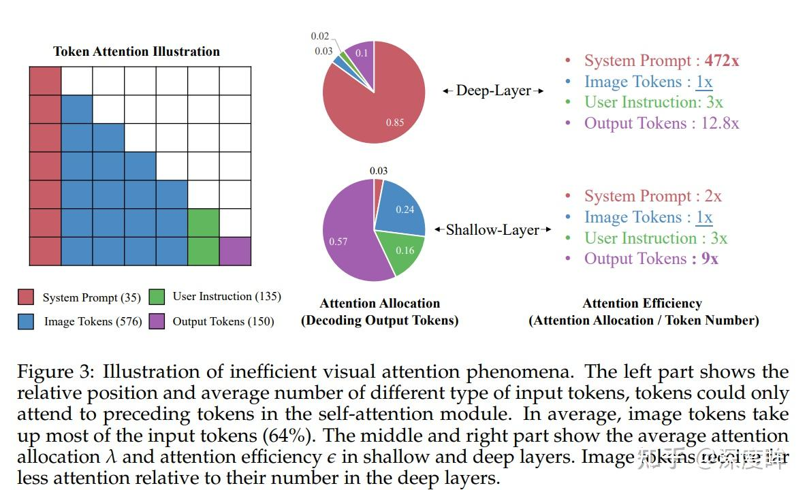
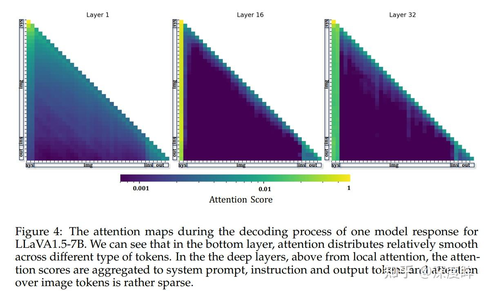
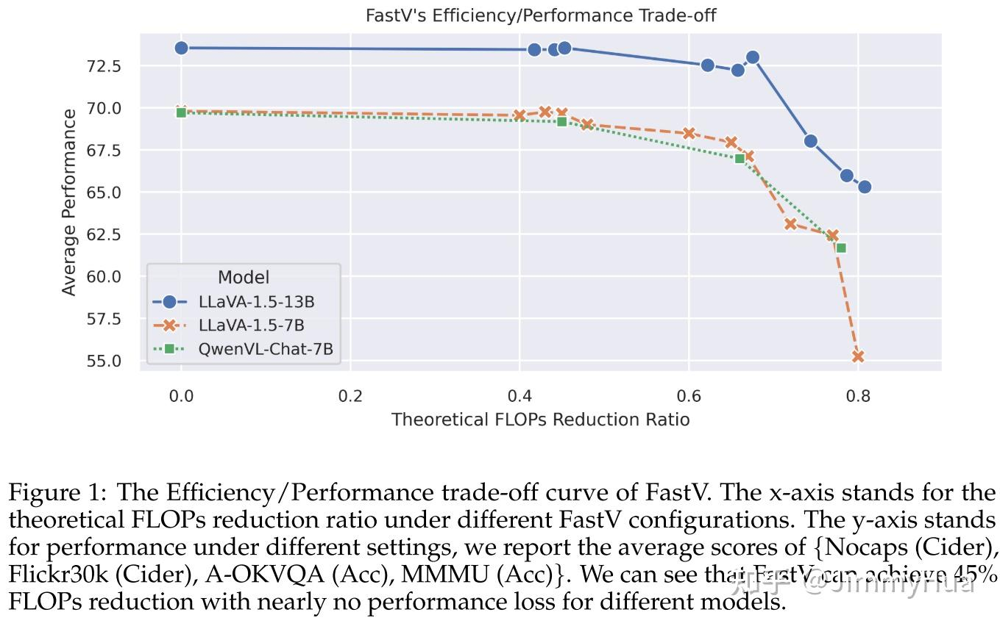
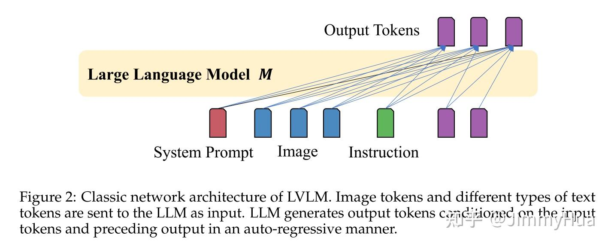

# FastV-助力多模态模型无损加速( 45% 的 FLOPS 减少)

**An Image is Worth 1/2 Tokens After Layer 2: Plug-and-Play Inference Acceleration for Large Vision-Language Models
Paper:** [https://arxiv.org/pdf/2403.06764.pdf](https://link.zhihu.com/?target=https%3A//arxiv.org/pdf/2403.06764.pdf)
**Code:** [https://github.com/pkunlp-icler](https://link.zhihu.com/?target=https%3A//github.com/pkunlp-icler/FastV)

## 1. Motivation

**现状**

- 目前大型[视觉语言模型](https://zhida.zhihu.com/search?content_id=240909442&content_type=Article&match_order=1&q=视觉语言模型&zhida_source=entity)(LVLMs)中发现了**低效的注意力现象**，特别是在一些典型的模型中，如LLaVA-1.5, [QwenVL- chat](https://zhida.zhihu.com/search?content_id=240909442&content_type=Article&match_order=1&q=QwenVL-+chat&zhida_source=entity)和Video-LLaVA；
- 作者发现在vlm的深层网络中，visual token的注意力计算效率极低，这表明需要一种比文本数据处理更稀疏的方法；

**问题发现**

**发现**：LLaVA 1.5的深层(第2层之后)，image token 获得的平均注意力得分仅为system prompts得分的**0.21%**。相比之下，这个数字在最初的两层达到50%;

**分析**

如上图所示，作者发现随着 LLM 推理时候层数加深，模型自注意力基本上都是在 system prompt 和之前输出的 tokens 上面，对 image tokens 关注很少。下面这个图也可以清晰的看出来。

**猜测**：

- visual signals 的过剩导致图像相关的，指令特定的特征通过浅层的自注意力机制聚集到某些 **“anchor”** 上；
- 值得注意的是这些**“anchor”**很少image tokens;
- 在深层中，注意力集中在这些**“anchor”token 上**，导致对 image token 本身的关注大大减少；

**优点：**

- 对比其他的attention-based 加速方法(如：稀疏 attention)，***FastV不仅仅能够减少 attention的计算量，还可以减少 [FFN模块](https://zhida.zhihu.com/search?content_id=240909442&content_type=Article&match_order=1&q=FFN模块&zhida_source=entity)在 deeper layers 里的计算\***；

**主要贡献**

- **低效的注意力现象**：识别和分析当前流行的LVLMs中低效的视觉注意现象；
- **FastV方法**：提出FastV，一种多功能的**即插即用**方法，旨在***通过学习早期层的自适应注意力模式并在随后的层中修剪visual token\***来优化计算效，且不牺牲性能；

> FastV 能够显著降低计算成本（如：***LLaVA-1.5-13B 能够减少 45% 的 [FLOPs](https://zhida.zhihu.com/search?content_id=240909442&content_type=Article&match_order=1&q=FLOPs&zhida_source=entity)，同时保持性能不损失***）；

- **可定制性和帕累托效率**：FastV的计算效率和性能之间的权衡是高度可定制的。它可以压缩一个拥有13B参数模型的FLOPs，使其预算低于一个拥有7B参数模型，同时仍然保持优越的性能。
- **实际应用价值**：作者认为FastV对于在边缘设备和商业模型中部署LVLMs具有实际价值。

## 2. Related Work

- 目前的多模态模型为了更强的表征和理解能力，处理更高分辨率需要更多的 token: | |

| 多模态模型 | 分辨率    | token数量 |
| ---------- | --------- | --------- |
| LLaVA      | 336x336   | 576       |
| LLaVA-Next | 672x672   | 2304      |
| fuyu-8B    | 1080x1080 | 1296      |

> 其他的多图或者视频理解如Video-Poet，Unified-IO2，都是上千的 token数；

- Gemini这类的大模型强调上下文的扩展，扩展到 1M以解决 context learning；

**常用的LLM推理优化**

1. 优化 attention的内存消耗，如 FlashAttention、vLLM 和 RingAttention 等；
2. 基于LLM推理中观察到的独特注意力模式而提出的方法，如 StreamingLLM和 FastGen 等，但是都是专门为 LLM设计的，对于 VLLM不一定适用；

> LLaMA-VID 利用 cross-attention 有效地用 2 个 token 表示视频帧，但是需要额外的微调，阻碍了广泛的适用性；

## 3. Method

### 3.1. 不同的输入 token:

- **system prompt (sys), image tokens (img), user instruction (ins), output tokens (out)**

### 3.2. 实验设置

- 从包括图像标题（Flickr30K）、具身推理（PCA-Bench）、视觉问答（A-OKVQA）、多模态理解和推理（MMMU）等视觉语言任务的组合中随机抽取N个图像-文本，输出N（实验为1000）个response；
- 收集不同层中每个output token的注意力分数分布α，并为不同类型的输入令牌进行了汇总；
- 对于第  $i$  个令牌，在第  $j$  层，我们计算  $\alpha_{\text{sys}}^{i,j}$ ,  $\alpha_{\text{img}}^{i,j}$ ,  $\alpha_{\text{ins}}^{i,j}$ ,  $\alpha_{\text{out}}^{i,j}$  来表示当前token在不同类型token上关注的总注意力分数，且有：

$$
\alpha_{\text{sys}}^{i,j} + \alpha_{\text{img}}^{i,j} + \alpha_{\text{ins}}^{i,j} + \alpha_{\text{out}}^{i,j} = 1
$$

**补充说明：**
1. 已知 attention 的计算公式为：

$$
\text{Attention}(Q, K, V) = \text{softmax}\left(\frac{QK^T}{\sqrt{d_k}}\right)V
$$

2. 对于每个 system token 的计算如下：

$$
\alpha_{i,j}^{\text{sys}} = \sum_{k \in \text{system prompt}} \text{Attention}_{i,k}^{(j)}
$$

其中  $\text{Attention}_{i,k}^{(j)}$  表示第  $i$  层对于第  $j$  层对第  $k$  个 system prompt 的得分

3. 归一化：为了确保每个 token 的注意力分数总和为1，需要对上述求和结果进行归一化处理；

- 计算每一类 token 的总注意力得分：

$$
\lambda_{\text{sys}}^j = \sum_{i=1}^n \alpha_{\text{sys}}^{i,j}
$$

其中  $n$  是响应的 token 总数，最终的注意力分配是在N个图像对中所有注意力头的平均值。

- **attention efficiency**
  - 表示响应中，一种类型的token在一层中接收到的平均注意力分数；例如，在第  $j$  层中，image token 的注意力效率：
  
$$
\epsilon_{\text{img}}^j = \frac{\sum_{i=1}^{n} \alpha_{\text{img}}^{i,j}}{|\text{img}|}
$$
  其中  $|\text{img}|$  是image的token总数，最终的得分也是取的平均值。

