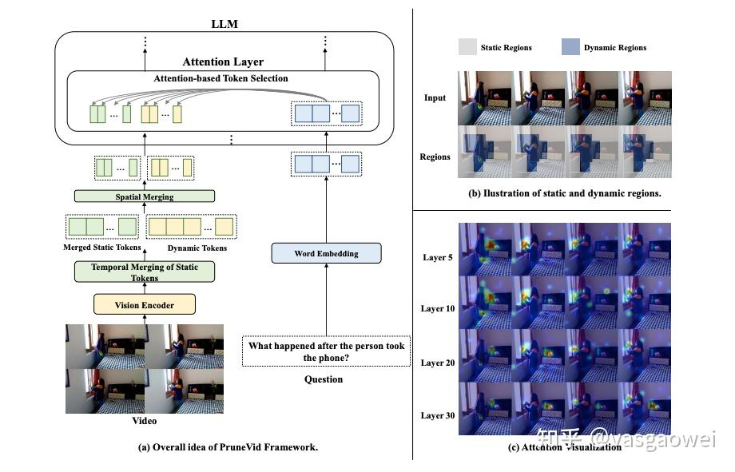
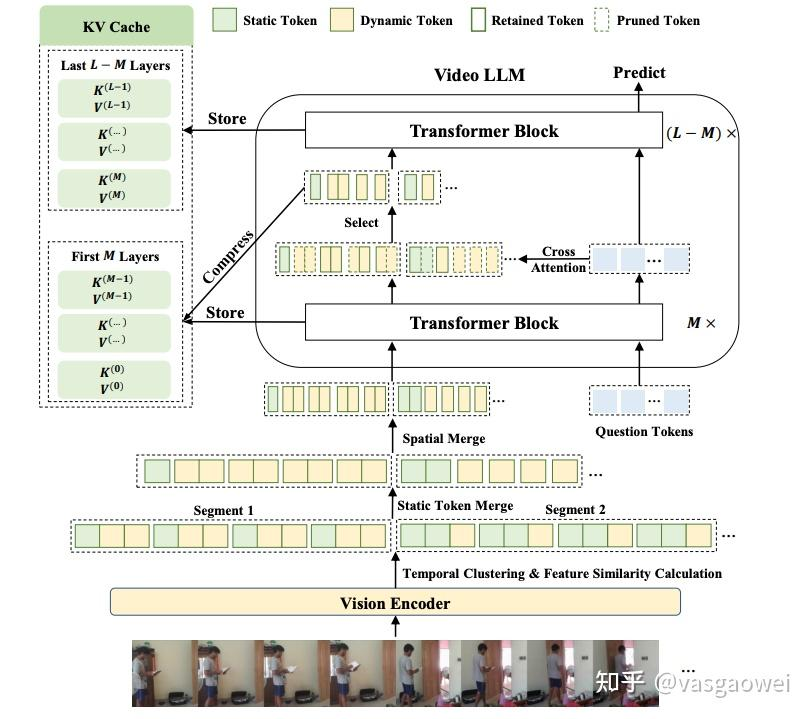
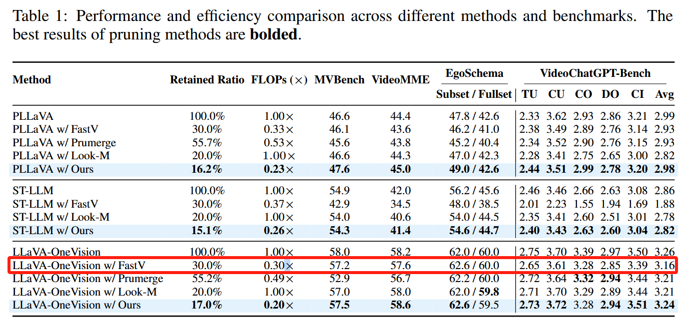

# Prunevid：视频多模态大模型里面的视觉Token剪枝

《[Prunevid](https://zhida.zhihu.com/search?content_id=252191785&content_type=Article&match_order=1&q=Prunevid&zhida_source=entity): Visual Token Pruning For Efficient Video Large Language Models》是香港大学和百度的一个工作，提出了一种[视觉Token剪枝](https://zhida.zhihu.com/search?content_id=252191785&content_type=Article&match_order=1&q=视觉Token剪枝&zhida_source=entity)的方PruneVid，以减少视频多模态大模型里面需要处理的视觉Token数量和计算量，也提高模型处理效率。

文章提出的视觉Token剪枝方法主要是基于两个准则，**一个是视频帧之间以及帧内的视觉token冗余，一个是和问题文本的token的相关性**。

模型结构如下图Fig 1所示，首先介绍一些记号，问题文本token为  $X_q \in \mathbb{R}^{N_q \times C}$ ，视觉Token为  $X_v \in \mathbb{R}^{N_v \times C}$ ，压缩之后的视觉token为  $X_v' \in \mathbb{R}^{N_v' \times C}$ ，输入LLM的序列为  $X \in \mathbb{R}^{(N_q + N_v') \times C}$ 。第  $l$  层TransformerLayer的query、key、value和Attention分别为

$$
A^{(l)} = \text{Softmax}\left(\frac{Q^{(l)}(K^{(l)})^T}{\sqrt{C}} + m\right), \quad m \in \mathbb{R}^{(N_q + N_v') \times (N_q + N_v')}
$$

接下来来看PruneVid如何基于视频帧间以及帧内的token冗余对视觉token进行压缩。一个视频里面，冗余信息是挺多的，比如同一个位置处相连帧的内容可能是一致的，同一个帧里面不同位置处也有可能存在相似的内容，一个视频也可以分为不同的segment。

基于这样的事实，PruneVid的第一步是把  $T$  帧视频分为  $B$  个Segment。每一帧的视觉Token序列记为  $X_v^t \in \mathbb{R}^{N_v \times C}$ ，视频的所有帧的Token序列记为  $X_v = \{X_v^{(1)}, \ldots, X_v^{(T)}\}$ 。每一帧的视觉Token序列经过空间平均池化之后得到每一帧的Embedding  $f^{(t)} \in \mathbb{R}^C$ ， $\{f^{(1)}, \ldots, f^{(T)}\}$  经过DPC-KNN聚类可以得到  $B$  个视频片段  $\{\mathcal{T}_1, \ldots, \mathcal{T}_B\}$ 。

在每一个视频段  $\mathcal{T}_B$  内，会计算相同空间位置处帧间的视觉token  $\{X_v^{(t)}(i)|t \in \mathcal{T}_B, 1 \leq i \leq B_v\}$  的相似度，

$$
s_i^{(t,t')} = \frac{X_v^{(t)}(i)^\top X_v^{(t')}(i)}{\|X_v^{(t)}(i)\| \|X_v^{(t')}(i)\|}
$$

每一个位置处的视觉Token平均相似度为

$$
\bar{s}_i = \frac{2}{|\mathcal{T}_b|(|\mathcal{T}_b| - 1)} \sum_{t,t' \in \mathcal{T}_b, t < t'} s_i^{(t,t')}
$$

基于平均相似度把视觉Token划分为静态的Token和动态的Token，静态的token集合为  $\mathcal{I}_{\text{static}} = \{i | \tau \leq \bar{s}_i\}$ ，这些静态的Token经过时序的平均合成一个Token，

$$
\bar{X}_v^{(b)}(i) = \frac{1}{|\mathcal{T}_b|} \sum_{t \in \mathcal{T}_b} X_v^{(t)}(i), \quad \forall i \in \mathcal{I}_{\text{static}}
$$

动态的Token集合  $\mathcal{I}_{\text{dynamic}} = \{1, \ldots, N_v\} \setminus \mathcal{I}_{\text{static}}$  保留。

为了进一步减少空间的冗余性，又对每一帧的动态  $\{X_v^{(i)}(i)|i \in \mathcal{I}_{dynamic}\}$  和静态的视觉Token  $\{X_v^{(i)}(i)|i \in \mathcal{I}_{static}\}$  通过DPC-KNN进行聚类，各得到对应的Token集合  $\mathcal{C}_1^{(t)}, \ldots, \mathcal{C}_{\mathcal{C}_s}^{(t)}$  和  $\mathcal{D}_1^{(t)}, \ldots, \mathcal{D}_{\mathcal{C}_d}^{(t)}$ ，每一个集合里面的Token平均之后得到单一的Token，即  $\{\overline{X}_v^{(t)}(c)|c = 1, \ldots, \mathcal{C}_s\}$  和  $\{\overline{X}_v^{(t)}(d)|d = 1, \ldots, \mathcal{C}_d\}$ 。

通过这样的多步聚类之后得到压缩之后的视觉Token集合  $\tilde{X}_v = \cup_{b=1}^{B} (\tilde{X}_v^{(b)})$ 。

第二步是基于文本Token的视觉Token压缩，一句话表述就是基于视觉Token和文本Token的attention值大小选择视觉Token。

在第  $M$  层，我们计算注意力分数  $A^{(M)}$ ，它是一个维度为  $(N_q + N_v') \times (N_q + N_v')$  的矩阵。为了获得问题和视觉标记之间的交叉注意力分数，我们从  $A^{(M)}$  中提取一个子矩阵  $A_{qv}^{(M)}$ ，其维度为  $N_q \times N_v'$ ，如下所示：

 $$ A_{qv}^{(M)} = A^{(M)}[N_v' : , : N_v'] $$ 

这里， $A^{(M)}[N_v' : , : N_v']$  表示从  $A^{(M)}$  中选择从问题标记到视觉标记的注意力分数。

接下来，我们对所有问题标记应用最大池化操作，为每个视觉标记计算最大注意力值  $a_{v'}$ ，其维度为  $N_v'$ 。这种方法能够捕捉到最具信息量的问题标记，因为并非所有问题标记都同等重要。

然后按照注意力的值，取前  $\alpha\%$  的视觉Token，

$$
\mathcal{S} = \{j \in \{1, \ldots, N_v'\} \mid \text{Rank}(a_v(j)) \leq \lceil \alpha N_v' \rceil\},
$$

前  $M$  层的KV分别为  $K_v^{(l)} \in \mathbb{R}^{N_v' \times C}$  和  $V_v^{(l)} \in \mathbb{R}^{N_v' \times C}$ ，在后  $M$  层灰基于上出的index集合  $\mathcal{S}$  得到压缩之后的Token集合。

$$
\tilde{K}_v^{(l)} = K_v^{(l)}[\mathcal{S},:], \quad \tilde{V}_v^{(l)} = V_v^{(l)}[\mathcal{S},:],
$$

这样KV的Token数量从  $N_q + N_v'$  减少到  $N_q + |\mathcal{S}|$ 。

为了在解码阶段减少内存和计算成本，我们通过仅保留选定的视觉标记来压缩从先前M层存储的KV缓存。对于每一层  $l (1 \leq l \leq M)$ ，视觉标记的原始键和值矩阵分别是  $K_v^{(l)} \in \mathbb{R}^{N_v' \times C}$  和  $V_v^{(l)} \in \mathbb{R}^{N_v' \times C}$ 。

我们通过选择对应于索引  $\mathcal{S}$  的行来创建压缩的键和值矩阵  $\tilde{K}_v^{(l)}$  和  $\tilde{V}_v^{(l)}$ ：

$$
\tilde{K}_v^{(l)} = K_v^{(l)}[\mathcal{S},:], \quad \tilde{V}_v^{(l)} = V_v^{(l)}[\mathcal{S},:],
$$

其中  $K_v^{(l)}[\mathcal{S},:]$  和  $V_v^{(l)}[\mathcal{S},:]$  表示选择对应于索引  $\mathcal{S}$  的行。

同样，我们通过结合问题标记和选定的视觉标记来调整整个序列的键和值矩阵：

$$
\tilde{K}^{(l)} = [\tilde{K}_v^{(l)}; K_q^{(l)}], \quad \tilde{V}^{(l)} = [\tilde{V}_v^{(l)}; V_q^{(l)}],
$$

其中  $K_q^{(l)}$  和  $V_q^{(l)}$  是问题标记的键和值矩阵。通过压缩KV缓存，我们有效地将序列长度从  $N_q + N_v'$  减少到  $N_q + |\mathcal{S}|$ ，其中  $|\mathcal{S}|$  表示选定的视觉标记的总数。

