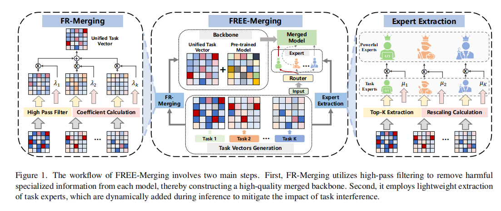

# **FREE-Merging: Fourier Transform for Efficient Model Merging**
好的，这篇论文提出了一种名为 **FREE-Merging** 的高效模型合并框架，旨在整合现有多个模型的能力，同时解决现有方法中存在的性能和部署成本之间的权衡问题。该框架主要包含两个核心部分：**FR-Merging** 和 **轻量级专家提取 (Lightweight Expert Extraction)**。

[cite_start]核心思想在于，论文首次揭示了模型合并中的“任务干扰”现象在参数的**频域**上表现得尤为明显，而现有方法大多只关注于在空间域解决该问题，效果有限 [cite: 5][cite_start]。因此，作者提出在频域上对参数进行处理，以构建一个高性能的合并后主干网络，并辅以轻量级的任务专家模块来补偿合并过程中不可避免的信息损失 [cite: 8, 29]。

以下是对该方法各部分的详细说明：

### **1. FREE-Merging 总体框架**

[cite_start]FREE-Merging 是一个两阶段方法 [cite: 29]，其工作流程如图1所示：

1.  [cite_start]**FR-Merging (FR-Merging)**：首先，利用高通滤波技术处理每个模型的任务向量（task vectors），移除其中导致任务干扰的有害低频信息，从而构建一个高质量的、合并后的主干网络 (backbone) [cite: 35]。
2.  [cite_start]**专家提取 (Expert Extraction)**：然后，通过一种轻量级的方式提取特定于每个任务的“专家”模块。在推理时，根据输入动态地将相应的专家模块添加到主干网络上，以补偿在滤波过程中损失的信息，并减少任务干扰的影响 [cite: 36]。

---

### **2. FR-Merging：基于傅里叶变换的主干网络合并**

[cite_start]FR-Merging 的目标是构建一个高性能的合并主干网络，其关键在于解决频域中的任务干扰问题 [cite: 46]。

#### **问题分析**
[cite_start]论文发现，来自不同任务的微调模型，其参数（以“任务向量”的形式表示）在频域上存在巨大差异，尤其是在**低频区域** [cite: 75, 102][cite_start]。如图2(a)所示，不同任务在低频部分的振幅功率差异很大 [cite: 76, 80][cite_start]。作者认为，低频信号捕捉了模型的全局结构，更容易包含导致任务冲突的特定任务信息 [cite: 37][cite_start]。合并这些信号强度差异巨大的模型，会导致弱信号被强信号掩盖，从而使得某些任务的性能在合并后几乎完全丢失 [cite: 79]。

#### **方法与公式**
[cite_start]基于上述发现，FR-Merging 提出直接应用**高通滤波器 (High-pass Filter)**，滤除（即移除）存在严重干扰的低频部分 [cite: 38, 95]。

[cite_start]**公式 (1) 和 (2)** 定义了这个高通滤波过程 [cite: 97]：
$$G(x,y)=\mathcal{F}^{-1}\{H(\eta,\gamma)\cdot\mathcal{F}\{v(x,y)\}\}$$

$$H(\eta,\gamma)=\begin{cases}1, & \sqrt{\eta^{2}+\gamma^{2}}\ge D_{0}\\ 0, & \sqrt{\eta^{2}+\gamma^{2}}< D_{0}\end{cases}$$

**符号含义**:
* [cite_start]$v(x,y)$：代表任务向量，即微调后的模型参数 $\theta_k$ 与预训练模型参数 $\theta_{pre}$ 的差值 ($v_k = \theta_k - \theta_{pre}$) [cite: 69, 96]。这里将其视为一个二维信号。
* [cite_start]$\mathcal{F}$ 和 $\mathcal{F}^{-1}$：分别代表傅里叶变换和逆傅里叶变换 [cite: 97]。
* [cite_start]$H(\eta,\gamma)$：是一个理想的高通滤波器。它允许所有频率高于某个阈值的信号通过，而阻止低于该阈值的信号 [cite: 97]。
* [cite_start]$\eta$ 和 $\gamma$：表示在频域中，点 $(\eta, \gamma)$ 到频域中心的距离 [cite: 98]。
* [cite_start]$D_{0}$：是可调节的**截止频率 (cutoff frequency)**。所有与频域中心的距离小于 $D_0$ 的频率成分都会被置为0（即被滤除） [cite: 98]。

经过滤波后，需要将来自不同任务的、处理后的任务向量进行加权合并。**公式 (3)** 定义了合并系数 $\lambda_i$ 的计算方法：
$$\lambda_{i}=\mathbb{E}(v_{i})(\sum_{j=1}^{K}\mathbb{E}(v_{j}))^{-1}$$

**符号含义**:
* [cite_start]$\lambda_i$：任务 $i$ 的任务向量 $v_i$ 的合并系数 [cite: 110]。
* [cite_start]$\mathbb{E}(v_i)$：代表任务向量 $v_i$ 中所有参数的**平均值 (average)** [cite: 110]。这个公式旨在根据每个任务向量的平均“强度”来分配权重，以维持合并后输出的稳定性。

[cite_start]最终，合并后的主干网络 $\theta_m$ 由预训练模型 $\theta_{pre}$ 和所有经过滤波并加权合并后的任务向量构成 [cite: 128]：
$$\theta_{m}=\theta_{pre}+\sum_{i=1}^{K}\lambda_{i}G(v_{i})$$

---

### **3. 轻量级专家提取 (Lightweight Expert Extraction)**

[cite_start]为了补偿因高通滤波而损失的信息（主要是被滤除的、包含任务特定信息的低频信号），FREE-Merging 引入了轻量级的任务专家 [cite: 115]。

#### **方法与公式**
[cite_start]作者认为，在微调过程中，变化最大的参数对任务的特化影响最大 [cite: 117][cite_start]。因此，可以通过提取这些参数并进行适当的**重新缩放 (rescaling)** 来构建任务专家 [cite: 118]。

**公式 (4)** 定义了专家的提取和缩放过程：
$$e(v_{i})=\mu_{i}M(v_{i},d)$$

$$\mu_{i}=-\frac{\mathbb{E}(M(v_{i},d))\cdot log(d)}{\lambda_{i}\cdot\mathbb{E}(v_{i})}$$

**符号含义**:
* [cite_start]$e(v_i)$：任务 $i$ 的轻量级专家 [cite: 121]。
* [cite_start]$M(v_i, d)$：一个函数，它从任务向量 $v_i$ 中选出绝对值**最大**的前 $d\%$ 的参数 (Top-K selection) [cite: 121][cite_start]。$d$ 是一个百分比，通常很小（例如1%） [cite: 118]。
* [cite_start]$\mu_i$：专家 $e(v_i)$ 的**重新缩放因子 (rescale factor)** [cite: 121][cite_start]。由于只提取了一小部分参数，其均值和方差会发生改变。设置这个缩放因子的目的是为了在补偿信息的同时，保持专家模块输出的量级与原始模型的期望输出一致，从而保证性能 [cite: 121, 460]。
* [cite_start]$\lambda_i$ 和 $\mathbb{E}(v_i)$：与 FR-Merging 中定义的合并系数和任务向量平均值相同 [cite: 121]。

---

### **4. 最终推理流程**

[cite_start]在最终的推理阶段，FREE-Merging 的工作流程如 **Algorithm 1** 所示 [cite: 127]：
1.  [cite_start]**一次性计算**：首先，通过 FR-Merging 计算出合并后的主干网络 $\theta_m$ [cite: 128][cite_start]。然后，为每个任务提取出对应的轻量级专家 $\{e_{i}\}_{i=1}^{K}$ [cite: 129][cite_start]。这两个步骤都是一次性完成的，不需要在每次推理时都重新计算 [cite: 127]。
2.  [cite_start]**动态推理**：当接收到输入数据 $x$ 时，一个**路由器 (Router)** $R$ 会判断这个输入最适合哪个任务 [cite: 124, 133]。
3.  [cite_start]**模型组合**：路由器会激活相应的专家 $e_i$，并将其加到主干网络 $\theta_m$ 上，形成最终用于推理的模型 $\theta_* = \theta_m + w_i e_i$ (其中 $w_i=1$ 表示激活) [cite: 133]。
4.  [cite_start]**生成输出**：使用组合后的模型 $\theta_*$ 对输入 $x$ 进行计算，得到最终输出 [cite: 133]。

[cite_start]通过这种方式，FREE-Merging 在几乎不增加额外推理开销和存储（每个专家仅占约1%的额外参数）的情况下 [cite: 138, 139][cite_start]，有效地合并了多个模型，在多项视觉、语言和多模态任务上取得了优异的性能平衡 [cite: 48, 159]。

