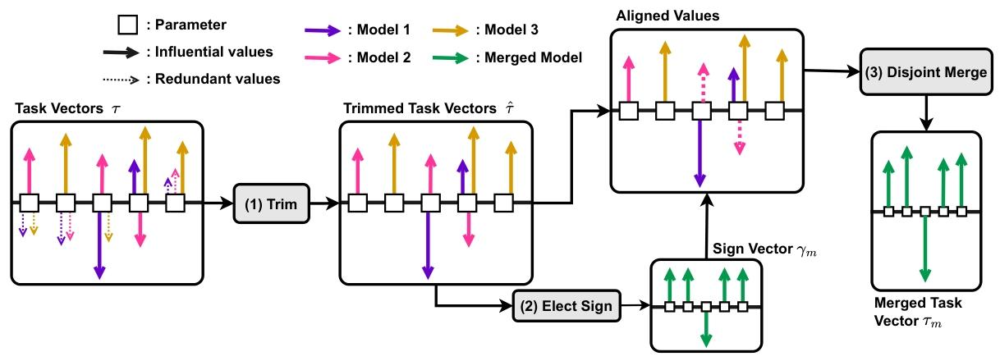

# “TIES-MERGING: Resolving Interference When Merging Models”

好的，我们来详细说明一下 TIES-MERGING 方法，特别是其中涉及的公式和符号。

### **核心思想**

[cite\_start]TIES-MERGING 是一种旨在合并多个经过微调的（fine-tuned）神经网络模型，以创建一个单一的多任务模型的方法 [cite: 2, 20][cite\_start]。现有模型合并方法，如简单的权重平均，在合并多个模型时常常会因为不同模型参数间的\*\*干扰（interference）\*\*而导致性能下降 [cite: 2, 23]。

[cite\_start]TIES-MERGING 认为，这种干扰主要来自两个方面 [cite: 3]：

1.  [cite\_start]**来自冗余参数的干扰**：在模型微调过程中，许多参数的改变对模型性能影响很小，是冗余的 [cite: 24][cite\_start]。当一个对某个模型至关重要的参数与其他模型中相应位置的冗余参数合并时，其重要性会被稀释，从而影响最终模型的性能 [cite: 25]。
2.  [cite\_start]**来自参数符号不一致的干扰**：对于同一个参数，不同模型微调后可能会呈现出相反的符号（一个为正，一个为负） [cite: 26][cite\_start]。直接对这些值进行平均，会使得参数的绝对值减小，从而损害其在各项任务上的表现 [cite: 27, 28]。

[cite\_start]为了解决这两个问题，TIES-MERGING 提出了一个包含三个新颖步骤的合并流程：**修剪（Trim）**、**选举符号（Elect Sign）** 和 **合并（Merge）** [cite: 4, 30]。

### **方法详解与公式解析**

在详细介绍步骤之前，我们先来理解一个核心概念：**任务向量（Task Vector）**。

#### **任务向量 (Task Vector)**

[cite\_start]任务向量代表了模型为了适应特定任务，其参数相对于初始预训练模型所发生的变化 [cite: 22, 66]。

  - **符号定义**：

      - $\\theta\_{init}$：表示预训练模型的初始参数。
      - $\\theta\_{ft}^{t}$：表示在任务 *t* 上微调后的模型参数。
      - $\\tau\_{t}$：表示任务 *t* 的任务向量。

  - **计算公式**：
    [cite\_start]$$\tau_{t} = \theta_{ft}^{t} - \theta_{init} \quad [cite: 67]$$
    [cite\_start]这个公式计算出的向量 $\\tau\_{t}$，其维度与模型参数量相同（记为 *d*），向量中的每一个值都代表了相应参数在微调过程中发生的变化量 [cite: 67]。TIES-MERGING 正是对这些任务向量进行操作，而不是直接操作模型权重。

  - **任务向量的分解**：
    [cite\_start]任务向量 $\\tau\_{t}$ 可以被分解为其**符号（sign）和幅度（magnitude）** [cite: 86]。
    [cite\_start]$$\tau_{t} = \gamma_{t} \odot \mu_{t} \quad [cite: 86]$$

      - [cite\_start]$\\gamma\_{t} = sgn(\\tau\_{t})$：这是**符号向量**，其中每个元素为 +1、-1 或 0，代表了对应参数变化的方向（增加、减少或不变） [cite: 85, 87]。
      - [cite\_start]$\\mu\_{t} = |\\tau\_{t}|$：这是**幅度向量**，其中每个元素都是非负值，代表了对应参数变化的绝对大小 [cite: 88]。
      - [cite\_start]$\\odot$：表示元素对应相乘（elementwise product） [cite: 86]。

#### **TIES-MERGING 的三个步骤**

以下是 TIES-MERGING 方法的具体流程，并附有图示说明（可参考下图）。

\
[cite\_start]*图1：TIES-MERGING 流程示意图。图中，方块代表模型参数，彩色箭头代表不同任务微调后产生的参数更新（即任务向量），箭头的方向代表符号，长度代表幅度。* [cite: 14, 15, 16]

**1. 修剪 (Trim)**
[cite\_start]此步骤旨在消除冗余参数的干扰 [cite: 30][cite\_start]。具体做法是，对于每个任务向量，只保留其中幅度最大的前 k% 的参数，将其余 (100-k)% 的参数变化重置为 0 [cite: 89][cite\_start]。这等同于将这些冗余参数的权重恢复到它们在预训练模型中的初始值 [cite: 31]。

  - [cite\_start]**操作**：通过一个函数 `keep_topk_reset_rest_to_zero` 来实现 [cite: 75]。
  - **结果**：原始任务向量 $\\tau\_{t}$ 经过修剪后，得到修剪后的任务向量 $\\hat{\\tau}\_{t}$。在这个新的向量中，只有少数被认为是“有影响力的”（influential）参数的值被保留，其余都为 0。

**2. 选举符号 (Elect Sign)**
[cite\_start]即使在修剪之后，不同任务向量在同一参数位置上仍可能存在符号冲突 [cite: 32][cite\_start]。此步骤旨在为合并后的模型确定一个统一的符号方向 [cite: 89, 90][cite\_start]。选举规则是选择在所有模型中具有**最大总幅度**的符号 [cite: 91]。

  - **符号定义**：

      - $\\gamma\_{m}$：选举出的最终符号向量。
      - $\\hat{\\tau}\_{t}^{p}$：表示第 *t* 个任务向量修剪后，第 *p* 个参数的值。

  - **计算公式**：
    对于每一个参数位置 *p*，最终的符号 $\\gamma\_{m}^{p}$ 通过以下方式高效计算得出：
    [cite\_start]$$\gamma_{m}^{p} = sgn\left(\sum_{t=1}^{n} \hat{\tau}_{t}^{p}\right) \quad [cite: 94]$$
    [cite\_start]这里的 *n* 是被合并模型的总数。这个公式的含义是：将所有修剪后的任务向量在参数 *p* 上的值相加，然后取这个和的符号 [cite: 94][cite\_start]。如果正向变化的总幅度大于负向变化的总幅度，最终符号就是+1，反之亦然 [cite: 92, 93]。

**3. 不相交合并 (Disjoint Merge)**
[cite\_start]最后一步是计算最终的合并后任务向量 $\\tau\_{m}$ [cite: 95][cite\_start]。对于每个参数 *p*，只对那些其符号与上一步选举出的最终符号 $\\gamma\_{m}^{p}$ **一致**的模型参数值进行平均 [cite: 94]。

  - **符号定义**：

      - $\\mathcal{A}^{p}$：对于参数 *p*，这是一个集合，包含了所有其修剪后任务向量符号 $\\hat{\\gamma}*{t}^{p}$ 与选举出的最终符号 $\\gamma*{m}^{p}$ 一致的任务索引 *t*。
      - $\\tau\_{m}^{p}$：合并后任务向量在参数 *p* 上的最终值。

  - **计算公式**：
    [cite\_start]$$\tau_{m}^{p} = \frac{1}{|\mathcal{A}^{p}|} \sum_{t \in \mathcal{A}^{p}} \hat{\tau}_{t}^{p} \quad [cite: 95]$$
    [cite\_start]这个公式表示，只对那些符号“正确”的参数值求平均 [cite: 95][cite\_start]。那些符号相反的或者在修剪步骤中被置为0的参数值，将不参与该位置的计算 [cite: 95]。

#### **生成最终模型**

在得到合并后的任务向量 $\\tau\_{m}$ 后，通过以下公式生成最终的多任务模型参数 $\\theta\_{m}$：

[cite\_start]$$\theta_{m} = \theta_{init} + \lambda \cdot \tau_{m} \quad [cite: 96]$$

  - **符号定义**：
      - [cite\_start]$\\lambda$：一个缩放超参数（scaling hyperparameter），用于调整合并任务向量的整体影响，其用法借鉴了之前的工作 [cite: 96]。

[cite\_start]通过以上三个步骤，TIES-MERGING 有效地解决了参数冗余和符号冲突带来的干扰，从而在合并多个模型时能够获得更好的性能 [cite: 5, 40]。

这篇论文提出了TIES-MERGING方法，有效解决模型合并时的干扰问题，在多场景下提升了合并模型性能。 

1. **研究背景**    - **预训练模型与模型合并**：预训练模型经微调在特定任务表现良好，但多任务需多个单独模型，存在存储和泛化问题。模型合并技术旨在将多个特定任务模型合并为一个多任务模型，现有方法多通过加权平均合并模型参数，但忽略了参数间干扰。    - **干扰的来源**：干扰主要源于冗余参数和符号不一致。冗余参数在微调时变化小且对性能影响小，合并时会掩盖重要参数值；不同模型中同一参数符号可能不同，简单平均会降低合并模型性能。 

2. **相关工作**    - **损失景观与权重插值**：研究表明不同训练运行的参数值有时可插值而不增加损失，但需考虑神经网络的置换对称性等因素。    - **模型合并及应用**：模型合并可用于多种场景，如提升单任务性能、跨域泛化等。已有多种改进方法，如RegMean、Fisher Merging、Task Arithmetic等，但都未充分考虑参数间干扰。 

3. **背景与动机**    - **问题设定**：给定多个任务和预训练模型，通过微调得到多个特定任务模型参数，目标是将这些模型权重合并为一个在域内和域外数据集都表现良好的多任务模型。    - **模型参数冗余性**：实验表明任务向量中很多参数冗余，去除这些冗余参数不影响任务性能。保留任务向量中前20%的参数，性能与保留所有参数相当。    - **参数符号不一致**：不同微调模型的任务向量对同一参数可能有相反变化，导致符号冲突。合并的模型数量增加时，符号冲突的可能性增大。 

4. **TIES-MERGING方法**    - **预备知识**：任务向量可分解为符号向量和幅度向量，符号表示参数变化方向，幅度表示变化大小。   

   **方法步骤**： 首先是Trim，保留任务向量中前k%的重要参数，将冗余参数设为0；接着Elect，通过计算所有相关模型中参数的总幅度来确定合并模型参数的符号；最后Disjoint Merge，只保留符号与聚合符号一致的参数值并计算均值，得到最终合并的任务向量，再与初始参数值相加得到合并模型参数。 

TIES-MERGING（TRIM, ELECT SIGN & MERGE）是一种用于合并模型的方法，旨在解决现有模型合并技术中因参数干扰导致性能下降的问题，该方法主要分为三个步骤，具体如下： 

1. **Trim（修剪）**：在每个任务向量$\tau_{t}$中，基于参数的幅度大小，仅保留前$k\%$的重要参数值，将其余$(100 - k)\%$的冗余参数值设为0 。这相当于把微调后的参数值中那些对任务性能影响较小的部分重置为预训练模型的初始值。例如，若$k = 20$，则只保留任务向量中幅度排在前20%的参数，其余参数值清零。这样做可以去除冗余参数的干扰，避免其对重要参数值的掩盖，因为在微调过程中，许多参数虽有变化但对性能影响不大，合并时这些冗余参数可能会降低整体模型性能。 
2. **Elect（选择符号）**：不同模型对同一参数的符号（正负方向）可能存在分歧，这会导致合并时的干扰。该步骤通过计算所有相关模型中每个参数的总幅度，来确定合并模型参数的符号。对于每个参数$p$，将不同模型中该参数的值$\hat{\tau}_{t}^{p}$按符号（+1或 -1）分开并分别求和，得到正负方向的总幅度，选择总幅度较大的方向的符号作为合并模型中该参数的符号$\gamma_{m}^{p}$ ，即$\gamma_{m}^{p} = sgn(\sum_{t = 1}^{n} \hat{\tau}_{t}^{p})$。这种方式能够解决符号冲突，确保合并后的参数符号更合理，有利于提升模型性能。 
3. **Disjoint Merge（不相交合并）**：在确定了每个参数的最终符号后，对于每个参数$p$，只保留那些符号与聚合选择符号$\gamma_{m}^{p}$相同的参数值，并计算这些值的平均值作为合并后模型中该参数的值$\tau_{m}^{p}$。具体来说，设$A^{p} = \{t \in [n] | \hat{\gamma}_{t}^{p} = \gamma_{m}^{p}\}$，则$\tau_{m}^{p} = \frac{1}{|A^{p}|} \sum_{t \in A^{p}} \hat{\tau}_{t}^{p}$。由于修剪步骤中已将冗余参数设为0，这里计算平均值时会忽略这些0值。最后，将得到的最终合并任务向量$\tau_{m}$进行缩放（缩放因子为$\lambda$ ），并与初始参数值$\theta_{init}$相加，得到合并模型的参数$\theta_{m} = \theta_{init} + \lambda * \tau_{m}$ 。 在实际应用中，TIES - MERGING方法在多种实验设置下都展现出了优势，能够有效提升合并模型在不同模态、领域、任务数量、模型大小、架构和微调设置下的性能，缩小与多任务训练模型之间的差距。 

	5.  **实验设置**    - **基线方法**：对比TIES-MERGING与简单平均、Fisher Merging、RegMean、Task Arithmetic四种基线方法。    
     - **无验证集的合并**：开发了一种固定超参数的TIES-MERGING通用方法，无需验证集调参，在全模型微调的ViT和T5模型中应用。 

6. **主要结果**    - **合并PEFT模型**：在参数高效微调的场景下，TIES-MERGING合并模型性能优于其他方法，有验证集时，11个任务平均提升2.5%。    - **合并全微调视觉模型**：在合并全微调的ViT-B/32和ViT-L/14模型时，有验证集平均提升1.8%和1.5%，无验证集提升更明显。    - **合并全微调NLP模型**：T5-base和T5-large模型中，有验证集分别提升0.7%和3.6%，T5-large无验证集时性能超越所有基线。    - **域外泛化**：TIES-MERGING在T5-base和T5-large模型上的域外泛化性能优于最强基线，分别提升1.0%和4.4%。    - **合并不同数量的任务**：随着合并任务数量增加，所有方法性能下降，但TIES-MERGING性能下降更慢。 

7. **额外结果与分析**    - **干扰类型及其对合并的影响**：去除冗余参数可避免干扰，使合并参数更合理；解决符号干扰能增加参数总体幅度，提升模型性能。    - **前k%参数符号的相关性**：翻转高幅度参数的方向会导致性能大幅下降，说明正确的参数方向很重要。    - **TIES-MERGING组件的消融实验**：TIES-MERGING的各个组件对性能都很关键，缩放和不相交平均的影响最大。    - **合并模型时估计正确符号的重要性**：使用多任务模型的神谕符号向量，TIES-MERGING性能接近多任务训练模型，表明获取正确符号向量可缩小差距。 8. **研究结论**    - **方法优势**：TIES-MERGING能有效解决模型合并时的干扰问题，在多种设置和领域中提升了合并多任务模型的性能，且超参数固定，方法简单。    - **研究不足与展望**：现有模型合并方法理论理解有限，TIES-MERGING也存在依赖共同初始化和架构等问题。未来可探索在无多任务模型时估计多任务符号的方法，缩小多任务合并与多任务训练的差距。 