# Contrastive Language-Image Pre-Training

> https://zhuanlan.zhihu.com/p/699376156

CLIP模型由图像编码器和文本编码器两部分组成。图像编码器负责将图像转换为特征向量，可以是卷积神经网络（如ResNet）或Transformer模型（如ViT），见图1；文本编码器则负责将文本转换为特征向量，通常是一个Transformer模型，见图2，这两个编码器通过共享一个向量空间来实现跨模态的信息交互与融合。

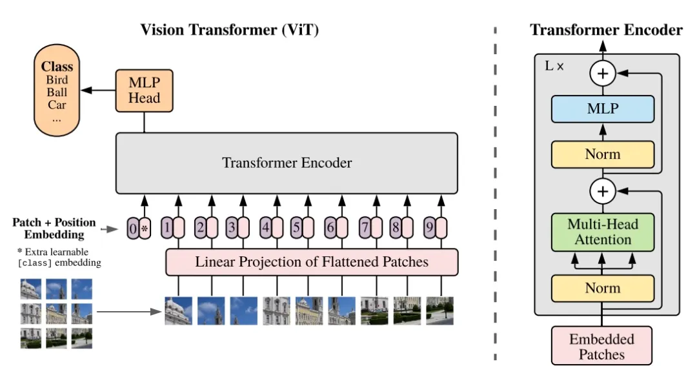

**图1：图形编辑器Image Encoder架构**

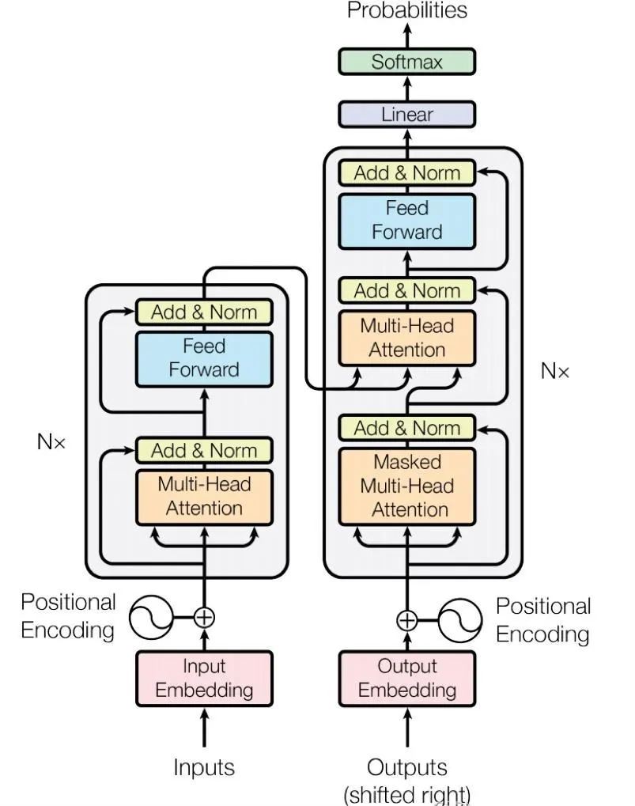

**图2：文本编辑器Text Encoder架构**

CLIP的工作原理可以概括为“对比学习”。对比学习是一种学习相似性度量的方法，其核心思想是通过将同一组数据中的不同样本对进行比较，来学习它们之间的相似度或差异度。在CLIP模型中，对比学习被用来训练模型学习视觉和语言的相互关系。

CLIP模型训练分为三个阶段：

（1）Contrastive pre-training：预训练阶段，使用图片-文本对进行对比学习训练；

（2）Create dataset classifier from label text：提取预测类别文本特征；

（3）Use for zero-shot predictiion：进行 Zero-Shoot 推理预测。

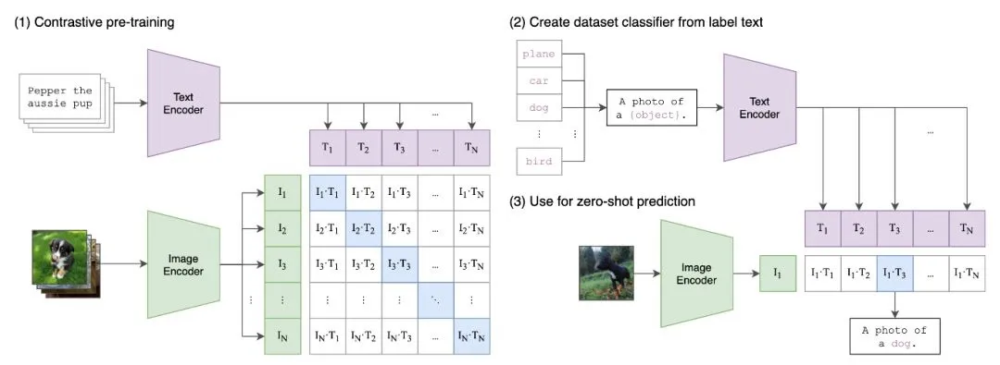

具体来说，在预训练阶段，CLIP通过对比图像和文本的向量表示，学习它们之间的匹配关系。模型会接收一批图像-文本对作为输入，并尝试将匹配的图像和文本向量在共同的语义空间中拉近，而将不匹配的向量推远，也就是计算类别标签与预测的余弦相似度，相似度最高的标签即是预测的分类结果，这种学习方式使得CLIP能够捕捉到图像和文本之间的深层语义联系，实现跨模态理解。不同于以的分类网络的类别数量是固定的，CLIP给了我们很高的自由度去设置“多项选择题”提供给网络的分类标签不仅数量不固定，内容也是自由的，摆脱了事先定好的分类标签。

**训练阶段：**N张图像和N个文本分别通过Encoder编码成高维向量。这些向量被用来构建一个[相似度矩阵](https://zhida.zhihu.com/search?content_id=243547320&content_type=Article&match_order=1&q=相似度矩阵&zhida_source=entity)，其中矩阵的每个元素表示对应图像和文本向量的[内积](https://zhida.zhihu.com/search?content_id=243547320&content_type=Article&match_order=1&q=内积&zhida_source=entity)。在训练过程中，对角线上的内积代表匹配的图文对，而其他位置的内积代表不匹配的图文对。

训练的目标是通过对比训练，使得匹配的图文对的内积尽可能大，而不匹配的图文对的内积尽可能小。这意味着在相似度矩阵中，匹配的图文对应的内积值应该高于其他不匹配的图文对应的内积值。

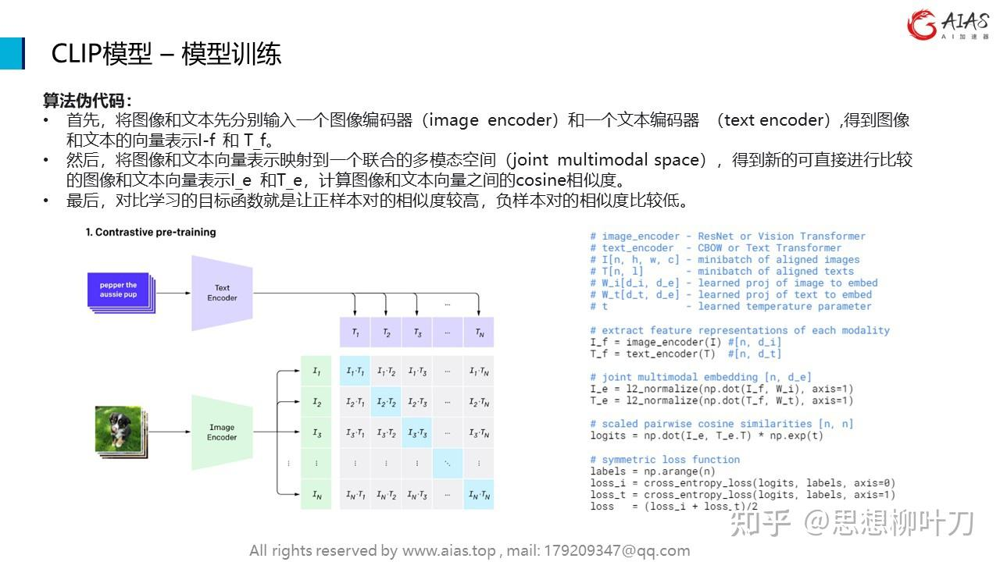

**算法[伪代码](https://zhida.zhihu.com/search?content_id=243547320&content_type=Article&match_order=1&q=伪代码&zhida_source=entity)：**

•首先，将图像和文本先分别输入一个[图像编码器](https://zhida.zhihu.com/search?content_id=243547320&content_type=Article&match_order=1&q=图像编码器&zhida_source=entity)（image encoder）和一个[文本编码器](https://zhida.zhihu.com/search?content_id=243547320&content_type=Article&match_order=1&q=文本编码器&zhida_source=entity) （text encoder）,得到图像和文本的向量表示I-f 和 T_f。

•然后，将图像和[文本向量](https://zhida.zhihu.com/search?content_id=243547320&content_type=Article&match_order=2&q=文本向量&zhida_source=entity)表示映射到一个联合的[多模态空间](https://zhida.zhihu.com/search?content_id=243547320&content_type=Article&match_order=1&q=多模态空间&zhida_source=entity)（joint multimodal space），得到新的可直接进行比较的图像和文本向量表示I_e 和T_e，计算图像和文本向量之间的cosine相似度。

•最后，对比学习的目标函数就是让正样本对的相似度较高，负样本对的相似度比较低。

**推理验证：**用户可以根据自定义的文本来判断图像是否匹配。通过计算新文本和图像向量的内积值，可以确定它们之间的相似度。用户可以根据内积值的大小来判断图像是否与给定文本匹配，从而实现对图像内容的判断或分类。这种方法可以应用于各种领域，如图像识别、内容匹配等任务。

经典的分类训练只关心模型是否可以正确预测图像的分类标签。

而CLIP模型在大规模数据集上完成的训练，这使得CLIP模型还学习到了图像的各方面信息。

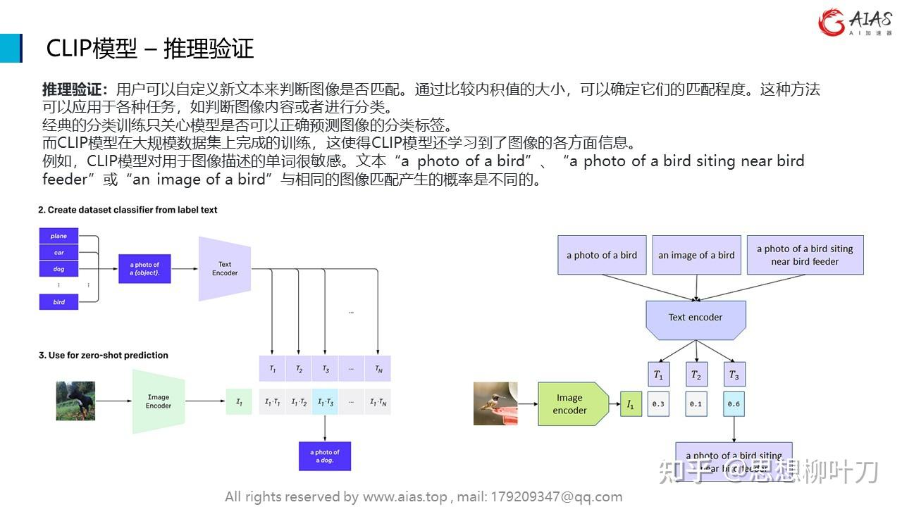

此外，在训练过程中，CLIP采用了对比损失函数，包括对比损失（通过最大化正确图像-文本对的相似性和最小化错误图像-文本对的相似性来训练模型）和分类损失（用于训练模型对图像和文本进行多任务分类），这是对称的，意味着对于每个图像-文本对，模型会计算两个方向的损失：图像到文本和文本到图像。这种对称性确保了模型在两个方向上都能有效地学习匹配关系。

## 应用举例

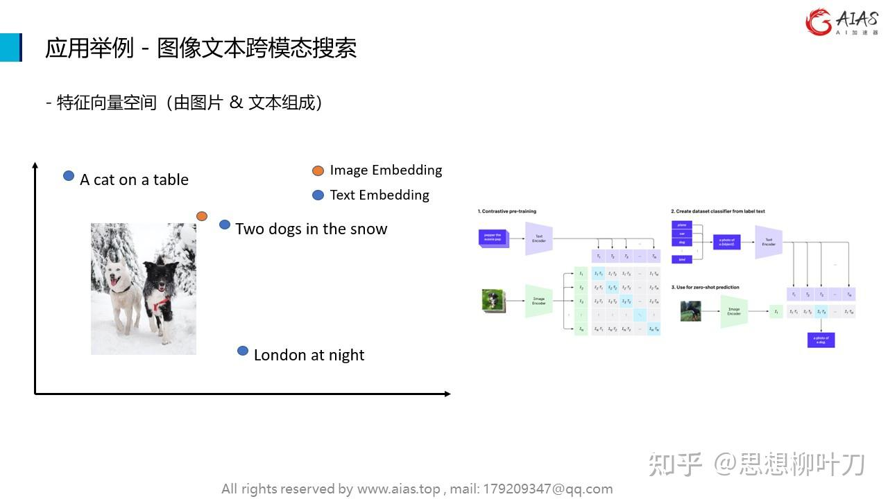

使用CLIP将自然语言识别与图像识别结合在一起，对日常生活中的图像和语言有了更好的理解。之前都是用文字搜文字，图片搜图片，现在通过实现文字搜图片，图片搜文字。其实现思路就是将图片跟文本映射到同一个向量空间。如此，就可以实现图片跟文本的跨模态相似性比对检索。[特征向量空间](https://zhida.zhihu.com/search?content_id=243547320&content_type=Article&match_order=1&q=特征向量空间&zhida_source=entity)由图片和文本组成。

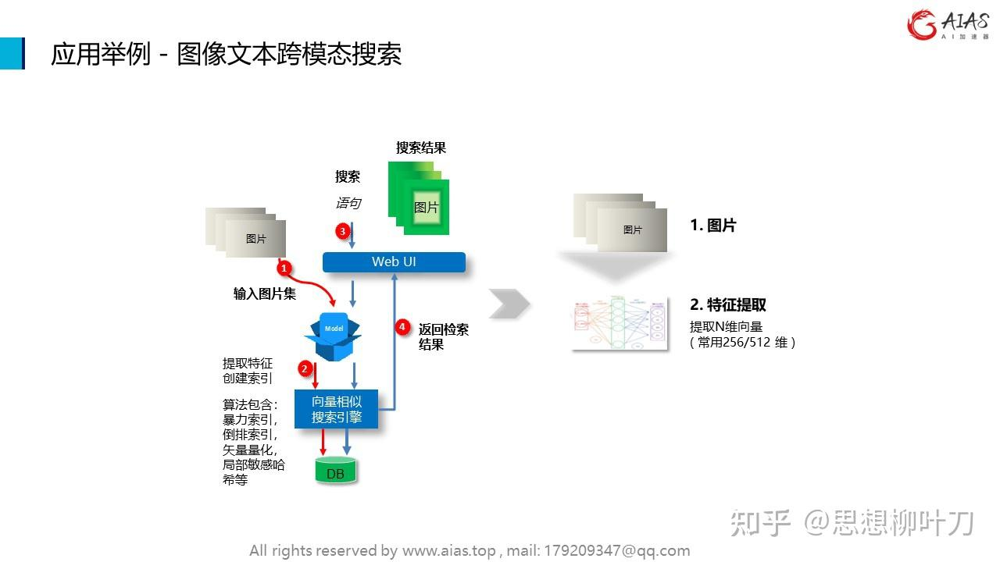

以文搜图或者以图搜图，具体过程都分为两个阶段：

首先是图片入库，图片入库主要包含两个步骤，图片特征提取，以及图片特征入库，也就是存入向量数据库**。**

第二阶段是以文搜图或者以图搜图。首先输入文本，或者上传图片，然后系统会提取文本或者图片的特征，最后根据[特征值](https://zhida.zhihu.com/search?content_id=243547320&content_type=Article&match_order=1&q=特征值&zhida_source=entity)去向量数据库进行检索，获取相似度最高的一组图片，并返回搜索结果。

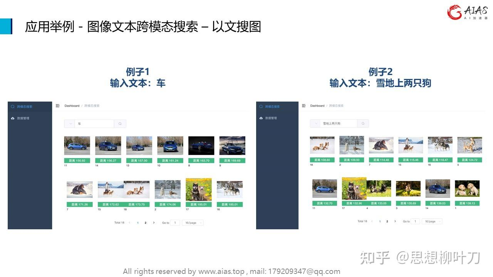

输入文字描述，点击查询，可以看到返回的图片清单，根据相似度排序。如例子2里，输入文本“雪地上有两只狗”，系统首先提取输入文本的特征，然后从向量数据库中检索图片，根据相似度排序后返回。从返回的结果中，我们可以看到，系统很好的理解了输入文本的语义，并返回了对应的图片，相似度高于其它图片。

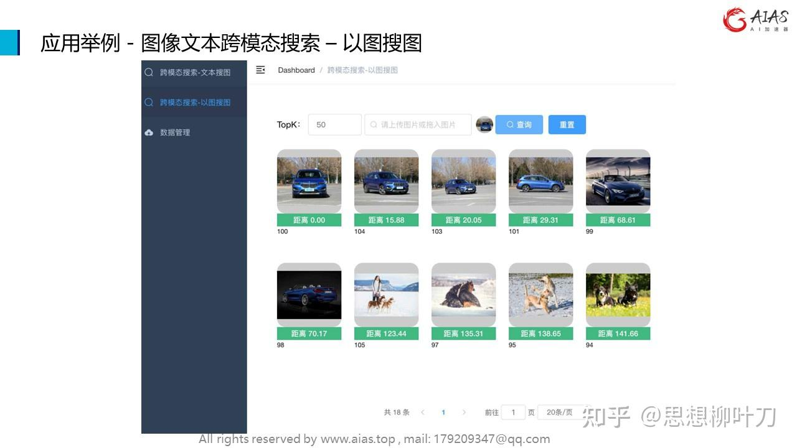

[以图搜图](https://zhida.zhihu.com/search?content_id=243547320&content_type=Article&match_order=3&q=以图搜图&zhida_source=entity)页面里，用户可以上传本地图片，点击查询后，系统首先提取上传图片的特征值，然后根据特征值从向量数据库中检索相似度最高的若干图片，然后根据相似度排序后返回。

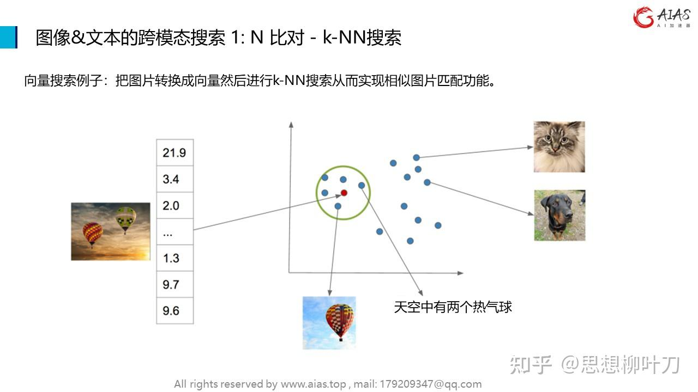

在1比N比对中，k最近邻搜索是一种常用的方法之一。k[最近邻搜索](https://zhida.zhihu.com/search?content_id=243547320&content_type=Article&match_order=2&q=最近邻搜索&zhida_source=entity)是一种基于相似度度量的算法，用于在数据库中找到与查询特征最相似的k个样本。

k最近邻搜索可以用于以下步骤：

首先从输入的图片中提取特征表示，可以是几何特征、外貌特征、[纹理特征](https://zhida.zhihu.com/search?content_id=243547320&content_type=Article&match_order=1&q=纹理特征&zhida_source=entity)或深度特征。

然后将提取的特征与数据库中存储的特征进行比对。**k最近邻搜索中，对于每个查询特征，系统会计算其与数据库中所有特征的相似度，并选择最相似的k个特征。**

k最近邻搜索的优点包括简单易懂、易于实现和调试。然而，对于大规模数据库和[高维特征空间](https://zhida.zhihu.com/search?content_id=243547320&content_type=Article&match_order=1&q=高维特征空间&zhida_source=entity)，k最近邻搜索可能会变得计算密集，因为需要计算查询特征与数据库中所有特征的相似度。

在实际应用中，可以根据具体的需求和场景选择合适的k值，以平衡搜索速度和准确性。此外，还可以结合其他技术，如索引结构、降维技术等索引策略，来提高搜索效率和准确性。

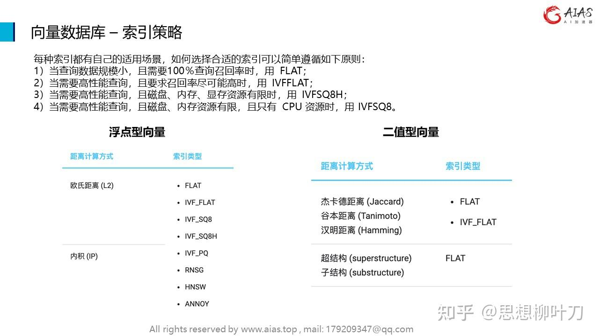

[向量数据库](https://zhida.zhihu.com/search?content_id=243547320&content_type=Article&match_order=5&q=向量数据库&zhida_source=entity)是一种用于高效搜索和检索大规模数据集的工具，它利用[向量化](https://zhida.zhihu.com/search?content_id=243547320&content_type=Article&match_order=1&q=向量化&zhida_source=entity)表示数据并通过计算向量之间的相似度来实现快速的检索。在向量引擎中，索引策略起着至关重要的作用，影响着检索效率和准确性。每种索引都有自己的适用场景。常用的数据类型有浮点型向量和二值型向量。

以下是一些常见的向量引擎索引策略：

\1. [倒排索引](https://zhida.zhihu.com/search?content_id=243547320&content_type=Article&match_order=1&q=倒排索引&zhida_source=entity)：倒排索引是一种常见的索引策略，通常用于文本搜索。它将每个文档表示为一个向量，并建立一个从单词到包含该单词的文档列表的映射。这样，当用户查询某个单词时，可以快速找到包含该单词的文档。

\2. [近似最近邻搜索](https://zhida.zhihu.com/search?content_id=243547320&content_type=Article&match_order=1&q=近似最近邻搜索&zhida_source=entity)：在大规模数据集中，精确的最近邻搜索可能会变得非常耗时。近似最近邻搜索通过牺牲一定的准确性来加快搜索速度，常用的方法包括局部敏感哈希和[近似最近邻算法](https://zhida.zhihu.com/search?content_id=243547320&content_type=Article&match_order=1&q=近似最近邻算法&zhida_source=entity)。

\3. 向量量化：向量量化是一种将连续的向量映射到离散的码本中的技术。通过将向量映射到码本中的近似向量，可以减少存储空间和加速搜索过程。

\4. 图结构索引：对于具有复杂关系的数据集，图结构索引可以更好地捕捉数据之间的关联关系，从而提高检索效率。

这些索引策略可以根据具体的应用场景和数据特点进行选择和组合，以实现高效的数据检索和搜索功能。

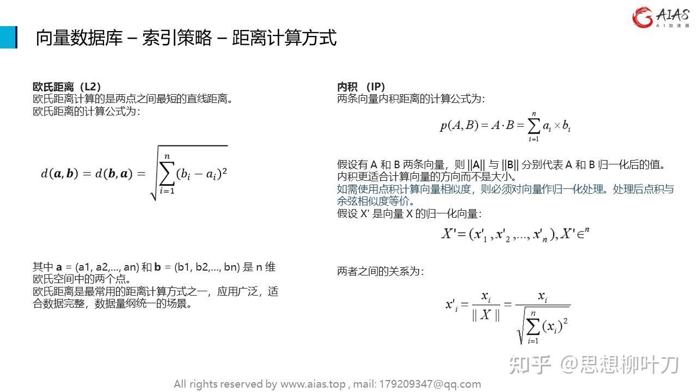

常用的距离计算方式有[欧氏距离](https://zhida.zhihu.com/search?content_id=243547320&content_type=Article&match_order=1&q=欧氏距离&zhida_source=entity)计算与内积计算。

欧氏距离计算的是两点之间最短的直线距离。欧氏距离是最常用的距离计算方式之一，应用广泛，适合数据完整，数据量纲统一的场景。

如需使用内积也叫点积计算向量相似度，则必须对向量作归一化处理。处理后点积与[余弦相似度](https://zhida.zhihu.com/search?content_id=243547320&content_type=Article&match_order=1&q=余弦相似度&zhida_source=entity)等价。

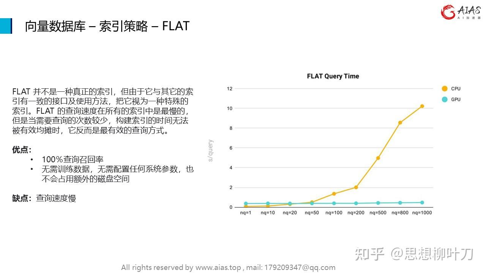

在向量数据库中，索引策略是指如何有效地组织和管理向量数据，以便快速检索和查询。FLAT是一种常见的索引策略，它的设计思想很简单，就是将所有向量数据都放在一个扁平的结构中进行存储和索引。

该索引策略的优点是简单直观，适用于小规模的向量数据集。但是随着数据规模的增大，可能会导致检索速度变慢，因为需要遍历整个数据集来比对，然后进行排序，获取目标向量集。因此，在处理大规模向量数据时，通常会采用更复杂的索引策略，来提高检索效率。

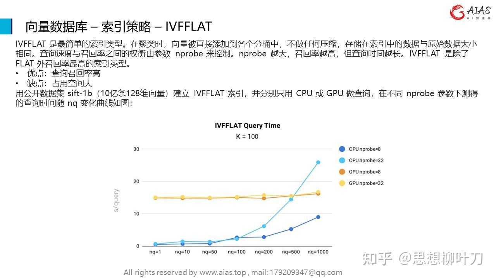

[倒排文件](https://zhida.zhihu.com/search?content_id=243547320&content_type=Article&match_order=1&q=倒排文件&zhida_source=entity)扁平索引是一种用于加速近似最近邻搜索的索引策略，通常用于大规模数据集上。它结合了倒排文件和扁平索引的优点，以提高搜索效率。

其基本思想是将数据集分成多个子集，称为聚类或者子空间，然后为每个子集构建一个倒排文件。在搜索时，首先根据查询向量的特征找到最可能包含最近邻的子集，然后只在这些子集中进行[线性搜索](https://zhida.zhihu.com/search?content_id=243547320&content_type=Article&match_order=1&q=线性搜索&zhida_source=entity)，从而减少搜索的计算量。

这种索引策略优点包括：

\1. 减少搜索空间：通过将数据集分成多个子集，可以减少搜索的空间，从而加快搜索速度。

\2. 索引结构简单：结合了倒排文件和扁平索引的优点，具有较简单的索引结构，易于实现和维护。

\3. 适用于大规模数据集：适用于大规模数据集上的近似最近邻搜索，能够在海量数据中快速找到近似的最近邻。