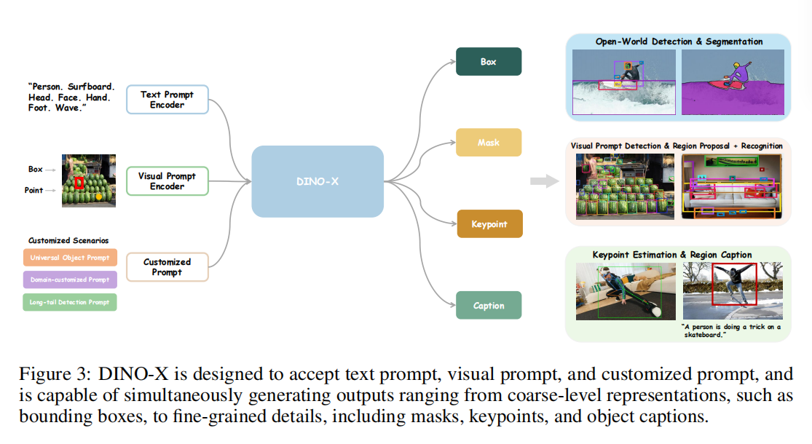
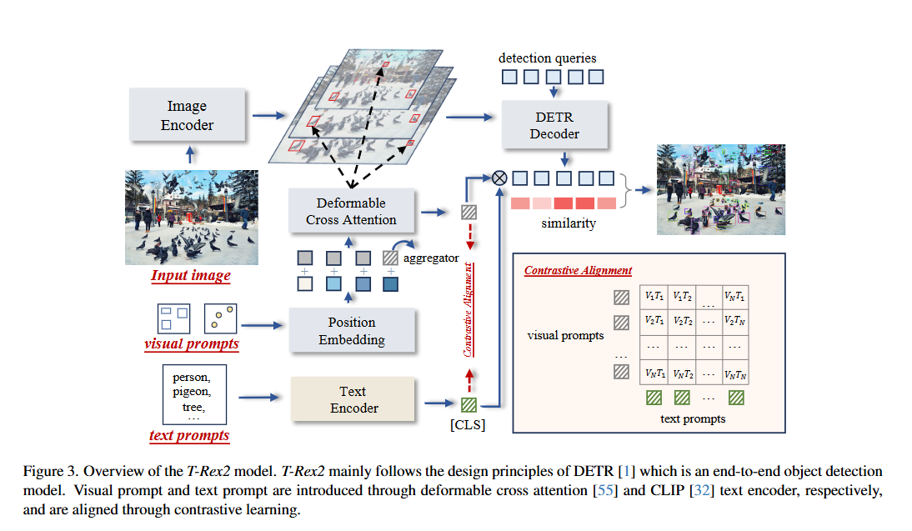
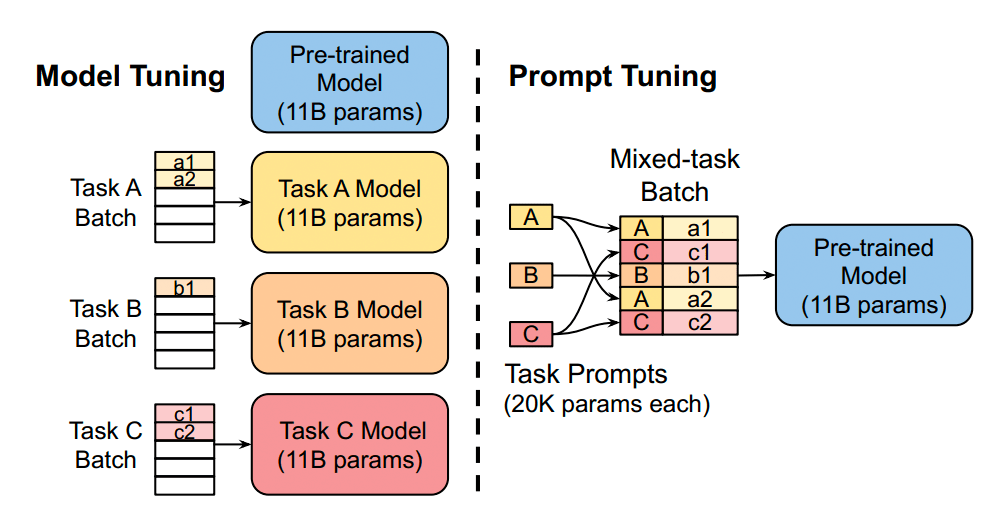

# DINO-X: A Unified Vision Model for Open-World Object Detection and Understanding

> - 技术报告 
> - https://blog.csdn.net/hhhhhhhhhhwwwwwwwwww/article/details/143986858
> - 一种统一的以对象为中心的视觉模型。
> - 为了使长尾对象检测变得容易，DINO-X扩展了其输入选项，以支持文本提示、视觉提示和自定义提示。
> - 我们开发了一个通用的对象提示，以支持无提示的开放世界检测，从而可以在不需要用户提供任何提示的情况下检测图像中的任何内容。

- 文本提示编码器：在 DINO-X Pro 中，我们使用预训练的 CLIP [65] 模型作为我们的文本编码器

- 视觉提示编码器：我们采用了T-Rex2[18]中的**视觉提示编码器**，并将其整合以利用用户定义的视觉提示（包括框和点格式）来增强目标检测。这些提示通过使用正弦余弦层转换为位置嵌入，然后投影到一个统一的特征空间中。模型通过不同的线性投影来区分框和点提示。然后，我们使用与T-Rex2中相同的多尺度可变形交叉注意力层，根据用户提供的视觉提示从多尺度特征图中提取视觉提示特征。
  - (ECCV 2024) T-Rex2: Towards Generic Object Detection via Text-Visual Prompt Synergy 
    - 以前的基于文本提示的开放集对象检测方法有效地封装了常见对象的抽象概念，但由于数据稀缺和描述限制，难以处理罕见或复杂的对象表示。相反，视觉提示在通过具体的视觉示例描绘新颖对象方面表现出色，但在传达对象的抽象概念方面不如文本提示有效。认识到文本和视觉提示的互补优势和劣势，我们引入了T-Rex2，通过对比学习在单个模型中协同两种提示。T-Rex2接受多种格式的输入，包括文本提示、视觉提示以及两者的组合，因此它可以通过在两种提示模式之间切换来处理不同的场景。
    - 
- 自定义提示：在DINO-X Pro中，我们定义了一系列专门的提示语，被称为定制化提示。这些提示语可以通过提示调优技术进行微调，以便在资源高效和成本效益高的方式下覆盖更多长尾、领域特定或功能特定的场景，同时不会损害其他能力。
  - (*EMNLP*, 2021) The Power of Scale for Parameter-Efficient Prompt Tuning.
    - prompt tuning(P-Tuning)冻结了整个预训练模型，仅允许对每个下游任务在输入文本前添加额外的可调整token数量进行调整。这种“**软提示(Soft Prompt)**”通过端到端训练，可以浓缩整个标注数据集的信号.
    - 
  - 例如，**我们开发了一个通用的对象提示**，以支持无提示的开放世界检测，使得能够检测图像中的任何对象，从而扩展了其在屏幕解析[35]等领域的潜在应用。[35] OmniParser for Pure Vision Based GUI Agent
- Box Head: 在Grounding DINO [33]的基础上，我们采用了语言引导的查询选择模块来选择与输入提示最相关的特征作为解码器对象查询。然后将每个查询输入到Transformer解码器中，并逐层更新，接着是一个简单的MLP层，用于预测每个对象查询对应的边界框坐标。与Grounding DINO类似，我们使用L1损失和G-IoU [49]损失进行边界框回归，同时使用对比损失将每个对象查询与输入提示对齐以进行分类。
- Mask Head：遵循Mask2Former [4]和Mask DINO [28]的核心设计，我们通过融合1/4分辨率的骨干特征和Transformer编码器上采样后的1/8分辨率特征来构建像素嵌入图。然后，我们将Transformer解码器中的每个对象查询与像素嵌入图进行点积运算，以获得查询的掩码输出。为了提高训练效率，仅在掩码预测中使用了来自骨干的1/4分辨率特征图。我们还遵循[24, 4]的做法，仅在最终掩码损失计算中为采样点计算掩码损失。
- Keypoint Head：关键点头部接收来自DINO-X的与关键点检测相关的输出，例如人物或手部，并使用一个独立的解码器来解码对象的关键点。每个检测输出被视为一个查询，并扩展成一定数量的关键点，然后发送到多个可变形Transformer解码器层以预测所需的关键点位置及其可见性。这个过程可以看作是一个简化的ED-Pose[68]算法，它不需要考虑对象检测任务，只专注于关键点检测。在DINO-X中，我们实例化了两个关键点头部，分别用于人物和手部，它们分别有17个和21个预定义的关键点。
- Language Head：语言头部是一个可任务提示的小型生成语言模型，用于增强DINO-X理解区域上下文的能力，并执行超出定位的感知任务，如对象识别、区域描述、文本识别以及基于区域的视觉问答（VQA）。我们的模型架构如图4所示。对于DINO-X检测到的任何对象，我们首先使用RoIAlign [15]操作符从DINO-X的骨干特征中提取其区域特征，结合其查询嵌入形成我们的对象标记。然后，我们应用一个简单的线性投影以确保它们的维度与文本嵌入对齐。轻量级的语言解码器将这些区域表示与任务标记集成，以自回归的方式生成输出。可学习的任务标记赋予语言解码器处理各种任务的能力。

