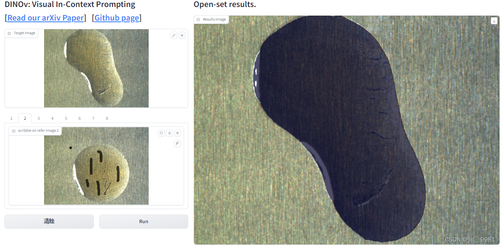
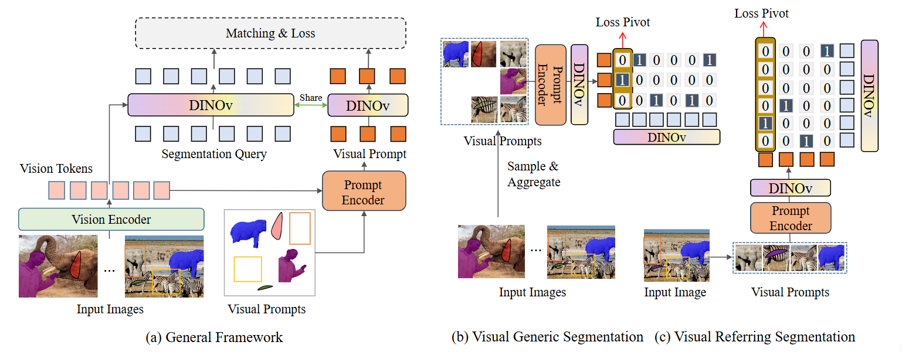
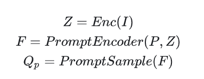
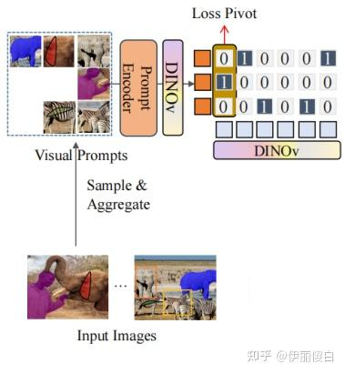
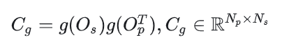
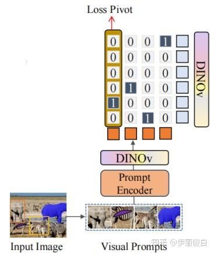
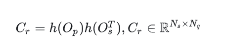
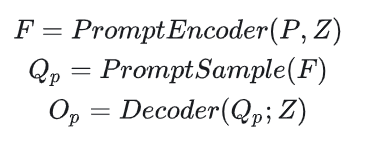
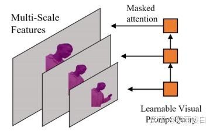
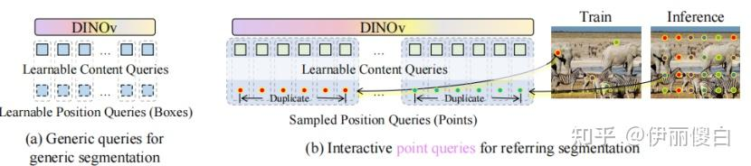

# [DINOv](https://github.com/UX-Decoder/DINOv) ：Visual In-Context Prompting

> 作者在文中提出的模型支持视觉上下文提示，以适用于所有类型的[图片分割](https://zhida.zhihu.com/search?content_id=236809478&content_type=Article&match_order=1&q=图片分割&zhida_source=entity)模型。
>
> 作者提出的模型称为DINOv，基于统一检测和分割模型MaskDINO。
>
> 模型为encoder-decoder结构，带有额外的抽取提示的encoder去制定和采样视觉提示。
>
> 解码器采用分割查询和参考提示查询来生成分割掩码和目标视觉提示，并将输出的分割掩码与目标提示查询关联起来，以获得最终的输出。
>
> 视觉上下文可以定义为一个集合，包括：参考图片（Q）--视觉提示（A）对
>
> 提示可以是任何类型的提示，如掩码，涂画，边框。
>
> 通过上下文提示，模型接收一个目标图片，并输出其掩码。


## DEMO

> https://zhuanlan.zhihu.com/p/669055698

上下文提示是一种利用少量示例任务来指导模型完成新任务的技术。在视觉任务中，这种技术可以通过提供一组带有标签的图像作为示例，来引导模型理解和解决新的视觉任务。

现有的视觉提示方法侧重于参考分割来分割最相关的对象，但没有解决许多通用的视觉任务，如开集分割和检测。

作者建立在编码器-[解码器](https://zhida.zhihu.com/search?content_id=236809478&content_type=Article&match_order=1&q=解码器&zhida_source=entity)架构之上，并开发了一个通用的提示编码器来支持各种提示，如笔画、框和点。

> - Closed-Set模型只需要关注有限数量的已知类别，答案选项是预先定义的，这意味着模型的输出范围是有限的、固定的，并且只限于训练时已知的选项
> - Open-Set模型可以识别不属于任何已知类别的样本，即其输出范围不是固定的，具备一定的泛化能力和鲁棒性，以应对这些未知的挑战，例如SAM。

下图是DINOv作者提供的demo界面，左上角输入油污推理图，左下角输入多张油污示例图，并用画笔进行mask，运行模型可得到右边的推理效果。



## Method



Mask DINO是DINO [32]的延伸。在内容查询嵌入之上，DINO有两个分支用于框预测和标签预测。框被动态更新并用于引导每个Transformer解码器中的可变形注意力。Mask DINO为掩码预测增加了另一个分支，并最小限度地扩展了检测中的几个关键组件，以适应分割任务。

给定N个参考图片 I={I1,...,IN} ，和对应的提示 P={p1,...,pN} ，DINOv目的是在新的目标图片 It 上分割感兴趣的目标。感兴趣的的物体可以是参考的分割（参考分割）或者相同语义的所有物体（通用分割）。

### **2.1. 特征输入**

输入图片记为**I**，输入的视觉提示记为**P**。（视觉提示可以是掩码，边界框，点，笔画等等。）

### **2.2. 特征抽取**

输入图片I经过视觉编码器得到视觉Tokens，记为**Z。**

**Z**和**P**同时输入到提示编码器得到视觉提示**F**



### 2.3. **采样和生成**

对视觉提示**F**进行采样得到查询视觉提示特征 Qp **。（不同任务的采样和分类不同，后面会介绍针对不同任务的具体采样方法）**

同时生成用于抽取建议的分割查询 Qs

### 2.4. **交叉注意解码**

Qp 和 Qs 共享同一个解码器DINOv，解码时两者都使用[交叉注意力机制](https://zhida.zhihu.com/search?content_id=236809478&content_type=Article&match_order=1&q=交叉注意力机制&zhida_source=entity)与视觉Token **Z**进行交叉注意。

Qp 解码得到输出分割查询特征 Op ， Qs 解码得到输出目标视觉提示 Os 。

### 2.5. **[分类任务](https://zhida.zhihu.com/search?content_id=236809478&content_type=Article&match_order=1&q=分类任务&zhida_source=entity)**

### 2.5.1. **通用分割任务**

对于通用分割任务，如实例和[全景分割](https://zhida.zhihu.com/search?content_id=236809478&content_type=Article&match_order=1&q=全景分割&zhida_source=entity)任务，典型的目标是将目标特征**Os**分类到各自的类别。



对于视觉提示的通用分割任务，将所有的视觉提示 Qp 进行分组，属于相同类别的 Qp 在同一个组，然后对每一组取平均值送入到提示Encoder，得到类别嵌入 Op 。

之后将 Op 作为类别嵌入，然后将每一个建议抽取 Qs 的输出 Os 分类，将其归类到所属的 Op 。（将 Os 归到 Op 个类）。因此通用分割任务能够将属于同一语义的物体分割出来。

公式表达如下：



Np 和 Ns 表示视觉提示和物体特征的个数。

g(∙ ) 是[线性映射](https://zhida.zhihu.com/search?content_id=236809478&content_type=Article&match_order=1&q=线性映射&zhida_source=entity)，用于通用区域分割任务。

### 2.5.2. **参考分割任务**



每一个视觉提示 Qp 用于识别目标图片中最接近匹配实例。将每个视觉提示 Op 分类到目标图片中特定的实例。（ 将归为类将Op归为Os类 ）。

不同于通用分割任务，参考分割任务中，每一个视觉提示都是一个类别，所以参考分割任务能够把每个视觉提示描述的物体分割出来。

公式表达记为：

参考分割，建立每一个提示 Op 与分割查询 Os 的对应矩阵，计算每个提示对应哪一个分割查询。


### 2.6. **PrompEncoder的结构**

已知视觉提示编码，采样，解码的过程如下：



其中提示编码器会将视觉提示**P**和视觉Token **Z**一起编码，这种模式的编码，最容易想到的方式是使用预训练视觉编码器，如CLIP，去根据用户提示处理参考图片。

但是这样有三个问题：

一是视觉编码器使用裁剪的图片作为输入，这会导致域偏移。 尤其是对小物体。

二是从CLIP抽取到的视觉特征偏向于具有[语义性](https://zhida.zhihu.com/search?content_id=236809478&content_type=Article&match_order=1&q=语义性&zhida_source=entity)，无法满足VOS任务。



为了解决此问题，以及为了捕获不同粒度的视觉详细信息，作者重用模型中的视觉Encoder，将图片不同的层进行输出，得到不同分别率大小的图片（3张）。

然后使用3层掩码注意力层，使用可学习的视觉提示查询，抽取对应区域的视觉特征。

每一层使用从不同层抽取到的图片特征作为输入，**使用视觉输入中定义的区域作为掩码（如上图中红色部分），然后使用可学习的查询去处理对应区域的特征，以获得视觉提示特征。**

### 2.7. **提示采样**

### 2.7. 1参考分割采样

使用“自参考”的方式，引用图片就是目标图片。

从一个实例中采样一个提示，然后训练模型从Segmentation查询中引用相同的实例。


### 2.7. 2通用分割采样

先对一个训练批次中所有图片参考视觉提示*F*按照类别进行分组。

然后对于每一个语义类别，随机选择N个参考视觉提示。

然后对每一类别进行聚合，生成参考视觉提示tokens，记为Qp。假设有M个类别，则Qp的长度为M，为M个语义类别的参考视觉提示。

```python
def Prompt_Sample(F): #F是参考视觉提示列表，长度为M
      #-----------------------------对F分组-----------------------------------
      C=Unique(C); #获得一个训练批次中所具有的语义类别。C是一个训练批次中，包含所有语义类别的list。
      FC=Dict();#定义视觉提示字典，Fc是视觉提示字典，key是语义类别，value是参考视觉提示
      FC[c]=[] for c in C ; #初始化视觉提示字典Fc，将一批次中的每个语义类别初始化成一个空列表
      Fc[c].append(f) for c,f in zip(C,F);#在视觉提示列表F中收集语义提示，将其归类到字典中各自的语义类别列表
      #---------------------------采样----------------------------------------
      n = Randint(1,N); #随机生成N个整数
      Sc = RandomSelect(Fc[c],n ) for c in C;#在视觉提示字典Fc中，每个语义类别随机选择n个视觉提示。
      #----------------------------聚合----------------------------------
      Qp =[  Aggregate(Sc[c]) for c in C  ]；#将每个语义类别的参考视觉提示进行聚合（可以是平均或方差）。
```

### 2.8. 分割查询的设计



两种类型的分割查询设计

### 2.8.1. 通用分割

使用类似与MaskDINO的可学习查询。


### 2.8.2. 视觉参考任务

使用Semantic-SAM的交互点查询。

[位置查询](https://zhida.zhihu.com/search?content_id=236809478&content_type=Article&match_order=1&q=位置查询&zhida_source=entity)：视觉提示（点或框）都被转换为anchor框格式，然后每个视觉提示的位置被编码为位置查询。

每个位置查询被复制，并用于与不同粒度的内容查询进行结合作为最终的分割查询。

在训练阶段，为了避免过度的开销计算，作者采样一个视觉概念中的一个点子集作为正样本点查询，采样剩余区域中一个[点子集](https://zhida.zhihu.com/search?content_id=236809478&content_type=Article&match_order=2&q=点子集&zhida_source=entity)作为负样本点查询。

在推理阶段，在20×20均匀分布网格上的初始点位置查询作为单个frame的初始点位置。
