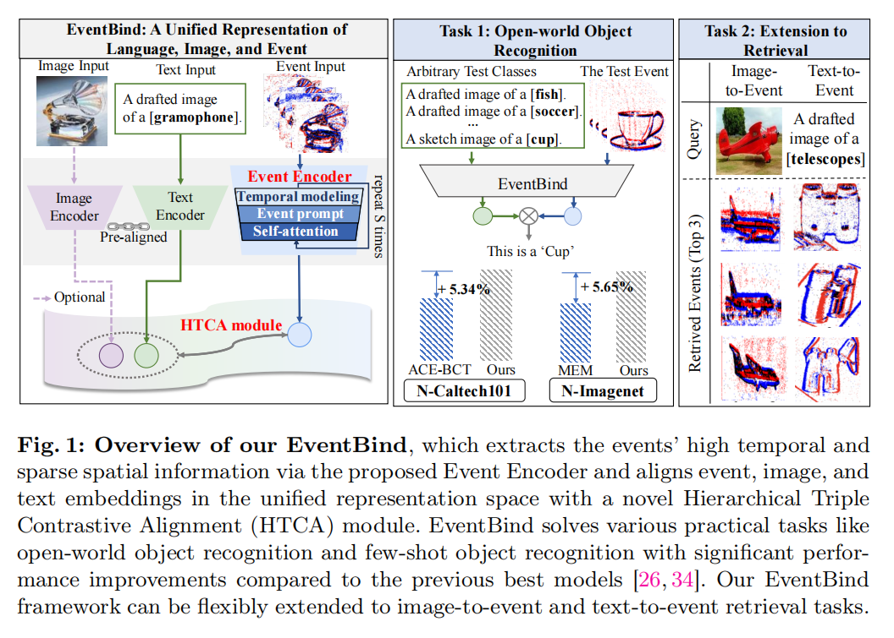
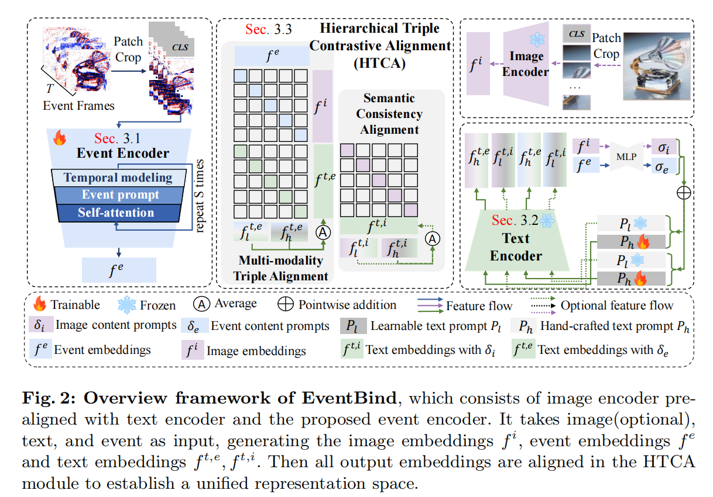
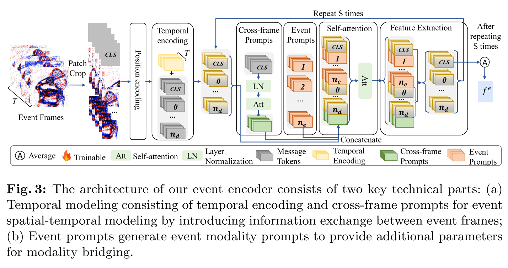
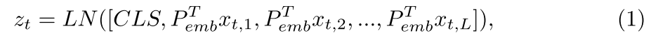
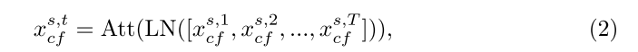
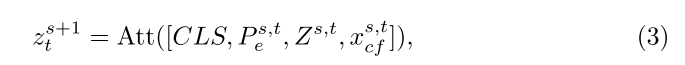

# EventBind: Learning a Unified Representation to Bind Them All for Event-based Open-world Understanding

摘要。在本文中，我们提出了EventBind，这是一个新颖且有效的框架，它释放了视觉语言模型（VLMs）在基于事件的识别中的潜力，以弥补大规模基于事件的数据集的不足。特别是，**由于与图像文本数据存在显著的模态差距以及缺乏大规模数据集，为图像、文本和事件学习一个共同的表示空间并非易事**。直观地看，我们需要解决两个关键挑战：**1）如何将CLIP的<u>视觉编码器</u>泛化到事件数据，同时充分利用事件的独特属性，例如稀疏性和高时间分辨率；2）如何有效地对齐多模态嵌入，即图像、文本和事件。**因此，我们首先引入了一个**新颖的事件编码器**，**它巧妙地模拟了事件中的时间信息，并同时生成事件提示以进行模态桥接。**然后，我们**设计了一个文本编码器，它生成内容提示并利用混合文本提示来增强EventBind在不同数据集上的泛化能力**。通过提出的**事件编码器、文本编码器和图像编码器，引入了一个新颖的层次三重对比对齐（HTCA）模块，以联合优化三个模态之间的相关性，并实现高效的跨模态知识转移**。我们评估了包括微调和少样本学习在内的多种设置，在三个基准测试上，我们的EventBind与之前的方法相比，达到了新的最先进准确率。具体来说，在N-Caltech101上，使用微调和20样本设置分别提高了5.34%和1.70%，在N-Imagenet上分别提高了5.65%和1.99%。此外，我们的EventBind可以灵活地扩展到使用文本或图像查询的事件检索任务，并显示出合理的表现。

图1：我们EventBind的概述，它通过提出的事件编码器提取事件的高时间性和稀疏空间信息，并通过新颖的层次三重对比对齐（HTCA）模块在统一的表示空间中对齐事件、图像和文本嵌入。EventBind解决了各种实际任务，如开放世界物体识别和少样本物体识别，与之前最佳模型[26, 34]相比，性能有显著提升。我们的EventBind框架可以灵活扩展到图像到事件和文本到事件的检索任务。

图2：EventBind的总体框架概述，它由与文本编码器预先对齐的图像编码器和提出的事件编码器组成。它接受图像（可选）、文本和事件作为输入，生成图像嵌入f_i、事件嵌入f_e以及文本嵌入f_t,e, f_t,i。然后所有输出嵌入在HTCA模块中对齐，以建立一个统一的表示空间。

图3:我们的事件编码器架构由两个关键技术部分组成:(a)由时间编码和跨帧提示组成的时间建模，通过在事件帧之间引入信息交换来进行事件时空建模;(b)事件提示生成事件模态提示，为模态桥接提供额外参数。

### **3.1 Event Encoder**

我们提出了一种新颖的事件编码器，它包含两个关键技术部分：1）事件时间建模，以有效利用事件帧之间的独特时间信息；2）事件提示生成，作为额外的模态桥接参数，而不会引入过多的参数，从而使其效率和可转移性得以实现。

具体来说，我们将原始事件转换为一系列具有空间大小H×W的T帧的事件框架$I^e∈R^{T×H×W×3}$(请参阅供应中事件框架表示的更多详细信息)。然后将每一帧划分为L个不重叠的P×P方形patch，其中$L = H×W/P^2$。对于每个事件帧，将所有的patch被平铺成一个$3P^2$维向量，表示为$\{x_t,i∈R^{3P^2}\}^L_i$，其中t为帧号，i为patch号。所有的patch向量通过与线性投影$P_{emb}∈R^{3P^2×D}$的矩阵乘法投影到D维。此外，附加的类令牌，即CLS，被连接在每帧补丁令牌序列的开始。事件框架t的输入令牌序列$z_t∈R^{(L+1)×D}$可表示为:

式中LN(.)表示层归一化，[.]表示串联操作;xt中，L为原始消息令牌，其中t为事件帧号，L为补丁总数。

**事件时态建模**。为了在事件框架之间建立唯一的时间相关性，我们将时间编码e与事件编码器的输入令牌序列$z_t$相加，其中$e =e_{spatial}+e_{temporal}$。$e_{spatial}$和$e_{temporal}$分别表示空间和时间位置编码。在CLIP[40]之后，$e_{spatial}$和$e_{temporal}$是可学习的参数，并且是随机初始化的。除了时间编码外，事件编码器还引入了跨帧提示，以便在事件帧之间交换信息，从而实现更好的时间信息传输。具体如图3所示，对于事件编码器的第s层，从输入序列$z^s_t$, t = 1,2，…T中提取所有T个事件帧中的**类令牌**，然后依次送入范数层[2]和自注意力机制[47]，目的是得到第s层交叉帧提示$x^{s,t}_{cf}$如下:

**事件提示生成。**在事件时间建模的基础上，捕获了事件框架之间唯一的时间相关性。由于与web规模的图像数据集相比，由于模态差距和较小的事件数据集大小，**微调预训练的图像编码器处理事件数据可能无法保证良好的性能，因此我们提出了事件提示来弥合图像、文本、在不引入过多参数的情况下使用事件模式，否则可能导致灾难性的遗忘[23]**。具体来说，我们在每个编码器层的输入处插入少量可学习参数。提出的事件提示$P_e$是插入到输出令牌序列的可学习向量，位于原始类令牌和其他消息令牌之间(见图中的橙色矩形)。在事件时间建模和事件提示生成之后，我们将原始消息令牌$Z^{s,t}$，事件提示$P^{s,t}_e$和跨帧提示$x^{s,t}_{cf}$，然后将其发送到标准自注意力机制层如下:

令

$$
P_{e}^{s,t} = [p_{1}^{s,t}, p_{2}^{s,t}, ..., p_{n_{e}}^{s,t}]
$$

表示 $ s $-层中针对第 $ t $ 帧的事件模态提示，且  

$$
n_{e}
$$

表示事件模态提示的数量；  

$$
Z^{s,t} = [x_{1}^{s,t}, x_{2}^{s,t}, ..., x_{n_{d}}^{s,t}]
$$

表示去除了第一个分类令牌的原始消息令牌，且  

$$
n_{d}
$$

表示原始消息令牌的数量；  

$$
x_{cf}^{s,t}
$$

为跨帧事件提示；  

$$
\text{Att}(.)
$$

表示自注意力层。然后，我们提取消息令牌，作为事件编码器的下一层（即第 $(s+1)$-层）的输入（参见图 3 特征提取模块）。假设事件编码器  

$$
E_{e}
$$

有 $ S $ 层，则上述过程会迭代 $ S $ 次。最终，我们从令牌序列中提取 CLS 令牌，并通过线性投影  

$$
P_{\text{cls}} \in \mathbb{R}^{D \times D'}
$$

将它们投射到 $ D' $ 维空间。事件嵌入  

$$
f_{e}
$$

最终通过对 $ T $ 帧事件的 CLS 令牌取平均值计算得到。

### 3.2文本编码器

**混合文本提示**  
在基于事件编码器提取事件嵌入后，我们进一步采用混合文本提示 [56] 来增强模型在多样化数据集上的泛化能力：  

1) 手工设计的文本提示 `A drafted image of a [class].`，其中 $[class]$ 表示类别名称。  
每个单词被编码为 $D_p$-维的词嵌入，形成最终的文本令牌 $P_h$；  
2) 可学习的文本提示  

$$
P_l = [P_1, P_2, ..., P_{n_l}, P_\text{class}],
$$

其中 $i = 1, 2, ..., n_l$ 是具有 $D_p$ 维度的随机初始化参数；  
$n_l$ 表示可学习文本提示的数量；  
$P_\text{class}$ 表示 $[class]$ 的词嵌入，而 $[.]$ 表示连接操作。

**内容提示**  
此外，引入内容提示以增强模型性能。  
内容提示由一个简单的两层 MLP 生成。  
具体来说，MLP 将事件嵌入 $f^e$ 和图像嵌入 $f^i$ 作为输入，并生成相应的**事件内容提示**  
$$
\sigma_e \in \mathbb{R}^{1 \times D_p},
$$

和**图像内容提示**  

$$
\sigma_i \in \mathbb{R}^{1 \times D_p},
$$

它们都具有与手工设计文本令牌 $P_h$ 相同的维度 $D_p$。  

接下来，将可学习文本提示 $P_l$ 和手工设计文本提示 $P_h$ 与内容提示 $\sigma_m$ 按元素相加，$m = i, e$，分别生成最终的文本输入（如图 2 所示）。  

随后，由**文本编码器 $E_t$ 生成带有内容提示的可学习文本嵌入**  

$$
f_t^{m}, \quad m = i, e,
$$

和手工设计的文本嵌入 $f_h^{m}, \, m = i, e$。  

最终，通过对 $f_t^{m}$ 和 $f_h^{m}$ 取平均值，获得模态 $m$ 的文本嵌入  

$$
f^{t, m}, \quad m = e, i.
$$

### 3.3 Hierarchical Triple Contrastive Alignment (HTCA) 层次三重对比对齐(HTCA)

利用提取的事件嵌入 $f^e$（第 3.1 节）、图像嵌入 $f^i$、以及带有事件内容提示的文本嵌入 $f^{t,e}$（第 3.2 节），如何弥合图像、文本和事件这三种不同模态之间的模态差异，并有效对齐它们，仍然是一个未解决的问题。  

一个简单的目标是从头开始将 $f^e$ 与 $f^t$ 对齐。然而，事件数据集的相对较小规模和有限的词汇量可能会阻碍可靠的表示和合理的少样本学习性能。  

为此，我们提出了分层三重对比对齐模块（Hierarchical Triple Contrastive Alignment, HTCA），旨在联合对齐事件、图像和文本模态，并基于语义一致性增强模型性能。

**多模态三重对齐**  
我们首先**最小化事件嵌入 $ f^e $ 和图像嵌入 $ f^i $ 之间的对比损失 $ L(f^i, f^e) $**，同时**最小化事件嵌入 $ f^e $ 和带有事件内容提示的文本嵌入 $ f^{t,e} $ 之间的对比损失 $ L(f^e, f^{t,e}) $**。我们忽略了图像-文本对，因为经验观察表明，改变预训练的图像-文本对齐会降低性能。具体来说，对比损失是通过对小批次中的每对模态 $ M^1 $ 和 $ M^2 $ 进行平均计算得到的，其公式如下：
$$
L(M^1, M^2) = \frac{1}{N} \sum_{n \in N} -\log \frac{\exp (M_n^1 \cdot M_n^2 / \tau)}{\exp (M_n^1 \cdot M_n^2 / \tau) + \sum_{m \in N, m \neq n} \exp (M_n^1 \cdot M_m^2 / \tau)},
$$

其中 $ \tau $ 为温度系数，$ N $ 表示小批次的大小，$ n, m $ 分别表示小批次中的第 $ n $ 和第 $ m $ 个数据，$ m \neq n $ 和 $ m = n $ 分别表示批次中的负对和正对。

**语义一致性对齐**  
语义一致性表明，从同一项目的不同模态生成的嵌入具有相同的语义意义，例如，配对的文本和事件数据，导致它们在表示空间中的距离更接近。鉴于此，我们提出了语义一致性对齐，以提高模型性能，并继承预训练 CLIP (第 4.3 节) 的显著少样本能力。具体来说，我们通过采用损失函数 $ L(f^{t,i}, f^{t,e}) $，确保图像和事件内容添加文本嵌入 $ f^{t,i} $ 和 $ f^{t,e} $ 之间的语义一致性，以及附加的均方误差（MSE）损失 $ \text{MSE}(f_l^{t,m}, f_h^{t,m}) $ 以减少由可学习提示和手工设计提示（第 3.2 节）生成的文本嵌入 $ f_l^{t,m} $ 和 $ f_h^{t,m} $ 之间的差异。

### 3.4 Total Objective

综上所述，如图 2 所示，总目标由 $ L(f^i, f^e) $、$ L(f^e, f^{t,e}) $，以及 $ L(f^{t,i}, f^{t,e}) $ 和 $ \text{MSE}(f_l^{t,m}, f_h^{t,m}) $ 构成，所有这些内容均在第 3.3 节中提到。  
我们通过不同的权衡超参数组合它们：

$$
L_{\text{final}} = \alpha L(f^i, f^e) + \beta L(f^e, f^{t,e}) + \theta L(f^{t,i}, f^{t,e}) + \gamma \text{MSE}(f_l^{t,m}, f_h^{t,m}),
$$

其中 $ f^e, f^i, f^{t,e}, f^{t,i} $ 分别表示事件嵌入、图像嵌入、事件内容添加的文本嵌入和图像内容添加的文本嵌入；  
$ \text{MSE}(.) $ 表示均方误差损失函数；  
$ f_l^{t,m} $ 和 $ f_h^{t,m} $ 是分别从可学习和手工设计的文本提示中生成的文本嵌入，其模态提示为 $ m $，其中 $ m $ 可以为 $ e $ 表示事件模态，或为 $ i $ 表示图像模态。

我们将 $ \alpha, \beta, \theta, \gamma $ 的默认值设为 1，因为冻结的 CLIP 可视化编码器作为事件编码器的初始化，确保四个组件的幅度分布在同一尺度上。  
注意，当图像输入不可用时，仅 $ L(f^e, f^{t,e}) $ 参与反向传播，此时将 $ \alpha, \theta, \gamma $ 设为 0，而 $ \beta $ 设为 1。

## 4实验与评价

### 4.1实验设置和数据集

**数据集**  
我们在实验中使用了三个公开的图像-事件-文本配对数据集：N-ImageNet [24]（基于 ImageNet-1K [11]）、N-Caltech101 [15]（基于 Caltech101 [39]）、以及 N-MNIST [39]（基于 MNIST [12]）。我们官方划分了 N-ImageNet 和 N-MNIST 数据集。N-Caltech101 数据集按 4:1 的比例划分为训练集和验证集。零样本、少样本和微调均使用相同的验证集。少样本数据是随机选择的，并保持一致。*实验设置的更多细节请参见补充材料。*

**数据集预处理**  
RGB 图像被调整为 $224 \times 224$ 的分辨率，以确保与 ViT 输入设置一致，而灰度图像通过复制三个相同的通道转换为三通道张量。然后，我们将事件数据转换为事件帧，单帧内的聚合事件计数 $N$ 由超参数搜索决定。*关于 $N$ 的更多讨论参见第 4.3 节以及补充材料中关于事件帧表示的细节。*

**推理与任务设置**  
事件识别是事件视觉中的一个基本任务，表示对事件数据的分类。如图 1 所示，文本类别名称被输入到文本编码器以生成文本嵌入 $f^{t,e}$。事件数据被编码以生成事件嵌入 $f^e$，然后通过 $f^{t,e}$ 和 $f^e$ 的乘积生成最终概率映射，并对其应用 softmax 函数。在微调和少样本事件识别场景下，前者使用整个训练数据集，而后者在训练阶段每个类别仅使用少量的训练样本。

### 4.2事件识别任务结果

**微调设置。**在N-Caltech101、N-MINIST和N-ImageNet数据集上对比各种基线的微调实验结果如表1所示，包括事件自监督预训练方法[26、27、32、37、43、45、55]和监督图像预训练方法的迁移学习[17、19、34、42、51]。与之前的方法相比，我们的EventBind在三个基准上实现了新的最先进的精度。对于N-Caltech101数据集，我们的方法达到了95.29%的Top-1准确率，比之前的SOTA[34]高出+5.34%，比竞争对手[53]高出+1.72%。EventBind在N-ImageNet上达到63.54%的准确率，比SOTA[26]提高了4.79%。对于N-MNIST, EventBind达到99.45%的SOTA准确率，而[45]达到99.10%。微调结果证明了EventBind在有效地将事件数据与文本和图像对齐方面的优越性。我们的EventBind很好地适应了各种对象类的数据集，包括10、101和1000，证明了它的可移植性和鲁棒性。我们采用三个版本的ViT主干:ViT- b -32、ViT- b -16和ViT- l -14。参见第4.3节中关于不同主干的模型参数的更多讨论。

**少量样本学习设置。**我们将EventBind与现有的方法EventCLIP[53]进行比较。为了保证比较的一致性，如EventCLIP所述，使用viti - l -14骨干网。在表2中，EventBind在少量样本学习情况下优于EventCLIP，在NCaltech101上，5射、10射和20射的收益分别为0.92%、1.31%和1.7%。值得注意的是，我们的20次射击准确率超过了之前最先进的(SOTA)[34]，后者是在完整数据集上训练的，而EventBind只使用了N-Caltech101数据集46.09%的数据。对于N-ImageNet数据集，在5拍、10拍和20拍设置下，EventBind的准确率也分别提高了2.78%、2.73%和3.99%，优于EventCLIP，显示了其在低拍场景下的优势。

https://www.jianshu.com/p/2b26ea68c63c

