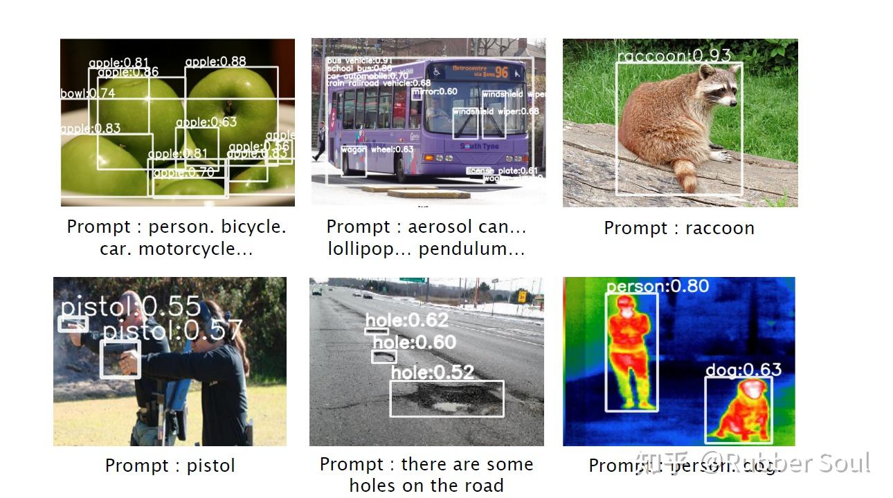
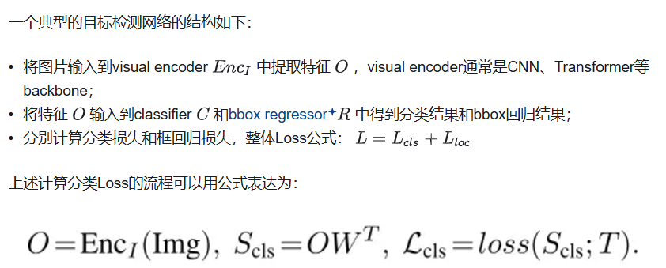
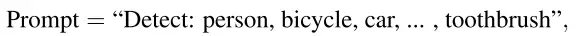
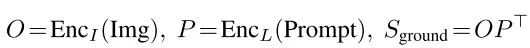
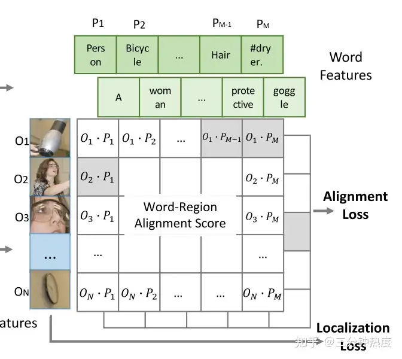
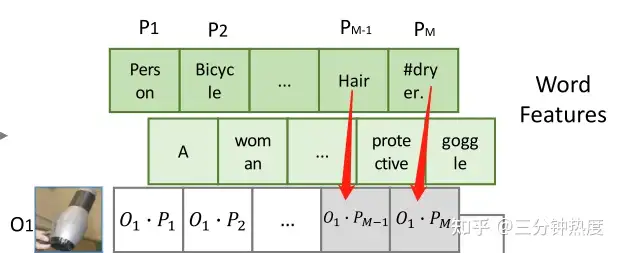
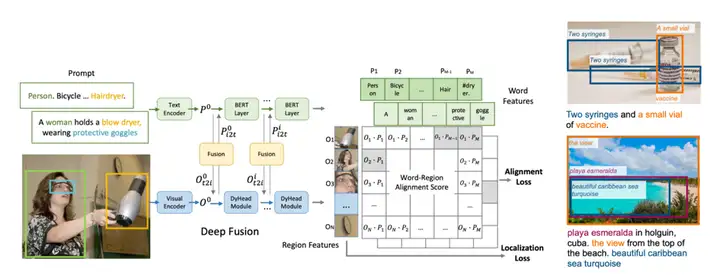
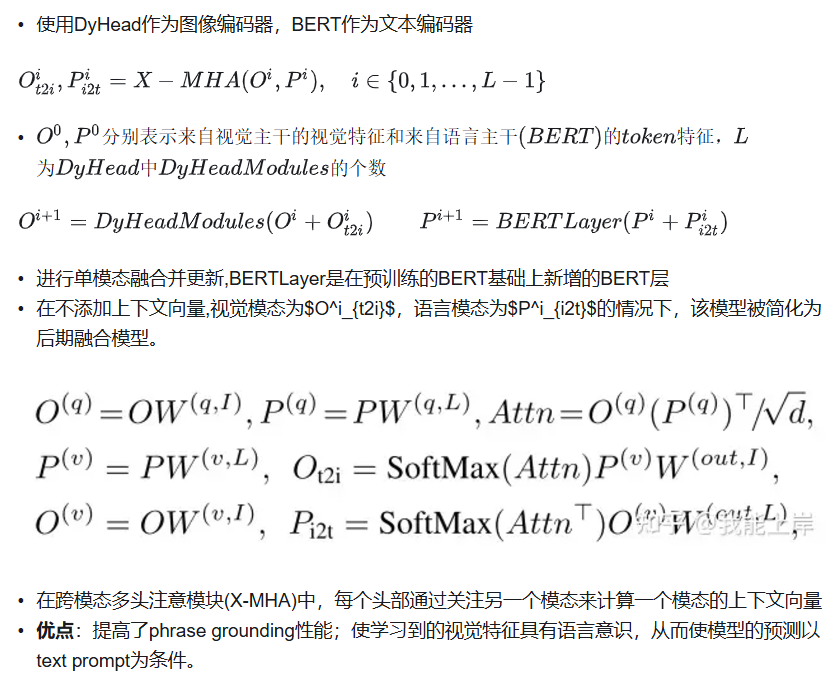
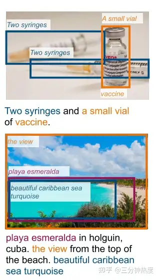

# Grounded Language-Image Pre-training

CLIP适用于分类任务，而GLIP尝试将这一技术应用于**目标检测**等更加复杂的任务中。

在本文中，作者提出了[phrase grounding](https://zhida.zhihu.com/search?content_id=586848979&content_type=Answer&match_order=1&q=phrase+grounding&zhida_source=entity)的概念，意思是让模型去学习图片和句子短语之间更加精细的联系。然后提出了GLIP模型：Grounded Language-Image Pre-training。

总结一下GLIP的贡献：第一，GLIP将grounding任务和detection任务 **统一** 起来，通过实验证明了没有额外提示的grounding任务和detection任务其实是一样的，从而使模型可以学习两者的数据，训练出了更好的grounding模型（也可以说是detection模型）。第二，GLIP采用了一种自学习方法，即通过教师模型标注信息，再让学生模型进行学习，这样不仅可以利用大量信息而无需手工标注，还可以让学生模型学习到大量语义丰富的信息，超越教师模型的表现。

### 1. 何为grounding？

说了那么多，首先的一个问题是，到底什么是grounding？grounding的全称是 **phrase grounding** ，即短语定位，更准确地说是 **识别句子中的短语与图像中的对象（或区域）之间的细粒度对应关系** 。这听起来就跟目标检测很像对不对，目标检测所需要的输入是一张图片，而phrase grounding的输入是一句话和一张图片。那么，当我这句话只是我想要找的物体的名称，那不就和目标检测一样了吗？但是我其实不需要这么做，grounding任务显然更加和CLIP更贴近。phrase ground数据集中大量的语义，本身就是非常非常有价值的信息，当然要被拿来训练。

图1pharsegrounding任务的Prompt.png

观察图1，我们可以看到，pharse grounding不仅可以通过单纯的物体名称来进行检测，也可以通过类似 "there are some holes on the road"这样的句子来进行检测。这无疑是非常有效的，"[on the road](https://zhida.zhihu.com/search?content_id=249880750&content_type=Article&match_order=2&q=on+the+road&zhida_source=entity)"就是一个很好的提示信息。

作者是怎么证明grounding和detection实际上是一件事呢？也很好办，就是把单独的词当成grounding的输入，最后发现训练出来的模型准确度与detection模型一模一样，当然这是在控制了其他变量都一样的情况下。这就说明，grounding和detection确实做的是一件事，我们也可以吧grounding理解成一种更高级的detection。

■  **模型：**

### 2.1 Unified Formulation（统一目标检测和phrase grounding任务）

从模型输入层面来说，GLIP 创造性地将目标检测任务转换为短语定位任务。即，对待任意一张训练图片，把标签用句号隔开，拼接成一句话。通过这种方式，所有的[目标检测数据集](https://zhida.zhihu.com/search?content_id=469786468&content_type=Answer&match_order=1&q=目标检测数据集&zhida_source=entity)都可转化为短语定位数据集。至此，我们便有了文字-重点区域对（word-region pair）。然后，通过对文字和图片分别进行编码，获得了文字与图片各自的特征。

​	与上述分类器不同，GLIP将目标检测任务与phrash grounding统一，将目标检测中的每个region与text prompt进行匹配以实现分类效果。举例来说，假设我们有[person, bicycle, car, ..., toothbrush]等类别，我们可以设计一个这样的prompt，其中每一个类别名字都是一个phrase：

​	我们可以通过添加更加精确的描述或者加载一些pre-trained language model来提升prompt的质量。例如在使用预训练的BERT模型时，像“person. bicycle. car. ... . toothbrush.”这样的prompt表现会更好。grounding模型中的分类流程可以用公式表示为：

通过目标检测中的位置损失 (localization loss) 和分类损失 (classification loss)，从而优化对应区域与文本之间相似度，达到学习区域预测的最终目的。其中，Enc_I即为图片编码器（例如swin transformer），Enc_L即为文本编码器（例如BERT）.P 是language encoder得到的文字特征， Sground 的计算过程如下如图示：

​	在传统的目标检测网络中，每个类别都会分配一个{0，1}的标签用于[classifier](https://zhida.zhihu.com/search?content_id=586848979&content_type=Answer&match_order=2&q=classifier&zhida_source=entity)计算loss。然而，在grounding model中，一个短语（phrase）可能包含多个word tokens，这就导致一个类别可能对应多个子单词（sub-words）。针对这个问题，本文是这样做的：当这些sub-words的phrase与目标region匹配时，每个positive sub-word都与目标region所匹配。例如，吹风机的phrase是“Hair [dryer](https://zhida.zhihu.com/search?content_id=586848979&content_type=Answer&match_order=1&q=dryer&zhida_source=entity)”，那么吹风机的region就会与“Hair”和“dryer”这两个词都匹配，如下图所示：

### 2.2 Language-Aware Deep Fusion（图像-文字特征的深度融合）

​	在这以后，作者引入了“深度融合”（[deep fusion](https://zhida.zhihu.com/search?content_id=469786468&content_type=Answer&match_order=1&q=deep+fusion&zhida_source=entity)）的概念：区别于前期融合（early fusion）和后期融合（[late fusion](https://zhida.zhihu.com/search?content_id=469786468&content_type=Answer&match_order=1&q=late+fusion&zhida_source=entity)），深度融合对两个模态的特征向量计算交叉注意力（cross attention），从而让模型可以在较浅的模型阶段就开始进行跨模态的特征学习。

### 2.3 Pre-training with Scalable Semantic-Rich Data （通过大量语义丰富数据训练的预训练模型）

GLIP训练采用的数据包含了超过2000个类别，并且是bbox+phrase grounding的标注。另外，作者通过实验证明，GLIP可以轻松的扩展到非常罕见的类别上，使用80万金标准训练的模型就可以在另外200万罕见类别测试机上获得很大的提升。

GLIP还提供了一种快速丰富训练数据集的方式：

1）首先，用金标准训练一个[teacher模型](https://zhida.zhihu.com/search?content_id=586848979&content_type=Answer&match_order=1&q=teacher模型&zhida_source=entity)；

2）然后，用teacher模型在新数据上进行预测，获取到检测框和对应的名词，也就是伪标注；

3）最后，用一个[student模型](https://zhida.zhihu.com/search?content_id=586848979&content_type=Answer&match_order=1&q=student模型&zhida_source=entity)同时在金标准数据集和伪标注数据集上训练。

为什么student模型可能会优于teacher模型呢？

作者是这样解释的：起初teacher可能并不知道类似于上图中**疫苗（vaccine）**和**绿宝石（turquoise）**的具体概念，但是它可以根据文字的上下文去猜测，例如根据“a small vial”（一小瓶），GLIP定位到了这个小瓶子，然后[vaccine](https://zhida.zhihu.com/search?content_id=586848979&content_type=Answer&match_order=2&q=vaccine&zhida_source=entity)就可以跟这个小瓶子关联起来了，这种情况被称为“educated guess”。而在训练sutdent模型时，这些“educated guess”就变成了一个强监督信息，从而让模型真正认识疫苗（vaccine）。
