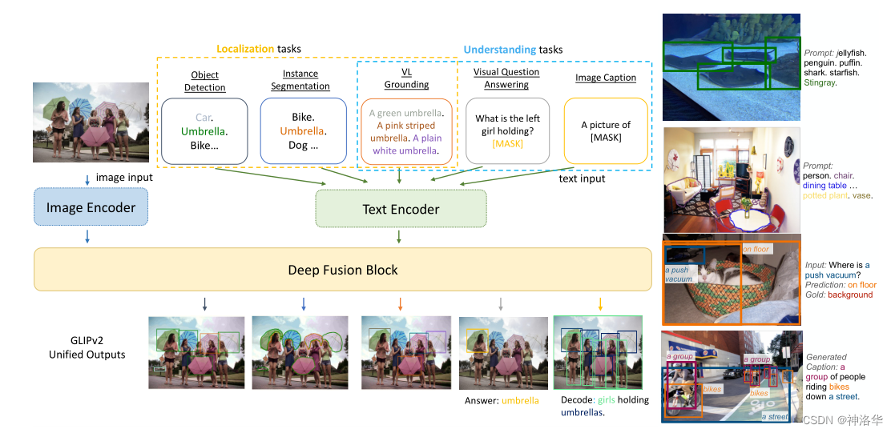

# [GLIPv2: Unifying Localization and Vision-Language Understanding](https://link.csdn.net/?target=https%3A%2F%2Fpaperswithcode.com%2Fpaper%2Fglipv2-unifying-localization-and-vision%3Flogin%3Dfrom_csdn)

> https://zhuanlan.zhihu.com/p/638985390

GLIPv2和GLIPv1架构基本一样，只是融合了更多的任务和[数据集](https://so.csdn.net/so/search?q=数据集&spm=1001.2101.3001.7020)。从论文题目 Unifying Localization and Vision-Language Understanding可以看出，其统一了所有的定位任务（比如分割和检测）和Vision-Language任务。

Vision-Language：语言-视觉任务，包括：

> - vision Caption：图像描述生成，根据一张图片生成描述性文本；
> - VQA：给定一张图片和一个与该图片相关的自然语言问题，计算机能产生一个正确的回答。文本QA即纯文本的回答，与之相比，VQA把材料换成了图片形式，所以这是一个典型的多模态问题；
> - Vision grounding：根据短语定位图片中对应的物体。

​	通过下图可以看到，比起GLIPv1，GLIPv2加了一些text encoder的训练任务，使其表征更加丰富。比如定位任务不光有目标检测还有实例分割，Understanding任务包含了Vision grounding、vision Caption和VQA任务。
  然后就是图片特征和文本特征做Deep Fusion，后面就是一样的处理了。像这样在统一框架下囊括更多任务更多数据集更多模态也是当前的一种趋势，比如去年的OFA、今年的Unified-IO等等。

