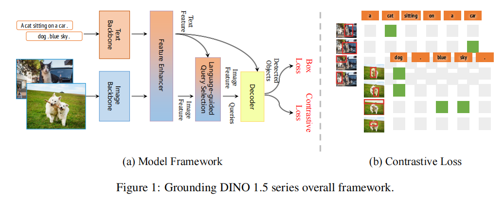

# Grounding DINO 1.5: Advance the “Edge” of Open-Set Object Detection

> 本文介绍了由IDEA研究院开发的Grounding DINO 1.5，一套先进的开放集目标检测模型，旨在推动开放集目标检测的“边缘”进步。该套件包括两个模型：Grounding DINO 1.5 Pro，这是一个高性能模型，设计用于在广泛场景中具有更强的泛化能力；以及Grounding DINO 1.5 Edge，这是一个为许多需要边缘部署的应用程序所优化的高效模型，要求更快的速度。Grounding DINO 1.5 Pro模型通过扩大模型架构、集成增强的视觉骨干网络，并将训练数据集扩展到超过2000万张带有定位注释的图像，从而实现了更丰富的语义理解，从而超越了其前身。尽管设计用于效率并减少了特征规模，但Grounding DINO 1.5 Edge模型通过在相同的全面数据集上进行训练，保持了强大的检测能力。实证结果证明了Grounding DINO 1.5的有效性，其中Grounding DINO 1.5 Pro模型在COCO检测基准测试上达到了54.3 AP，在LVIS-minival零样本迁移基准测试上达到了55.7 AP，为开放集目标检测设定了新的记录。此外，当使用TensorRT进行优化时，Grounding DINO 1.5 Edge模型在LVIS-minival基准测试上实现了零样本性能36.2 AP，同时达到了75.2 FPS的速度，使其更适合边缘计算场景。模型示例和带有API的演示将在https://github.com/IDEA-Research/Grounding-DINO-1.5-API上发布。

