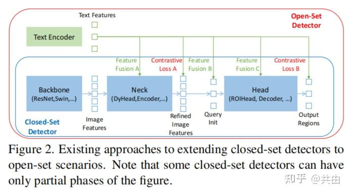
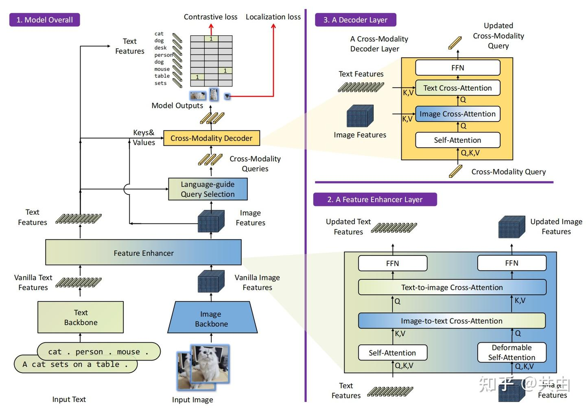

# Grounding DINO: Marrying DINO with Grounded Pre-Training for Open-Set Object Detection

## 写在前面

- 明确说明：开放集目标检测的关键解决方案是将**语言引入[闭集检测器](https://zhida.zhihu.com/search?content_id=239397128&content_type=Article&match_order=1&q=闭集检测器&zhida_source=entity)，用于开集概念泛化**。
- https://zhuanlan.zhihu.com/p/680702265

## Abstract

在本文中，我们提出了一种开放集对象检测器，称为Grounding DINO，**通过将基于Transformer的检测器DINO与真值预训练相结合，该检测器可以通过人类输入（如类别名称或指代表达）对任意物体进行检测**。开放集目标检测的关键解决方案是将**语言引入[闭集检测器](https://zhida.zhihu.com/search?content_id=239397128&content_type=Article&match_order=1&q=闭集检测器&zhida_source=entity)，用于开集概念泛化**。为了有效地融合语言和视觉模态，我们从概念上将闭合集检测器分为三个阶段，并提出了一个紧密的融合解决方案，其中包括**一个特征增强器、一个以语言引导的查询选择和一个跨模态的融合**。虽然以前的工作主要评估对新类别的开放集对象检测，但我们建议也对用属性指定的对象的指代表达理解进行评估。Grounding DINO在三种配置中都表现得非常好，包括COCO、LVIS、ODinW和RefCOCO/+/g上的基准测试。Grounding DINO在COCO检测零样本传输基准上达到52.5AP，即没有COCO的任何训练数据。用COCO数据微调后，Grounding DINO的AP达到63.0。它在ODinW[零样本](https://zhida.zhihu.com/search?content_id=239397128&content_type=Article&match_order=2&q=零样本&zhida_source=entity)基准上设置了一个新记录，AP平均值为26.1。

## intro

​	开放集检测的关键是引入不可见对象泛化的语言[1，7，26]。例如，GLIP[26]将对象检测重新定义为短语基础任务，并引入对象区域和语言短语之间的对比训练。它在[异构数据集](https://zhida.zhihu.com/search?content_id=239397128&content_type=Article&match_order=1&q=异构数据集&zhida_source=entity)上表现出了极大的灵活性，在闭合集和开放集检测上都表现出了显著的性能。尽管GLIP的结果令人印象深刻，但它的性能可能会受到限制，因为它是基于传统的一级检测器动态头设计的。

​	**Grounding DINO比GLIP有几个优势**。首先，它**基于Transformer的架构**类似于语言模型，使它能够轻松的处理图像和语言数据。例如，由于所有的图像和语言分支都是用Transformers构建的，我们可以很容易地在其整个架构中融合[跨模态特征](https://zhida.zhihu.com/search?content_id=239397128&content_type=Article&match_order=1&q=跨模态特征&zhida_source=entity)。其次，基于Transformers的检测器在利用大规模数据集方面表现出卓越的能力。最后，作为一个**类似DETR的模型，DINO可以端到端优化，而无需使用任何手工设计的模块，如NMS（[非极大值抑制](https://zhida.zhihu.com/search?content_id=239397128&content_type=Article&match_order=1&q=非极大值抑制&zhida_source=entity)）**，这大大简化了整个grounding模型的设计。

​	大多数现有的[开放集检测器](https://zhida.zhihu.com/search?content_id=239397128&content_type=Article&match_order=3&q=开放集检测器&zhida_source=entity)是通过将闭合集检测器扩展到具有语言信息的开放集场景来开发的。如图2所示，闭合集检测器通常具有三个重要模块，一个用于特征提取的主干、一个用于特性增强的Neck和一个用于区域细化（或边界框预测）的head。闭合集检测器可以被推广为通过学习语言感知区域嵌入来检测新的对象，使得每个区域可以在语言感知空间中被分类为新的类别。实现这一目标的关键是在neck和/或head输出处使用区域输出和语言特征之间的对比损失。为了帮助模型对齐[跨模态信息](https://zhida.zhihu.com/search?content_id=239397128&content_type=Article&match_order=1&q=跨模态信息&zhida_source=entity)，一些工作试图在最终损失阶段之前融合特征。图2显示了[特征融合](https://zhida.zhihu.com/search?content_id=239397128&content_type=Article&match_order=1&q=特征融合&zhida_source=entity)可以分三个阶段进行：neck(阶段A)、查询query初始化(阶段B)和head(阶段C)。例如，GLIP[26]在neck(阶段A)模块中执行早期融合，OV-DETR[56]使用[语言感知查询](https://zhida.zhihu.com/search?content_id=239397128&content_type=Article&match_order=1&q=语言感知查询&zhida_source=entity)作为head模块(阶段B)输入。

​	与经典检测器不同，基于Transformer的检测器DINO具有与语言块一致的结构。逐层设计使其能够轻松地与语言信息交互。根据这一原则，我们**在颈部、query初始化和head阶段设计了三种特征融合方法，更具体地说，我们通过堆叠自注意力、文本到图像的交叉注意力和图像到文本的交叉注意力作为颈部模块来设计特征增强器。然后，我们开发了一种语言引导的查询选择方法来初始化head的查询。我们还为头部阶段设计了一个具有图像和文本交叉注意力层的[交叉模态](https://zhida.zhihu.com/search?content_id=239397128&content_type=Article&match_order=1&q=交叉模态&zhida_source=entity)解码器，以增强查询表示**。

本文的贡献总结如下：

- 我们提出了Grounding DINO，它通过在**多个阶段执行视觉语言模态融合来扩展闭合集检测器DINO**，包括特征增强器、语言引导的查询选择模块和[跨模态解码器](https://zhida.zhihu.com/search?content_id=239397128&content_type=Article&match_order=1&q=跨模态解码器&zhida_source=entity)。这样的深度融合策略有效地提高了开放集对象检测。
- 我们建议将开放集对象检测的评估扩展到REC数据集。它有助于评估具有自由形式文本输入的模型的性能。
- 在COCO、LVIS、ODinW和RefCOCO/+/g数据集上的实验证明了Grounding DINO在开集对象检测任务中的有效性。

## 3. Grounding DINO

Grounding DINO为给定的(图像、文本)对输出多对对象框和名词短语。例如，如图3所示，该模型从输入图像中定位一个cat和一张table，并从输入文本中提取词cat和table作为相应的标签。[目标检测](https://zhida.zhihu.com/search?content_id=239397128&content_type=Article&match_order=2&q=目标检测&zhida_source=entity)和REC任务都可以与[pipeline](https://zhida.zhihu.com/search?content_id=239397128&content_type=Article&match_order=1&q=pipeline&zhida_source=entity)对齐。根据GLIP[26]，我们将所有类别的名称拼接起来，作为对象检测任务的输入文本。REC要求每个文本输入都有一个边界框。我们使用得分最大的输出对象作为REC任务的输出。

Grounding DINO是一种双编码器-单解码器架构。它包含用于**图像特征提取的图像主干、用于文本特征提取的文本主干，用于图像和文本特征融合的特征增强器**(第3.1节)，**用于查询初始化的语言引导查询选择模块(**第3.2节)和**用于框细化的跨模态解码器**(第3.3节)。总体框架如图3所示。

对于每个(图像、文本)对，我们首先分别使用**图像主干和文本主干提取普通图像特征和普通文本特征**。这两个普通特征被**送到用于跨模态特征融合的特征增强器模块中**。**在获得[跨模态文本](https://zhida.zhihu.com/search?content_id=239397128&content_type=Article&match_order=1&q=跨模态文本&zhida_source=entity)和图像特征后，我们使用语言引导的查询选择模块从图像特征中选择[跨模态查询](https://zhida.zhihu.com/search?content_id=239397128&content_type=Article&match_order=1&q=跨模态查询&zhida_source=entity)**。与大多数DETR类模型中的[对象查询](https://zhida.zhihu.com/search?content_id=239397128&content_type=Article&match_order=1&q=对象查询&zhida_source=entity)一样，**这些跨模态查询将被送到跨模态解码器中，以从双模态特征中探测所需特征并更新它们自己**。**最后一个解码器层的输出查询将用于预测对象框并提取相应的短语。**