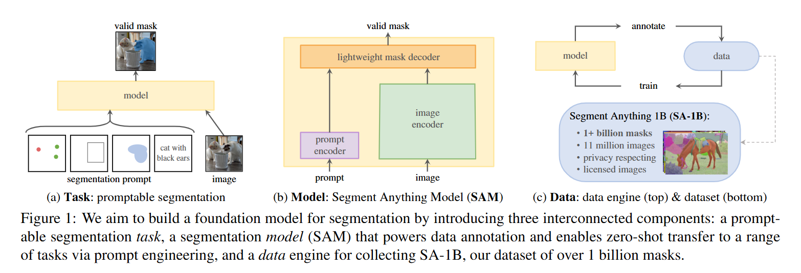
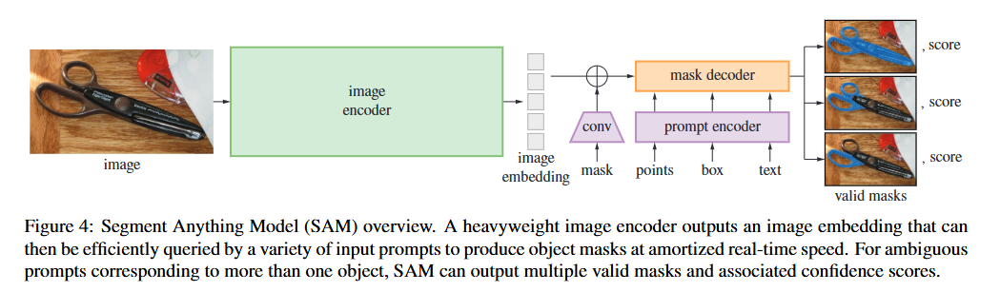
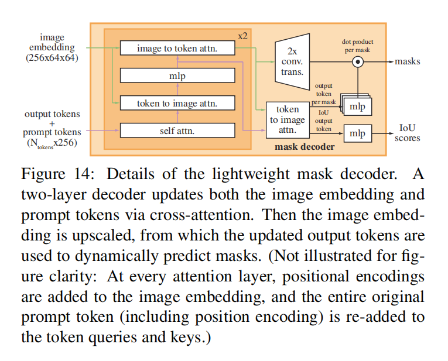

# Segment Anything

> https://zhuanlan.zhihu.com/p/619962145

在这项工作中，我们的目标是为图像分割构建一个**foundation model基础模型**。也就是说，我们希望开发一个可提示的模型，并使用一种任务在广泛的数据集上对其进行预训练，以实现强大的泛化。有了这个模型，我们的目标是使用提示工程来解决一系列下游分割问题，以解决新的数据分布问题。

这个计划的成功取决于三个组件：**task任务、model模型和data数据**。为了开发它们，我们解决了关于图像分割的以下问题：

**Task任务**：在NLP和最近的计算机视觉中，基础模型是一种有前途的发展，可以通过使用“**[prompting](https://zhida.zhihu.com/search?content_id=225900803&content_type=Article&match_order=2&q=prompting&zhida_source=entity)提示**”技术来执行对新数据集和任务的零样本和少量样本学习。受到这一工作的启发，我们提出了**prompted segmentation task可提示的分割任务**，其中目标是在给定任何分割prompt提示的情况下返回有效的分割掩码（见**图1a**）。一个prompt提示只是指定图像中要分割的内容，例如，提示可以包括识别对象的空间或文本信息。有效输出掩码的要求意味着即使提示存在歧义并且可能指向多个对象（例如，衬衫上的一个点可能表示衬衫或穿着它的人），对于这些对象中至少一个，输出也应该是合理掩码。我们将**可提示的分割任务用作预训练目标，并通过提示工程来解决一般的下游分割任务**。

**Model模型**：可提示的分割任务和现实世界使用的目标对模型架构施加了约束。特别是，模型必须支持灵活的提示，需要在摊销的实时计算掩码以允许交互式使用，并且必须是模糊感知的。令人惊讶的是，我们发现一个简单的设计满足了这三个约束：**一个强大的图像编码器计算image embedding图像嵌入，一个提示编码器嵌入提示，然后两个信息源在轻量级的掩码解码器中组合，预测分割掩码。**我们将这个模型称为Segment Anything Model，或SAM（见**图1b**）。通过将SAM分为图像编码器和[快速提示编码器](https://zhida.zhihu.com/search?content_id=225900803&content_type=Article&match_order=1&q=快速提示编码器&zhida_source=entity)/掩码解码器，可以重用相同的image embedding图像嵌入（并摊销其成本）与不同的提示。给定image embedding图像嵌入，提示编码器和掩码解码器可以在web浏览器中预测掩码。我们专注于点、框和掩码提示，并且还提供了使用自由形式文本提示的初始结果。为了使SAM模糊感知，我们设计它来预测单个提示的多个掩码，从而使SAM能够自然地处理模糊性，例如衬衫与人的例子。

**Data engine数据引擎**：为了达到对新数据分布的强大泛化，我们发现需要在大量和多样化的掩码上训练SAM，超出任何现有的分割数据集。虽然获取数据的典型方法是在线获取[82]，但掩码并不自然丰富，因此我们需要另一种策略。我们的解决方案是建立一个“数据引擎”，即我们与model-in-the-loop数据集标注共同开发我们的模型（见**图1c**）。我们的数据引擎有三个阶段：**assisted-manual辅助手动，semi-automatic半自动和fully automatic完全自动**。在第一阶段，SAM协助标注人员标注掩码，类似于经典的[交互式分割](https://zhida.zhihu.com/search?content_id=225900803&content_type=Article&match_order=1&q=交互式分割&zhida_source=entity)设置。在第二阶段，SAM可以通过prompting提示可能的对象位置来自动为一部分对象生成掩码，并且标注员专注于标注其余对象，从而帮助增加掩码多样性。在最后一个阶段，我们用前景点的常规网格去提示SAM，平均每个图像产生约100个高质量掩码。

## 2. 分割一切任务Segment Anything Task

**Task任务**。我们首先将prompt提示的思想将NLP迁移到分割，其中一个prompt提示可以是一组前景/背景点，粗略的框或掩码，自由形式的文本，或者，一般来说，任何指示在图像中分割什么的信息。然后，**promptable segmentation task可提示分割任务**是给定任何提示返回有效的分割掩码。掩码的“有效”要求只是意味着即使提示模糊并且可能指向多个对象（例如，回想一下衬衫与人的例子，并参见**图3**），输出也应该是至少一个这些对象中的合理掩码。这个要求类似于期望语言模型输出对模糊提示的连贯响应。我们选择这个任务是因为它导致了一种自然的预训练算法和一种通过提示将可提示分割任务迁移到下游分割任务的通用方法。

**[Pre-training](https://zhida.zhihu.com/search?content_id=225900803&content_type=Article&match_order=1&q=Pre-training&zhida_source=entity)预训练**。可提示的分割任务提出了一种自然的预训练算法，该算法为每个训练样本模拟一系列提示（例如，点，框，掩码），并将模型的掩码预测与真值GroundTruth进行比较。我们从交互式分割中采用了这种方法，尽管与交互式分割不同，其目标是在足够的用户输入后最终预测有效的掩码，我们的目标是始终为任何提示预测有效的掩码，即使提示是模糊的。这确保了预训练的模型在涉及模糊性的用例中是有效的，包括我们的data engine数据引擎所需的自动注释。我们指出，良好地执行此任务是具有挑战性的，并且需要专门的建模和训练损失选择，我们在附录3中讨论。

**Zero-shot transfer零样本迁移**。直观地说，我们的预训练任务赋予模型在推理时间对任何提示做出适当响应的能力，因此下游任务可以通过设计适当的提示来解决。<u>例如，如果有一个猫的bounding box检测器，那么可以通过将检测器的框输出作为提示提供给我们的模型来解决猫的实例分割。</u>一般来说，各种实际分割任务都可以作为提示来处理。除了自动数据集标记之外，我们在附录7中的实验部分探索了五个不同的示例任务。

**Related tasks 相关任务**。分割是一个广泛的领域：有**interactive segmentation交互式分割**，**edge detection边缘检测，super pixelization超像素化，object proposal generation对象建议生成，foreground segmentation前景分割，semantic segmentation语义分割，instance segmentation实例分割，panoptic segmentation全景分割**等。我们的可提示分割任务的目标是产生一个广泛的模型，可以通过提示工程来适应许多（但不是所有）现有和新的分割任务。我们工作中的一个重要区别是，训练可提示分割的模型可以通过作为更大系统中的组件来执行新的，不同的任务，例如，要执行实例分割，可提示分割模型与现有的对象检测器结合。

## 3. 分割一切模型Segment Anything Model

我们接下来描述了用于可提示分割的**Segment Anything Model (SAM)模型**的三个组件，如**图4**所示：图像编码器，灵活的提示编码器和快速的掩码解码器。我们建立在Transformer视觉模型之上，这些模型具有特定的权衡，以实现（摊销）实时性能。我们在这里对这些组件进行高层次的描述，详细信息见**附录A**。

**Image encoder图像编码器**。受到可扩展性和强大的预训练方法的启发，我们使用了一个MAE预训练的Vision Transformer（ViT），最小化地适应处理高分辨率输入。图像编码器每个图像运行一次，并且可以在提示模型之前应用。

**Prompt encoder提示编码器**。 我们考虑两组提示：稀疏（点，框，文本）和密集（掩码）。我们通过位置编码来表示点和框，这些编码与每种提示类型的学习嵌入相加，并且使用CLIP的现成文本编码器来表示自由文本。密集提示（即掩码）使用卷积嵌入，并与图像嵌入元素相加。

**Mask decoder掩码解码器**。掩码解码器通过有效地将**image embedding图像嵌入**，**prompt embeddings提示嵌入**和输出token映射到掩码来实现。这种设计采用了一个修改的Transformer解码器块，后跟一个动态掩码预测头。我们修改的解码器块使用提示自注意力和交叉注意力两个方向（提示到图像嵌入和反之亦然）来更新所有嵌入。在运行两个块之后，我们对图像嵌入进行[上采样](https://zhida.zhihu.com/search?content_id=225900803&content_type=Article&match_order=1&q=上采样&zhida_source=entity)，并且MLP将输出令牌映射到动态[线性分类器](https://zhida.zhihu.com/search?content_id=225900803&content_type=Article&match_order=1&q=线性分类器&zhida_source=entity)，然后在每个图像位置计算掩码前景概率。

**Resolving ambiguity解决歧义**。在一个输出中，如果给出了歧义的提示，模型将平均多个有效的掩码。为了解决这个问题，我们修改了模型，以便为单个提示预测多个输出掩码（见**图3**）。我们发现，3个掩码输出足以解决大多数常见情况（嵌套的掩码通常最多三层：**whole整体，part部分和subpart子部分**）。在训练期间，我们仅在掩码上反向传播最小损失。为了对掩码进行排序，模型预测每个掩码的置信度分数（即估计的IoU）。

**Efficiency效率**。整体模型设计主要受到效率的启发。给定预先计算的图像嵌入，提示编码器和掩码解码器在Web浏览器中以CPU运行，运行时间大约为50毫秒。这种运行时性能使我们的模型能够无缝、实时地提示我们的模型。

**Losses and training损失和训练**。我们使用**focal loss和dice loss**的线性组合来监督掩码预测。使用**geometric prompts几何提示**的混合来训练可提示的分割任务（对于文本提示，请参见**第7.5小节**）。我们通过在每个掩码中随机采样11轮提示来模拟交互式设置，从而使SAM能够无缝地集成到我们的数据引擎中。

## 附录A. **Segment Anything Model and Task Details**

**图像编码器 Image encoder**。一般，图像编码器可以成为任何C x N x W大小的图像嵌入。受可扩展性和强大的预训练的启发，我们使用了一个MAE带掩码[自编码器](https://zhida.zhihu.com/search?content_id=225900803&content_type=Article&match_order=1&q=自编码器&zhida_source=entity)[47]预训练的Vision Transformer(ViT)，并对其进行了最小化适应，以处理高分辨率的输入，具体来说，是一个ViT-H/16，具有14x14窗口化的注意力和四个等间隔的全局注意力块。图像编码器的输出是输入图像的16倍缩小的嵌入。由于我们的运行时目标是实时处理每个提示，因此我们可以承担高数量的图像编码器FLOP，因为它们仅针对每个图像而不是每个提示计算一次。

遵循标准做法（例如文献[40]），我们使用1024x1024的输入分辨率，通过重新缩放图像并填充较短的边来获得。因此，图像嵌入是64x64。为了减少通道维度，我们使用1x1卷积来获得256个通道，然后是3×3卷积，也是256个通道。每个卷积后面都跟着一个正则化层。

**提示编码器 Prompt encoder**。稀疏提示被映射为如下的256维的向量嵌入。一个点被表示为位置编码与两个学习到的嵌入（表示在前景中还是背景中）之一的总和。一个框被表示为一个embedding pair嵌入对：(1)它的左上角的位置编码与学习到的表示“左上角”的嵌入进行求和，(2)相同的结构，但使用学习到的表示“右下角”的嵌入。最后，为了表示自由形式的文本，我们使用CLIP的文本编码器(一般来说，任何文本编码器都是可能的)。在本节的其余部分，我们将重点讨论几何提示，并在附录D.5中深入讨论文本提示。

稠密提示（即掩码）与图像具有空间对应关系。我们以比输入图像低4倍的分辨率输入掩码，然后使用两个2x2、步幅为2的卷积，输出通道分别为4和16，进一步降低4倍。最后，1x1卷积将通道维度映射到256。每一层都由GELU激活和正则化层分开。然后将掩码和图像嵌入逐元素相加。如果没有掩码提示，则在每个图像嵌入位置上添加一个表示“无掩码”的学习嵌入。

**轻量级掩码解码器 Lightweight mask decoder**。该模块有效地将图像嵌入以及一组提示[嵌入映射](https://zhida.zhihu.com/search?content_id=225900803&content_type=Article&match_order=1&q=嵌入映射&zhida_source=entity)到输出掩码中。为了组合这些输入，我们从Transformer的分割模型中得到启发，并修改一个标准的Transformer解码器。在应用我们的解码器之前，我们首先将学习到的输出令牌嵌入插入到提示嵌入的集合中，该令牌嵌入将被用于解码器的输出，类似于[class]令牌。为了简单起见，我们将这些嵌入（不包括图像嵌入）统称为“**token令牌**”。

我们的解码器设计如**图14**所示。每个解码器层执行四个步骤：（1）对令牌的自注意力；（2）从令牌（作为查询）到图像嵌入；（3）逐点MLP更新每个令牌；（4）从图像嵌入（作为查询）到令牌的交叉注意力。最后一步使用提示信息更新图像嵌入。在交叉注意力期间，图像嵌入被视为一组642x256维向量。每个自/交叉注意力和MLP都有一个残差连接，正则化层和训练时的0.1的dropout。下一个解码器层从前一层获取更新的令牌和更新的图像嵌入。我们使用两层解码器。

为了确保解码器已经访问了关键的几何信息，当位置编码参与注意力层时，它们被添加到图像嵌入中。此外，每当它们参与注意力层时，整个原始提示令牌（包括它们的位置编码）都被重新添加到更新的令牌中。这允许对提示令牌的几何位置和类型都有很强的依赖。

在运行解码器后，我们上采样4倍更新后的图像嵌入，使用两个转置卷积层（现在相对于输入图像缩小了4倍）。然后，令牌再次关注图像嵌入，我们将更新的输出令牌嵌入传递给一个小的3层的MLP，该MLP输出一个与放大后图像嵌入的通道维数相匹配的向量。最后，我们预测了一个在升级图像嵌入和MLP输出之间具有空间点乘积的掩码。

该Transformer使用256维的嵌入。Transformer MLP块具有2048的内部维度，但是MLP仅应用于令牌提示，对于这些令牌，数量相对较少（很少大于20）。但是，在我们有一个64x64图像嵌入的交叉注意力层中，我们通过减少查询、键和值的通道维度为一半（128维），以提高计算效率。所有的注意力层都使用8个头。

用于放大输出图像嵌入的转置卷积大小是2x2，步幅为2，输出通道维度为64和32，并具有GELU激活。它们由正则化层分开。

**使模型具有模糊感知性 Making the model ambiguity-aware**。如前所述，单个输入提示可能是模糊的/歧义的，因为它对应于多个有效的掩码，模型将学习对这些掩码进行平均。我们通过一个简单的修改来消除这个问题：我们不是预测单个掩码，而是使用少量的输出令牌，并同时预测多个掩码。默认情况下，我们预测三个掩码，因为我们观察到三个层（整体、部分和子部分）通常足以描述嵌套掩码。在训练期间，我们计算真值GT和每个预测掩码之间的损失（稍后描述），但只从最低损失反向传播。这是用于具有多个输出的模型的常见技术。为了在应用程序中进行使用，我们希望对预测的掩码进行排序，因此我们添加了一个小头small head（对额外的输出令牌进行操作），该头估计了每个预测掩码与其覆盖的对象之间的IoU交并比。

有多个提示的歧义更加罕见，三个输出掩码通常会变得相似。为了在训练时最小化退化损失的计算，并确保单个无歧义的掩码接收到正常的梯度信号，当给出多个提示时，我们只预测单个掩码。这是通过添加第四个输出令牌来实现的，用于额外的掩码预测。这第四个掩码永远不会返回给单个提示，也是多个提示返回的唯一掩码。

**损失 Losses**。我们使用focal loss焦点损失和dice loss骰子损失的线性组合来监督掩码预测，比例为20:1。与文献[20,14]中不同，我们观察到在每个解码器层之后的辅助深度监督是无用的。IoU预测头是用IoU预测和预测掩码与真值掩码的IoU之间的[均方误差](https://zhida.zhihu.com/search?content_id=225900803&content_type=Article&match_order=1&q=均方误差&zhida_source=entity)损失来训练的。它被添加到掩码损失中，缩放因子为1.0。

**训练算法 Training algorithm**。遵循最近文献[92,37]的方法，我们在训练期间模拟交互式分割设置。首先，以相等的概率随机为目标掩码选择前景点或边界框。点是均匀地从真值掩码中采样的。框被视为真值掩码的边界框，每个坐标都添加了[随机噪声](https://zhida.zhihu.com/search?content_id=225900803&content_type=Article&match_order=1&q=随机噪声&zhida_source=entity)，标准偏差等于盒子边长的10%，最大为20个像素。这种噪声[配置文件](https://zhida.zhihu.com/search?content_id=225900803&content_type=Article&match_order=1&q=配置文件&zhida_source=entity)是实例分割等应用程序的合理折衷，这些应用程序在目标对象周围产生一个紧密的框，以及交互式分割，其中用户可能会画一个松散的框。

从第一个提示中做出预测后，后续点从前一个掩码预测和真值掩码之间的误差区域中均匀选择。如果误差区域是假阴性或假阳性，则每个新点都是前景或背景。我们还将前一次迭代的掩码预测作为额外的提示提供给我们的模型。为了为下一次迭代提供最大的信息，我们提供了无阈值掩码logits，而不是二值化的掩码。当返回多个掩码时，传递给下一次迭代并用于采样下一个点的掩码是具有最高预测IoU的掩码。

我们发现在8个迭代采样点之后（我们已经测试了16个）收益递减。此外，为了鼓励模型从提供的掩码中受益，我们还使用了两个没有采样额外点的迭代。其中一个迭代是随机插入在8个迭代采样点之中，另一个迭代总是在最后。这总共有11个迭代：一个采样的初始输入提示，8个迭代采样点，以及两个迭代，其中没有向模型提供新的外部信息，因此它可以学习细化自己的掩码预测。我们注意到，使用相对较大的迭代次数是可能的，因为我们轻量级的掩码解码器仅需要图像编码器计算量的1%，因此每次迭代只会增加很小的开销。这与以前的交互式方法不同，这些方法每次优化器更新只执行一次或几次交互步骤。

**训练配方 Training recipe**。我们使用AdamW优化器（ β1=0.9 ， β2=0.999 ）和线性学习率warmup [42]进行250次迭代，以及阶梯式学习率衰减计划。初始学习率（lr）在warmup之后为8e-4。我们训练90k次迭代（约2 SA-1B epochs），并在60k次迭代时将lr降低10倍，再次在86666次迭代时降低。批量大小为256张图像。为了正则化SAM，我们将权重衰减（wd）设置为0.1，并使用drop path [53]，速率为0.4。我们使用0.8的层次学习率衰减（ld）。没有应用数据增强。我们从一个MAE预训练的ViT-H初始化SAM。由于大型图像编码器和1024×1024输入大小，我们将训练分布在256个GPU上。

为了限制GPU内存使用，我们每个GPU训练最多64个随机采样的掩码。此外，我们发现轻度过滤SA-1B掩码以丢弃覆盖图像超过90%的任何掩码在定性上改善了结果。

对于消融和其他训练变体（例如，附录D.5文本到掩码），我们遵循上面的默认配方，如下所示。当仅使用第一个和第二个数据引擎阶段的数据进行训练时，我们使用大规模抖动对输入进行增强，其范围为[0.1,2.0]。直观地说，当训练数据更有限时，数据增强可能是有用的。为了训练ViT-B和ViT-L，我们使用128个GPU分布在128个GPU上的128个GPU进行180k次迭代。我们分别为ViT-B/L设置lr = 8e−4/4e−4，ld = 0.6/0.8，wd = 0.1，dp = 0.6/0.4。

## 附录**B. Automatic Mask Generation Details**

**裁剪 Cropping。**掩码是从完整图像上的32x32点的常规网格和20个额外的缩放图像裁剪中生成的，这些裁剪来自2x2和4x4部分重叠的窗口，分别使用16x16和8x8常规点网格。原始的高分辨率图像用于裁剪（这是我们唯一使用它们的时间）。我们删除了接触裁剪内部边界的掩码。我们在两个阶段应用了标准的基于greedy box的NMS（boxes用于效率）：首先在每个裁剪中，然后在裁剪之间。在裁剪中应用NMS时，我们使用模型的预测IoU对掩码进行排序。在裁剪之间应用NMS时，我们根据掩码的来源裁剪，从最缩放的（即4x4裁剪）到最不缩放的（即原始图像）对掩码进行排序。在这两种情况下，我们使用0.7的NMS阈值。

**过滤 Filtering**。我们使用三个过滤器来提高掩码质量。首先，为了只保留有信心的掩码，我们通过模型在88.0的阈值处预测的IoU分数进行了过滤。其次，为了只保留稳定的掩码，我们通过在不同的值处对其进行阈值处理，比较由相同的底层软掩码产生的两个二进制掩码。我们只保留预测（即阈值处理logits为0得到的二进制掩码），只有当其-1和+1阈值掩码对之间的IoU等于或大于95.0时。第三，我们注意到，偶尔会有一个自动掩码覆盖整个图像。这些掩码通常是无趣的，我们通过删除覆盖95%或更多图像的掩码来过滤它们。所有过滤阈值都被选择为既能获得大量掩码，又能获得高质量的掩码，这是通过专业标注人员使用第5节中描述的方法进行判断的。

**后处理 Postprocessing**。我们观察到两种错误类型，这两种错误类型很容易通过后处理来减轻。首先，估计有4％的掩码包含小的虚假组件。为了解决这些问题，我们删除了面积小于100像素的连接组件（包括删除整个掩码，如果最大组件低于此阈值）。其次，另外估计有4％的掩码包含小的虚假孔洞。为了解决这些问题，我们用面积小于100像素的孔洞进行填充。孔洞被识别为反转掩码的组件。

**自动掩码生成模型 Automatic mask generation model**。我们训练了一个特殊版本的SAM，用于完全自动的掩码生成，它牺牲了一些推理速度，以改善掩码生成的性能。我们注意到我们默认的SAM和用于数据生成的SAM之间的差异：它仅在手动和半自动数据上进行了训练，它的训练时间更长（177656次迭代而不是90k），使用大规模抖动数据增强[40]，模拟交互式训练仅使用点和掩码提示（没有框），并且在训练期间仅对每个掩码采样4个点（将我们的默认值从9减少到4加快了训练迭代，并且对1点性能没有影响，尽管如果使用更多点进行评估，它会损害mIoU），最后掩码解码器使用3层而不是2层。

**SA-1B例子**。我们在**图2**中显式了SA-1B数据的样例。更多例子，详见我们的**dataset explorer（[https://www.segment-anything.com/dataset/index.html](https://link.zhihu.com/?target=https%3A//www.segment-anything.com/dataset/index.html)）**。