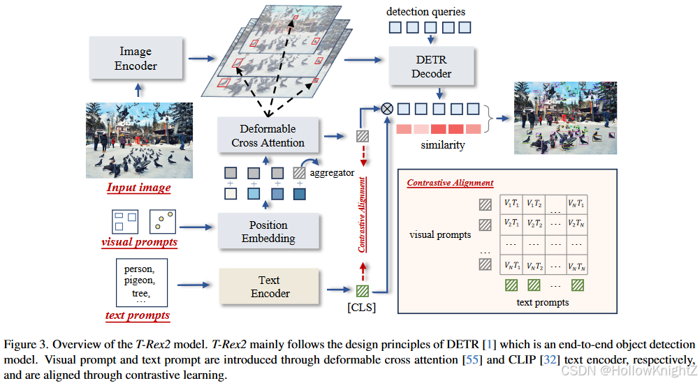
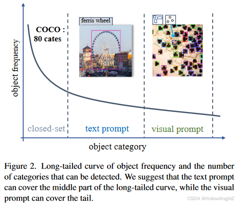
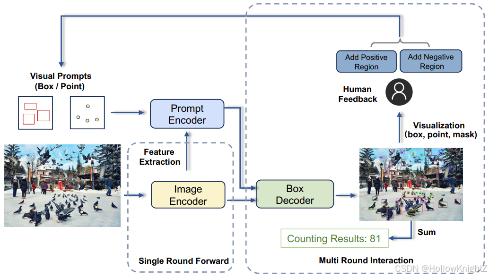

# T-Rex2: Towards Generic Object Detection via Text-Visual Prompt Synergy

> T-Rex2是在端到端的目标检测模型DETR的结构上建立的。它包含了两个并行编码器，对文本和视觉提示进行编码。对于本文提示，作者利用CLIP的文本编码器将文本编码成本文嵌入。对于视觉提示，作者引入了一种新的带有可变形注意力机制的视觉提示编码器，他可以将输入的单幅图像或多幅图像上的视觉提示（即点或框）转换成为视觉提示嵌入。
>
> 为了促进两种提示模态的协作，作者提出了一个对比学习模块，可以显式地对齐文本提示和视觉提示。在对齐过程中，视觉提示可以得益于文本提示所固有地概括性和抽象能力。相反，文本提示可以通过查看各种视觉提示来增强其描述能力，这种迭代的交互允许视觉或文本提示不断演化，从而提高它们在一个模型中的通用理解能力。
>
> 论文：https://arxiv.org/pdf/2403.14610
>
> 代码：https://github.com/IDEA-Research/T-Rex 【api调用】

T-Rex2集成了4个组件，如图3所示：1）图像编码器，2）视觉提示编码器，3）文本提示编码器，4）框解码器。T-Rex2遵循DETR的设计原则。这四个组件促进了四个不同的工作流，涵盖了广泛的应用场景。

### motivation：

虽然使用文本提示由于其抽象描述对象的能力在开集检测中备受青睐，但它仍然面临以下局限性：

1）长尾数据缺陷。本文提示的训练需要在视觉表征之间进行模态对齐，然而长尾物体的数据稀缺可能会损害学习效率，如图2所示，物体的分布固有地遵循长尾模式，即随着可探索物体种类的增加，这些物体的可用数据变得越来越稀缺。这种数据稀缺性会削弱模型识别稀有物体或新奇物体的能力。

2）描述的局限性。文字提示也不足以准确描述语言中难以描述的对象。如图2所示，虽然文本提示可以有效地描述摩天轮，但在缺乏生物学知识的情况下，文本提示难以描述显微镜图像中的微生物。

> 文本提示涵盖了长尾曲线的中间部分，视觉提示涵盖了长尾曲线的尾部部分。

另一种流行的方法是使用**视觉提示**。视觉提示通过提供一种更直观的视觉示例来表示物体。例如，用户可以使用点或框来标记物体进行检测，即使他们不知道物体是什么。**此外视觉提示不受跨模态对齐需求的限制，因为它们依赖于视觉相似性而不是语言相关性，这使得他们可以应用于训练过程中没有遇到的新物体。**

尽管如此，视觉提示也表现出局限性。与文本提示相比，它们在捕获物体的一般概念方面效率较低。例如，“狗”一词作为本文提示语，广泛的涵盖了所有类型的狗，相比之下，由于狗的品种，大小和颜色的多样性，视觉提示需要一个全面的图像集合来直观的传达狗的抽象概念。

### Method

> https://blog.csdn.net/Z960515/article/details/141464971

#### 2 创新点

1. 提出了一个开放集的目标检测模型T-Rex2，将文本和视觉提示统一在一个框架中，这在各种场景中显示出强大的零样本能力。
2. 提出了一个对比学习模块来显式地对齐文本和视觉提示，这使得这两种模态的相互增强。

### 图像编码器

借鉴 **Deformable DETR** 框架，T-Rex2 中的图像编码器由一个从输入图像中提取多尺度特征的视觉骨架组成。其次是几个配备了可变形自注意力机制的 **Transformer** 编码器层，它们被用来改进这些提取的特征图。图像编码器输出的特征图记为：

$$f_i \in \mathbb{R}^{C_i \times H_i \times W_i}, i \in \{1, 2, ..., L\}$$

其中 $L$ 为特征图层数。

### 视觉提示编码器

本文方法结合了框和点两种分割的视觉提示。设计原理涉及将用户指定的视觉提示从其坐标空间转换到图像特征空间。

#### 坐标转换

给定K个用户指定的参考图像上的 4D 矩形框：
$$b_j = (x_j, y_j, w_j, h_j), j \in \{1, 2, ..., K\}$$  
或 2D 一化点：
$$p_j = (x_j, y_j), j \in \{1, 2, ..., K\}$$

首先通过一个固定的正余弦嵌入层将这些标量编码为位置嵌入，随后使用两个不同的线性层将这些嵌入投影到一个统一的维度：

$$
B = \text{Linear}(\text{PE}(b_1, ..., b_K); \theta_B) : \mathbb{R}^{K \times 4D} \to \mathbb{R}^{K \times D} \tag{1}
$$

$$
P = \text{Linear}(\text{PE}(p_1, ..., p_K); \theta_P) : \mathbb{R}^{K \times 2D} \to \mathbb{R}^{K \times D} \tag{2}
$$

- 其中 **PE** 表示位置嵌入；
- $\text{Linear}(.; \theta)$ 表示一个带有参数 $\theta$ 的线性投影运算。

作者将框和点建模为不同类型的提示，然后创建一个可学习的内容嵌入，将其广播 $K$ 次，记为 $C \in \mathbb{R}^{K \times D}$。此外，一个通用的类标记 $C' \in \mathbb{R}^D$ 被用来聚合其他视觉提示的特征，以适应用户可能在单张图像中提供多个视觉提示的场景。

---

**注意**：这里的通用类标记 $C'$ 用来聚合其他视觉提示的特征。从文本中看出，其他视觉提示特征应该指的是全局查询特征。

---

#### 查询嵌入的构造

将这些内容嵌入与位置嵌入沿着通道维度进行串联，并应用一个线性层进行投影，从而构建输入查询嵌入 $Q$：

$$
Q =
\begin{cases} 
\text{Linear}(\text{CAT}([C; C'], [B; B']); \phi_B), & \text{box} \\ 
\text{Linear}(\text{CAT}([C; C'], [P; P']); \phi_P), & \text{point}
\end{cases}
$$

从图片提取的文本存在一定的识别错误，我将尝试修正并以 Markdown 格式重新整理内容。

---

### 视觉提示的细节编码

- **位置嵌入**：
  $ \text{CAT} $ 表示通道维度的合并；
  $ B' $ 和 $ P' $ 表示全局位置嵌入，来源于全局归一化坐标 $[0.5, 0.5, 1, 1]$ 和 $0.5, 0.5$。全局查询的作用是从其他查询中聚合特征。

---

### 多尺度自适应交互

随后，作者采用多尺度可变形交叉注意力层，以视觉提示为条件，从多尺度特征图中提取视觉提示特征。对于第 $j$ 个提示，计算交叉注意力后的查询特征为：

$$
Q_j' =
\begin{cases}
\text{MSDeformAttn}(Q_j, b_j, \{f_i^L\}_{i=1}), & \text{box} \\
\text{MSDeformAttn}(Q_j, p_j, \{f_i^L\}_{i=1}), & \text{point}
\end{cases} \tag{4}
$$

在本文方法中，将可变形注意力限制在视觉提示的坐标上，即每个查询将选择性地关注包含视觉提示周围区域的有限多尺度特征集合。这保证了代表感兴趣区域的视觉提示的捕获。

---

### 自注意力和特征投影

在抽取特征后，作者使用一个自注意力层来调节查询之间的关系，并使用一个前馈层来投影：

$$
V = \text{FFN}(\text{SelfAttn}(Q'))[-1] \tag{5}
$$

---

**注释**： 感觉这里的意思是将全局信息和视觉提示信息相似的特征全部提取出来并与视觉信息的特征聚合。

---

如果需要更深入的解释或修改，请随时告诉我！
