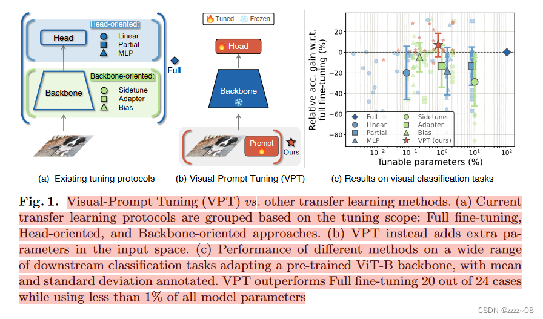
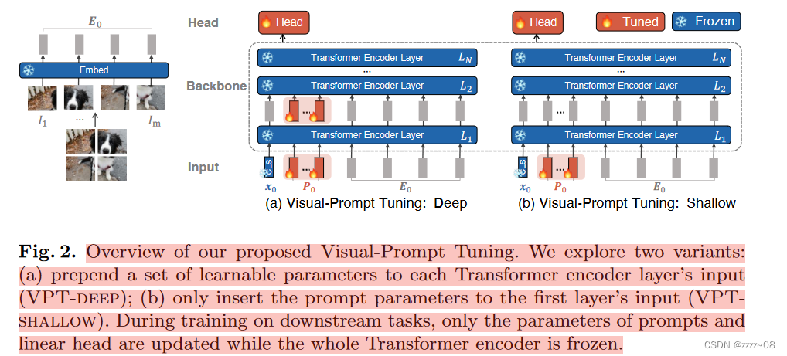

# Visual Prompt Tuning

**Abstract：**当前在调整预训练模型的操作方式包括更新所有的主干参数，即全面微调。 **本文介绍了视觉提示调整（Visual Prompt Tuning，简称VPT），作为一种针对视觉中大规模Transformer模型的高效且有效的全面微调替代方案**。 VPT受到近期在高效调整大型语言模型方面的进展的启发，在保持模型主干冻结的同时，**在输入空间引入了仅有少量（少于模型参数的1%）的可训练参数**。 通过在广泛的各种下游识别任务上的大量实验，我们展示了VPT与其他参数高效调整协议相比取得了显著的性能提升。 最重要的是，在模型容量和训练数据规模的许多情况下，VPT甚至超过了全面微调，同时降低了每个任务的存储成本。 代码可在[http://github.com/kmnp/vpt](https://link.zhihu.com/?target=http%3A//github.com/kmnp/vpt)上获取。

在本文中，我们探索了一条不同的路线。我们**不是修改或微调预训练的Transformer本身，而是修改Transformer的输入**。从NLP中提示的最新进展[50,48,45,51]中获得灵感，我们提出了一种新的简单有效的方法来适应下游视觉任务的transformer模型(图1(b))，即视觉提示调优(VPT)。我们的方法只在输入空间中引入少量特定于任务的可学习参数，同时在下游训练期间冻结整个预训练的Transformer骨干。在实践中，这些额外的参数被简单地预先添加到每个Transformer层的输入序列中，并在微调期间与线性头一起学习。

在24个跨越不同领域的下游识别任务中，使用预训练的ViT骨干，VPT击败了所有其他迁移学习基线，甚至在20个情况下超过了完全微调，同时保持了为每个单独任务存储显著更少参数(不到骨干参数的1%)的优势(图1(c))。这个结果证明了视觉提示的独特力量:而在NLP中，提示调优只能在某些情况下匹配完整的微调性能[45]。VPT在low-data环境中特别有效，并在数据规模上保持其优势。最后，VPT在一系列Transformer规模和设计(ViTBase/Large/Huge, Swin)方面具有竞争力。综上所述，我们的研究结果表明，VPT是适应不断增长的视觉主干的最有效方法之一。
## 3.方法

我们提出了视觉提示调优(VPT)来适应大型预训练的视觉transformer模型。VPT在Transformer的输入空间中注入少量的可学习参数，并在下游训练阶段保持骨干的冻结。总体框架如图2所示。我们首先在第3.1节定义符号，然后在第3.2节正式描述VPT。

对于一个简单的 Vision Transformer (ViT)，它具有 \(N\) 层，输入图像被划分为 \(m\) 个固定大小的图像块 $\{I_j \in \mathbb{R}^{3 \times h \times w} \mid j \in \mathbb{N}, 1 \leq j \leq m\}$。\(h, w\) 分别是图像补丁的高度和宽度。然后，每个图像补丁首先被嵌入到具有位置编码的 \(d\) 维潜在空间中：$
e_0^j = \text{Embed}(I_j), \quad e_0^j \in \mathbb{R}^d, \quad j = 1, 2, \dots, m.
$

我们记图像补丁嵌入的集合为 $
E_i = \{e_i^j \in \mathbb{R}^d \mid j \in \mathbb{N}, 1 \leq j \leq m\}
$

作为输入到第 $(i+1)$ 层 Transformer 层 ($L_{i+1}$)，连同一个额外的可学习的分类标记 $[CLS]$，整个 ViT 被公式化为：$
[x_i, E_i] = L_i([x_{i-1}, E_{i-1}]), \quad i = 1, 2, \dots, N.
$

$
y = \text{Head}(x_N).
$

在这里，$x_i \in \mathbb{R}^d$ 表示在 $L_{i+1}$ 的输入空间中 $[CLS]$ 的嵌入。符号 $[ \cdot, \cdot ]$ 表示在序列长度维度上的堆叠和连接，即 $
[ \cdot, \cdot ] \in \mathbb{R}^{(1 + m) \times d}.
$

每一层 $L_i$ 由多头自注意力（Multiheaded Self-Attention, MSA）和前馈网络（Feed-Forward Networks, FFN）组成，并带归一化（LayerNorm）和残差连接。一个神经分类头部被用来将最后一层的 $[CLS]$ 嵌入 $x_N$ 映射到预测的类别概率分布 $y$。

### 3.**2. 视觉提示调整（Visual-Prompt Tuning ，VPT）**

给定一个预训练的Transformer模型，我们在Embed层之后的输入空间引入了一组维度为 d 的 p 个连续嵌入，即提示（prompts）。仅在微调期间更新特定于任务的提示，同时保持Transformer主干冻结。根据涉及的[Transformer层数](https://zhida.zhihu.com/search?content_id=243938071&content_type=Article&match_order=1&q=Transformer层数&zhida_source=entity)，我们的方法有两种变体，即VPT-shallow和VPT-deep，如图2所示。

### VPT-Shallow

提示仅被插入到第一个 Transformer 层 \( L_1 \) 中。每个提示令牌是一个可学习的 \( d \) 维向量。一组包含 \( p \) 个提示的集合表示为 $ P = \{p_k \in \mathbb{R}^d \mid k \in \mathbb{N}, 1 \leq k \leq p\} $。浅层提示的 ViT（视觉 Transformer）定义如下：

$$
[\mathbf{x}_1, \mathbf{Z}_1, \mathbf{E}_1] = \textcolor{red}{L_1} ([ \textcolor{blue}{\mathbf{x}_0}, \textcolor{red}{\mathbf{P}}, \mathbf{E}_0])
$$

$$
[\mathbf{x}_i, \mathbf{Z}_i, \mathbf{E}_i] = \textcolor{blue}{L_i}([\mathbf{x}_{i-1}, \mathbf{Z}_{i-1}, \mathbf{E}_{i-1}]) \quad i = 2, 3, \dots, N
$$

$$
y = \textcolor{red}{\text{Head}}(\mathbf{x}_N),
$$

其中：

- $ \mathbf{Z}_i \in \mathbb{R}^{P \times d} $$ 表示由第 \( i \) 个 Transformer 层计算出的特征。
- $ [\mathbf{x}_i, \mathbf{Z}_i, \mathbf{E}_i] \in \mathbb{R}^{(1+p+m) \times d} $。

**颜色说明**：

- $ \color{red}{·} $ 和 $\color{blue}{·}$ 分别指**可学习**的和**冻结**的参数。  
- **重要点**：在 ViT 中，$ \mathbf{x}_N $ 不受提示位置的影响，因为提示是在位置编码之后插入的。例如：

$$
[\mathbf{x}_0, \mathbf{P}, \mathbf{E}_0] \quad \text{与} \quad [\mathbf{x}_0, \mathbf{E}_0, \mathbf{P}]
$$

在数学上是等价的。这一点同样适用于 VPT-Deep。

### VPT-Deep

在每一层 Transformer 的输入空间中引入提示。对于第 \( (i+1) \) 层 \( L_{i+1} \)，我们将插入空间中的一组可学习的提示表示为 \( P_i = \{p^i_k \in \mathbb{R}^d \mid k \in \mathbb{N}, 1 \leq k \leq m\} \)。深层提示的 ViT 可以表示为：

$$
[\mathbf{x}_i, \mathbf{E}_i] = \textcolor{blue}{L_i}([\mathbf{x}_{i-1}, \textcolor{red}{\mathbf{P}_{i-1}}, \mathbf{E}_{i-1}]) \quad i = 1, 2, \dots, N
$$

$$
y = \textcolor{red}{\text{Head}}(\mathbf{x}_N),
$$

**存储视觉提示：**VPT在有多个下游任务存在时是有益的。我们只需要为每个任务存储学习到的提示（prompts）和分类头部（classification head），并重新使用原始的预训练Transformer模型副本，从而显著降低存储成本。例如，给定一个具有8600万（M）参数的ViT-Base模型，且 d = 768，50个浅层提示（shallow prompts）和深层提示（deep prompts）分别产生额外的 p×d=50×768=0.038M，和 N×p×d=0.46M参数，分别仅占所有[ViT-Base](https://zhida.zhihu.com/search?content_id=243938071&content_type=Article&match_order=2&q=ViT-Base&zhida_source=entity)参数的0.04%和0.53%。

