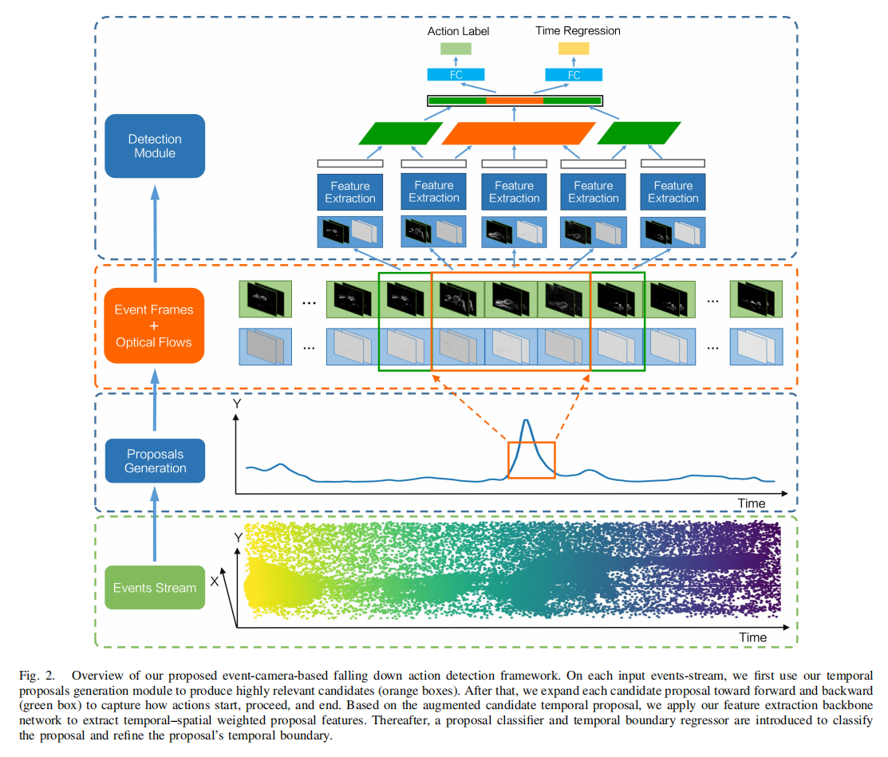
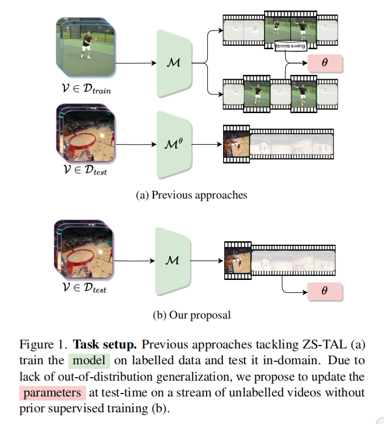
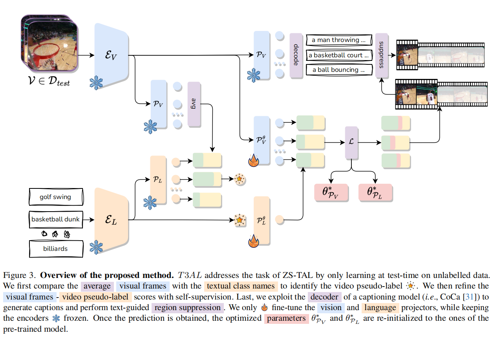

# Task：TAD and “event caption” task

### **定义**

**第一篇对事件数据做caption的工作【个人觉得可以考虑 TAD任务，合在一块做】** 非常火！！！

### **motivation**

暂定，**主要是这个领域在事件相机实现不深刻**，完全可以用大模型去实现。

### **意义**

几乎所有基于视觉传感器的跌倒检测系统都使用视频片段作为输入，只输出二值分类结果(是否跌倒)，这使得无法在长视频中定位何时发生跌倒。

### **粗略看下TAD论文**：

- **2023_CVPR TriDet: Temporal Action Detection with Relative Boundary Modeling**: 时间动作检测（TAD）旨在从未修剪的视频中检测所有动作的开始和结束时刻以及相应的动作类别.（TriDet：采用相对边界建模的时间动作检测）

​	为了促进定位学习，**我们假设视频中时间特征的相对响应强度可以减轻视频特征复杂性的影响并增加定位准确性**。受此启发，我们提出了一种具有**专门用于动作边界定位的新型检测头部**Trident-head的单阶段动作检测器。具体来说，**与直接基于中心点特征预测边界偏移不同，提出的Trident-head通过估计边界的相对概率分布来建模动作边界**（见图1）。然后，**根据相邻位置（即区间）的期望值计算边界偏移量。**

​	图1。说明不同的边界建模。分段级:这些方法基于预测的时间段的全局特征来定位边界。即时级:它们直接基于单个瞬间回归边界，可能带有一些其他特征。我们的:动作边界是通过边界的估计相对概率分布来建模的。

​	除了Trident-head之外，在这项工作中，提出的动作检测器由主干网络和特征金字塔组成。近期的TAD方法[9, 40, 47]采用了基于Transformer的特征金字塔，并展示了令人期待的性能。然而，视频主干网络的视频特征往往在片段之间表现出很高的相似性，这种相似性被SA进一步恶化，导致了排名损失问题（见图2）。此外，SA还带来了显著的计算开销。

- **2024 CVPR: Low-power, Continuous Remote Behavioral Localization with Event Cameras【事件域做TAD工作】**: 这项工作开创了使用事件相机进行远程野生动物观察的先河，开辟了新的跨学科机会。

  

- **2022 T-CYB Neuromorphic Vision-Based Fall Localization in Event Streams With Temporal–Spatial Attention Weighted Network** 【事件域第一篇做TAD的工作】

​	第一阶段**是生成一系列与发生时间和持续时间高度相关的时空范围提案。与传统的基于滑动窗口的方法相比，后者生成了太多的冗余提案，或者与需要耗时的动作性分类器的动作性得分方法相比，我们提出了一种高效的基于事件密度的提案策略。提案生成后，**第二阶段**是通过我们提出的时空注意力加权网络提取时空特征。在我们获得提取的时间-空间特征之后，**我们使用一个分类器和一个回归器来对候选提案进行分类，并细化时间边界以实现完全的时间定位**。

### 再来看看open set的问题

- **2022 CVPR OpenTAL: Towards Open Set Temporal Action Localization**：据我们所知，这项工作是开放集合时间动作局部化(OSTAL)的第一次尝试，它在开放世界环境中基本上更具挑战性，但具有很高的价值。

​	现有的TAL方法都植根于封闭集假设，不能处理开放世界场景中不可避免的未知动作。提出了一种基于证据深度学习(EDL)的通用框架OpenTAL。具体来说，OpenTAL由不确定性感知动作分类、动作预测和时间位置回归组成。该方法主要通过从重要样本中收集分类证据来学习分类不确定性。为了将未知动作从背景视频帧中区分出来，通过正向无标记学习来学习动作。通过利用来自时间定位质量的指导来进一步校准分类不确定性。

​	TAL在近几年关注的都是封闭集的任务，并没有针对开集进行相关的解释。对于OSTAL任务，他不仅需要时序上的定位动作区间，同时还需要拒绝来自其他未知类别的动作。但不变的是不管开集闭集都需要正确分辨背景。OSTAL的任务相比单纯的TAL或者OSR任务都要困难，原因有两点：由于背景帧和未知前景动作的混合，使得对已知动作的识别和定位变得更加困难，传统的TAL任务一般是把错误的类别和背景信息混合起来进行赋值；与OSR问题不同的是，拒绝未知动作的条件是能够正确的对前景动作进行定位，因此定位质量对最终结果至关重要。

为了应对这些挑战，我们提出了一个通用框架OpenTAL，它将整个OSTAL目标分解为三个相互关联的组件：不确定性感知动作分类、动作预测和时间位置回归。本质上，通过动作性预测将前景动作与背景区分开来，并通过时间定位来定位前景动作，同时通过分类模块学习到的证据不确定性来区分已知和未知的前景动作。整个框架中的创新设计包含三个部分：首先，动作分类是为了识别已知动作，并通过最近证据深度学习(EDL)来量化分类不确定性[1，4，53，72]。为了使该模块能够从重要样本中学习，我们利用EDL梯度的大小和证据特征，提出了一种重要性平衡的EDL方法。第二，动作性预测是区分前景动作(积极的)和背景帧(消极的)。在开集设置中，由于未知前景动作(未标记的)和背景帧的混合，从已标记的已知动作和混合固有地归结为positive-unlabeled(PU)学习问题[5]。我们提出一种PU学习方法，从前景背景的混合中选择最负面的样本作为真负样本。第三，训练时间定位模块，不仅定位已知动作，而且校准分类不确定性。提出了一种基于时间交集的不确定度校正方法(IoUC)，利用时间交集联合(IOU)作为定位质量对不确定度进行校正。

- **2024 CVPR Test-Time Zero-Shot Temporal Action Localization**

零样本时序动作定位（ZS-TAL）旨在识别和定位**在训练期间未见过的未剪辑视频中的动作**。现有的ZS-TAL方法涉及在大量注释的训练数据上微调模型。虽然这种方法有效，但基于训练的ZS-TAL方法假设可用于监督学习的标记数据可用，这在某些应用中可能不切实际。此外，训练过程自然会在学习到的模型中引入领域偏差，这可能会影响模型对任意视频的泛化能力。这些考虑促使我们从一个全新的角度来解决ZS-TAL问题，放宽对训练数据的要求**。为此，我们引入了一种新颖的方法，即在测试时对时序动作定位（T3AL）进行自适应。简而言之，T3AL通过适应预先训练好的视觉和语言模型（VLM）。T3AL的操作分为三个步骤。首先，通过聚合整个视频的信息计算出视频级别的动作类别伪标签。然后，采用一种受自监督学习启发的新程序进行动作定位。最后，使用最先进的字幕模型提取的帧级文本描述来细化动作区域提议。**我们通过在THUMOS14和ActivityNet-v1.3数据集上进行实验来验证T3AL的有效性。我们的结果表明，T3AL显著优于基于最新VLM的零样本基线，证实了测试时自适应方法的好处。

图1. 任务设置。先前处理零样本目标动作定位(ZS-TAL)的方法(a)在标记数据上训练模型，并在域内进行测试。由于缺乏分布外的泛化能力，我们提出在测试时更新参数，通过一系列未标记的视频流进行，无需先前的监督训练(b)。

