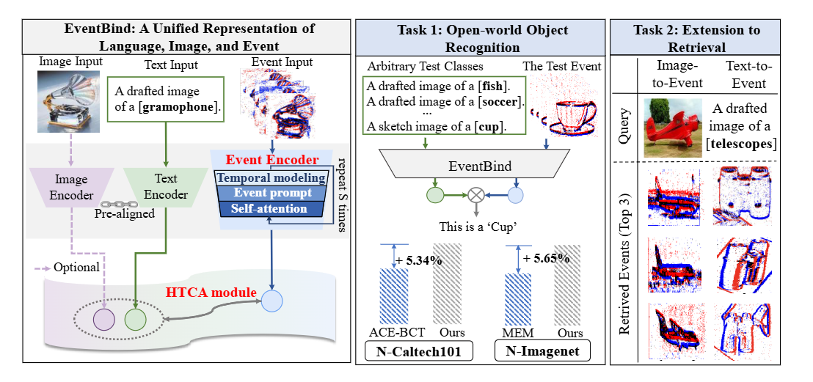
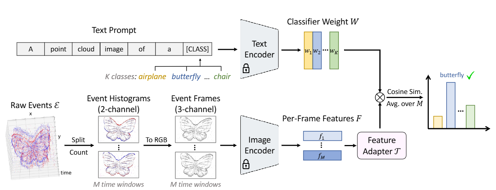
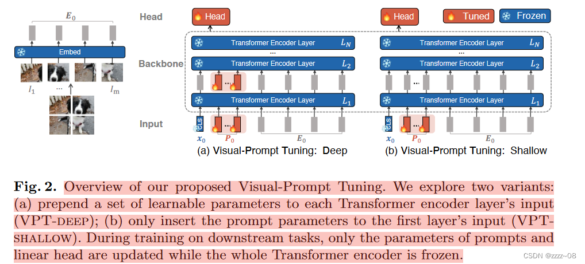
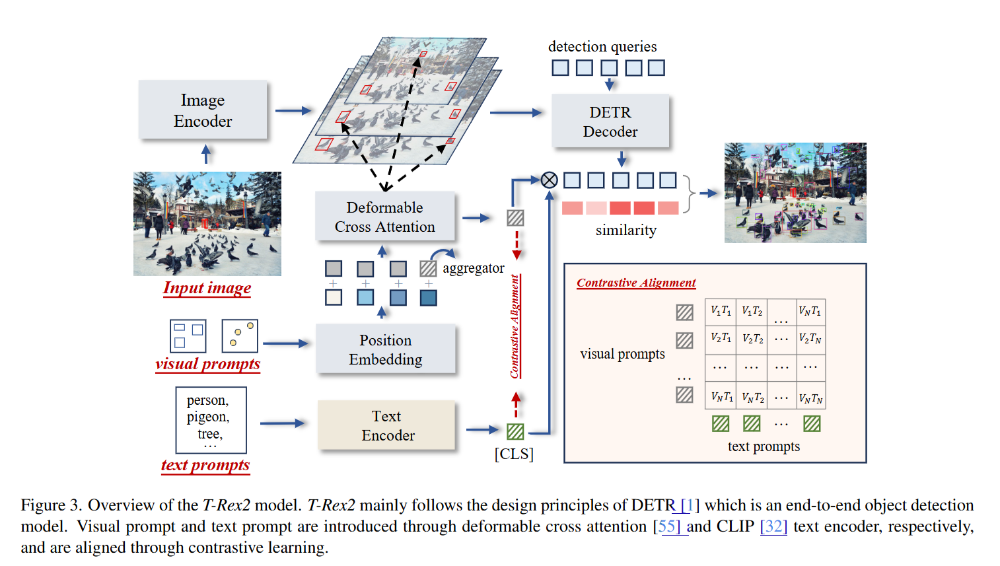
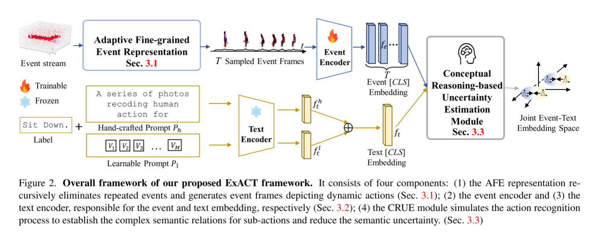

## LVM

- 任务：结合LVM去构建一个处理事件相机域的LVM？

  - #### LVM现状

  - Text prompt，目前的视觉大模型几乎都是结合文本去做。（自诩视觉大模型，其实就是多模态大模型）

    - **GLIP** [md](..\GLIP\GLIP.md)：提出了[phrase grounding](https://zhida.zhihu.com/search?content_id=586848979&content_type=Answer&match_order=1&q=phrase+grounding&zhida_source=entity)的概念，将grounding任务和detection任务 **统一** 起来，通过实验证明了没有额外提示的grounding任务和detection任务其实是一样的，从而使模型可以学习两者的数据，训练出了更好的grounding模型（也可以说是detection模型）。
    - Grounding DINO [md](..\Grounding DINO\Grounding DINO.md)：开放集目标检测的关键解决方案是将**语言引入闭集检测器，用于开集概念泛化**。
    - CVPR 2024 Improved Zero-Shot Classification by Adapting VLMs with Text Descriptions : 视觉语言模型(VLMs)[6,11,29,33,45]学习将图像与其相应的文本标题关联起来。学习共享嵌入使它们在**测试期间与适当的文本(如类名)配对时**，在零样本学习分类任务中表现出色。

  - Visual prompt：

    - CVPR 2024 [DINOv](https://github.com/UX-Decoder/DINOv) [md](..\DINOv\DINOv.md)

  - Visual prompt+text prompt

    - **DINO-X** [md](..\DINO-X\DINO-X.md) is a **unified object-centric vision model** which supports various open-world perception and object-level understanding tasks, including Open-World Object Detection and Segmentation, Phrase Grounding, Visual Prompt Counting, Pose Estimation, Prompt-Free Object Detection and Recognition, Dense Region Caption, etc. 【技术报告】
      - 开发了一个通用的对象提示，以支持无提示的开放世界检测，从而可以在不需要用户提供任何提示的情况下检测图像中的任何内容。【技术报告，方法没说】

      - **Open-World Object Detection and Segmentation**：这是一种在开放世界环境中识别和分割对象的技术。在这种环境中，模型需要识别和分割出图像中的对象，即使这些对象在训练时并未见过。这要求模型具有很好的泛化能力。

      - **Phrase Grounding**：这是一种将**文本短语**与图像内容关联起来的任务。给定一个描述图像中对象或场景的短语，模型需要在图像中定位与该短语相关的区域。
      - **Visual Prompt Counting**：这是一种视觉计数任务，模型需要根据给定的视觉提示（如图像中的特定对象）来计算数量。这通常涉及到对图像中的对象进行识别和计数。
      - **Pose Estimation**：这是一种估计对象姿态的任务，即确定对象在空间中的方向和位置。这在机器人技术、增强现实等领域非常重要。
      - **Prompt-Free Object Detection and Recognition**：这是一种无需提示的对象检测和识别任务。在这种任务中，模型需要在没有任何额外提示或标签的情况下识别图像中的对象。这要求模型具有高度的自主性和理解能力。

    - **T-Rex2: Towards Generic Object Detection via Text-Visual Prompt Synergy [md](..\T-Rex2\T-Rex2.md)**，用于开放集目标检测。

- #### Question2：Challenge有什么？

- 事件领域LM的现状：

  - **文本-图像-事件**：2024 ECCV EventBind （**VLM**）
    - motivation：弥补大规模基于事件的数据集的不足。特别是，由于与图像文本数据存在明显的模态差距，并且缺乏大规模数据集，学习图像、文本和事件的公共表示空间并非易事。直观地说，需要解决两个关键挑战：1）如何将CLIP的视觉编码器通用化为事件数据，同时充分利用事件的独特属性，例如稀疏性和高时间分辨率；2） 如何有效地对齐多模态嵌入，即图像、文本和事件。
    - 具体一点的贡献：该编码器巧妙地对事件中的时间信息进行建模，同时生成用于模态桥接的事件提示。然后，我们设计了一个文本编码器，该编码器生成内容提示，并利用混合文本提示来增强EventBind在不同数据集上的泛化能力。通过所提出的事件编码器、文本编码器和图像编码器，引入了一种新的分层三对比对齐HTCA模块，以联合优化相关性，并实现三种模态之间的有效知识传递。
    - 
    - EventBind解决了各种实际任务，如开放世界对象识别和少数镜头对象识别，我们的EventBind框架可以灵活地扩展到**图像到事件**和**文本到事件的检索任务。**
  - **LLM 直接识别重构的事件帧**【gpt4o】：2024 arxiv Can Large Language Models Grasp Event Signals? Exploring Pure Zero-Shot Event-based Recognition
    - 效果优于EventBind、EventCLIP
  - **文本-事件**：EventCLIP（这个有点硬搬CLIP到事件领域，被低分拒了）
    - EventCLIP 将件转图像直接生成灰度事件帧（将原始事件转换为基于2D网格的表示）与文本对齐。
    - 
    - 对于每个Ei，我们通过计算每个像素处的正事件和负事件的数量来构建一个2通道直方图。为了获得3通道图像，我们首先将直方图归一化到[0,1]的范围内，然后用预定义的RGB颜色图对其进行着色。最后，我们根据Klenk等人（2022）的研究，将空像素设置为纯白色，以获得更好的视觉质量。
  - **文本-事件**：2024 CVPR ExAct [md](..\..\Event camera\ANN\2024_CVPR_highlight_ExACT\ExACT.md)
    - 事件相机最近被证明对于实际的视觉任务，如动作识别，非常有益，这得益于它们的高时间分辨率、能效和减少的隐私问题。然而，当前的研究受到了两个主要障碍的阻碍：**1）由于事件的持续时间长和动态动作具有复杂且模糊的语义，处理事件变得困难；**2）**事件帧表示的固定堆栈对动作的冗余描述。我们发现语言自然地传达了丰富的语义信息，使其在减少语义不确定性方面显著优越。**鉴于此，我们提出了ExACT，一种新颖的方法，首次从跨模态概念化视角解决基于事件的动作识别问题。我们的ExACT带来了两个技术贡献。首先，我们提出了一个自适应的细粒度事件（AFE）表示，以自适应地过滤掉静止物体的重复事件，同时保留动态事件。这在不增加额外计算成本的情况下微妙地提高了ExACT的性能。然后，我们提出了一个基于概念推理的不确定性估计模块，该模块模拟识别过程以丰富语义表示。特别是，概念推理基于动作语义构建时间关系，而不确定性估计则基于分布式表示处理动作的语义不确定性。实验表明，我们的ExACT在PAF、HARDVS和我们的SeAct数据集上分别实现了94.83%(+2.23%)、90.10%(+37.47%)和67.24%的优越识别准确率。
    - 这里存在一个问题：就是它得拿训练集训再去拿对应测试集去测，没有ZERO shot能力

- **确定motivation**：

  - 如果纯视觉，那么通用任务受限。局限于：目标检测、分割，直观的理解，因为它不需要给出label文本，zero shot只需要区别不同就行。=>Visual Prompt方案

  - 要实现动作识别等任务，那么可以去实现一个 目标检测+目标跟踪+动作识别 的通用大模型。=>text prompt【必选】+Visual Prompt【可选】方案。

  - Continue learning 

  - Visual prompt:
  
    - 那么实施方法，EXACT为base，我们需要较大GPU开销。motivation：，结合降低模型训练消耗【角度一：微调/few shot 技术的优化】，去构建一个事件追踪（检测）、动作识别(还可以扩展至静态的目标计数、目标分割问题)的大模型。这个问题的挑战在于，从静态的目标检测问题变为动态的事件的追踪、动作识别问题【无法扩展至骨骼点动作识别】
    - visual prompt tuning : 
      - 
    
    - ECCV 2024 T-Rex2: Towards Generic Object Detection via Text-Visual Prompt Synergy
      - 
    - CVPR 2024 EXACT（全量） 权重大小1.1G
      - 
    
    

