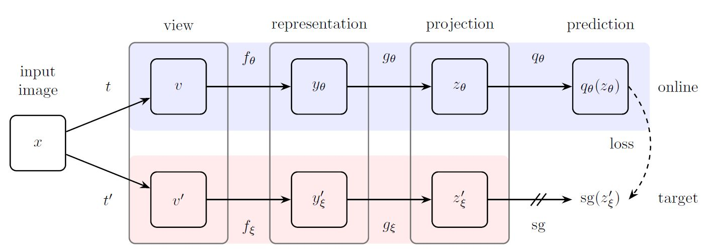
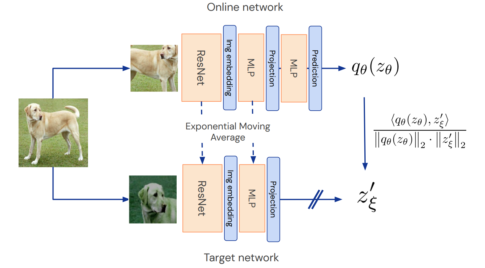
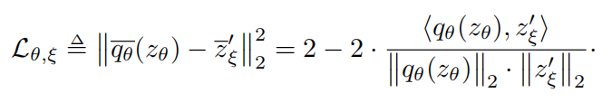
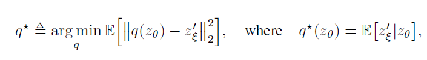
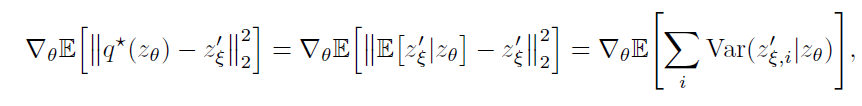

# Bootstrap your own latent ：A new approach to self-supervised Learning（BYOL）

这篇论文提出了一个新的方法来做自监督的图像的特征学习。使用两个神经网络，即online network和target network，用online network来预测target network输出的特征。之前做自监督常用正负样本进行对比学习，这篇论文的最大的亮点在于完全不用负样本来做自监督学习（世界观），只使用正样本进行学习，是一个全新的想法。为了避免得到collapsed representation，作者引入了target network/mean teacher（方法论）。

## 一、框架介绍

框架真的简单，如图2所示

图2 BYOL框架

Figure 2:  BYOL minimizes a similarity loss between  $q_{\theta }(z_{\theta })$and $\operatorname{sg}\left(z_{\xi}^{\prime}\right)$, where θ are the trained weights, ξ are an exponential moving average of θ and sg means stop-gradient. At the end of training, everything but $f_{\theta }$ is discarded, and $y_{\theta}$ is used as the image representation.（其中t和 t' 代表了一组不同的数据增强)
1. 先对图像做个数据增强，
2. 再用ResNet提特征，
3. 然后用MLP做个变换，
4. 然后online network再用MLP去预测target network的输出，

> 在自监督学习中，“online network”通常是指一个动态更新、参与学习过程的神经网络，以下是具体解释： 
>
> 结构组成 
>
> • 编码器(encoder)：用于对输入数据进行特征提取，将原始数据转换为一个低维的特征表示。例如在图像自监督学习任务中，编码器可以将图像数据编码成一个包含图像关键信息的特征向量。
>
>  • 投影器(projector)：将编码器输出的特征进一步映射到一个潜在空间，这个潜在空间的维度和结构可能与原始特征空间不同，目的是为了使特征在该空间中更容易进行对比学习等操作，以便学习到更有区分度的特征表示。 
>
> • 预测器(predictor)：在某些自监督学习框架中，如BYOL，online network还会包含一个预测器。它的作用是根据online network的投影输出，去预测target network的投影输出，通过这种方式来优化online network的参数，使online network能够更好地学习到数据的内在表示。 
>
> 训练过程 
>
> • 接收输入与前向传播：online network接收经过数据增强等预处理后的输入数据，如图像的不同增强视图，然后依次通过编码器、投影器（以及预测器，如果有的话）进行前向传播，得到对应的特征表示或预测输出。 
>
> • 损失计算与反向传播：根据自监督学习任务的目标，计算online network的输出与目标之间的损失函数值，如与target network输出的对比损失等。然后通过反向传播算法，将损失值传播回网络，更新online network的参数，以优化网络性能，使其能够更好地完成自监督学习任务。
> • 参数更新策略：在一些方法中，online network的参数会按照一定的策略进行更新，如采用优化算法根据损失函数的梯度来调整参数，使其在训练过程中不断学习和改进，以更好地适应数据和任务。  与target network的关系 
>
> • 对比学习：在许多自监督学习框架中，online network和target network是相互配合的。例如在BYOL中，online network的目标是预测target network对同一数据不同增强视图的输出，通过这种方式来学习数据的表示。target network的参数通常是online network参数的滑动平均，这种设计可以使target network提供更稳定的目标，避免online network参数频繁更新导致的训练不稳定问题。

为什么online network要用两个MLP呢？第一个MLP（Projection：投影）是因为SimCLR[2]发现这样好使，作者就follow了这个做法。第二个MLP（Predictor）对这篇论文很重要。最后用输出的两个特征计算L2 Loss作为loss，loss的梯度只在online network上反传，那个双斜杠就是梯度不反传的意思（stop gradient），target network的参数是online network的滑动平均。下图描述更加生动形象一些：

把loss的公式写一下，L2 Loss：

 有了loss，参数怎么更新呢，这样更新：

θ 表示online network的参数， ξ 是target network的参数， τ 是更新参数时的权重， τ 越大，更新越缓慢。就是无监督版本的Mean Teacher[4]。

## 二、为什么这么简单它就work了呢

许多成功的自监督学习方法都是基于多视角预测的框架（cross-view prediction framework）来做的，经典的做法就是，通过预测同一张图的不同视角来学习特征，就是说，同一张图，经过不同的数据增强，得到相同的特征。这会导致一个问题，collapsed representation，也就是不管输入的图像是什么，输出的特征都是一样的，这显然不是我们想要的特征。为了解决这一问题，对比学习的做法是引入负样本，同一图像经过不同数据增强（正样本对）后的特征的距离尽可能近，不同图像（负样本对）的特征的距离尽可能远，这样就保证了学到的特征的判别性。那么，为了防止collapse，负样本是必不可少的吗？

只用图2所示的框架中的online network，随机初始化参数，在ImageNet上的性能是1.4%。加上target network，对target network也随机初始化参数，且固定target network的参数不变，只更新online network的参数，性能涨到了18.8%。注意，此过程没有用到负样本，loss是正样本对的L2距离。看来不用负样本也能提升性能，有希望啊！但是，为什么引入target network就可以避免collapsed representation，作者试图解释，hypothesize和assume了很多东西，但似乎没有解释清楚。

一个较为粗糙的解释可能是，BYOL的参数只有online network的参数 θ 是沿着最小化loss的方向走的，而target network的参数 ξ 不是沿着最小化loss的方向走的，而是 θ 的滑动平均。这解释了为什么引入target network可以避免collapsed representation的原因，但并没有解释为什么BYOL性能这么好。

### 捋一下作者的思路

作者先假设BYOL的predictor是最优的，可以得到最优的predictor的表示 q∗

然后把这个最优的 q∗ 代入loss的梯度（我觉得应该把求梯度的算子去掉。因为我们是希望loss最小，而不是loss的梯度最小），可以得到

对于任意随机变量 $z^′_ξ$， $Z_θ$ 和常量 c ，  $\operatorname{Var}\left(z_{\xi}^{\prime} \mid z_{\theta}\right) \leq \operatorname{Var}\left(z_{\xi}^{\prime} \mid c\right)$【Var()是方差】，所以，online network输出c这种情况最多也就是一个局部最优点（loss不是最小)，它不稳定，这样就可以避免collapsed representation了。

这个推导说明了为什么损失函数的梯度可以表示为条件方差的期望值的梯度。通过最小化这个梯度，我们可以鼓励模型学习到更稳定的表示，从而避免collapsed representation的问题。

> 在上述推导中，将平方和视为条件方差可能需要更清晰的解释。让我们逐步分析这个概念：
>
> 1. **损失函数的展开**：
>    首先，我们考虑损失函数的展开形式：
>    $ L(\theta) = E[\|q(z_\theta) - z_\xi'\|_2^2] $
>    这可以进一步展开为：
>    $ L(\theta) = E\left[\sum_{i} (q_i(z_\theta) - z_{\xi,i}')^2\right] $
>    其中 $q_i(z_\theta)$ 和 $z_{\xi,i}'$ 分别是向量 $q(z_\theta)$ 和 $z_\xi'$ 的第 $i$ 个分量。
>
> 2. **最优预测器的代入**：
>    代入最优预测器 $q^\star(z_\theta) = E[z_\xi' | z_\theta]$，我们得到：
>    $ L(\theta) = E\left[\sum_{i} (E[z_{\xi,i}' | z_\theta] - z_{\xi,i}')^2\right] $
>
> 3. **方差的定义**：
>    方差定义为随机变量与其期望值之差的平方的期望值。对于每个分量 $z_{\xi,i}'$，我们可以计算其在给定 $z_\theta$ 条件下的方差：
>    $ \text{Var}(z_{\xi,i}' | z_\theta) = E[(z_{\xi,i}' - E[z_{\xi,i}' | z_\theta])^2] $
>
> 4. **损失函数与方差的关系**：
>    将方差的定义代入损失函数的展开形式，我们可以看到：
>    $ L(\theta) = E\left[\sum_{i} \text{Var}(z_{\xi,i}' | z_\theta)\right] $
>    这是因为 $E[z_{\xi,i}' | z_\theta]$ 是 $z_{\xi,i}'$ 在给定 $z_\theta$ 条件下的期望值，而 $(E[z_{\xi,i}' | z_\theta] - z_{\xi,i}')^2$ 正是方差定义中的差值平方。
>
> 5. **梯度的计算**：
>    最后，我们计算损失函数关于 $\theta$ 的梯度，这涉及到对每个分量的条件方差的梯度求和：
>    $ \nabla_{\theta} L(\theta) = \nabla_{\theta} E\left[\sum_{i} \text{Var}(z_{\xi,i}' | z_\theta)\right] $
>

这个推导是从假设predictor是最优的开始的，所以要保证predictor一直处于接近最优的状态，才能避免collapsed representation，所以target network不可以突变，因为这样会破坏predictor的最优性，所以对target network采用滑动平均的方式更新参数，而不是直接把online network的参数复制过去。