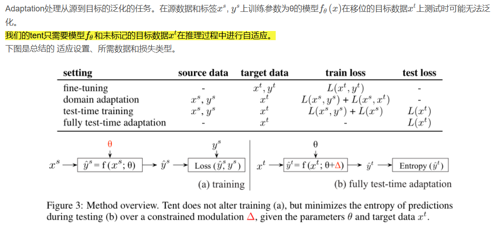
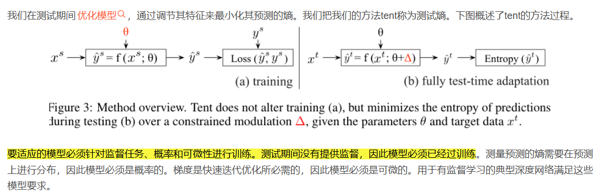
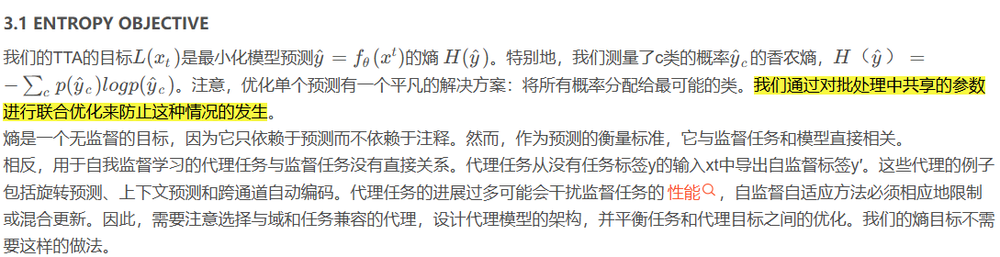

# TENT: FULLY TEST-TIME ADAPTATION BY ENTROPY MINIMIZATION

### 摘要

在测试期间，模型必须自我调整以适应新的和不同的数据。在这种完全自适应测试时间的设置中，模型只有测试数据和它自己的参数。我们建议通过test entropy minimization (tent[1])来适应:我们通过其预测的熵来优化模型的置信度。我们的方法估计归一化统计量，并优化通道仿射变换，以在线更新每个批次。Tent降低了ImageNet和CIFAR-10/100上图像分类的泛化误差，并在ImageNet- c上达到了新的最先进的误差。Tent处理从SVHN到MNIST/MNIST- m /USPS的数字识别的source-free domain 适应，从GTA到cityscape的语义分割，以及在VisDA-C基准上。这些结果是在不改变训练的情况下在测试时间优化的一个epoch中获得的。

### 3 论文方法的概述

